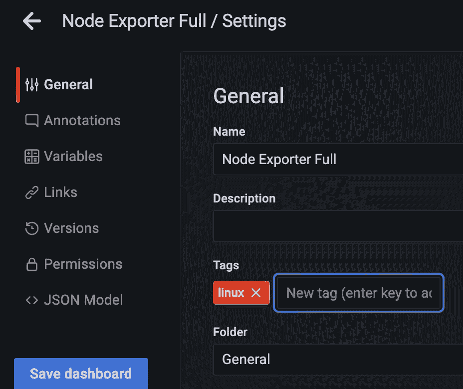
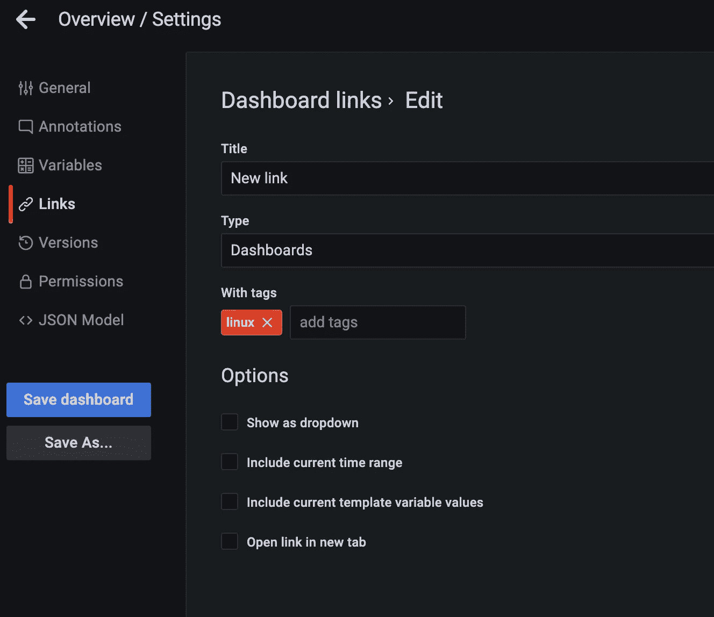
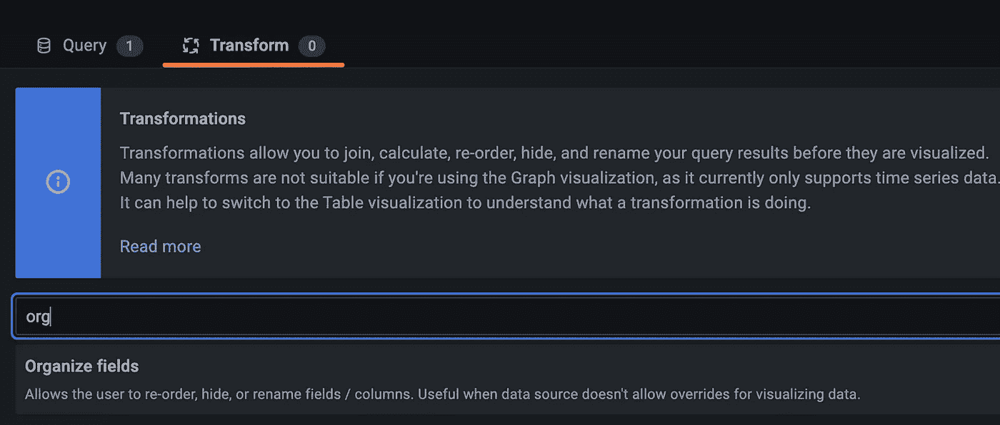
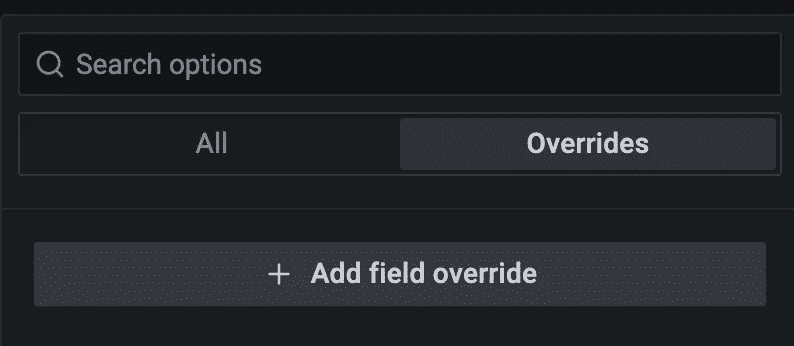
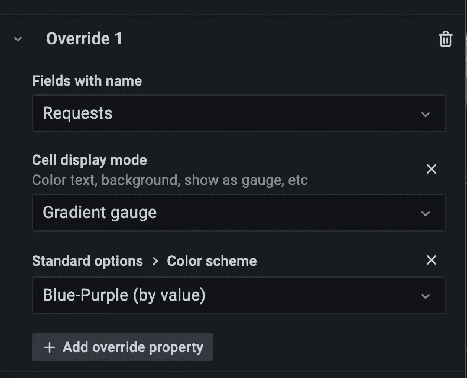
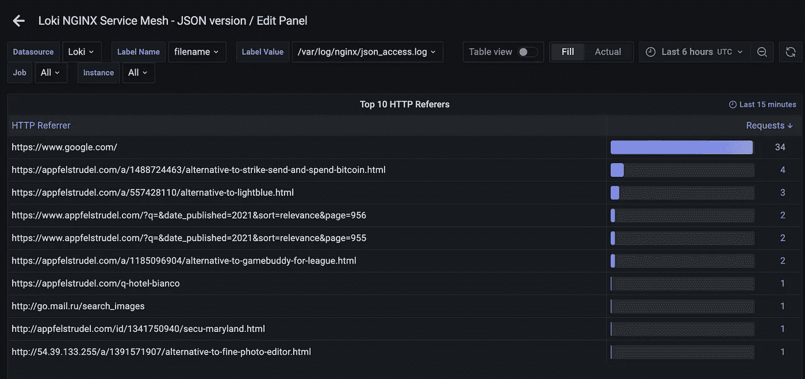
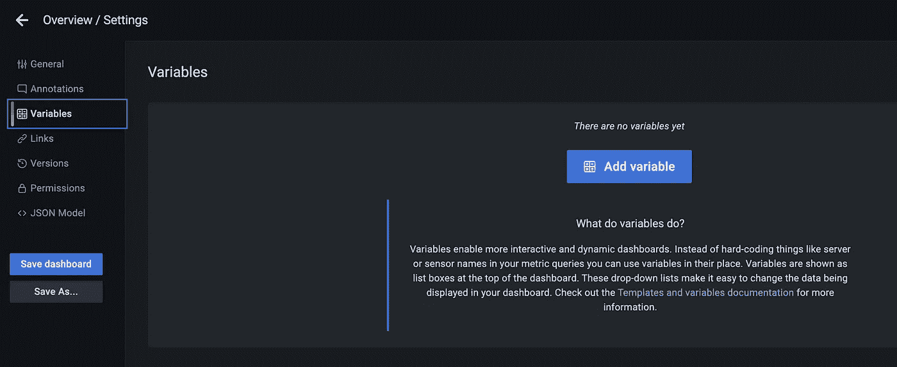
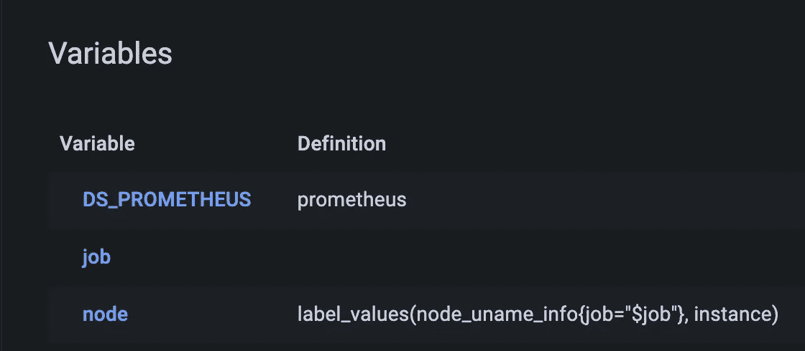

# Grafana 随机提示和技巧

> 原文：<https://itnext.io/grafana-random-tips-and-tricks-dc325a95122e?source=collection_archive---------2----------------------->

Samuel Regan-Asante 在 [Unsplash](https://unsplash.com?utm_source=medium&utm_medium=referral) 上拍摄的照片

Grafana 非常容易使用，不需要任何培训就可以开始使用。一旦你添加一个数据源到 Grafana，游戏就开始了。这篇文章将只涉及一些我学会后发现非常有用的东西。它们没有特定的顺序。希望你能找到一两条你不知道的提示。

# 秘诀 1:模仿是最真诚的奉承

Grafana 主办了一个展示 Grafana 最新特性和功能的网站，这是一个欣赏可能性艺术的好地方。你可以在 https://play.grafana.org/的[找到仪表盘](https://play.grafana.org/)

假设您的数据可能有也可能没有支持所有功能所需的数据，但您可以随时查看图表并了解它是如何构建的，以改进您正在处理的功能。

我还发现，与仅仅阅读相关文档相比，看到这些功能的实际应用确实有所不同。

# 技巧 2:仪表板标签

您导入的许多仪表板已经有了标记。直到我发现仪表板链接(下一个技巧)，我才注意到它们。最初，我们使用它们来分组并轻松识别每个团队构建了哪些仪表板。

要向仪表板添加标签，请进入仪表板并单击“齿轮”图标进行设置。在“常规”标签下有一个“标签”部分。只需在那里添加您的标签并保存仪表板

向仪表板添加标签

# 技巧 3:仪表板链接

仪表板链接将链接添加到您的仪表板顶部。这些对于将一组仪表板联系在一起非常有用。比方说，如果您对报告的所有节点有一个概述，然后可以链接到一个更详细的控制面板，您可以在其中查看单个主机的统计信息、网络统计信息或任何其他控制面板。当然，您可以随时返回浏览或主页导航菜单，但这将使工作流程更加集中。

要向仪表板添加链接，可以通过标准链接(Type=Link)或利用仪表板标签(Type=Dashboard)来完成。使用标签时，Grafana 会将所有带有该标签的仪表板动态添加到该仪表板中。请记住，这些标签是区分大小写的。您可以将这些链接显示为下拉列表或顶部的单个链接(右对齐)。

仪表板链接

保存仪表板后，您将在仪表板的右上角看到您的链接，如下所示。

仪表板链接

# 技巧 4:隐藏字段

很多时候，我发现我想从显示在图表中的输出中隐藏一个字段。我到处寻找，试图找出正确的 PromQL 或 LogQL，但毫无结果。可能有一种方法可以做到这一点，希望有人会就如何做到这一点添加评论！

谢天谢地，通过图表上的[变换](https://grafana.com/docs/grafana/latest/panels/transform-data/)，有一个非常简单的方法可以做到这一点！

添加查询后，单击“Transforms”选项卡，然后搜索“Organize fields”转换并单击它。

这将显示查询返回的字段列表。要隐藏一个，点击“眼睛”图标。在下图中，您可以看到时间字段已被隐藏。

# 技巧 5:覆盖

覆盖允许您在可视化之前更改字段的格式。您可以更改字段类型(转换为 MB 或 F/C)或为字段添加渐变，而不只是显示数字。我通过查看 theplay.grafana.org 网站的各种图表找到了这些。我在添加了梯度字段的图表上获得了很好的效果，这样人们可以快速看到项目的状态。

要向面板添加覆盖，请单击覆盖选项卡，然后单击“添加字段覆盖”按钮

添加覆盖

使用 Grafana 网站上的一个图表，我们可以看到他们向 requests 字段添加了一个渐变标尺，然后选择了配色方案。

为渐变配置覆盖

正如你所看到的，Grafana 使得在字段中添加渐变标尺和数字变得非常容易。当然，你也可以变得更好，但是通过“堆叠”覆盖来覆盖字段的其他部分

覆盖的示例

# 技巧 6:仪表板变量/过滤器

仪表板变量允许您在仪表板顶部设置下拉列表或搜索框，这样就可以根据选择的值过滤每个图表。请记住，您的单个面板/图表需要使用查询中的变量才能生效。

要添加仪表板变量，请转到仪表板的设置，单击左侧导航中的变量链接，然后单击“添加变量”按钮。

添加仪表板变量

在这里，我们将看看一些很好的例子节点导出器完整的仪表板。该控制面板提供了 3 个过滤器，它们互为基础。一旦选择了“数据源”，就可以选择相关的作业；选择作业后，您将看到主机列表。选择主机后，控制面板将仅显示该主机的结果。

节点导出器过滤器

为节点导出程序定义的变量

一旦定义了变量，您就可以在另一个变量或图表中使用它们。如果您注意到上面的节点变量引用了$job，这是 job 变量的值。每个面板的查询行都是一样的，见下图。

使用变量的面板查询

# 摘要

希望你从这些提示/技巧中有所收获。你可以用 Grafana 做很多事情，但是我想分享一些我发现对我有帮助的事情。

如果你喜欢这篇文章或者学到了新的东西，发表评论，鼓掌或者关注！