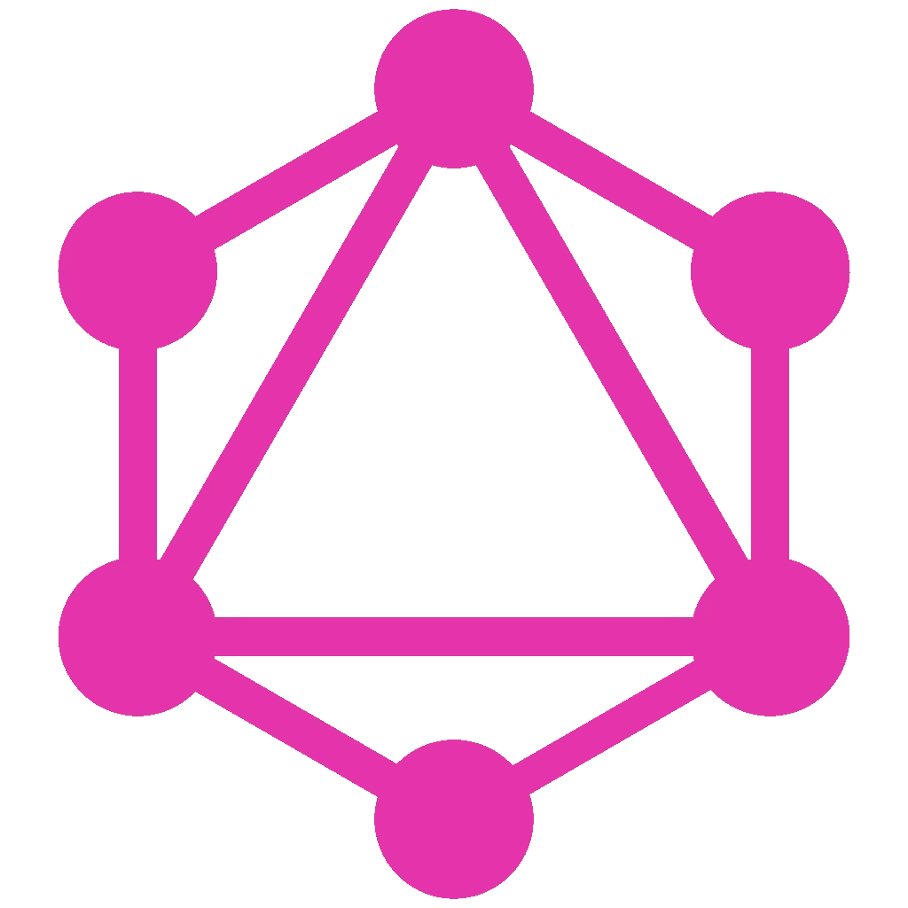

# Spring Boot 2.x Kotlin 应用程序中的 GraphQL API 集成测试

> 原文：<https://itnext.io/graphql-api-integration-tests-in-a-spring-boot-2-x-kotlin-application-5840d3c5d66f?source=collection_archive---------0----------------------->



在最近的一个项目中，我们集成了 [graphql-java](https://github.com/graphql-java) 和 [graphql-java-servlet](https://github.com/graphql-java/graphql-java-servlet) ，通过 HTTP(通过 at /graphql)公开了 GraphQL API。

为了测试端到端场景，我需要一种简单的方法来…

*   启动后端，公开 GraphQL API 端点
*   定义测试图查询
*   加载测试图 SQL 查询
*   准备并发送 GraphQL HTTP 查询

最重要的是，执行断言(对查询结果和后端状态)。

在本文中，我假设您已经在使用 graphql-java，并使用 graphql-java-servlet 或等效的方法来公开它。

# 启动后端，公开 GraphQL API 端点

如果你习惯了 Spring Boot，那么我就在这里扮演一下“明显队长”,但基本上只需要使用@SpringBootTest:

```
...
import org.codehaus.jackson.JsonNode
import org.junit.jupiter.api.Assertions.*
import org.junit.jupiter.api.Tag
import org.junit.jupiter.api.Test
import org.junit.jupiter.api.extension.ExtendWith
import org.springframework.beans.factory.annotation.Autowired
import org.springframework.boot.test.context.SpringBootTest
import org.springframework.boot.test.web.client.TestRestTemplate
import org.springframework.http.*
import org.springframework.test.context.junit.jupiter.SpringExtension

@ExtendWith(SpringExtension::class)
@SpringBootTest(webEnvironment = SpringBootTest.WebEnvironment.RANDOM_PORT)
class SomeMutationOrQueryResolverIT : AbstractIntegrationTest() {

    @field:Autowired
    private lateinit var restTemplate: TestRestTemplate

    @field:Autowired
    private lateinit var someRepository: SomeRepository

    @field:Autowired
    private lateinit var graphQLTestUtils: GraphQLTestUtils

    @Test
    fun `create thing should succeed when the input is valid`() {
        ...
    }}
```

请注意上面的内容:

*   我们用的是 [@SpringBootTest。WebEnvironment.RANDOM_PORT](https://spring.io/guides/gs/testing-web/) 。这将启动应用程序，并引导测试后端所需的一切
*   我们正在注入 TestRestTemplate(由@SpringBootTest 准备),我们将使用它来轻松地与/graphql 上公开的 GraphQL 端点进行交互
*   我们正在注入 GraphQLTestUtils(下面将详细介绍)

# 定义测试图查询

接下来，为了避免在我们的测试类中编写难看的转义字符串或 heredoc 注释，它们被存储在 src/test/resources/graphql 下的专用文件中。

例如，下面是 create-thing.graphql:

```
**mutation** {
    createThing(name: "e", description: "cool") {
        uuid,
        name,
        description
    }
}
```

将我们的测试查询存储在专用文件中有多种好处:

*   我们可以在 IDE 中进行自动完成和验证
*   没有必要逃避什么
*   更容易维护

现在的问题是“我如何使用这些？”

# 加载测试图 SQL 查询

因为我们使用的是 Spring，我们可以很容易地做到这一点。下面是一个简单的测试配置，它将这些公开为可以在任何地方注入的 beans:

```
...

import org.springframework.beans.factory.annotation.Value
import org.springframework.context.annotation.Bean
import org.springframework.context.annotation.Configuration
import org.springframework.core.io.Resource
import org.springframework.util.StreamUtils
import java.nio.charset.StandardCharsets

@Configuration
class GraphQLTestConfiguration {
    @Value("classpath:graphql/query-wrapper.json")
    private lateinit var queryWrapperFile: Resource

    @Value("classpath:graphql/things/create-thing.graphql")
    private lateinit var createThingPayloadFile: Resource

    @Bean
    fun createThingPayload(): String {
        return StreamUtils.copyToString(createThingPayloadFile.*inputStream*, StandardCharsets.*UTF_8*)
    }

    @Bean
    fun queryWrapper(): String {
        return StreamUtils.copyToString(queryWrapperFile.*inputStream*, StandardCharsets.*UTF_8*)
    }
}
```

如您所见，这只是将文件作为资源注入并读取它的问题。我们将在下面进一步讨论“queryWrapper”。

由于上述原因，我们现在可以轻松地在集成测试中插入测试查询:

```
@field:Autowired
private lateinit var createThingPayload: String
```

# 准备查询

对于 graphql-java(我猜，可能还有其他通过 HTTP 公开 graphql 的实现)，发送到端点的 GraphQL 查询是在 POST 请求的主体中传递的，在 JSON 对象的“query”属性中。

请求的正文如下所示:

```
{
  "query": "__payload__",
  "variables": **null** }
```

其中 __payload__ 是 GraphQL 查询的“JSON 转义”版本。

到目前为止，我们已经有了可以注入到测试中的原始查询。现在我们需要一种简单的方法来构造合适的 JSON 有效负载。

为了方便起见，我将上面的 JSON 放在一个“query-wrapper.json”文件中，该文件也公开为一个 Spring bean(前面显示的 cfr 配置类)。

然后，我编写了一个小的实用 Spring 组件，它提供了一些函数，使逃避 GraphQL 查询和创建正确的 JSON 有效负载变得很容易:

```
...
import org.codehaus.jackson.JsonNode
import org.codehaus.jackson.io.JsonStringEncoder
import org.codehaus.jackson.map.ObjectMapper
import org.springframework.beans.factory.annotation.Autowired
import org.springframework.stereotype.Component

*/**
 * Small utility component for GraphQL tests.
 ** ***@author*** *Sebastien Dubois
 */* @Component
class GraphQLTestUtils {
    */**
     * Basic empty GraphQL query.
     */* @field:Autowired
    private lateinit var queryWrapper: String

    private val jsonStringEncoder = JsonStringEncoder.getInstance()

    */**
     * Call this method with a valid GraphQL query/mutation String
     * This function will escape it properly and wrap it into a JSON query object
     */* fun createJsonQuery(graphQL: String): String {
        // *TODO add support for setting variables in the query* return queryWrapper.*replace*("__payload__", escapeQuery(graphQL))
    }

    */**
     * Clean the given QraphQL query so that it can be embedded in a JSON string.
     */* fun escapeQuery(graphQL: String): String {
        return jsonStringEncoder.quoteAsString(graphQL).*joinToString*("")
    }

    companion object {
        */**
         * Where to send GraphQL requests
         */* const val ENDPOINT_LOCATION: String = "/graphql"
    }

    */**
     * Parse the given payload as a [JsonNode]
     ** ***@return*** *the payload parsed as JSON
     */* fun parse(payload: String): JsonNode {
        return ObjectMapper().readTree(payload)
    }
}
```

# 发送 GraphQL HTTP 查询

有了这些，通过 HTTP 发送 GraphQL 查询就非常简单了:

```
...
class SomeMutationOrQueryResolverIT : AbstractIntegrationTest() {
    @field:Autowired
    private lateinit var createThingPayload: String

    @field:Autowired
    private lateinit var graphQLTestUtils: GraphQLTestUtils

    @Test
    fun `create thing should succeed when the input is valid`() {
        assertTrue(thingRepository.findAll().isEmpty(), "There should be nothing in the database yet")
        // create the JSON version of the GraphQL query that will be added to the body of the request
        val payload: String =  graphQLTestUtils.createJsonQuery(createSchoolPayload)

        // add the proper Content-Type header
        val headers = HttpHeaders()
        headers.*contentType* = MediaType.*APPLICATION_JSON* // prepare the request
        val httpEntity: HttpEntity<String> = HttpEntity(payload, headers)

        // send the request
        val response: ResponseEntity<String> =
            restTemplate.exchange(GraphQLTestUtils.*ENDPOINT_LOCATION*, HttpMethod.*POST*, httpEntity, String::class.*java*)
```

这里我们只使用 Spring 提供的 TestRestTemplate 来通过网络发送请求。

为了简单起见，我们在这里只是以字符串的形式返回结果。

# 执行断言

要执行简单/基本的断言，您可以使用 Jackson 解析响应:

```
val response: ResponseEntity<String> =
            restTemplate.exchange(GraphQLTestUtils.*ENDPOINT_LOCATION*, HttpMethod.*POST*, httpEntity, String::class.*java*)assertEquals(HttpStatus.*OK*, response.*statusCode*)

val parsedResponse: JsonNode = graphQLTestUtils.parse(response.*body*)
assertNotNull(parsedResponse)
assertNotNull(parsedResponse.get("data"))
assertNotNull(parsedResponse.get("data").get("createSchool"))
assertNotNull(parsedResponse.get("data").get("createSchool").get("uuid"))
assertNull(parsedResponse.get("errors"))
assertTrue(schoolRepository.findAll().isNotEmpty())
```

事实上，这对于可维护性来说并不好，但这是一个开始。

对这个想法的一个改进是尝试解析响应，并将其与预期的响应负载进行比较。