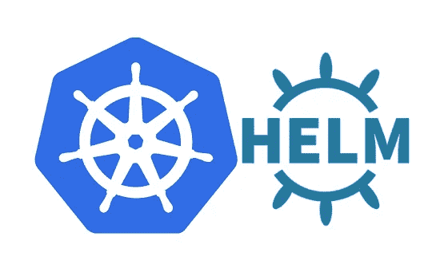

# Helm 3.8.0 — OCI 注册中心支持

> 原文：<https://itnext.io/helm-3-8-0-oci-registry-support-b050ff218911?source=collection_archive---------0----------------------->



一个令人兴奋的新更新已经进入了最新版本的头盔；即[舵 3.8.0](https://github.com/helm/helm/releases/tag/v3.8.0) — OCI 注册表支持。公平地说，这个特性作为一个实验性的特性已经存在了几个版本，但是它最终脱离了测试版，进入了正式发布阶段。

# 什么是“OCI 注册管理机构支持”？

在 Docker 的早期，容器映像是构建过程中产生的主要工件，也是人们真正关心的唯一工件。您的代码被存储在其他地方，在其他地方被加工，然后被烘焙成映像。然后，您的容器被推到容器注册中心，从那里，您的容器平台可以获取并运行它。因此，容器注册中心只支持作为工件的容器图像——生活是美好的。

随着 Docker 相关技术的成熟，我们开始看到 OpenShift 和 Kubernetes 等平台的出现，Helm 和 Kubernetes 等工具也出现了。这些工具中的每一个都会产生自己的工件；在舵的情况下，这些当然是舵图。这些文物从来没有在当时的集装箱景观中得到满足，因此如果你选择的登记处碰巧支持一个*“海图博物馆”*，它们总是被随意存放。

进入 OCI 或[开集装箱倡议](https://opencontainers.org/)。OCI 的作用是为所有与集装箱相关的事情提供一个通用标准。直接引用他们的话:

> **开放容器倡议**是一个开放的治理结构，其明确目的是围绕容器格式和运行时创建开放的行业标准。

实际上，OCI 所做的是扩展集装箱清单的定义，将其他二进制工件也包括进来，比如舵图。这允许我们像 Docker 映像一样从 Docker 注册表中推送和提取图表，从而以与 Docker 映像相同的方式管理和版本化我们的图表。

# 这在 Helm 3.8.0 中是什么意思？

## 海图博物馆

对于 Helm 的日常使用——如果您愿意，图表博物馆的概念以及图表的推拉方式保持不变。Helm 3.8.0 支持向后兼容，所以如果你愿意，你可以继续使用图表博物馆机制。

图表博物馆的方法也有缺点。部署你的舵图的管道或脚本需要使用第三方舵插件，如[舵推插件](https://github.com/chartmuseum/helm-push)来实现这一功能。没有人想安装额外的插件——它们很容易坏，不能保证当新版本出现时它们还能继续工作。在我看来，这个机制总感觉有点笨重。

## 搬到 OCI

要在 Helm 3.8.0 中迁移到 OCI，需要进行一些重构。前面提到的插件不再需要，注册中心的认证方式将会改变。下面突出显示了基本命令:

**登录存储库:**

```
helm registry login -u <user> <registry>
```

**将一个工件推送到仓库:**

这里的先决条件是首先使用 Helm 的 package 命令打包您的图表。

```
helm push <artifact>.tgz oci://<registry>/<repository>
```

**从储存库中取回神器:**

```
helm pull oci://<registry>/<repository>/<artifact> --version <version>
```

# 警告

在我的项目上做迁移到 OCI 图表时，我遇到了 OCI 注册表的一个缺点——搜索。您必须确切地知道您想要安装哪个工件，以及在您的注册中心的哪个存储库中可以找到它。因此 Helm 中没有内置注册表范围的搜索功能——根据我的调查,[OCI 不支持这一功能。](https://github.com/helm/helm/issues/9983)

例如，假设你有一个注册表，你把 10 张舵轮图放到各自的存储库中。在这种情况下，无法使用 Helm 命令请求所有存储库的列表(读取图表)。对于我们的项目，这是一个问题，我们不得不求助于注册表实现的本地 API 来检索这个列表——在我们的例子中，我们使用 [Harbor](https://goharbor.io/) 。一旦使用 API 检索到列表，我们就可以退回到 Helm 命令来提取图表和/或列出它们的版本。

这对你来说可能不是问题，但在开始之前值得注意。