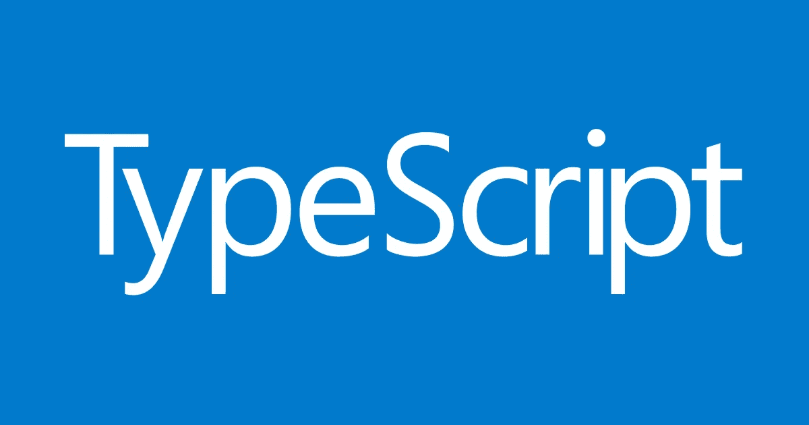

# 帮助保持角形的类型安全

> 原文：<https://itnext.io/help-keep-angular-forms-type-safe-ca35f7b2edf8?source=collection_archive---------2----------------------->



**注意:这篇文章与合并到表单模块中的以下内容不再相关。**[](https://github.com/angular/angular/discussions/44513)

**[*点击这里在 LinkedIn 上分享这篇文章*](https://www.linkedin.com/cws/share?url=https%3A%2F%2Fitnext.io%2Fhelp-keep-angular-forms-type-safe-ca35f7b2edf8)**

**注意"**

**角反应形式很棒，也非常强大，但在我看来，它们有一个明显的缺点，那就是它们不是类型安全的。让我们看一个例子来演示。(我们将在所有示例中使用 FormBuilder。)**

```
class MyComponent {
  myForm: FormGroup = this.fb.group({
    firstName: [''],
    lastName: ['']
    email: ['']
  }); constructor(private fb: FormBuilder) {} onSubmit() {
    console.log(this.myForm.value);
  }
}
```

**上面我们可以看到用 3 个属性定义的简单 FormGroup 模型，但是如果我们将鼠标悬停在 IDE 中的“value”属性上，我们会看到类型是“any”！在这个小例子中，这可能没什么大不了的，但是一旦我们进入更大、更动态的表单，就会导致一些难以追踪的错误。**

**虽然我的首选解决方案是 AbstractControl 成为一个泛型，并允许类似这样的事情:(实际上这里有一个关于这个[的问题](https://github.com/angular/angular/issues/13721)，所以祈祷吧。)**

```
myForm: FormGroup = this.fb.group<MyFormModel>({
  firstName: [''],
  lastName: ['']
  email: ['']
});
```

**我们可以绕过这个限制，如果不是真正的类型安全，至少使我们的类型安全。我们的解决方案应满足 3 个标准:**

1.  **当我们创建一个表单时，我们应该知道表单所期望的对象的形状。**
2.  **当我们更新一个表单时，我们知道可以更新的属性。**
3.  **当我们得到形状的值时，我们就知道它是形状。**

**那么我们如何开始呢？让我们一步一步来。**

**首先，我们知道我们想要定义一个模型，所以让我们继续这样做。**

```
interface MyFormModel {
  firstName: string;
  lastName: string;
  email: string;
}
```

**我们想告诉我们的表单，它有三个属性是字符串。接下来，我们需要一个返回表单并接受我们的模型作为参数的方法。**

```
private createForm(model: MyFormModel): FormGroup {
  return this.fb.group(model);
}
```

**现在，当我们调用“createForm”时，编译器会告诉我们是否拥有所有的属性。接下来是更新的方法。(Partial 内置于 TypeScript 中，使其参数的每个属性都是可选的)**

```
private updateForm(model: Partial<MyFormModel>): void {
  this.myForm.patchValue(model)
}
```

**最后，一个用于查看表单值的属性。这里我们可以使用强制转换来告诉编译器“myForm”的值是 MyFormModel**

```
get formValue() {
  return this.myForm.value as MyFormModel;
}
```

**把这些放在一起，我们得到…**

```
import { Component } from '@angular/core';
import { FormGroup, FormBuilder } from '@angular/forms';interface MyFormModel {
  firstName: string;
  lastName: string;
  email: string;
}@Component(...)
export class MyComponent {
  myForm: FormGroup = this.createForm({
    firstName: '',
    lastName: '',
    email: ''
  }); get formValue() {
    return this.myForm.value as MyFormModel;
  } constructor(private fb: FormBuilder) {}

  onSubmit() {
    console.log(this.myForm.value);
  } private createForm(model: MyFormModel): FormGroup {
    return this.fb.group(model);
  } private updateForm(model: Partial<MyFormModel>): void {
    this.myForm.patchValue(model)
  }
}
```

**仅此而已！现在，当我们更新表单时，我们可以更加自信，当我们必须更改表单的任何内容时，也更加安全。**

**感谢阅读！如果你有任何关于如何在工作中更安全的想法，请告诉我，我很乐意看到。**