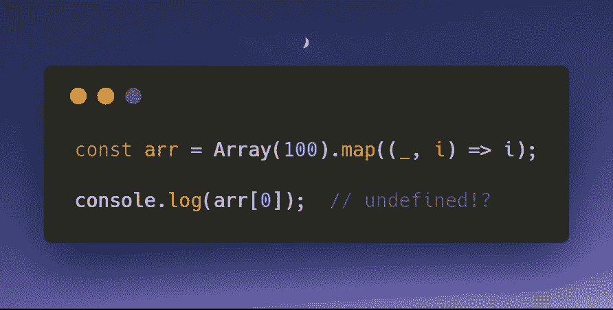

# 这就是为什么在 JavaScript 中映射一个构造好的数组不起作用的原因

> 原文：<https://itnext.io/heres-why-mapping-a-constructed-array-doesn-t-work-in-javascript-f1195138615a?source=collection_archive---------0----------------------->

## 以及如何正确地去做



# 方案

为了便于演示，假设您需要生成一个从 0 到 99 的数字数组。你会怎么做？这里有一个选择:

```
const arr = [];for (let i = 0; i < 100; i++) {
  arr[i] = i;
}
```

如果你和我一样，在 JavaScript 中看到传统的 for 循环会让你有点不舒服。事实上，由于高阶函数如 [forEach](https://developer.mozilla.org/en-US/docs/Web/JavaScript/Reference/Global_Objects/Array/forEach) 、 [map](https://developer.mozilla.org/en-US/docs/Web/JavaScript/Reference/Global_Objects/Array/map) 、 [filter](https://developer.mozilla.org/en-US/docs/Web/JavaScript/Reference/Global_Objects/Array/filter) 、 [reduce](https://developer.mozilla.org/en-US/docs/Web/JavaScript/Reference/Global_Objects/Array/reduce) ，我已经*年*没有写过一个传统的 for-loop *、T1。面向胜利的声明式函数编程！*

也许你还没有喝过函数式编程的苦艾酒，你认为上面的解决方案看起来非常好。从技术上来说确实如此，但是在你领略了高阶函数的魔力之后，你可能会想，“ *There* ***一定是更好的方法。***

我对这个问题的第一反应是，“*我知道！我将创建一个长度为 100 的空数组，并将索引映射到每个元素！* " JavaScript 允许您使用数组构造函数创建一个长度为 *n* 的空数组，如下所示:

```
const arr = Array(100);
```

完美，对吧？我有一个长度为 100 的数组，所以现在我只需要将索引映射到每个元素。

```
const arr = Array(100).map((_, i) => i);console.log(arr[0] === undefined);  // true
```

什么鬼东西！？数组的第一个元素应该是 *0* ，但实际上是*未定义*！

# 说明

为了解释为什么会发生这种情况，我需要在这里做一个重要的技术区分。在内部，JavaScript 数组**是**对象，以数字作为键。例如:

```
['a', 'b', 'c']
```

本质上等同于这个对象:

```
{
  0: 'a',
  1: 'b',
  2: 'c',
  length: 3
}
```

当访问数组中索引为 0 的元素时，实际上只是访问一个键为 0 的对象属性。这一点很重要，因为当您将数组视为对象并结合这些高阶函数的实现方式时(别担心，我已经为您完成了这一部分)，我们问题的原因就很清楚了。

当你用数组构造函数创建一个新的数组时，它会创建一个新的数组对象，它的*长度*属性被设置为你传入的值，否则*对象就是一个真空*。无论如何，在数组的对象表示中没有索引键。

```
{
  //no index keys!
  length: 100
}
```

当您试图访问索引 0 处的数组值时，您会得到*未定义的*，但这并不是说值*未定义的*存储在索引 0 处，而是说如果您试图访问一个不存在的键的对象的值，JavaScript 中的默认行为是返回*未定义的*。

恰好高阶函数*映射*、*归约*、*过滤*、 *forEach* 从 0 到*长度*迭代数组对象的索引键，但是只有在对象上存在的情况下才会执行*回调。这解释了为什么我们的回调函数从来没有被调用，当我们在数组上调用 map 函数时什么也没有发生——因为没有索引键！*

# 解决办法

正如你现在所知道的，我们需要的是一个数组，它的内部对象表示包含一个从 0 到*长度*的每个数字的键。最好的方法是[将数组](https://developer.mozilla.org/en-US/docs/Web/JavaScript/Reference/Operators/Spread_syntax)展开成一个空数组。

```
const arr = [...Array(100)].map((_, i) => i);console.log(arr[0]);
// 0
```

将数组展开为空数组会导致数组在每个索引处填充未定义的*。*

```
*{
  0: undefined,
  1: undefined,
  2: undefined,
  ...
  99: undefined,
  length: 100
}*
```

*这是因为 spread 运算符比 map 函数简单。它简单地从 0 到*长度*遍历数组(或任何可迭代的对象),并在封闭数组中创建一个新的索引键，该索引键的值来自当前索引处的扩展数组。由于 JavaScript 在其每个索引处从我们的扩展数组返回 *undefined* (记住，它默认这样做，因为它没有该值的索引键)，我们最终得到一个实际上填充了索引键的新数组，因此*映射* -able(以及*减少* -able、*过滤* -able 和 *forEach* -able)。*

# *结论*

*我们发现了数组在 Javascript 中被内部表示为对象的一些含义，并了解了创建任意长度的数组的最佳方式，其中填充了您需要的任何值。*

**一如既往，请在下面留下您的评论、问题和反馈！**

*编码快乐！👍*

# *跟我来。*

*如果你喜欢这篇文章，请关注我！或者至少给我一两下掌声。你能省下一点掌声，对吧？*

***中**:[@ Shawn . web dev](https://medium.com/@shawn.webdev)
**推特**:[@ reisner Shawn](https://twitter.com/ReisnerShawn)
**dev . to**:**[@ sreisner](https://dev.to/sreisner) **insta gram**:[@ Shawn . web dev](https://www.instagram.com/shawn.webdev)***

# ***查看我的更多作品***

***[](/a-quick-practical-use-case-for-es6-generators-building-an-infinitely-repeating-array-49d74f555666) [## ES6 发电机的快速实用用例

### 构建无限重复的数组

itnext.io](/a-quick-practical-use-case-for-es6-generators-building-an-infinitely-repeating-array-49d74f555666) [](/understanding-the-react-context-api-through-building-a-shared-snackbar-for-in-app-notifications-6c199446b80c) [## 学习 React Context API，并将其应用到您的应用中

### 为应用内通知构建共享素材 UI Snackbar

itnext.io](/understanding-the-react-context-api-through-building-a-shared-snackbar-for-in-app-notifications-6c199446b80c) [](/building-a-toggled-mask-password-input-component-w-react-and-material-ui-f55e6bd73434) [## 使用 React 和 Material UI 构建“Mask Toggle”密码输入组件

### 众所周知，允许用户切换密码输入可见性消除了摩擦并提高了用户…

itnext.io](/building-a-toggled-mask-password-input-component-w-react-and-material-ui-f55e6bd73434)***