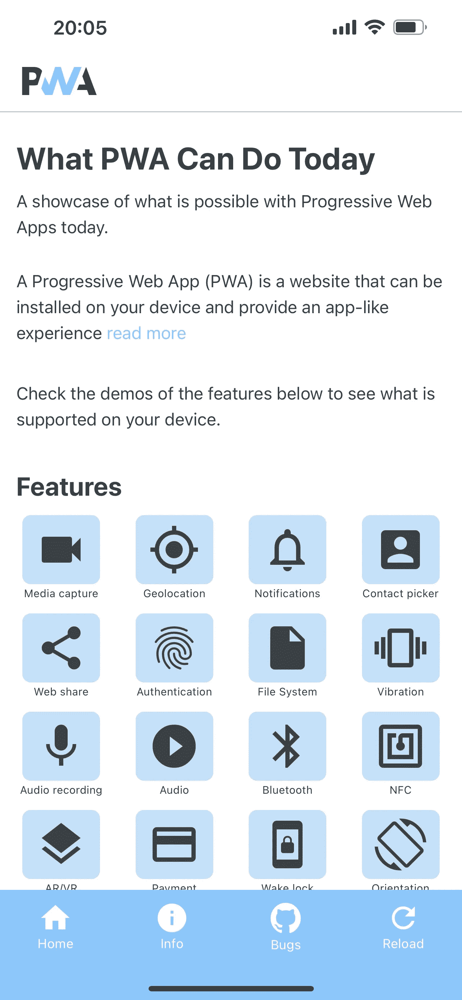

# 隐藏在浏览器中的宝石，藏在显眼的地方。

> 原文：<https://itnext.io/hidden-gems-inside-your-browser-hiding-in-plain-sight-f158003af796?source=collection_archive---------1----------------------->

仍未得到充分利用的令人兴奋的浏览器功能。


本杰明·格雷姆勒在 [Unsplash](https://unsplash.com?utm_source=medium&utm_medium=referral) 上的照片

你的浏览器可以做一些你可能不知道的非常棒的事情。

我每天都和浏览器打交道，我仍然对我发现的一些东西感到惊讶。有时候，我发现了一些我认为只有在本地应用中才有的功能，而且似乎我不是唯一的一个，因为很多这些功能甚至很少在网站中使用！

这些功能可以让你的网站更加强大，并极大地改善用户体验。

然而很少有网站能有效地使用这些功能。这是为什么呢？

可能开发者不知道它们的存在或者不知道如何实现。另一个原因可能是浏览器支持:这些特性中的一些并不是在所有浏览器中都可用，所以开发人员要等到它们可用时才实现它们，顺便说一句，这很不幸。

让我们看看这些隐藏的宝石，从一个显而易见的开始:地理定位。

# 地理定位

地理定位是一项已经在浏览器中存在了很长时间的功能。它使网站能够确定用户设备的位置(坐标)。

尽管它已经存在了一段时间并且得到了很好的支持，但是很多网站仍然没有使用它。

我遇到过很多次这种情况:我在城市里，我需要在当前位置附近找到一个商店位置。

我一般会去店家的网站找最近的位置。很多时候，我必须输入邮政编码，而不是通过地理定位 API 询问我的当前位置。

现在，当我在家的时候，这不是一个真正的问题。但是当我在一个城市的某个地方时，我不知道我当前位置的邮政编码是什么。

地理定位的完美用例。

这个 API 非常简单:

```
navigator.geolocation.getCurrentPosition(({coords}) => {
  const {latitude, longitude} = coords; console.log(`your position is: ${latitude}, ${longitude}`);
}, ({code}) => {

  const reasons  = {
    1: 'no permission given',
    2: 'position not available',
    3: 'time-out trying to get position'
  }; console.error(`Geolocation error: ${reasons[code]}`);
});
```

当用户给予许可时，你可以获得他/她的位置，并将其与谷歌地图相结合，例如，并提供如何到达最近的商店位置的方向。

您不需要原生应用程序就能获得出色的用户体验！

在所有浏览器中都可用。

# 无密码登录

现在，许多甚至大多数用户都有了可以进行面部识别或读取指纹的设备，真的没有理由再仅仅依靠密码进行身份验证了。

众所周知，密码很麻烦。人们使用太简单的密码，他们很容易记住，甚至重复使用不同的帐户。

密码要求，如最小长度和特殊字符的使用，已被证明用途有限，因为这些要求鼓励重复使用相同的密码，并且对使密码更容易被破解几乎没有作用。

但主要问题是，密码是一个*共享的秘密*。你需要在每次登录时与某个服务器共享它。

而当你*分享*它的时候，它就可以被*偷走*。这是每天都会发生的事情。

虽然你肯定应该继续为没有读取生物特征数据的设备的用户使用密码，但你可以从今天开始为有此功能的用户使用无密码登录*。*

*网络认证，简称为 *WebAuthn* ，所有现代浏览器(包括手机)都支持，让你只需一个用户名/电子邮件和你的指纹或面部就能登录。*

*WebAuthn 依赖于公钥加密，这意味着不会共享任何敏感数据。与密码不同，公钥不是秘密，即使被盗，如果没有相应的私钥，它实际上也是无用的。*

*您只需注册用户的用户名或电子邮件和公钥，然后该用户就可以使用用户名和指纹或面部识别(例如 FaceID)登录。*

*下面是一个 Github 项目，带有源代码和演示，可以帮助您入门:*

*[](https://github.com/DannyMoerkerke/webauthn-demo) [## GitHub-DannyMoerkerke/WebAuthn-demo:一个无密码 Web 认证(Web auth)的演示

### 使用 Web 身份验证(WebAuthn)的无密码身份验证演示。要运行演示，请运行 npm install 一次，然后…

github.com](https://github.com/DannyMoerkerke/webauthn-demo) 

# 离线支持

如今，任何网站都可以离线工作，但提供这一功能的网站并不多。

为什么不呢？

我的猜测是，许多开发者根本不知道这一点，或者认为当你不在线时，一个网站就不能工作。

但是当你添加一个[服务人员](https://developer.mozilla.org/en-US/docs/Web/API/Service_Worker_API)到你的网站时，你可以让它离线时完全正常工作，或者至少提供一个有用的后备。

服务人员基本上是位于浏览器和网络之间的代理服务器。它可以拦截请求，从而提供缓存的响应和内容。

这意味着您可以在用户的设备上缓存内容，并在用户离线时提供这些内容。这是许多原生应用提供的功能，你的网站也可以。

服务人员可以做许多更有用的事情，并且在所有现代浏览器中都得到支持。

下面是我写的一篇文章，可以帮助你开始:

[https://it next . io/how-to-make-your-website-work-offline-b5 be 47 b 92 ADC](/how-to-make-your-website-work-offline-b5be47b92adc)

# (推送)通知

您可以在桌面(MacOS、ChromeOS、Windows、Linux)和 Android 设备上的任何浏览器中显示通知。

在 ChromeOS 和 Android 上，当网站没有打开或浏览器甚至没有运行时，也可以发送这些通知。这些通知称为推送通知。

不幸的是，iOS 和 MacOS 不支持这些在网站未打开或浏览器未运行时发送的推送通知，尽管 MacOS 上的 Safari Tech Preview 正在慢慢增加支持。

无论网站或浏览器是否运行，都能够接收通知，这显然是这些通知的最大优势。

但是另一个很好的特性是这些通知也会出现在操作系统的通知中心。

在 Android 上，你甚至可以让手机在收到通知时按照你定义的振动模式振动。

# 将您的网站安装为应用程序

在桌面、安卓和 iOS 上，你现在可以把你的网站作为一个应用程序来安装。

这些应用程序被称为渐进式 Web 应用程序(PWA ),使您的网站能够像本机应用程序一样运行，包括本机应用程序提供的大多数功能。

这意味着你的网站将在用户的主屏幕上有一个图标，将全屏显示，并且可以完全离线运行。在 Android 和 ChromeOS 上，你的应用可以接收通知，即使它没有运行。

这也意味着你不需要把你的应用程序放入应用商店或者 Play Store 让用户安装。你可以给他们提供一个你网站的链接。

每当你的应用程序有更新时，用户不必手动下载。您只需将更改部署到托管您网站的服务器上，安装的应用程序就会自动更新。

艾滋病毒本身就是一门完整的学科。我写了一篇文章解释基础知识和为什么我认为 PWAs 最终会取代本地应用。

我还创建了[PWA 今天能做什么](https://whatpwacando.today)，这是一个 PWA 今天能做什么的演示集。

这个网站本身就是一个 PWA，所以你可以把它安装到你的设备上，自己看看有什么可能。



PWA 今天能做什么

# 你可以从今天开始

所有这些特性对你的用户都非常有用，因为它们在所有现代浏览器中都得到支持，所以你可以从今天开始实现它们。

不用担心完全的浏览器支持！

每当浏览器不(完全)支持某个功能时，您可以提供一个优雅的后备，以确保这些用户也能获得最佳体验。

许多网站不提供这些功能，而是希望你安装他们的原生应用程序。事实上，[正在积极地赶走那些不想安装应用的用户，也没有必要安装。](https://medium.com/better-programming/were-killing-the-mobile-web-be5c5662c807)

你的浏览器已经准备好了，你的网站也可以了。

*你可以* [***在 Twitter 上关注我***](https://twitter.com/dannymoerkerke) *在那里我写了更多关于现代网络能做什么的内容。**