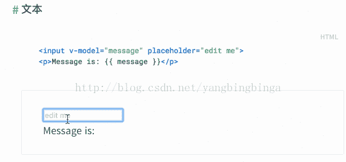

# 前端框架如何帮助我实现“全堆栈”

> 原文：<https://itnext.io/how-a-front-end-framework-helped-me-with-becoming-full-stack-dda72f580d30?source=collection_archive---------3----------------------->


来源:bondforwebsolutions.nl

> [点击这里在 LinkedIn 上分享这篇文章](https://www.linkedin.com/cws/share?url=https%3A%2F%2Fitnext.io%2Fhow-a-front-end-framework-helped-me-with-becoming-full-stack-dda72f580d30%3Futm_source%3Dmedium_sharelink%26utm_medium%3Dsocial%26utm_campaign%3Dbuffer)

在这篇博客中，我将讲述我作为后端程序员如何开始前端开发的经历，以及一个框架如何帮助我从后端开发人员过渡到“全栈”。我在“全栈”中使用引号的原因是因为这个术语有点模糊。这是一个因为被使用而失去了一点价值的术语。帮助我的框架是 vuejs。因此，我将谈谈这个框架的一些对我有帮助的特性，并解释它们为什么对我有帮助。

## 背景

让我们从我的一点历史开始。我叫马克·范德·斯廷霍文，25 岁，住在阿姆斯特丹，为一家名为 DigiMonks 的公司工作。一家专注于大数据创建和分析的公司。我在阿姆斯特丹的 Hogeschool van Amsterdam 学习了 4 年计算机科学，这个学校只教授 Java 作为编程语言。像前端这样的东西不会引起注意，我们希望你们自己去学习。也就是说，当我完成我的研究并开始在 DigiMonks 工作时，我也知道如何前端，因为他们也创建了 dashboard 等。因此不难想象，我在 SSR、webpack、virtual-DOM 和前端世界中所有很酷的东西上度过了一段艰难的时光。我发现自己在寻找一种结构化的前端方式。出于各种原因，我一直不喜欢 jQuery。其中一个，因为我从来都不擅长，代码变得很乱，当 DOM 改变时，我的脚本会崩溃(我们都经历过)。

## 我如何开始使用 Vuejs

我第一次接触类似的框架是脸书的 React，回头看，它可能是通向 far 的桥梁。与其说是框架，不如说是库。它提供了很大的灵活性和各种各样的工具来以不同的方式完成同样的事情。管理状态是通过 Flux、Redux 或 react-easy-state 或其他 npm 包完成的。你看到我的问题了吗？当时我不知道该挑选什么，像商店这样的东西对我来说是新的，所以我很快就厌倦了我被提供的无尽的选择。我在网上找到的样板彼此差异太大，以至于我找不到结构，很快就感到臃肿。如果你有经验，它是完美的，它使程序员能够完全控制它的应用程序。但是，这不是我当时需要的。

接下来是 Vuejs，我们公司使用 Laravel，所以我很快就接触到了 Vuejs，因为 Laravel 社区将它作为首选框架。我的第一个应用程序是一个单页应用程序。对于 SSR，需要一个存储器和一个路由器。我从一开始就被扔进了深渊。但是应用程序的基础已经写好了，所以我只需要找到如何使用它。这非常容易。

为什么？Vuejs 有自己的社区，当时 SSR 是用 Nuxtjs 完成的。受 Nextjs 启发的框架。商店大部分是用 Vuex 完成的，这是一个受 Mobx 启发的状态管理库。不同的是，Vuejs 很好地采用了这些工具，就好像它们是框架的一部分。所以我当时的想法是:“嗯，我想这些是我应该使用的工具。”回想起来，我想我是对的。但是为了简单起见，在这篇博客中我将只讨论 Vuejs。如果有人要求我也写 Nuxt 和 Vuex，我可能会改天再写。由于这不是一个关于如何开始使用 Vuejs 的博客，我将只谈论一些对我帮助很大的特性，而不会深入讨论。只是为了让你了解这些特性是如何以及为什么帮助我的。

## 一切都有位置，vue 组件。

基于组件的前端开发是编写应用程序的一种方式。这是一种在前端应用程序中创建可重用部件的方法，这些部件接收属性，并使用这些属性来显示或实现某种行为，而无需知道它们的使用环境。(如果我说错了请纠正我)。Vuejs 中组件的构造方式非常简单。

```
<template>
  <div>
    <div class="someClass">
      {{someData}}
      {{fullname}}    
      {{numberToBeIncremented}}
    </div>
   <button @click="increment">increment</button>
  </div>
</template>
<script>
  export default{
    props:['somepropertie'],
    data() {
      return{
        someData: "this is a data field",
        firstname: "mark",
        lastname: "steenhoven",
        someApiResponse: []
        numberToBeIncremented: 0
      }

    },
    methods:{
      increment(){
        this.numberToBeIncremented += 1;
      }
    },
    computed:{
      fullname(){
        return this.firstname + this.lastname;
      }
    },
    async mounted(){
      const response = await this.$http.get('http://domain.com/some-api/posts')
      this.someApiResponse = response.data;
    }

  }
</script>
<style scoped>
  .someClass {
    background-color:red;
  }
</style>
```

这段代码代表了一个 vue 组件，具有我最常用的特性。它从一个模板标签开始，在这里我们写我们的 html 元素并显示组件的数据或状态，为什么我认为这是一个很大的优点是你可以像你习惯的那样写你的 html。我注意到的第二件事是每样东西都有它应该在的地方。应该由用户交互或更改某些数据属性触发的功能被放在方法中。你想要映射的东西，或者为了特定的可视化显示而改变的东西，比如把日期解析成另一种格式，放在计算对象中，挂载的地方是我们启动 API 调用并把响应放在数据对象中的地方。挂载是组件生命周期的一部分，你可以在文档中读到更多关于它的内容，但是这是你想要进行 API 调用的地方，因为这是组件已经呈现在 DOM 中的时刻。父组件传递的属性放在 props 属性中。数据属性是一个返回对象的函数。这可以用于各种各样的事情，它可以用来填充一些默认数据的组件。复制 API 调用的响应，并将其传递给子组件。最后但同样重要的是，我们有风格标签。这是你写风格的地方。它的特别之处在于您可以使样式有范围。这意味着类名、样式或任何您想做的样式都被隔离在这个组件中。这些组件的结构被很好地记录下来，因为 Vue 组件总是有相同的结构，所以从一个项目到另一个项目的转换也很容易。

## 与 v-model 的双向绑定

在许多情况下，您希望跟踪在某种输入字段中发生变化的数据。V-model 有点神奇，但它是一种在输入、文本区域等上创建双向数据绑定的方法。这使得跟踪例如表单中的当前数据变得容易。



正如你所看到的，它很容易使用，我已经使用(和误用)了很多东西。这使得用户输入与您的状态保持同步变得很容易。这是你现在使用 Vuejs 时不用担心的事情之一。

## 易于在现有应用中实施

我想讨论的另一件事是在现有的应用程序中使用 Vuejs 的方式。在我工作的公司，我们使用了很多 jQuery。我发现自己在为此挣扎。所以我尝试着为一些小东西实现 Vuejs，比如一个表单，它包含一些基于输入而出现和消失的元素。vue 应用程序有时是一个组件，或者一个或三个组件。但是，即使对于现有系统中的这些小功能，编写起来也很有趣，实现起来也很容易。现在我不知道这在 React 或者说 Angular 中是如何实现的，所以我将只讨论 Vuejs 实现这一点的方式。如果你正在使用 angular 或 react，你可能会说“我使用的框架也很简单！”。哪个好！我只是来说说这个案例中的 vue 是如何帮助我的。

```
<script>
import Vue from 'vue'
import SomeComponent from '~/components/SomeComponent'new Vue({
  el: "#app",
  render: (h) => h(SomeComponent)
})
</script>
```

在这个代码示例中，我们创建了一个新的 Vue 实例，我在 html 中给了这个实例应该挂载的元素。在本例中，是一个 id 为“#app”的元素。我们给它一个渲染函数，包含我们想要渲染的组件。当您在现有应用程序中使用 Vuejs 时，该组件通常是使用其他子组件的根组件。这就是在现有应用程序中使用它的全部内容。简单对吗？如果你是一名程序员，你可能会在你没有写过的应用程序中工作。这是 Vuejs 让我如此高兴的原因之一，它在现有的应用程序中实现起来如此简单。我不必担心我必须给某些元素的 css 类。我可以在现有的仪表板或网站中编写我自己的独立应用程序。

## 数据驱动

最后但同样重要的是，这不是 Vuejs 特有的，而是几乎所有前端框架都有的，它们是由数据驱动的，而不是由 DOM 的结构驱动的。当这些数据改变时，这些数据的可视化也会改变。如果一个列表有 10 个条目，并且在 jQuery 或普通 javaScript 中删除了一个条目，我们必须自己用查询选择器从 DOM 中删除这个条目。就性能而言，改变 DOM 代价很高。这就是 Vuejs 和 react 使用虚拟 DOM 的原因。虚拟 DOM 是用 javaScript 表示的 html 文件。

```
// An unordered list represented as Javascriptlet 
domNode = {  
    tag: 'ul',  
    attributes: { id: 'someId' },  
    children: [    // where the LI's would go  ]
}; 
```

这样，我们可以直接从代码中使用 DOM API。执行的更新是对 javaScript 对象进行的，这很便宜。在虚拟 DOM 改变之后，执行同步以将虚拟 DOM 与实际 DOM 同步。在此同步之后，仅呈现已更改的元素，以保护应用程序的性能。如果在这之后你不知道我刚才说了什么，我建议你仔细阅读它，因为它是一个非常有趣的特性。

## 结论

当我开始前端时，我在 jQuery 上挣扎，因为使用查询选择器处理 DOM 并不是一种让前端变得健壮的方法。我交付的作品不够好。这就是我开始寻找有希望给出结构的框架的原因。Vuejs 对我来说是一个框架，它的组成部分是合乎逻辑的，易于理解。V-model 帮助我保持用户输入与组件状态同步，尽管有点神奇的是我再也不用担心这个了。最后但同样重要的是，我需要一些在现有应用程序中容易实现的东西。在我看来，Vuejs 在这方面比较强。有一点并非 Vuejs 所特有，但我喜欢框架是数据驱动的这一事实。如果你写的 API 是好的和一致的，你现在可以相信你的前端在一些视觉方面实现它，并相信只要 API 不改变，它就不会崩溃。额外的好处是虚拟 DOM 也提高了前端应用程序的性能。

## 包装它

在这篇博客中，我谈到了我作为一个必须在前端工作的后端人员所经历的挣扎。以及我如何最终选择使用 Vuejs 作为我的框架。

我讲了一些对我帮助最大的特性。这给了你一个想法，是什么让我如此容易地从后端快速过渡到前端，成为我想要(必须)成为的前端。我希望读完这篇博客后，你能体会到我所经历的转变，如果你现在和我有同样的经历，我也会帮助你。或者，如果你是一个想做前端的后端，给你一个从哪里开始的感觉！

谢谢你的阅读，我希望你喜欢我写的第一篇博客。如果你想让我写更多关于 Vuejs，nuxt，vuex 的东西。留言评论！