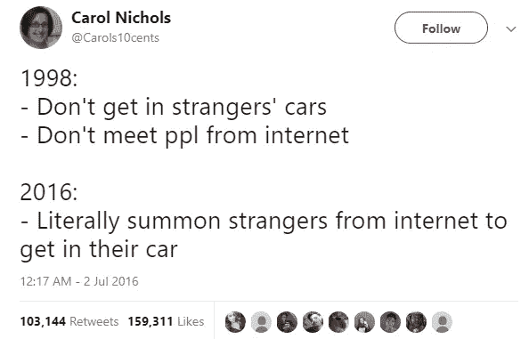
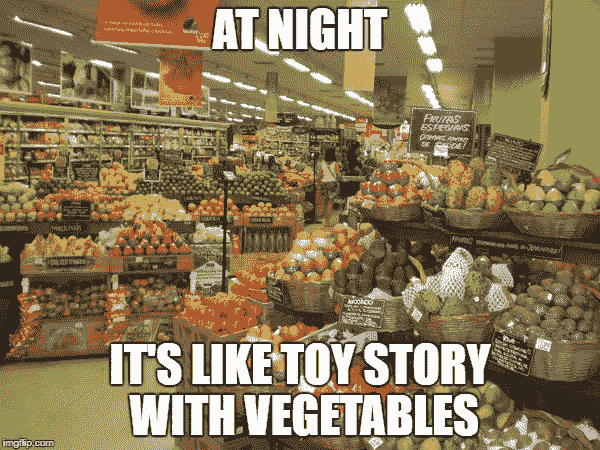
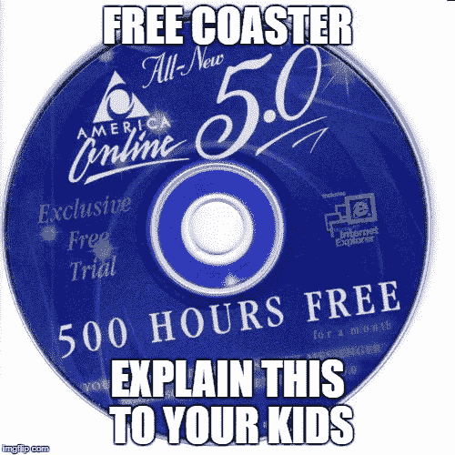
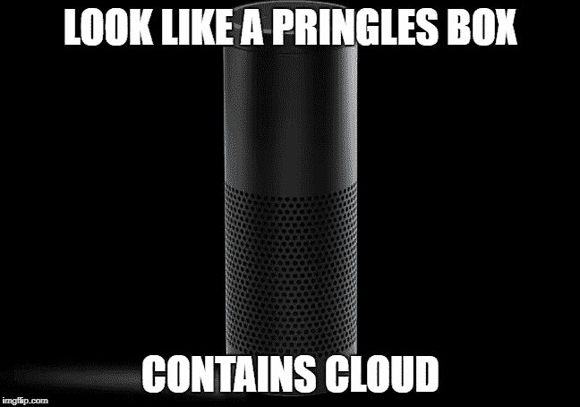

# 大公司如何在云驱动的创业革命中生存？

> 原文：<https://itnext.io/how-can-large-companies-survive-the-cloud-powered-startup-revolution-bbe86dfb00d7?source=collection_archive---------0----------------------->

要打败你还没听说过的创业公司，你必须像创业公司一样思考。

[*点击这里在 LinkedIn*](https://www.linkedin.com/cws/share?url=https%3A%2F%2Fitnext.io%2Fhow-can-large-companies-survive-the-cloud-powered-startup-revolution-bbe86dfb00d7) 上分享这篇文章

如果你有一个千载难逢的机会来重塑你的企业，会怎么样？想象一下，如果你能在白板上左边画出你所有的业务问题，右边画出所有你想做的事情，然后你就能*完成*？

对于一般的企业来说，这看起来会是什么样的呢？

左侧的棘手问题拖了好几年——我遇到过几十家企业，它们都有这一系列的长期问题。他们都说，“没有人知道如何修理呼叫中心，没有人愿意承认有盗窃问题，我们没有创新预算。”好吧，那我们什么都不做！

同样的企业，如果有机会，会喜欢尝试一些相当鼓舞人心的东西。如果他们能想出自助服务，他们就能摆脱电话作为客户唯一选择的局面。他们可以通过高质量的 how-to 视频内容和定期订阅来照顾他们最重要的回头客，并通过跟踪他们销售的每一件商品和使用自动化来解决盗窃问题。

左边的企业无处不在——无论是大企业还是小企业——它们很可能构成你竞争对手的大部分。但是现在有一个岔路口。当新的创业公司不知从哪里冒出来，突然做了所有正确的事情时，这些公司正在慢慢被侵蚀，不再存在。

我们遇到了一个基本问题——为什么经验丰富的老公司无法实现这种转变，而新的创业公司却可以？如何从白板的左侧移到右侧？

# 顾客讨厌平庸。

在新经济中，引领潮流的是消费者，而不是公司。让那件事过去一秒钟，因为事情并不总是这样。

一个接一个的行业，技术正在打破已有的传统规范，留下一个真空，由新的做事方式来填补。无论是在智能手机上获得小额贷款，用 Lyft 叫车，还是通过 Prime Now 获得冷冻披萨，这些事情在十年前都是遥不可及的。虽然哪种技术是推动者，但所有这些都不是由公司推动的，而是由客户主导的。

亚马逊没有用 Kindle 杀死 Borders，AirBnB 也没有通过垄断行为或游说立法成为世界上最大的酒店房间提供商。这些公司发现了新技术嵌入用户时出现的机会，然后满足了这些客户的需求。如果他们没有采取行动，其他人也会这样做。

电视专家们搞错了——这不是一个传统的“大企业摧毁夫妻店”的故事。不像大公司来到镇上，通过买下所有土地和贿赂当地城市来阻止竞争，这一次任何人都可以竞争。进入门槛处于历史低位，但很少有公司清楚地看到正在发生的事情。

# 创业领域比你想象的要大很多。

我知道，我知道，每个人总是推出同样的几个例子——优步、Airbnb、亚马逊——绝大多数行业并没有真正受到影响，对吗？

不对！以下是 **250** 更多颠覆行业的初创公司，仅在金融服务领域:

来自[https://www . CB insights . com/research/fin tech-250-startups-most-promised/](https://www.cbinsights.com/research/fintech-250-startups-most-promising/)

金融服务革命的时机已经成熟，但这种革命正在任何地方发生。超级聪明的马克·安德森是我的偶像之一，他解释了风险投资如何不再只追逐希望渺茫的互联网独角兽，而是资助那些可以杀死老牌恐龙的初创公司。风投们现在正把数十亿美元硬塞给小而有活力的初创公司，这些公司可以击败企业 T-Rexes。这很重要。

如果这听起来很牵强，大公司的寿命已经从几十年前的 60 年缩短到今天的 20 年。美国银行预测标准普尔 500 指数的 50%可能在十年内消失。很难夸大技术变革的加速速度、悬崖状成本曲线的影响，以及这如何将老牌公司置于智能和云设备的交叉路口。

# “但人们永远不会<insert wrong="" assumption="" here="">！”</insert>

老牌大公司根本不理解消费者对移动、智能和即时的不断变化的偏好。我听到有人说，当他们忙着在手机上一键下单时，他们认为实体零售永远不会消失。真的在摇头。

> “我讨厌亚马逊的便利，”从来没有人说过。

把超市想象成不受科技影响的旧世界商业的代理。如果你走过当地杂货店的过道，越过 Muzak，你会听到微弱但越来越大的声音。这是商店主管们失去理智的声音，也是对亚马逊收购全食超市感到不安的声音。

超市的商业策略根植于实体，可以简单地总结为“买下所有的土地”。当你在 10 英里之外时，消费者不会驱车 50 英里去见竞争对手，所以你仅仅通过在场就迫使他们做出消费选择。这是一个辉煌的商业模式，直到现在。

对杂货商来说，坏消息是他们的物流技术被亚马逊无情地超越，他们的战略思维也过时了。运输新鲜产品的明显问题正在得到解决，尽管有人声称人们“喜欢选择蔬菜”，但我敢打赌，如果可能的话，大多数人更喜欢让蔬菜神奇地出现在冰箱里。

简而言之，这是一个选择，要么每周花 2 小时与公众斗争购买食物，要么使用一种服务来自动补充一切。10 年后，逛大型商店购买食物对人们来说将是陌生的，就像 1 万年前花时间寻找你吃的东西看起来是*一样。*

# 像成年人一样行动，像创业者一样思考。

对于现有的企业来说，有许多重要的东西需要从与云相关的初创公司那里学习。

## 1.让云成为您工作的中心。

不管是哪个行业，这些颠覆性的创业公司都有几个共同点:

*   **他们*都*用云**。全部都是。我还没有听说过一个人在内部启动设备。这真的很有意义。
*   它们都是基于技术的解决方案**，直接解决特定的业务或消费者问题**。
*   他们都由拥有强大商业和技术技能的小团队组成。

正如麦肯齐·科苏特在奥斯汀的 AWS 启动日上指出的，10 年前启动一个想法可能要花费 500 万美元，需要一个工程师团队几个月或几年的时间；如今，只需 5000 美元，只需一名工程师和几周时间。

换句话说，云是一堆乐高积木，你可以用任何你想要的方式组装起来。云提供的自动化和扩展取代了旧世界 IT 的整个部门，但它也为您提供了难以置信的灵活性。随着初创公司不可避免地调整和微调他们的产品，他们正在加强他们的技术栈，而不是抛弃它。

## 2.让云加速您的产品开发。

在你的公司里，谁没有可以改进你的产品或服务的想法？有多少次顾客给了你被掩盖的非常好的反馈？这并不是说改进的想法很难找到——公司只是习惯于忽略它们。

事实上，在许多传统企业中，整个激励模式是反创新和反顾客的。如果你有一个想法，你很可能会被视为“不是一个团队成员”，或者受到组织中政治机器的惩罚。等级制度是用来严格限制变化的——但是这种方法将不再以云的速度工作。

旧世界认为，好的产品创意来自公司的高层，然后他们会花一两年的时间来打造要推出的产品，当客户说产品很糟糕时，他们就会利用营销和销售来强迫他们接受。从航空公司到洗发水，这是一种屡试不爽的技术，主导了之前的商业时代。

云可以通过为您提供快速上市的速度、数据和自动化来改进您的产品并推动其发展，这些结合起来形成一个反馈回路，让您快速迭代以满足您的客户。这就简单多了。你不必再假装你事先知道所有的答案。停止对抗流程，让云帮助您构建客户真正想要的解决方案。

## 3.云是业务和 IT 之间的粘合剂。

为了在未来提供价值，IT 人员将需要更好的业务技能。或者也许它死了，而获得技术技能的是商业人士。无论哪种方式，留下来的关键人物都会很好地理解双方，并使用云技术作为粘合剂。

亚马逊工程师杰西·沃森(Jesse Watson)写了一篇[的伟大文章](https://www.linkedin.com/pulse/hard-thing-software-development-jesse-watson)，讲述了开发者的价值正变得越来越与他所谓的“深层环境”相关，他的观察实际上非常出色。发展作为一项活动本身的价值越来越小，推而广之，如果它只是作为一个独立的实体存在，也是如此。

做出最大贡献的人对他们所在领域的 IT 和业务有着深刻的了解，并通过使用云作为结缔组织来毫不费力地将两者联系起来。

## 4.敏捷地嫁给云:Alexa 是我们这个时代的特洛伊木马。

亚马逊是一个很好的案例研究——注意当 Alexa 到来时，她很快就(它？)与订货和库存进行了深度整合，然后迅速展现为开发者 API 平台。他们能够测试产品——这可能是一场灾难，就像 Fire phone 一样——然后一旦客户验证了这个想法，就把它连接起来。

这是亚马逊在创业。太多的公司没有利用他们的云机会来交付真正敏捷的产品。除非你接受敏捷和云是如何联系在一起的，否则你不会比任何人都更好地将你所有的努力放在识别和解决客户问题上。相比之下，想象一下如果西尔斯发明了 Alexa…我知道这很可怕。

## 5.放下过去。

忘记它曾经的样子，因为它已经死去。源自工厂生产时代，它没有 2 到 5 年周期的灵活性，现在抛弃了旧的商业模式。供应商锁定、百万美元合同和只能向后看的数据模型——这些都完了。

然而，技术是满足这种新的客户需求的核心，您需要现代化、稳定、廉价的系统，能够适应不断变化的市场需求。你需要在更短的周期内，支持技术，调整技术，然后淘汰技术。

# 云无非就是创新本身。

当亚马逊把它的秘密武器——AWS——作为任何人都可以购买的产品向世界发布时，它通过成为互联网的操作系统有效地保证了它的成功。正如你不能在旧世界不使用现实世界的高速公路和电网网络而成功一样，新世界基于云的基础设施是成功的核心。

对于意识到云机遇的公司来说，它提供了摆脱技术债务蜗牛壳的自由，这些债务一直在削弱他们的能力。未来成功的公司将是更小、更灵活的实体，能够更快地对正确的产品和服务做出反应。IT 将完全基于云，因为 it *只为支持业务而存在。*

我们正处于云创业革命的早期。我不指望许多保守派能适应生存，但对于那些能适应的人来说，这有望成为十年的商机。