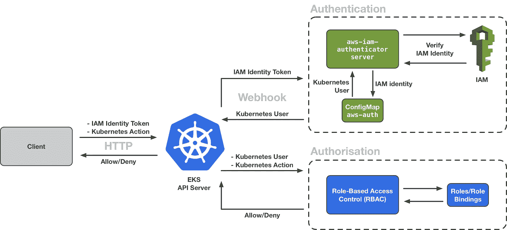
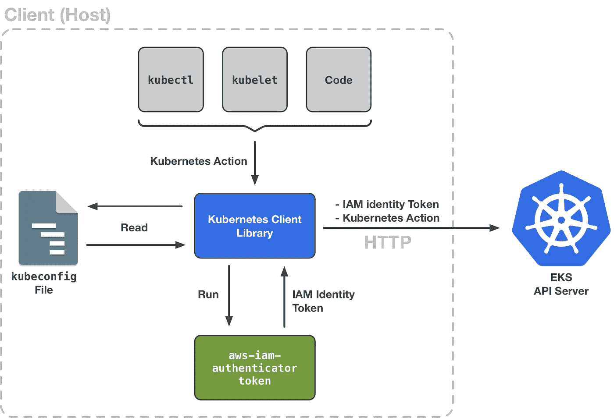

# 亚马逊 EKS 上的 Kubernetes 客户端认证

> 原文：<https://itnext.io/how-does-client-authentication-work-on-amazon-eks-c4f2b90d943b?source=collection_archive---------1----------------------->

亚马逊[Kubernetes(EKS)弹性容器服务](https://aws.amazon.com/eks/)是 AWS 的托管 Kubernetes 服务。本文解释了在 EKS 上对 API 服务器请求的认证是如何工作的。

讨论分为两个主要部分，可以通过这些快捷方式直接访问:

*   [**EKS 认证:服务器端**](#b575)
*   [**EKS 认证:客户端**](#609a)

# 亚马逊 EKS

亚马逊 EKS 于 2018 年 6 月[正式上市](https://aws.amazon.com/blogs/aws/amazon-eks-now-generally-available/)。它与来自谷歌云平台的 [GKE](https://cloud.google.com/kubernetes-engine/) 或来自微软 Azure 的 [AKS](https://docs.microsoft.com/en-us/azure/aks/) 属于同一类服务。

然而，与后两种服务不同，EKS 并不为您创建和运行整个集群，而是为您创建和运行集群的*控制平面*。控制平面的含义一般是*主节点*。

特别是，EKS 在 AWS 管理的帐户中的不同可用性区域运行多个主节点(为了高可用性)(也就是说，您在自己的帐户中看不到主节点)。您负责在自己的帐户中作为 EC2 实例供应和运行工作节点(数据平面),并使它们加入主节点以形成完整的集群。

这种方法使您能够在流程的早期接触到 Kubernetes 客户端身份验证(工作节点必须在控制平面中针对 API 服务器进行身份验证，以便加入集群)。此外，EKS 以一种非常特殊的方式处理客户端身份验证(使用 IAM 身份)。这就是为什么客户端认证对于 EKS 用户来说是一个非常重要的话题。

在本文中，“身份验证”指的是针对 Kubernetes API 服务器的请求(来自任何类型的客户机)的身份验证。

# Kubernetes 基础知识

## Kubernetes API 和 API 服务器

从用户的角度来看，Kubernetes 本质上是一个 HTTP REST API。这个 API 的端点叫做 [**API 服务器**](https://kubernetes.io/docs/concepts/overview/components/#kube-apiserver) 。API 服务器通常运行在 Kubernetes 集群的主节点上。

客户端与 Kubernetes 的每次交互都是通过 API 调用 API 服务器来实现的。例如，如果您执行`kubectl get pods`，那么幕后的`kubectl`向 API 服务器发出一个 HTTP 请求，API 服务器执行所请求的`get pods`动作，并将结果返回给您。

这不仅适用于来自集群外部的请求，也适用于来自集群内部的请求，包括集群组件本身。例如，工作节点通过对 API 服务器的 API 调用与主节点上的控制平面通信。这与您在集群外部使用的 API 和 API 服务器相同。

Kubernetes 可以通过这个 API 完全控制，所以很明显，对这个 API 的访问必须是安全的。这就是客户端身份验证的用武之地。

## 证明

从任何客户端到 API 服务器的每个请求都由 API 服务器进行身份验证。这适用于来自集群外部的请求(例如，来自您的本地机器)，也适用于来自集群内部的请求(例如，来自工作节点上的`kubelet`)。身份验证机制在所有情况下都是相同的。

Kubernetes 提供了许多可以被 API 服务器使用的**认证方法**。这些认证方法也被称为*认证模块*或*认证器*。

从概念上来说，API 服务器将每个接收到的请求传递给认证器，认证器将认证决定返回给 API 服务器(尽管有些认证器简单得就像静态的令牌列表，如果请求包含列表中的令牌，则请求被认证)。

可以同时使用多个授权码，在这种情况下，API 服务器会按顺序查询它们。启动 API 服务器时，必须为 API 服务器配置所需的授权码。

以下是所有可用认证方法的列表，如 Kubernetes 文档中的[这里的](https://kubernetes.io/docs/reference/access-authn-authz/authentication/)所述:

*   [**X509 客户端证书**](https://kubernetes.io/docs/reference/access-authn-authz/authentication/#x509-client-certs)
*   [**静态令牌文件**](https://kubernetes.io/docs/reference/access-authn-authz/authentication/#static-token-file)
*   [**自举令牌**](https://kubernetes.io/docs/reference/access-authn-authz/authentication/#bootstrap-tokens)
*   [**静态密码文件**](https://kubernetes.io/docs/reference/access-authn-authz/authentication/#static-password-file)
*   [**服务账户令牌**](https://kubernetes.io/docs/reference/access-authn-authz/authentication/#service-account-tokens)
*   [**OpenID 连接令牌**](https://kubernetes.io/docs/reference/access-authn-authz/authentication/#openid-connect-tokens)
*   [**Webhook 令牌认证**](https://kubernetes.io/docs/reference/access-authn-authz/authentication/#webhook-token-authentication)
*   [**认证代理**](https://kubernetes.io/docs/reference/access-authn-authz/authentication/#authenticating-proxy)

一般来说，如果一个验证者可以验证一个请求，那么它会将该请求映射到 Kubernetes 系统内部的一个“主题”(让我们称之为 Kubernetes 用户)。这个 Kubernetes 用户是后续授权步骤的基础。

## 授权

经过身份验证后，我们知道请求来自集群的有效用户。然而，每个请求都带有一个特定的 **Kubernetes 动作**(例如，`get pods`或`create deployment`)。集群的不同用户通常具有执行或不执行特定操作的不同特权。因此，我们需要检查请求的发送者是否有权执行所请求的操作。这就是授权的来源。

授权步骤看起来非常类似于认证步骤。有许多可用的**授权方法**(也称为*授权模块*或*授权者*)，您可以在创建 API 服务器时配置希望 API 服务器使用的方法。

以下是 Kubernetes 文档中[这里](https://kubernetes.io/docs/reference/access-authn-authz/authorization/)描述的可用授权方法列表:

*   [**节点授权**](https://kubernetes.io/docs/reference/access-authn-authz/node/)
*   [**【基于属性的访问控制(ABAC)**](https://kubernetes.io/docs/reference/access-authn-authz/abac/)
*   [**【RBAC】**](https://kubernetes.io/docs/reference/access-authn-authz/rbac/)
*   [**Webhook 授权**](https://kubernetes.io/docs/reference/access-authn-authz/webhook/)

授权者的输入包括 Kubernetes 用户(由身份验证步骤返回)和该用户请求的 Kubernetes 操作。在对照其内部策略进行检查之后，授权者向 API 服务器返回一个允许/拒绝决定。

授权者和被授权者是相互独立的，它们是分开配置的。在[这里](https://kubernetes.io/docs/reference/access-authn-authz/controlling-access/)可以找到认证和授权的高级描述。

# EKS 认证和授权

现在我们知道 Kubernetes 提供了什么样的认证和授权方法。EKS 配置并启动 API 服务器以供使用，作为集群控制平面的一部分。那么 EKS 使用哪些认证者和授权者呢？

简短的回答如下:

*   **认证:** [**webhook 令牌认证**](https://kubernetes.io/docs/reference/access-authn-authz/authentication/#webhook-token-authentication)
*   **授权:** [**基于角色的访问控制(RBAC)**](https://kubernetes.io/docs/reference/access-authn-authz/rbac/)

**认证**方法是高度特定于 EKS 的，这是本文的主题。简而言之，它与一个[**承载令牌**](https://tools.ietf.org/html/rfc6750) (包含在每个请求中)一起工作，该令牌由 AWS 提供的 webhook 服务在服务器端进行验证。关键的一点是，这个承载令牌包括 AWS **身份和访问管理(IAM)** 身份，并且 webhook 服务的认证决定基于这个 IAM 身份。这意味着客户端使用 IAM 身份向 EKS 集群进行身份验证。您必须为 webhook 服务配置 IAM 标识，以便授予对集群的访问权限。本文将详细解释所有这些是如何工作的。

在 EKS，授权由 RBAC 授权人完成。它独立于认证系统，并以标准的 Kubernetes 方式完成。也就是说，在授权步骤中没有任何特定于 EKS 的内容。授权不是基于 IAM 身份，而是基于 EKS 认证者返回的标准 Kubernetes 用户。您为 EKS 集群配置 RBAC 授权器的方式与为任何其他 Kubernetes 集群配置授权器的方式相同(如何做，在[这一](#8424)部分有简要说明)。

本文的剩余部分将讨论 EKS 认证机制，该机制分为**客户端部分**和**服务器端部分**。客户端部分定义了客户端如何生成承载令牌并将其包含在请求中，而服务器端部分定义了身份验证器如何验证该令牌。

下面我们就从服务器端部分开始(客户端部分这里是[这里是](#609a))。

# EKS 认证:服务器端

下图说明了 EKS 身份验证机制的服务器端部分。为了完整起见，还包括授权步骤。



EKS 认证和授权(服务器端)。

以下小节解释了该系统的各个组件。

## 使用 IAM 身份验证

首先要注意的是，EKS 使用[身份和访问管理(IAM)](https://aws.amazon.com/iam/) 身份进行认证。IAM [身份](https://docs.aws.amazon.com/IAM/latest/UserGuide/id.html)可以是 IAM [用户](https://docs.aws.amazon.com/IAM/latest/UserGuide/id_users.html)或 IAM [角色](https://docs.aws.amazon.com/IAM/latest/UserGuide/id_roles.html)。

实际上，这意味着客户端包含在请求中的承载令牌必须包含 IAM 身份(以 ARN 的形式)。然后，服务器端的身份验证服务检查这个 IAM 身份是否对应于集群的有效用户。

因为这个不记名令牌包含一个 IAM 身份，所以在上图中我称之为 *IAM 身份令牌*。

使用 IAM 身份进行身份验证的 EKS 团队的想法是，不必为 Kubernetes 集群定义一组新的用户和凭证，而是重用现有的 IAM 身份。

## AWS IAM 验证器

如前所述，EKS 的认证决定是由 API 服务器调用的 webhook 服务做出的。这个 webhook 服务是由一个叫做 [AWS IAM Authenticator](https://github.com/kubernetes-sigs/aws-iam-authenticator) 的工具实现的。

AWS IAM Authenticator 是一个开源项目，由 Kubernetes 特别兴趣小组(SIG)维护，在 [GitHub](https://github.com/kubernetes-sigs/aws-iam-authenticator) 上维护。

> 注意，相同的 AWS IAM 认证器工具也用于 EKS 认证机制的客户端部分，这将在这里[讨论](#609a)。事实上，您只能在客户端使用 AWS IAM 身份验证器，因为在服务器端，EKS 会为您完成这项工作。

AWS IAM 认证器工具提供了可执行文件`aws-iam-authenticator`，该文件提供了几个子命令。这些子命令之一如下:

```
aws-iam-authenticator server
```

此命令启动 EKS webhook 身份验证服务。这意味着，当您创建 EKS 集群时，EKS 会为您运行这个命令(可能在一个主节点上)，并配置 API 服务器使用提供的端点作为 webhook 令牌身份验证方法的目标。

现在，每当 API 服务器接收到请求时，它都会将请求中的 IAM 身份令牌转发给 webhook 服务。webhook 服务首先使用 AWS IAM 服务验证包含的 IAM 标识是否是有效的 IAM 标识。

完成后，webhook 服务会咨询一个名为`aws-auth` ConfigMap 的对象，检查 IAM 标识是否对应于集群的有效用户。`aws-auth`配置映射对于服务器端认证机制至关重要，您必须在这里定义 IAM 身份，以便授予对集群的访问权限。所有这些将是下一节的主题。

## AWS-授权配置映射

`aws-auth` ConfigMap 包含 IAM 身份到 Kubernetes 用户的映射。在这里，您必须定义谁和什么可以访问您的 EKS 集群。如何做到这一点将在后面解释，因为首先，我们应该知道什么是 ConfigMap。

**什么是配置图？**

配置映射是一个 Kubernetes API 对象。这意味着它是一个可以存在于集群中的对象，如 *Pod* 或 *Deployment* 。配置图对象的规格可以在这里[找到。](https://kubernetes.io/docs/reference/generated/kubernetes-api/v1.12/#configmap-v1-core)

配置图具有非常简单的内部结构。它只是由一组**键/值对**组成。所有键都是字符串，值可以是字符串或二进制数据。

配置映射的目的是包含配置信息。它的作用类似于本地程序中的配置文件。配置图是为 pod 和系统组件创建和使用的。

简单配置图的 YAML 定义如下:

```
kind: ConfigMap
apiVersion: v1
metadata:
  name: my-configmap
data:
  key1: value1
  key2: value2
  key3: value3
```

如您所见，这个 ConfigMap 由三个键/值对组成，它们都是字符串。键/值对包含在`data`字段中(也存在可以包含具有二进制数据值的键/值对的`binaryData`字段)。

与任何其他 Kubernetes 对象一样，您可以在集群中使用`kubectl`创建这个配置映射，例如:

```
kubectl apply -f configmap.yml
```

配置图现在存在于集群中，集群组件(例如，pods)可以通过您为其指定的名称(在本例中为`my-configmap`)来访问它。

您可以查看集群中的所有现有配置图，如下所示:

```
kubectl get configmaps --all-namespaces
```

**`**aws-auth**`**配置图****

**`aws-auth`配置映射是一个名为`aws-auth`的配置映射，它必须存在于每个 EKS 集群中(特别是在`kube-system`名称空间中)。如前所述，它由 AWS IAM Authenticator webhook 服务读取，以读取应该被授权访问集群的 IAM 身份的列表。**

**EKS 为您做了很多工作，但它没有为您创建`aws-auth`配置图！您负责创建和维护该对象**

**但是，如果您按照 [*EKS 入门*](https://docs.aws.amazon.com/eks/latest/userguide/getting-started.html) 指南创建了 EKS 集群，那么您已经创建了此配置图！具体来说，在[“启动工作节点”](https://docs.aws.amazon.com/eks/latest/userguide/getting-started.html#eks-launch-workers)步骤中，要求您将工作节点的 IAM 角色 ARN 插入到 ConfigMap 模板中，然后将该模板应用到集群。**

**您必须修改的配置映射模板如下所示:**

```
apiVersion: v1
kind: ConfigMap
metadata:
  name: aws-auth
  namespace: kube-system
data:
  mapRoles: |
    - rolearn: <WorkerNodesRoleARN>
      username: system:node:{{EC2PrivateDNSName}}
      groups:
        - system:bootstrappers
        - system:nodes
```

**让我们更仔细地看看。**

****格式****

**该配置图在`data`字段中包含一个键/值对。不要被管道字符(`|`)和看起来像是 YAML 文档的一部分的后续行所迷惑。`|`是一个 [YAML 多行字符串](https://yaml-multiline.info/)指示符，这意味着后面的所有内容都将被解释为一个单独的多行字符串。**

**因此，该键被称为`mapRoles`，其值是以下字符串:**

```
- rolearn: <WorkerNodesRoleARN>
  username: system:node:{{EC2PrivateDNSName}}
  groups:
    - system:bootstrappers
    - system:nodes
```

**这两个字符串(键和值)对 Kubernetes 来说没有任何意义。对于 Kubernetes 来说，它们只是一个键字符串和一个值字符串。但是，键和值对于 AWS IAM 认证器都有*的意义。***

**事实上，这是 AWS IAM 认证器要求`aws-auth` ConfigMap 数据采用的格式。此配置格式在 AWS IAM 认证器文档中的[处](https://github.com/kubernetes-sigs/aws-iam-authenticator#full-configuration-format)处定义。**

****内容****

**那么，这个键/值对对 AWS IAM 认证器意味着什么呢？又来了:**

```
mapRoles: |
  - rolearn: <WorkerNodesRoleARN>
    username: system:node:{{EC2PrivateDNSName}}
    groups:
      - system:bootstrappers
      - system:nodes
```

**在 AWS IAM 认证器[配置格式规范](https://github.com/kubernetes-sigs/aws-iam-authenticator#full-configuration-format)中，我们可以看到`mapRoles`的每个条目都将一个 IAM 角色映射到一个用户名和一组组。**

**因此，应该被授予集群访问权限的每个 IAM 角色都必须有一个条目。映射的用户名和组定义了一个 Kubernetes“主题”。该主题对认证系统没有意义，但它将是后续 RBAC 授权步骤的基础。这将在[后面的章节](#8424)中解释。**

**在上面的例子中，worker nodes IAM 角色被映射到组`system:bootstrappers`和`system:nodes`中名为`system:node:<DNSName>`的“用户”([配置格式规范](https://github.com/kubernetes-sigs/aws-iam-authenticator#full-configuration-format)还定义了`{{EC2PrivateDNSName}}`将被解析为发出请求的实例的 DNS 名称)。此用户名和组定义了 RBAC 授权者将允许此请求执行的操作。**

**[规范](https://github.com/kubernetes-sigs/aws-iam-authenticator#full-configuration-format)还定义了一个名为`mapUsers`的键，用于为 *IAM 用户*(而不是 IAM 角色)指定映射。下面将展示一个带有额外 IAM 用户和 IAM 角色的扩展`aws-auth`配置图。**

****我们为什么要这么做？****

**为什么我们必须创建此配置图？ [*EKS 入门*](https://docs.aws.amazon.com/eks/latest/userguide/getting-started.html) 指南说，它使我们的工作节点能够加入集群。但是为什么呢？**

**表述这一点的另一种方式是，它首先使工作节点能够与 API 服务器“对话”。**

**遵循 *EKS 入门*指南，我们创建了工人节点作为 EC2 自动缩放组。此时，它们还没有与集群相关联。为了作为工作节点添加到集群中，它们必须从 API 服务器请求(通过已经在其上运行的`kubelet`)。如上所述，对 API 服务器的每个请求都必须包含一个 IAM 标识作为承载令牌。工作节点在其请求中包含的 IAM 身份是我们在创建过程中分配给工作节点的 IAM 角色。该角色在官方 [CloudFormation 模板](https://amazon-eks.s3-us-west-2.amazonaws.com/cloudformation/2018-11-07/amazon-eks-nodegroup.yaml)中被称为 *NodeInstanceRole* ，该模板在 *EKS 入门*指南中使用。**

**然而，到目前为止，这个 IAM 角色没有在`aws-auth`配置图中列出，所以 AWS IAM 验证器没有验证来自工作节点的这些请求(实际上，到目前为止，`aws-auth`配置图甚至还不存在)。**

**通过将 worker 节点的 IAM 角色添加到`aws-auth` ConfigMap 中，我们解决了这个问题，并最终使来自 worker 节点的请求由 AWS IAM Authenticator 进行身份验证。这允许工作节点最终与 API 服务器对话，并被添加到集群中。**

****一个扩展的** `**aws-auth**` **配置图****

**通过在`aws-auth`配置图中列出 IAM worker nodes 角色，我们实际上定义了第一个被允许与 API 服务器对话的“用户”。如果我们想要添加额外的集群用户，那么我们必须将他们作为新条目添加到`aws-auth` ConfigMap 中。**

**在下面的例子中，我编辑了`aws-auth`配置图，以包含一个额外的 IAM 角色和 IAM 用户(以粗体突出显示):**

```
apiVersion: v1
kind: ConfigMap
metadata:
  name: aws-auth
  namespace: kube-system
data:
  mapRoles: |
    - rolearn: <WorkerNodesRoleARN>
      username: system:node:{{EC2PrivateDNSName}}
      groups:
        - system:bootstrappers
        - system:nodes
 **- rolearn: <LambdaRoleARN>
      username: lambda
      groups:
        - system:masters
  mapUsers: |** **- userarn: <UserARN>
      username: user
      groups:
        - system:masters**
```

**如您所见，我必须将 IAM 角色映射添加到已经存在的`mapRoles`键的值中，并将 IAM 用户映射添加到单独的`mapUsers`键中。所有这些都在 AWS IAM Authenticator [配置格式规范](https://github.com/kubernetes-sigs/aws-iam-authenticator#full-configuration-format)中定义。**

**我自由地为两个映射选择了一个用户名，并将它们与`system:masters`组相关联，这是一个预定义的组，由 RBAC 授权者解释为允许对集群的完全访问(更多信息见下面的[)。](#8424)**

****如何编辑** `**aws-auth**` **ConfigMap？****

**创建完成后，您可以使用以下命令轻松编辑`aws-auth`配置图:**

```
kubectl edit -n kube-system configmap/aws-auth
```

**当您保存编辑过的文件时，您的更改将自动应用。**

****集群创建者呢？****

**创建 EKS 集群的 IAM 身份自动“硬连接”在 AWS IAM 身份验证器中。这意味着该 IAM 身份由 AWS IAM 验证器识别和验证(并映射到`system:masters`组中的用户),而不会在`aws-auth`配置映射中列出。这就是为什么在创建 EKS 集群之后，您已经可以使用`kubectl`访问集群，而无需进行任何配置(如果您对`kubectl`使用相同的 IAM 身份)。但是，您想要授予对集群的访问权限的任何其他 IAM 身份，您必须在`aws-auth` ConfigMap 中显式配置。**

## **授权**

**在`aws-auth` ConfigMap 中，我们定义了从 IAM 身份到“用户名”和“组”的映射。这些用户名和用户组定义了所谓的“主题”,这是成功认证后为每个请求执行的 [RBAC 授权](https://kubernetes.io/docs/reference/access-authn-authz/rbac/)步骤的基础。**

**一般来说，授权系统由定义谁能做什么的*政策*驱动。对于 Kubernetes RBAC 授权，这些策略由一组名为 [*Role*](https://kubernetes.io/docs/reference/generated/kubernetes-api/v1.12/#role-v1-rbac-authorization-k8s-io) 和 [*RoleBinding*](https://kubernetes.io/docs/reference/generated/kubernetes-api/v1.12/#rolebinding-v1-rbac-authorization-k8s-io) 的 Kubernetes API 对象指定(还有 [*ClusterRole*](https://kubernetes.io/docs/reference/generated/kubernetes-api/v1.12/#clusterrole-v1-rbac-authorization-k8s-io) 和[*ClusterRole binding*](https://kubernetes.io/docs/reference/generated/kubernetes-api/v1.12/#clusterrolebinding-v1-rbac-authorization-k8s-io)，它们具有集群作用域而不是名称空间作用域)。这些对象必须专门为 RBAC 授权人创建，并且只能由 RBAC 授权人使用。**

**简而言之，一个**角色**由一个或多个**规则**组成。每个规则都定义了一组允许的 Kubernetes 操作(例如，`get pods`)。一个**角色绑定**将一个角色绑定到一个或多个**主题**。并且主题可以是**用户名**或**组**。**

**因此，如果在`aws-auth` ConfigMap 中，您定义了一个特定的 IAM 身份映射到组`group`中的用户名`user`，那么如果请求的 Kubernetes 操作在某个角色中列出，并且该角色(通过角色绑定)绑定到用户名`user`或组`group`，那么 RBAC 授权者将允许该请求。**

**例如，在上一节中，我们定义了从 IAM 用户到`system:masters`组中的用户的映射。`system:masters`组是默认组。还有一个 RBAC 默认角色叫做`cluster-admin`，它允许所有可能的 Kubernetes 动作。此外，还存在一个默认的角色绑定，它将`cluster-admin`角色绑定到`system:masters`组。因此，当 RBAC 授权者处理来自这个用户的请求时，它应用`cluster-admin`角色，因为这个角色被绑定到`system:masters`组。**

**这与非默认用户名和组(即您自己选择的用户名和组名)完全相同，但在这种情况下，您必须定义并创建自己的自定义*角色*和*角色绑定* ( *ClusterRole* 和 *ClusterRoleBinding* )对象。一旦您创建了这些对象，它们将被 RBAC 授权者考虑用于所有后续请求。**

**您可以像创建任何其他 Kubernetes API 对象一样创建这些对象，方法是根据 YAML 文件中的[规范](https://kubernetes.io/docs/reference/generated/kubernetes-api/v1.12/)定义它们，然后用`kubectl apply`应用它们。关于创建角色和角色绑定的指南可以分别在[这里](https://kubernetes.io/docs/reference/access-authn-authz/rbac/#role-and-clusterrole)和[这里](https://kubernetes.io/docs/reference/access-authn-authz/rbac/#rolebinding-and-clusterrolebinding)找到**

**一般来说，您可以为用户名和组选择任何字符串，但是前缀`system:`是为 Kubernetes 系统保留的。**

**您可以使用以下命令查看集群中所有现有的角色和角色绑定:**

```
kubectl get roles --all-namespaces
kubectl get clusterroles
kubectl get rolebindings --all-namespaces
kubectl get clusterrolebindings
```

**您可以查看特定角色或角色绑定的内容，如下所示:**

```
kubectl describe clusterrole cluster-admin
kubectl describe clusterrolebinding cluster-admin
```

**如您所见，认证和授权是独立的系统，但它们是协同工作的。IAM 认证器的输出是 RBAC 授权器的输入。您可以在 authenticator 中定义任何用户名和组，但是您必须在 authoriser 中为它们赋予意义。**

**我们对服务器端 EKS 认证机制的讨论到此结束。现在让我们来看看客户端部分。**

# **EKS 身份验证:客户端**

**正如我们所看到的，EKS 身份验证机制要求所有发送到 API 服务器的请求都在一个承载令牌中包含一个 IAM 标识。在服务器端部分，我们已经讨论了如何在服务器端验证这个令牌。现在，在客户端部分，我们将讨论客户端如何获取 IAM 身份并生成这样的令牌。**

**下图总结了整个过程。请注意，该过程适用于所有类型的客户端，无论是您的本地计算机、EC2 实例、Lambda 函数还是集群中的工作节点:**

****

**EKS 客户端身份验证(客户端)。**

**以下小节将解释该过程的所有主要组成部分。**

## **Kubernetes 客户端库**

**上图的中心是一个 Kubernetes 客户端库。 [Kubernetes 客户端库](https://kubernetes.io/docs/reference/using-api/client-libraries/)将 Kubernetes API 调用的 HTTP 请求包装成可以从代码中调用的函数。这允许对 Kubernetes 进行编程访问(也就是说，您可以编写一个程序来做您可以用`kubectl`做的所有事情)。**

**事实上，像`kubectl`和`kubelet`这样的工具只不过是通过客户端库访问 Kubernetes 的程序(并且`kubectl`为您提供了一个很好的命令行界面，通过它您可以调用单独的 API 请求)。因此，我们可以说，对 API 服务器的每个请求都是通过 Kubernetes 客户端库发出的(除非您通过原始 HTTP 调用访问 API 服务器，但是我们可以忽略这一点)。**

**有许多官方支持的不同编程语言的 Kubernetes 客户端库。它们都托管在以下 GitHub 组织中:**

```
[**https://github.com/kubernetes-client**](https://github.com/kubernetes-client)
```

**还有一个非常重要的 Kubernetes 客户端库，即官方的 Kubernetes **Go 客户端库**。它托管在以下 GitHub 存储库中:**

```
[**https://github.com/kubernetes/client-go**](https://github.com/kubernetes/client-go)
```

**Go 客户端库很重要，因为它是官方 Kubernetes 工具使用的库，比如`kubectl`和`kubelet`(但是你也可以在自己的程序中使用它)。如果有新的 Kubernetes 特性，这个库通常会首先实现它们)。**

## **kubeconfig 文件**

**所有 Kubernetes 客户端库从哪里获得集群信息？，比如 API 服务器的 URL？答案来自一个 [*kubeconfig*](https://kubernetes.io/docs/concepts/configuration/organize-cluster-access-kubeconfig/) 文件。在使用 Kubernetes 客户端库时，通常要做的第一件事就是读取一个 *kubeconfig* 文件。**

**一个 *kubeconfig* 文件是用于 Kubernetes 集群访问的 YAML 配置文件。默认的 *kubeconfig* 文件是`~/.kube/config`，但是 *kubeconfig* 文件可以有任何名称，并且可以有多个。**

> **请注意，创建 EKS 集群后，可以使用以下命令自动创建或更新 kubeconfig 文件:**
> 
> **`*aws eks update-kubeconfig --name <ClusterName>*`**

**Kubernetes 文档中的 *kubeconfig* 文件的语法格式在这里[有所描述。简而言之，一个 *kubeconfig* 文件包含三条主要信息:](https://kubernetes.io/docs/tasks/access-application-cluster/configure-access-multiple-clusters/)**

*   ****集群****
*   ****语境****
*   ****用户****

****集群**部分包含两条强制信息:(*1)*API 服务器 URL，以及*(2)*API 服务器认证机构(CA)证书。客户端使用 CA 证书来验证服务器证书，即验证 API 服务器的身份(这是服务器认证，与本文的主题客户端认证相反)。**

**为了便于参考，**上下文**部分定义了集群、名称空间和用户的三元组。**

**最后，**用户**部分定义了**凭证**，用于向 API 服务器进行认证。对于 EKS 集群， *users* 部分必须采用特定的格式，这将在下一部分描述。**

## **凭据插件功能**

**首先，让我们看看 EKS 集群的 *kubeconfig* 文件*用户*部分是什么样子的:**

```
users:
  - name: <ClusterARN>
    user:
      exec:
        apiVersion: client.authentication.k8s.io/v1alpha1
        command: aws-iam-authenticator
        args:
          - token
          - -i
          - <ClusterName>
```

**最关键的一点是`exec`的财产。这个属性是由 Go 客户端库的一个名为*凭证插件*的特性提供的，这里的[对其进行了描述](https://kubernetes.io/docs/reference/access-authn-authz/authentication/#client-go-credential-plugins)。**

**`exec`属性允许定义一个生成并返回凭证的外部命令。返回的凭证可以是两种形式中的一种:不记名令牌或私钥和证书(这在这里的[中解释](https://kubernetes.io/docs/reference/access-authn-authz/authentication/#input-and-output-formats))。**

**凭证插件特性必须由 Kubernetes 客户端库实现，因为客户端库读取 *kubeconfig* 文件，并且必须“理解】属性。也是客户端库执行外部命令，然后读取命令的输出值。**

> **注意“凭证插件”是一个相对较新的特性(Kubernetes v1.10)，目前并不是所有的 Kubernetes 客户端库都实现了它。官方的 Go 客户端库实现了它，由于`kubectl`和`kubelet`使用 Go 客户端库，你也可以通过这些工具使用这个特性。但是，对于其他客户端库，您需要检查它们是否已经支持它。**

**对于 EKS 集群，外部的`exec`命令如下:**

```
aws-iam-authenticator token -i <ClusterName>
```

**让我们执行这个命令，看看它能做什么。输出如下所示:**

```
{
  "kind": "ExecCredential",
  "apiVersion": "client.authentication.k8s.io/v1alpha1",
  "status": {
    "token": <TOKEN>
  }
}
```

**该命令打印一些 JSON。这个 JSON 的格式是由凭证插件特性指定的(参见这里的)。最重要的部分是`token`的财产。这是必须包含在 API 服务器请求中的承载令牌，并且是针对 API 服务器的认证的基础。**

**下一节解释该命令如何生成这个令牌。**

## **客户端的 AWS IAM 身份验证器**

**您可能已经注意到，上面的`exec`命令是由已经在服务器端使用的同一个 [AWS IAM Authenticator](https://github.com/kubernetes-sigs/aws-iam-authenticator) 工具提供的。下面是客户端命令:**

```
aws-iam-authenticator token -i <ClusterName>
```

**与服务器端的区别在于使用了`token`子命令，而不是`server`子命令。**

**如上所述，生成的令牌必须包含一个 IAM 标识。但是，我们不能在输出中直接看到它，因为令牌被编码为符合 HTTP 格式要求。幸运的是，AWS IAM Authenticator 还提供了另一个解码令牌的子命令:**

```
aws-iam-authenticator verify -i <ClusterName> -t <TOKEN>
```

**这个命令打印一个 [Go 结构](https://tour.golang.org/moretypes/2)(因为 AWS IAM Authenticator 是用 Go 编写的)，它包含在令牌中编码的 IAM 身份的 ARN。**

> **请注意，`-i`值可以是任何字符串，但是对于`token`和`verify`子命令必须是相同的(此处解释了[，并且令牌在 15 分钟后过期(`verify`子命令将在此时间后失效)。](https://github.com/kubernetes-sigs/aws-iam-authenticator#what-is-a-cluster-id)**

**现在最大的问题是:这个命令从哪里获得 IAM 标识？**

****哪个 IAM 身份？****

**答案是，在主机系统上配置的 AWS **凭证链**中遇到的第一个 IAM 身份。此处详细解释了 AWS 凭证链[。简而言之，它是由 AWS 工具和 SDK 检查 IAM 身份的位置序列。默认凭据链如下:](https://docs.aws.amazon.com/sdk-for-go/v1/developer-guide/configuring-sdk.html#specifying-credentials)**

1.  **`AWS_ACCESS_KEY_ID`、`AWS_SECRET_ACCESS_KEY`和`AWS_PROFILE`环境变量**
2.  **`~/.aws/credentials`文件**
3.  **如果主机是 EC2 实例或 Lambda 函数，则分配 IAM 角色**

**`aws-iam-authenticator token`命令使用相同的凭证链来确定要包含在令牌中的 IAM 身份。通过执行以下 AWS CLI 命令，您可以随时检查这是哪个 IAM 标识:**

```
aws sts get-caller-identity
```

**这已经结束了我们对 EKS 认证机制的客户端部分的探索。如上所述，在执行了`aws-iam-authenticator token`命令之后，客户端库读取生成的令牌，并将其作为承载令牌包含在对 API 服务器的请求中。**

## **客户端身份验证成分**

**我提到过身份验证机制的客户端部分总是相同的，不管请求来自哪里。让我们通过考虑一些示例场景来深入了解这一点。**

**以下列表总结了客户端环境中需要存在的组件，以便能够向 API 服务器发出请求:**

*   **Kubernetes 客户端库或工具(例如`kubectl`或`kubelet`)**
*   ***kubeconfig* 文件**
*   **`aws-iam-authenticator`可执行**
*   **IAM 身份**

**让我们看看不同示例主机上的一些场景:一台本地机器、一个 EC2 实例、一个 Lambda 函数和集群中的一个 EKS 工作节点。**

****本地机器****

**在您的本地机器上，您很可能已经安装了`kubectl`。要访问 EKS 集群，您必须更新您的 *kubeconfig* 文件，您可以使用以下命令来完成:**

```
aws eks update-kubeconfig --name <ClusterName>
```

**您还需要安装`aws-iam-auhenticator`，您可以使用下面的命令来完成(参见此处的):**

```
go get -u github.com/kubernetes-sigs/aws-iam-authenticator/cmd/aws-iam-authenticator
```

**最后，在凭证链中必须有一个 IAM 身份，这可能是您在`~/.aws/credentials`文件中的主要 IAM 用户。**

****EC2 实例****

**如果您想从 EC2 实例访问 EKS 集群，很可能您想以编程方式访问集群(也就是说，部署一个访问集群的程序)。在这种情况下，您不需要`kubectl`，而是需要一个 Kubernetes 客户端库。通常通过将该库指定为主程序的依赖项来将它包含在程序中。**

**您需要创建一个 *kubeconfig* 文件，并在 EC2 实例上安装 AWS IAM Authenticator 可执行文件，这可以使用上面显示的相同命令来完成。**

**如果您为 EC2 实例分配了一个 IAM 角色，那么这个角色将被`aws-iam-authenticator token`命令使用。如果 EC2 实例没有 IAM 角色，那么您必须指定一个 IAM 身份，或者作为一个环境变量，或者通过在 EC2 实例上创建一个`~/.aws/credentials`文件。**

****λ函数****

**在这个场景中，您将创建一个 Lambda 函数来访问您的 EKS 集群。由于对 Kubernetes 的访问是编程式的，所以您也不需要`kubectl`，而是需要一个客户端库，您将它指定为 Lambda 函数代码的依赖项。**

**Lambda 函数需要在运行时在其文件系统中有一个 *kubeconfig* 文件和`aws-iam-authenticator`可执行文件。你可以将这些文件添加到 artefact 文件夹中，然后通过`aws cloudformation package`命令压缩并上传到 S3(如果你使用 CloudFormation)。每次调用 Lambda 函数时，文件将从这个位置部署到该函数的运行时环境中。**

**请注意，因为您必须将`aws-iam-authenticator`作为二进制文件提供给 Lambda 函数，所以它需要针对 Lambda 函数使用的目标平台进行编译。幸运的是，AWS IAM Authenticator 是用 Go 编写的，你可以很容易地交叉编译它。为了编译 Lambda 使用的 Linux 目标平台，可以设置变量`GOARCH=amd64`和`GOOS=linux`，然后用`go build`编译源代码。**

**每个 Lambda 函数需要有一个 IAM 角色，默认情况下，`aws-iam-authenticator`将使用这个角色来生成认证令牌。**

****EKS 职工节点****

**对于 EKS 集群中的一个工作者节点(使用官方的 [CloudFormation 模板](https://amazon-eks.s3-us-west-2.amazonaws.com/cloudformation/2018-11-07/amazon-eks-nodegroup.yaml)创建)来说，所有的需求都已经存在(这实际上是它们能够加入集群的原因)。因为这是一个有趣的主题，所以让我们在下一节中更详细地检查一个 worker 节点。**

## ****检查工人节点****

**使用 SSH 登录到现有 EKS 集群的一个工作节点(注意，要实现这一点，您可能需要添加一个入站规则，允许 SSH 流量进入工作节点的安全组):**

```
ssh -i my-key.pem ec2-user@XXXX.compute.amazonaws.com
```

**登录后，您可以检查所有客户端身份验证组件是否都在:**

*   **确认`kubelet`已安装:**

```
kubelet --version
```

*   **参见`kubelet`使用的 *kubeconfig* 文件:**

```
cat /var/lib/kubelet/kubeconfig
```

*   **确认`aws-iam-authenticator`已安装:**

```
aws-iam-authenticator --help
```

*   **查看`aws-iam-authenticator`使用的 IAM 身份:**

```
aws sts get-caller-identity
```

**如您所见，一切都在那里，看起来与您本地机器上的相似。重点是展示 EKS 身份验证的客户端部分对于任何类型的客户端都是一样的，不管它是您的本地机器、EC2 实例、Lambda 函数还是集群中的工作节点。**

**我希望阅读这篇文章能让您很好地理解客户端身份验证在 EKS 上是如何工作的。如果你对 EKS 认证有任何疑问，请在评论中告诉我。**