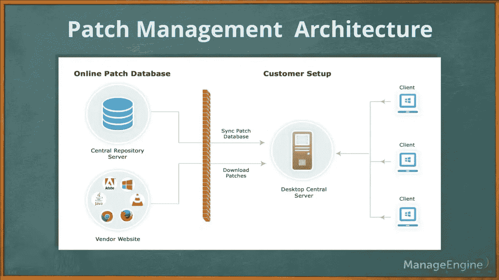
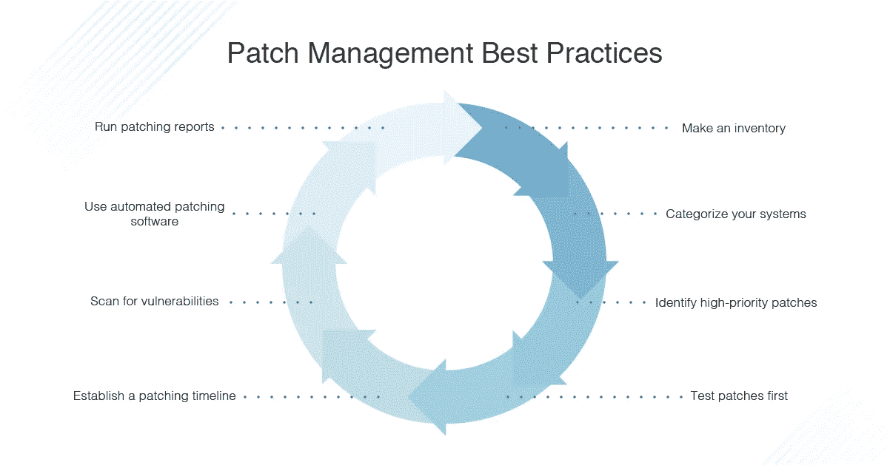

# 补丁程序管理如何影响您的应用程序

> 原文：<https://itnext.io/how-patch-management-impacts-your-application-589b635bfca8?source=collection_archive---------4----------------------->

[钳工](https://unsplash.com/@benchaccounting?utm_source=unsplash&utm_medium=referral&utm_content=creditCopyText)在 [Unsplash](https://unsplash.com/?utm_source=unsplash&utm_medium=referral&utm_content=creditCopyText) 上拍照

100%的安全性是一个幻想，它将继续如此，直到人工智能开始编写自己的代码并取代我们，如果我们曾经到达那里。我们是人，所以我们容易犯错误，尤其是在像软件开发这样的复杂领域。这并不是缺乏技能或经验，只是有时我们会错过一些东西，而当时并没有意识到，就像你眨眼的一瞬间，错过了一瞬间。

重要的是你如何处理这些问题——软件补丁是一种非常有效的方式。

# 什么是修补和修补程序管理？

如今，大多数软件使用语义版本化，给定的产品有一个版本号，比如 **2.0.0** ，或者更好的说法是 [**Major。小补丁**](https://medium.com/fiverr-engineering/major-minor-patch-a5298e2e1798) **。**当软件引入错误修复或安全更新且不影响 API 时，**补丁**版本增加。

维护良好的软件需要开发人员持续工作，为已知的错误提供修复，并缓解内部或外部发现的安全问题。

[补丁管理](https://resources.whitesourcesoftware.com/blog-whitesource/patch-management)是一个最终用户参与的过程，他们跟踪这些新的软件版本，并确保产品得到更新，通常是以最好的方式，而不干扰当前的环境。这不应该是一个问题，因为，正如我前面提到的，根据定义，补丁不应该影响 API 的使用方式——应该有向后兼容性。

[图像来源](https://www.youtube.com/watch?app=desktop&v=ohtlyCLty_I)

# 为什么打补丁很重要？

拥有一个补丁程序管理系统可以保护您的应用程序免受直接攻击，并避免产品需要被关闭而无法使用的情况。它还可以保护它保存的数据，从而保护用户。

这里的一个例子将有助于更好地理解补丁管理的需求，而 [Equifax 数据泄露](https://en.wikipedia.org/wiki/2017_Equifax_data_breach)就是一个完美的例子。

2017 年，在 [Apache Struts 2](https://cve.mitre.org/cgi-bin/cvename.cgi?name=CVE-2017-5638) 中发现了一个安全问题，多部分解析器在文件上传尝试过程中存在不正确的异常处理，这使得攻击者可以通过不同的 HTTP 头执行任意命令。

黑客利用这一点获得了对 Equifax 网络的访问权，并扩展了他们的用户权限——基本上，他们使自己成为系统管理员。因此，他们可以访问 Equifax 网络上的所有敏感数据。

除了导致数据泄露的错误之外，值得注意的是，征信机构本可以完全避免这种攻击。Apache Struts 2 中的缺陷是众所周知的，并且已经有了补丁，只是他们没有更新它。

# 怎么做

[图片来源](https://www.dnsstuff.com/patch-management-best-practices)

补丁管理可能会被错误地认为是一个繁琐的过程，阻碍了进展，但如果处理得当，情况并非如此。

基于团队规模和优先顺序，一个好的起点是创建一个时间框架和时间表，留出时间用于纠正。可以是一个月一次，也可以是周末的一次大型活动。

现在，根据您的基础架构，该计划可能会有所不同。因此，下一步是确定您正在使用的所有软件以及您的应用程序中的依赖项。如果你不知道你有什么，你就不知道要修补什么。

除非面临迫在眉睫的威胁，否则不要急于修补系统，直到您清楚地看到它可能产生的影响。即使一个补丁只是为了解决问题，而不是制造问题，有时甚至错误修复也需要错误修复。作为一个好的经验法则，给一个补丁一些时间，并监控它在社区中的行为；如果没有人抱怨它，那么继续把它应用到你的系统中。

同时，如果可能的话，继续在测试环境中测试补丁，或者在它实现后运行一些冒烟和回归测试，只是为了再次检查一切是否仍按预期工作。

如果事情变糟，准备好回滚计划可以给你更多的稳定性和信心。如果补丁篡改了应用程序，那么回滚计划将允许您快速恢复补丁。这通常也适用于任何更新。

社区事务。如果您认为下一次更新会使应用程序停止运行一段时间，或者它可能会有一些意想不到的行为，那么请通知社区。这将提高透明度和社区对产品的信心。

使用它或者失去它。如果您有不再使用的死代码或软件，那么您能做的最好的事情就是简单地删除它。黑客无法进入不存在的东西。

# 包裹

修补你的软件和依赖是软件开发的一个重要部分，不应该被忽视或被视为低优先级。补丁程序管理可以节省您的时间，因为它避免了一旦某个问题被攻击者利用就不得不紧急应对的尴尬局面。

如果您认为跟踪您正在使用的所有组件太难了，那么可以考虑使用自动化工具。

现在，有许多这样的工具，甚至是免费的，可以扫描你的应用程序或软件的依赖图，并让你知道你正在使用的版本是否与国家漏洞数据库或任何其他漏洞数据库中列出的任何众所周知的安全问题相匹配。