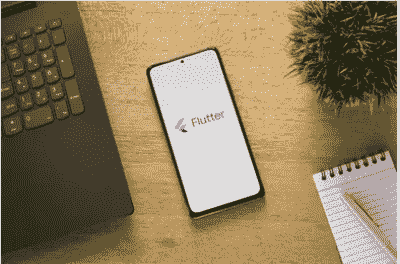
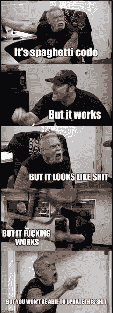
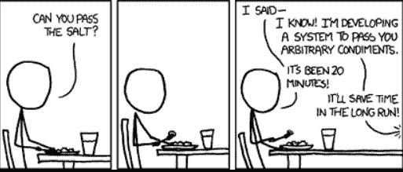
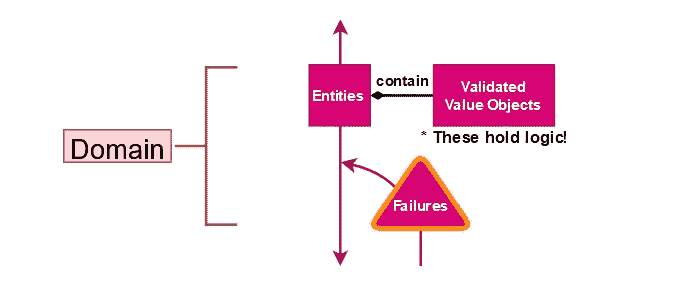
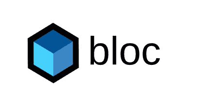
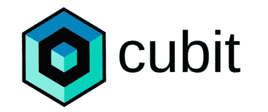

# 如何在 Flutter 中构建生产级应用

> 原文：<https://itnext.io/how-to-architect-a-production-level-app-in-flutter-251335cae1bb?source=collection_archive---------0----------------------->

# 技术债务

Flutter 帮助开发者快速构建优秀的 ui。当一个开发团队开始一个新项目时，他们会实现一个又一个特性。在开发的早期阶段，生产速度很可能会让客户满意。这种兴奋一直持续到开发人员意识到他们已经到了不能再扩大项目规模的地步。意大利面条式的代码导致开发的速度很快达到一个平稳期。因为各种各样的错误会出现，所以即使是很小的改变也会变得非常昂贵。这个项目最终以失败告终。

# 过度偿还债务

Flutter 开发人员需要遵循一个干净的架构，在这个架构中他们可以轻松地维护他们的项目。然而，Flutter 社区并没有一个被广泛接受的解决方案来编写干净的代码。开发人员混淆了过度使用复杂模式和干净编码。当你写代码来解决你没有的问题时，你就是过度工程化了。编写过度工程化的代码就像意大利面条一样有害，因为它会阻碍生产力。

# 寻求洁净之道

当我第一次开始用 Dart 和 Flutter 开发时，我知道我应该编写干净的代码，但是我不知道从哪里开始。我在网上看到很多自称用干净架构编写的开发者。然而，这些教程中的大多数都是过度工程化的，从长远来看是不可维护的。

在我寻找“最佳”架构的研究中，我遇到了由 [Reso Coder](https://www.youtube.com/channel/UCSIvrn68cUk8CS8MbtBmBkA) 出版的[领域驱动设计(DDD)教程](https://www.youtube.com/watch?v=RMiN59x3uH0&list=PLB6lc7nQ1n4iS5p-IezFFgqP6YvAJy84U)。这个建筑很有意义，而且是一见钟情。Reso Coder 将应用程序分为四个主要层。

*   域:模型类、自定义故障类和接口所在的层(例如 user_model.dart)。
*   基础设施:实现您在域层中定义的接口的层(例如 firebase_auth_service.dart)。
*   应用:业务逻辑和状态管理在这一层处理(如 auth_cubit.dart)。
*   演示:你的应用程序的用户界面。表示层是您的小部件所在的位置(例如 sign_in_page.dart)。

我想，每样东西都有它的位置，每样东西都有它的位置。所以我开始在一些小型项目中实践 DDD 建筑。

# Sponty 应用是如何开始的？

去年 8 月，我在 Reddit 上遇到了一个很棒的人。他看到了我用 DDD 完成的一个迷你项目，问我是否愿意和他一起完成他即将开始的项目。长话短说，我们组建了一个由 3 名 Flutter 开发人员组成的远程团队。我们同意建立一个改变游戏规则的社交媒体平台，让有相似兴趣的人能够组织和参加自发的活动。我们把它命名为[海绵宝宝](https://sponty.app/#/)。起初，我们讨论了项目的非技术性细节。我们最终开始讨论我们将使用什么架构。该项目的挑战是同时协调视频播放器、摄像机和地图。这要求我们小心内存泄漏，因为每个组件的内存消耗都很高。如果我们有糟糕的架构，Sponty 的性能就会受到影响。

[海绵](https://sponty.app/#/)

# 香草 DDD 的挑战

我提议使用 DDD 建筑。从长远来看，它是干净的，可维护的。最重要的是，我有很多使用 DDD 的经验，我对这个选择很有信心。我们所有人都同意并开始开发 DDD 架构。团队的其他成员和我一样热爱 DDD。然而，普通 DDD 的领域层有一个问题。值对象包含实体，而不是使用基本类型。很快，我意识到为每个实体编写值对象是令人疲惫的。这将大大降低我们的速度，但却没有获得多少价值。我们修改了原始架构中的域层，并以我们的风格实现了它。这大大提高了我们的生产率。

[reso coder 的原域层架构](https://resocoder.com/2020/03/09/flutter-firebase-ddd-course-1-domain-driven-design-principles/)

# 状态管理

对于状态管理，我们需要一个重视关注点分离的解决方案；一个从长远来看不会把我们晾在一边的解决方案。我们同意使用 [flutter_bloc](https://pub.dev/packages/flutter_bloc) ,因为这是大规模应用程序最推荐的状态管理解决方案。我们都不是集团模式的专家；我们只有最基本的东西。这对我们所有人来说都是一个挑战，直到我们习惯了集团模式，因为它有更高的学习曲线。

菲利克斯·安杰洛夫的《颤动区块库》

# 集团的挑战

flutter_bloc 库符合我们最初的预期。使用 flutter_bloc 最重要的好处之一就是得到了[菲利克斯·安杰洛夫](https://medium.com/u/bd78eebef416?source=post_page-----251335cae1bb--------------------------------)和社区的支持。flutter_bloc 的[官方不和谐频道](https://discord.com/invite/Hc5KD3g)中的开发者回答了我们心中所有的疑问。然而，在使用 BLoC 时仍然存在一些小障碍:

*   即使是简单的状态管理也需要过多的样板文件。
*   由于`yield`命令异步工作，很难理解/跟随状态何时更新。
*   集团对集团的交流是困难的。从内部作用域调用命令时，命令无法正常工作。

这些原因导致了我们开发和调试时间的增加。在一个漫长的调试之夜，我遇到了库比特，多亏了菲利克斯·安杰洛夫，库比特最终解决了我们面临的大部分问题:

# 丘比特的优点

选择 Cubit 比 Bloc 有很多好处。两个主要好处是:

*   Cubit 是 Bloc 的子集；所以，它降低了复杂性。Cubit 消除了事件类。
*   丘比特使用`emit`而不是屈服来发射状态。由于`emit`是同步工作的，所以可以保证下一行更新状态。

切换到 Cubit 大大加快了我们的开发速度。起初，我们只使用它来管理全新特性的状态。后来，我们将以前的 Blocs 转换为 Cubits。除非您需要高级功能，如[去抖](https://stackoverflow.com/questions/25991367/difference-between-throttling-and-debouncing-a-function)、[油门](https://stackoverflow.com/questions/25991367/difference-between-throttling-and-debouncing-a-function)、[开关映射](https://www.woolha.com/tutorials/rxdart-using-map-operators-examples)等，否则您不需要阻塞。你想知道在我们整个项目中需要多少次阻塞吗？一次也没有。

经验教训:对于状态管理问题，总是从 Cubit 开始。只有当你意识到 Cubit 不能解决你的问题时，才切换到 Bloc。我保证会节省很多开发调试时间。此外，您的业务逻辑代码将变得更容易理解和遵循。大多数新人害怕集团，因为它很难理解。我建议您在尝试其他状态管理解决方案之前先尝试一下 Cubit。你不会后悔的。

# 期待更多的内容

Flutter 社区充满了对初学者有帮助的内容，但缺乏展示产品级项目如何工作的内容。

第一篇文章旨在反映我们在项目中所做的架构选择的概述。在接下来的文章中，我将更深入地研究这个架构，并展示大量代码。

*   [如何在 Flutter 中构建生产级应用:电话号码认证](/how-to-architect-a-production-level-app-in-flutter-phone-number-sign-in-263628e1872c)

我们在开发 [Sponty](https://sponty.app/#/) 的过程中获得了丰富的经验，并愿意与社区分享。