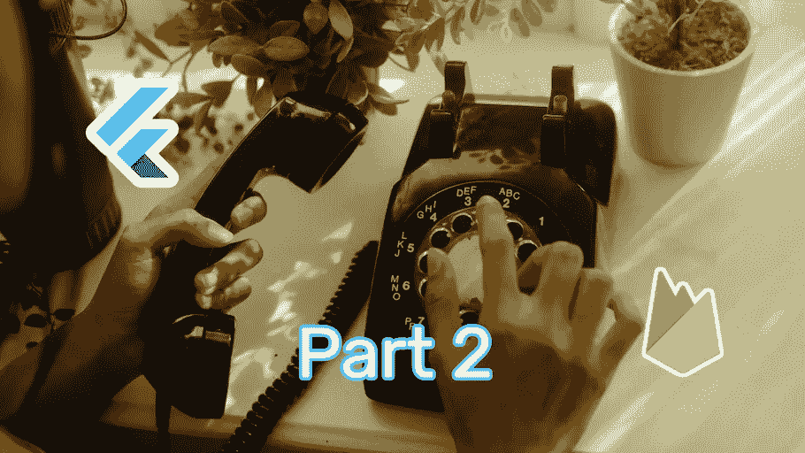

# 如何在 Flutter 中构建产品级应用程序:电话号码认证-第 2 部分

> 原文：<https://itnext.io/how-to-architect-a-production-level-app-in-flutter-phone-number-sign-in-part-2-63fff0bb79b1?source=collection_archive---------3----------------------->

在[的前一部分](/how-to-architect-a-production-level-app-in-flutter-phone-number-sign-in-263628e1872c)中，我们实现了域和基础设施层。接下来，我们将实现应用层和表示层。应用层是处理状态管理和业务逻辑的地方。我选择的状态管理包是 [flutter_bloc](https://pub.dev/packages/flutter_bloc) 。

尽管我喜欢 Bloc，但它需要大量样板代码来实现。还好有一个轻版的 Bloc 叫 [Cubit](https://bloclibrary.dev/#/coreconcepts?id=cubit) 。它是 Bloc 的一个子集，不依赖于事件，而是使用方法发出新的状态。如果你不需要像[去抖](https://stackoverflow.com/questions/25991367/difference-between-throttling-and-debouncing-a-function)、[油门](https://stackoverflow.com/questions/25991367/difference-between-throttling-and-debouncing-a-function)、[切换图](https://www.woolha.com/tutorials/rxdart-using-map-operators-examples)这样的高级功能，使用 cubit 进行状态管理就绰绰有余了。

现在，我们将实现一个 cubit 来处理电话号码登录逻辑。它使用域层中的身份验证服务接口与 Firebase 身份验证服务进行通信。它不会在应用层显式使用 Firebase，这意味着我们的 cubits 将是独立于 Firebase 的。我们可以无缝地将服务提供商从 Firebase 切换到任何其他服务。原因是我们依赖于抽象的`IAuthService`类，而不是特定的服务提供者。

当用户使用电话号码登录时，交互如下:

用户:

*   输入电话号码
*   按下下一步按钮
*   看到下一个按钮消失
*   看到一个加载屏幕
*   接收短信代码
*   输入 SMS 代码
*   被导航到主页
*   如果流程中出现任何问题，将收到一条错误消息

上面的场景可以帮助我们确定`PhoneNumberSignInCubit`的方法和状态。我们可以推断出需要以下四种方法:

*   `phoneNumberChanged`:保存本州最新电话号码
*   `signInWithPhoneNumber`:当用户按下下一步按钮时，开始电话号码登录过程
*   `smsCodeChanged`:保持最新的短信码状态
*   `verifySmsCode`:验证用户输入的短信代码

当用户通过上面提到的方法与 UI 进行交互时，cubit 的状态会发生变化。用户界面反映了腕关节的状态。考虑到用户交互和方法，state 类应该保留以下内容:

*   `phoneNumber`:用户输入的电话号码
*   `verificationIdOption:`将用于验证 SMS 代码的验证 id
*   `smsCode`:用户输入的短信代码
*   `isInProgress`:加载状态，了解是否有正在进行的过程
*   `failureOption`:用户在登录过程中出现问题时遇到的故障

我们已经完成了状态管理中最具挑战性的部分，即构建状态机。冻结类是实现状态类的完美候选，因为它们是不可变的，并且支持值相等。`PhoneNumberSignInState`类将如下所示:

注意 state 类中有三个额外的 getters。这些 getters 派生自现有的状态，它们的目的是简化 UI 中状态的使用。例如，UI 不需要知道验证 id 的存在。这只是一个实现细节。UI 唯一关心的是知道什么时候显示 next 按钮，或者什么时候显示 SMS 代码输入表单。因此，我们定义的 getters 极大地简化了 UI 中的逻辑。

国家级准备好了。我们现在可以跳到有趣的部分，实现业务逻辑。每当用户输入时，我们需要相应地更新状态中的`phoneNumber`或`smsCode`:

当用户按下**下一个**按钮时，`signInWithPhoneNumber`方法被调用。然后，清除状态中的现有错误，并发出进行中状态。`_phoneNumberSignInSubscription`将监听认证服务接口中定义的`signInWithPhoneNumber`流。如果在登录过程中收到失败，我们会相应地发出状态。如果用户成功接收到 SMS 代码，验证 id 将被发送到状态，以便稍后在`verifySmsCode`方法中使用。

不要忘记取消流订阅:

一旦用户输入 SMS 代码，就会调用 cubit 的`verifySmsCode`。该方法将状态中的`verificationId`和`smsCode`传递给认证服务。

# 授权肘

对`AuthCubit`的需求源于以下要求:

*   当用户打开应用程序时，我们需要了解用户是否已经登录
*   如果用户已登录，该用户的电话号码将显示在主页上
*   如果用户未登录，将显示电话号码登录页面
*   当用户成功完成登录后，我们会将用户重定向到主页
*   此外，主页上会有一个注销按钮。如果用户退出，我们会将用户导航到电话号码登录页面

`AuthState`类将非常简单。它将保留两个字段:

*   `userModel`:当前登录的用户。如果用户没有登录，将保留一个空的用户模型
*   `isUserCheckedFromAuthService`:一个布尔标志，用于了解我们是否在应用的生命周期中至少检查了一次用户的登录状态。当应用程序第一次打开时，我们的默认状态假设用户没有登录。在从`userChanges`流接收到实际用户信息后，`isUserCheckedFromAuthService`被设置为`true`。

`AuthState`类如下所示:

`AuthCubit`方法也很简单。`_authUserSubscription`监听`authStateChanges`流。

`AuthCubit`是一个 singleton，这意味着它只被创建一次，除非被手动处理，否则它将在整个应用程序生命周期中存在:

# 表示层

表示层是我们的小部件所在的地方。它不应该包含业务逻辑或任何基础结构代码。表示层使用 cubits 中的方法与应用层进行交互，并根据状态变化进行自我更新。

此外，路由是在表示层内部处理的。对于路由，我使用了 [auto_route](https://pub.dev/packages/auto_route) 包，这减少了样板文件。包设置已经在[裸机](https://github.com/erkansahin/bare-bones)模板中完成。我建议您阅读官方文档以了解该软件包的全部功能。

# 提供授权肘

我们需要知道用户的身份验证状态，而不考虑当前的路由。因此，auth cubit 将在`MaterialApp`之上提供，并贯穿应用程序的整个生命周期。它允许我们在应用程序的任何屏幕上访问身份验证状态:

app 最初的路线是`LandingPage`。它唯一的职责是确定用户的导航位置。如果用户已经登录，用户将被导航到`HomePage`。否则，用户被重定向到`PhoneNumberSignInPage`。

创建登录页面时，有两种可能的情况:

*   在创建`LandingPage`之前，身份验证状态已就绪
*   在建立了`LandingPage`页面之后接收认证状态

第一种情况在`LandingPage`的`initState`中处理。根据`AuthCubit`的状态，用户被重定向到正确的路线。如果`isUserLoggedIn`是`true`，我们可以安全地将用户导航到`HomePage`。否则，我们需要在将用户导航到`SignInPage`之前检查一个额外的标志。`isUserCheckedFromAuthService`告知`AuthState`中的认证用户信息是否可用。如果调用`initState`时查询没有结果，此时我们不应该采取行动将用户导航到任何路线。

在第二种情况下，当`AuthState`更新时，我们将用户导航到正确的路线。我们将添加一个`BlocListener`，当认证的用户信息可用时就会触发。屏幕上会显示一个循环进度指示器，直到`isUserCheckedFromAuthService`更新:

如果用户未登录，则显示`PhoneNumberSignInPage`。它将利用`PhoneNumberSignInCubit`与外界联系。我们应该使用`BlocProvider`为`PhoneNumberSignInCubit`提供能够调用其方法和访问其状态的功能:

每当`PhoneNumberSignInState`更新时，我们需要放置一个`BlocBuilder`来更新 UI:

每当用户修改电话号码输入时，就会调用`phoneNumberChanged`方法，以便在状态中保持最新的输入。

如果用户按下**下一个**按钮，则`signInWithPhoneNumber`方法被调用，这将启动登录过程。流程开始后，我们将隐藏“下一步”按钮，并在屏幕中央显示一个加载指示器。

如果用户在登录过程中收到一个错误，我们应该在屏幕上显示一个解释失败的祝酒词。我们可以使用`BlocListener`来捕捉错误。cubit 状态被重置，以便用户可以在出错时重试:

如果一切顺利，用户将从 Firebase 收到一个 SMS 代码和一个验证 id。收到验证 id 会触发我们的`BlocBuilder`；因此，SMS 代码输入表单将显示在用户界面中。

当用户修改`smsCode`输入时，`smsCodeChanged`方法被调用，以便我们在状态中保持最新的输入。当输入最后一个代码数字时，会触发`verifySmsCode`。

如果用户验证成功，我们应该将用户重定向到`HomePage`。该行为可以通过用户登录状态改变时触发的`BlocListener`来完成:

在`HomePage`上，显示登录用户的电话号码和**注销**按钮。为了显示用户的电话号码，我们可以在主页的`build`功能中使用一个`BlocBuilder`。

根据经验，将块构建器尽可能深地放在部件树中是很重要的。此外，它们不应该在你的区块/腕尺的每个状态改变时被触发。最好在您的`BlocBuilder`中使用`buildWhen`条件，或者使用`BlocSelector`观察值的变化，以提高您的应用程序的性能。在本教程的范围内，使用`buildWhen`条件可能不会显著影响性能。但是，您应该在生产级应用程序中使用它们:

按下**注销**按钮触发`AuthCubit`的`signOut`方法:

当用户成功退出时，我们应该将用户重定向到电话号码登录页面。为了实现这一行为，我们可以放置一个`BlocListener`，当用户不再登录时触发它:

就是这样！您已经看到了电话号码登录功能在生产级应用程序中的实现。我意识到可能很难一下子掌握所有的东西，因为涉及到许多方案和概念。我鼓励你分析每一层都做了什么，并在现有的应用程序中添加一个功能。我相信增加谷歌登录功能对你来说是一个很好的挑战。

这与我们在 [Sponty](https://sponty.app/#/) 中使用的实现相同。这是一个视频驱动的社交媒体应用程序，用于自发的群体聚会。

我希望这篇教程能帮助你理解如何在产品级应用程序中组织你的代码。欢迎在评论区提问。

感谢您的阅读，敬请关注！