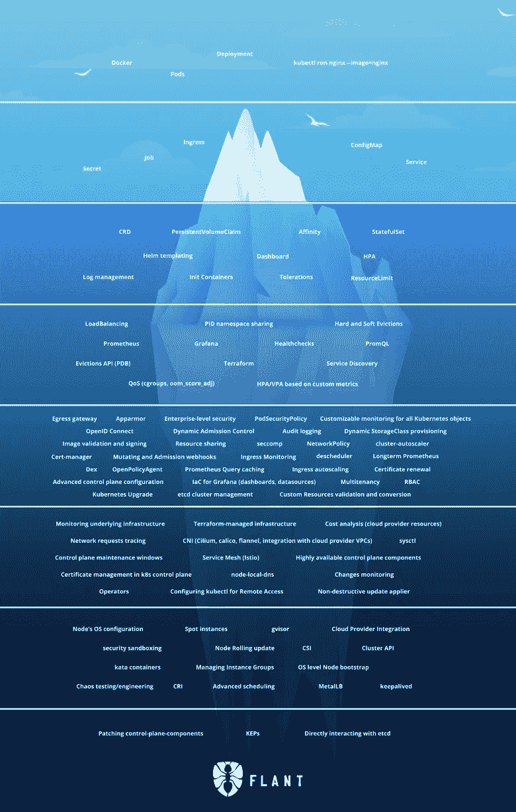
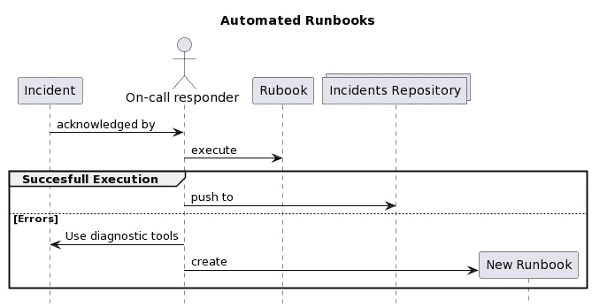

# 如何用 runbooks 自动化 Kubernetes 中的重复性任务？

> 原文：<https://itnext.io/how-to-automate-repetitive-tasks-in-kubetneres-with-runbooks-8b039976f546?source=collection_archive---------2----------------------->


马库斯·温克勒在 [Unsplash](https://unsplash.com?utm_source=medium&utm_medium=referral) 上的照片

## 介绍

使用 runbooks 可以通过自动化可重复的任务来简化和改进 Kubernetes 的工作。额外的一点是，我们可以只用开源工具做到这一点。

如果您在运营部门工作，是 platform 或 DevOps 团队的一员，或者只是想了解更多关于使用自动化来简化 Kubernetes 体验的信息，那么您将从这个博客中受益匪浅。

> 请继续关注关于这一主题的视频和互动场景。

## 库伯内特复杂性

在了解了 pod 和部署、服务、配置图和秘密之后，Kubetneres 看起来没那么可怕了。

正如一句著名的谚语所说。

> 你不知道的不会伤害你。

过了一段时间，你的需求超过了基本的 Kubetneres 资源所能给你的，你发现在表面之下有一个巨大的复杂“冰山”。



[https://www . Reddit . com/r/kubernetes/comments/u9b 95 u/kubernetes _ iceberg _ the _ bigger _ picture _ of _ what _ you/](https://www.reddit.com/r/kubernetes/comments/u9b95u/kubernetes_iceberg_the_bigger_picture_of_what_you/)

## 运行手册

page duty 给出的一个简单定义告诉我们什么是 runbook:

> 操作手册是一份详细的“如何”指南，用于完成公司 IT 运营流程中经常重复的任务或程序。Runbooks 旨在为团队中的每个人(无论是新成员还是有经验的成员)提供快速、准确解决特定问题的知识和步骤。例如，操作手册可能会概述日常操作任务，如修补服务器或更新网站的 SSL 证书。

## Runbooks 是干什么用的？

使用 runbooks 自动完成 3 种常见的任务

*   处理**事件**
*   执行可重复的任务
*   问题**诊断**

下图显示了从事件缓解和诊断开始收集有关新问题或可重复任务的信息的流程。



来源:作者

当然，Runbooks 不仅限于 Kubernetes，这也是我们今天要关注的内容。

## 诊断学

诊断是操作手册的一个特例，其中有许多探索性的步骤还没有以操作手册的形式记录下来。

使用和维护一个专用的调试容器，尤其是带有临时容器特性的调试容器，有助于在团队中共享最佳的诊断实践和工具。然而，这是一个单独的博客的主题！

[](https://github.com/Piotr1215/debug/blob/master/Dockerfile) [## 主 Piotr1215/debug 的调试/docker 文件

### 此文件包含双向 Unicode 文本，其解释或编译可能与下面显示的不同…

github.com](https://github.com/Piotr1215/debug/blob/master/Dockerfile) 

## 自动化目标

为什么不用一个脚本或一个程序来实现自动化呢？

操作手册是需要人工干预的任务的支持工具和指南，根据定义，这些任务不能自动化。他们获取运营知识，并为改进提供重要来源。

从构建和执行操作手册中获得的经验可以也应该成为提高它们所涉及的系统的自动化水平的灵感。

runbooks 自动化有什么帮助？

*   能够以可重复的方式执行操作手册中的步骤
*   以事件处理文件的形式留下**审计线索**
*   每个有权限的人都应该能够执行操作手册

# 实践中的自动化操作手册

首先，创建一个文件夹结构，每个文件夹对应一个单独的 Kubernetes 集群。通过这种方式，我们可以保持集群连接完全分离。

随着时间的推移。kube/config 文件将包含开发、测试和生产集群参考。很容易忘记从 prod 集群上下文中关闭，并出错运行例如`kubectl delete ns crossplane-system`。

## 使用 direnv 加载 k8s 配置

使用下面的设置来避免这种错误，并保持集群的独立性。

1.  安装目录环境

大多数 Linux 发行版上都有 Direnv，在 Mac 上设置它很容易

```
brew install direnv
echo eval "$(direnv hook bash)" >> ~/.bashrc # or ~/.zshrc
```

2.为每个集群创建一个目录

特别是对于连接重要的 prod 集群，使用专用目录要安全得多。

`mkdir prod-cluster-xxx && cd prod-cluster-xxx`

3.创造。envrc 文件

这个文件包含了 **KUBECONFIG** 变量，该变量的作用范围仅限于当前目录和所有子目录

`echo export KUBECONFIG="$PWD"/config >> .envrc`

大多数云提供商提供一个命令，将凭证合并到活动配置文件中。例如，添加一个命令

```
gcloud container clusters get-credentials ...
```

设置完`KUBECONFIG`后，变量将使用 Google Cloud 中远程 GKE 集群的凭证进行更新。

`.envrc`文件还可以保存需要按文件夹加载的静态变量，比如名称空间名称、部署名称等。

4.在目录中启用 direnv

`direnv allow`

## 文件夹=集群

每次进入文件夹，KUBECONFIG 变量都会改变，指向文件夹本地的配置文件。通过离开文件夹， **direnv** 将卸载本地 **KUBECONFIG** 变量并设置先前的 shell 变量。

## 操作手册

每个 runbook 都是一个 markdown 文件，包含与我们想要执行的操作相关的代码块。把它们想象成你行动的蓝图。

每个操作手册都是从一个模板文件中复制的，并且可以用一个专用的`. envrc '文件存储在一个单独的文件夹中，以便更好地捕获执行步骤的结果。

专用文件夹允许存储笔记、故障排除步骤等，如果需要，可以很容易地转换成 git 存储库。

## 示例操作手册

该文件本身是一个简单的标记，带有由代码运行器执行的隔离代码块和在命令下收集的结果。

完成操作手册后，命令输出将直接位于命令之下。您可以/应该添加关于执行这些步骤的注释和附加信息。

最后，将新文件提交给一个`runbooks-repository`并使用 PR 过程来合并它，并从您的同事那里获得反馈和改进建议。

来源:作者

## 结论

我们已经看到如何使用开源工具，如 neovim、direnv、git 和 kubectl，我们能够创建一个可重用的自动化运行手册。

自动化操作手册库将不断增长，并有助于以更干净、更快速的方式处理事件、更优化的手动配置任务，并帮助获取探索性诊断的结果。