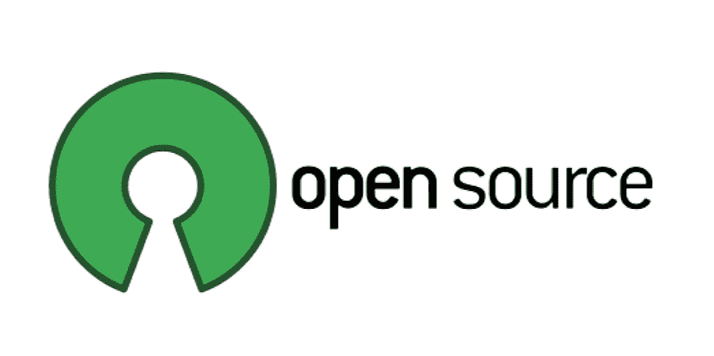

# 如何成为一名开源贡献者

> 原文：<https://itnext.io/how-to-become-an-open-source-contributor-6f2f8214c6d2?source=collection_archive---------2----------------------->

作为一名软件开发人员，当我为社区做贡献时，我感到很高兴。这是一个提高开发技能和学习新事物的机会。这是一个寓教于乐的过程。很少有事情像接受拉取请求一样让我满意:)

成为开源贡献者是一些开发者的梦想。如果你是一个新的开发者或者以前从未做过贡献，并且想成为一个贡献者，在这篇文章中，我有几个建议给你。

# **从哪里开始**

好吧，让我们假设你在 Github 上发现了一个项目，你想为这个项目做贡献。成为贡献者需要遵循哪些步骤？什么可能对贡献过程有帮助？我会列出我遵循的那些小步骤，让我的贡献过程变得简单。

**1-尽可能在生产中使用该项目**

这可能是成为贡献者最重要的部分。在生产或日常生活中使用工具有助于你更好地理解它。使用该工具时，您可能会遇到一些错误，这些错误实际上是需要修复的 bug。

此时，您可以通过创建一个描述重现该错误的步骤的问题来开始做出贡献。

之后，您就可以动手深入源代码，调查这个 bug 的根本原因。

当您发现问题并解决它时，您可以创建一个拉请求。

举个例子，大约 2.5 年前，当我写 C#的时候，我们像大多数其他开发者一样使用 RestSharp 作为 http 客户端。那时，我们很难比较两个几乎相同的日期时间；我们对此进行了调查，发现 RestSharp 在反序列化 json 字符串时遗漏了一个日期时间格式。我决定通过打开一个拉取请求来解决这个问题。之后我的 pr 合并了，我成了 RestSharp 的投稿人。

**2-看看源代码**

当我对一个项目感到好奇的时候，我会克隆它，看一看它的源代码。贡献并不总是一个好的起点，但它可能会帮助您找到一些要重构的代码。

举个例子，当我在 Trendyol 开始职业生涯时，我参与了一个项目，这是一个用于遗留项目的内部框架。当我查看源代码时，我发现了一段要重构的代码。

查看源代码的另一个例子是，当我们在项目中使用 Consul 时，我查看了源代码，我看到了一个没有指定长度的数组声明(初始化时声明长度是 Golang 中数组的性能改进)。所以我做了一行贡献，指定了数组的长度。即使这样我也很满意:)

在源代码中还有一件事要做:“测量测试覆盖率。”编写单元测试来增加测试覆盖率是对项目做出贡献的另一种方式。例如，我正在为 Kubernetes 准备一份 pr，其中包含了增加测试覆盖率的单元测试。

**3-阅读文档并应用示例**

阅读文档有助于您理解如何使用该工具。与阅读文档相关的有两件事。一个是你可能需要关于某个特性的信息，但是你在文档中找不到。在这里，您可以撰写关于该部分的文档。第二个是，有时文档可能不是最新的或者有错别字。当你遇到这种情况时，你可以通过修改文档来做出贡献。

我记得我在遵循 Istio 文档中的一个例子，应用了它，得到了一个错误。我意识到这个例子在 yaml 配置上有一个错别字。我创建了一个 pr 并修改了文档以节省其他开发人员的时间。

**4-使用该项目的客户端(如果存在)**

直接进入开源项目的源代码可能很难，尤其是当项目有大量源代码的时候。此时，开始使用该项目的客户端代码可能会有所帮助。这也有助于理解该项目的内部结构。

我们以 Kubernetes 为例，它有着相当庞大的源代码，作为一个陌生人去钻研源代码并不简单。但是，您可以使用 Kubernetes 客户端，并制作一些与 Kubernetes 交互的示例项目。你会发现它有助于你更好地理解 Kubernetes 的内部结构。

**5-搜索问题**

寻找要解决的问题是另一个开始贡献的选择，但是对初学者来说可能很难。您可以随时开始搜索标记为 **GoodFirstIssue** 的问题。

当我写 Java 的时候，我们经常在 Spring Boot 项目中使用 OpenFeign。我决定寻找一些问题，看看是否有一个简单的问题可以参与到这个项目中。我找到了！

我开始解决这个问题，并为此开了一个公关。它被作者们接受了，我在投稿人中得到了我的名字。

有些网站可以帮助你找到可以参与的项目。您可以按标签或语言过滤项目。

 [## 开始参与开源项目| CodeTriage

### CodeTriage 需要 JavaScript，请启用它！人们比以往任何时候都更有兴趣为医疗保健和……

www.codetriage.com](https://www.codetriage.com/)  [## 可利用的

### GitHub 上的视图这是一个专门为新贡献者策划任务的项目列表。这些是很棒的…

up-for-grabs.net](https://up-for-grabs.net/) 

您也可以通过过滤直接使用 Github 来查找项目:

 [## 一起打造更好的软件

### 高级搜索备忘单 GitHub 的搜索支持多种不同的操作。这里有一个快速的备忘单…

github.com](https://github.com/search?q=label%3Afirst-timers-only&state=open&type=Issues) 

**6-创建一个开源项目**

乍一看，创建一个开源项目可能听起来非常困难。但随着时间的推移，你会意识到开源你的代码，甚至是基本的自动化任务，也可能帮助其他人。

因此，按照这个想法，我创建了一个名为 docker-shell 的存储库，它为 docker 命令提供自动完成和建议。它比我预期的长得更远。对日常生活中使用 docker 的开发者有所帮助。

您也可以参与 docker-shell 项目:

 [## Trendyol/docker-shell

### Docker 的一个简单的交互式提示。灵感来自 kube-prompt 使用 go-prompt。你可以用自制软件安装…

github.com](https://github.com/Trendyol/docker-shell) 

在结束这篇文章之前，我想说，为其他项目做贡献是有好处的。第一个也是最明显的一个是，它提高了你的开发技能。您的代码由其他开发人员审查，这给了您一个新的视角。同时，你也在和其他开发者建立新的关系网和友谊。

额外收获:这里是另一个可能有助于开始开源的网站:

 [## 开源指南

### 开源软件是由和你一样的人制造的。了解如何启动和发展您的项目。想做一个…

开源指南](https://opensource.guide/) 

你可以在 Github 上关注我:

 [## mstrYoda -概述

### 在 GitHub 上注册你自己的个人资料，这是托管代码、管理项目和构建软件的最佳地方…

github.com](https://github.com/mstrYoda) 

感谢您阅读至此。在下一篇文章之前，请照顾好自己。