# 如何使用 python 为多处理器系统构建基于 DAG 的任务调度工具

> 原文：<https://itnext.io/how-to-build-a-dag-based-task-scheduling-tool-for-multiprocessor-systems-using-python-d11a093a835b?source=collection_archive---------3----------------------->

使用 pyDag 在云中调度大数据工作负载和数据管道

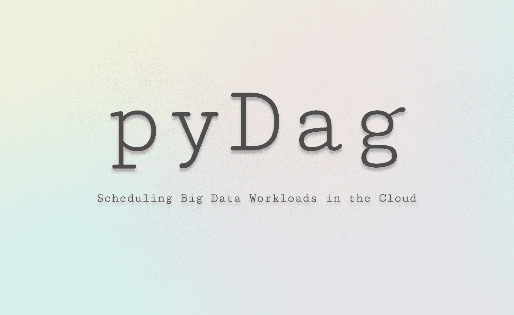

**PyDag**

从初创公司到大公司，不同规模的数据驱动型公司的成功很大程度上是基于他们良好的运营实践以及他们保持数据更新的方式，他们每天都在处理数据的**多样性**、**速度**和**量**，在大多数情况下，他们的战略依赖于这些特征。这类公司中数据团队的一些目标是:

*   设计和部署经济高效且可扩展的数据架构
*   从他们的数据中获得洞察力
*   保持业务和运营正常运行

为了实现这些目标，数据团队使用工具，这些工具中的大多数允许他们**提取**、**转换**和**加载**数据到其他地方或目的地数据源，可视化数据并将数据转换成信息。在这些团队中很常见到 ETL 工具、 ***任务调度*** 、 ***作业调度*** 或 ***工作流调度*** 工具。值得一提的术语: ***任务调度*** ， ***作业调度*** ， ***工作流调度*** ， ***任务编排*** ， ***作业编排*** 和 ***工作流编排*** 是同一个概念，在某些情况下区别它们的是工具的用途 其中一些工具仅用于编排 ETL 过程，并通过使用管道架构简单地指定何时执行它们，其他工具使用 DAG 架构，并提供指定何时执行 DAG 以及如何以正确的顺序编排其任务(顶点)的执行。

最后一种架构的优点是，所有计算都可以在执行 DAG 的机器上使用，优先并行运行 DAG 的一些任务(vetices)。

> 图是顶点(任务)和边(顶点之间的连接或依赖)的集合。因此，有向无环图或 DAG 是没有圈的有向图。

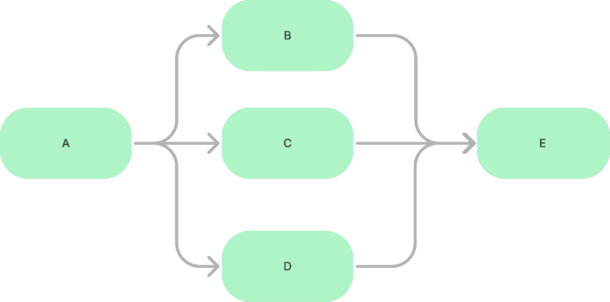

十克

> 流水线是一种 DAG，但是有限制，每个顶点(任务)最多有一个上游和一个下游依赖。


管道

这类工具在过去几年中蓬勃发展，提供了一些共同的功能:

*   自动化工作流程
*   任务/工作的调度或协调
*   它们允许 ETL 或数据集成过程的创建或自动化
*   Dag 或管道数据结构的使用
*   有的是 ***单片架构*** 有的是 ***高度分布式*** 。
*   一些工具不能在多处理器机器上利用优势，而另一些工具可以。
*   有些自带基础架构，有些则允许您使用云中或内部的任何基础架构。
*   有些允许您编写与每个 Dag 的任务相关的代码或脚本，有些是拖放组件。

> 总结一下:**编排**和**调度**是一些 ETL 工具具有的一些特性。

我将在此提及其中一些:

## [阿帕奇气流](https://airflow.apache.org/)，[杰姆调度器](https://www.jamsscheduler.com/)，[彭塔霍](https://www.hitachivantara.com/es-latam/products/data-management-analytics/pentaho.html)，[提督 io](https://www.prefect.io/) ，[阿尔戈](https://argoproj.github.io/)，[路易吉](https://luigi.readthedocs.io/en/stable/index.html)，[达斯克](https://dask.org/)，[马提利昂](https://www.matillion.com/)，[空气团](https://airbyte.com/)，[海豚调度器](https://dolphinscheduler.apache.org/)，[斯通布兰奇](https://www.stonebranch.com/)

这些工具的使用涉及到大企业，从咨询、昂贵的许可，到维护开源工具并拥有交付模式的公司，在这种模式下，集中托管的软件通过订阅计划许可给客户。

# 问题陈述

本文的目标是教你如何为多处理器系统设计和构建一个简单的基于 DAG 的任务调度工具，它可以帮助你减少公司中由这种技术产生的账单成本，或者基于这种工具创建你自己的并开始一个有利可图的业务。

# 功能需求

*   应该是 Python 模块
*   到目前为止，该模块应该只接收一个. json 或。yaml 文件，其中包含任务及其依赖项的规范。
*   这些任务将基于独立脚本
*   该工具应该适用于任何云或内部提供商
*   该工具应该在选定的云提供商中启动、关闭和停止基础架构
*   该工具应该利用运行 DAG 的机器上的计算，因此，一些任务可以并行执行，并可以独立地分配给每个处理器，从而利用机器的资源。
*   任务之间不应传输数据，状态之间也不应传输数据。
*   当且仅当所有任务都成功运行时，DAG 才会显示为成功状态。
*   该工具应该在运行时显示和分配任务的状态。

# 让我们一步一步地构建 pyDag:

## 1.选择的基础设施:谷歌云平台

虽然该库旨在接受任何类型的云提供商或内部基础设施，但在这种情况下，我们将使用 [Google 云平台](https://cloud.google.com/)作为云提供商，我们将创建三个层:

*   一个将作为**摄取层**的层，专门用于大数据工作负载，这样我们可以将数据从任何外部数据源移动到我们的暂存区，在这种情况下，我们将使用一个使用 [Google Cloud Dataproc](https://cloud.google.com/dataproc) 的 Apache Spark 集群。另一个选择是使用 [Google Cloud Functions](https://cloud.google.com/functions) 作为数据摄取层，但是如果我们需要在将数据移动到暂存区之前进行转换，该怎么办呢？在这种情况下，Google cloud functions 相比 Google Cloud Dataproc 有一个非常明显的劣势，[Google Cloud data proc 的另一个优势是可以使用多种外部数据源](https://www.analyticsvidhya.com/blog/2020/10/data-engineering-101-data-sources-apache-spark/#:~:text=Spark%20has%20six%20%E2%80%9Ccore%E2%80%9D%20data,sources%20written%20by%20the%20community.)。[如果您选择本地基础设施，Apache livy](https://livy.apache.org/) 可能是另一个选择。

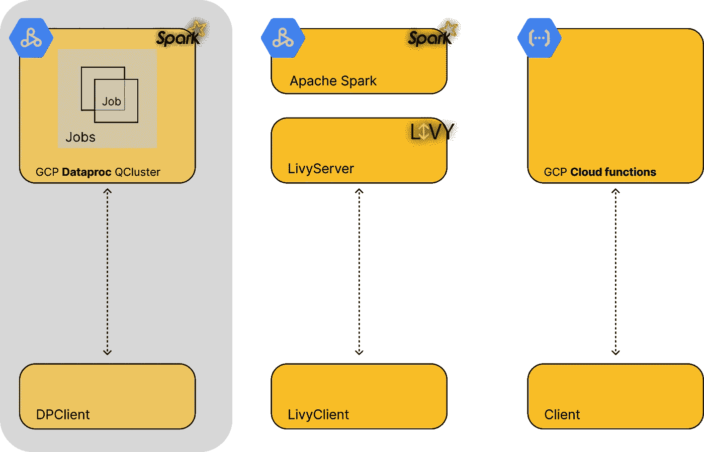

1.Google Cloud Dataproc，2。Apache Livy 用于内部基础架构，Google Cloud 功能用于数据接收

*   该层将作为具有 [BigQuery](https://cloud.google.com/bigquery) 的**暂存区**、分布式数据存储和数据仓库，所有来自外部源的数据将使用摄取层移动到该层。一切交给 bigquery。

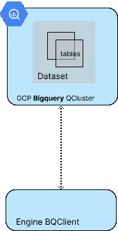

**BigQuery**

*   使用 [Google 云存储](https://cloud.google.com/storage)的**存储层**，它将负责:

▹ *存储在 bigquery* 上执行的 SQL 脚本

▹ *商店 IAC 脚本*

▹ *存储 pySpark 脚本，用于从 dataproc 到 bigquery 的数据摄取*

▹ *存储启动到 dataproc 集群的作业的输出日志*

▹ *在****temporarygcsbucket****桶中存储要从 dataproc 作业移动到 bigquery 的临时数据。*

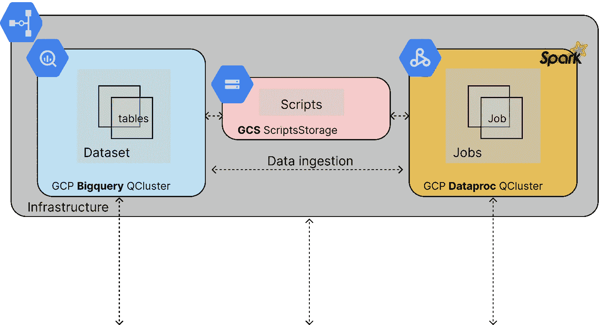

默认**谷歌云平台**基础设施为 **pyDag**

## 2.DAG 数据结构

这一步包括创建一个对象类，该对象类包含图的结构和一些方法，如向图中添加顶点(任务)，在顶点(任务)之间创建边(依赖关系),并执行基本验证，如检测图何时生成循环。

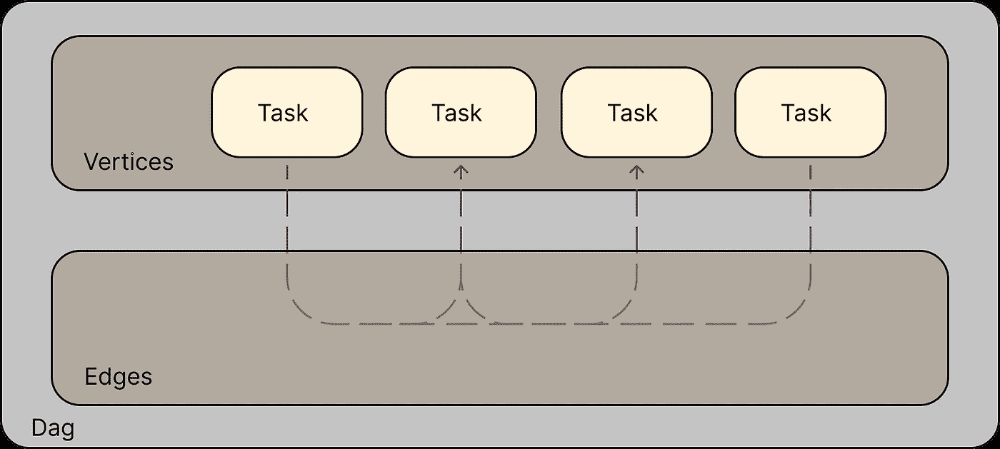

**Dag 数据结构**

## 3.拓扑排序和并行执行

这是一个有趣的部分，考虑调度它们之间有依赖关系的任务的问题，让我们假设任务“sendOrders”只能在任务“getProviders”和“getItems”成功完成之后进行。我们可以使用包含边“get providers”->“send orders”和边“getItems”->“send orders”的 DAG 来获得这种依赖关系，因此，通过使用上面的示例，拓扑排序算法将为我们提供一种顺序，按照这种顺序，这些任务可以按照它们之间的正确顺序及其依赖关系逐步完成。

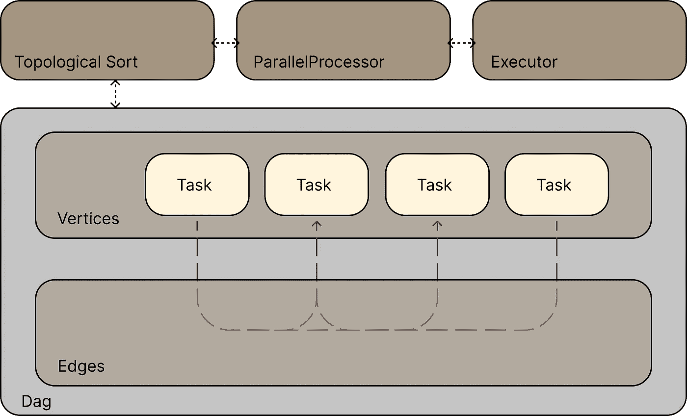

**拓扑排序**、**并行处理器**和**执行器**

因此，拓扑排序算法将是 pyDag 类中的一个方法，它将被称为“run ”,该算法在每一步中都将提供可以并行执行的下一个任务。有很多关于这种技术的研究，但我将采取最快的解决方案，即对 DAG 应用拓扑排序。

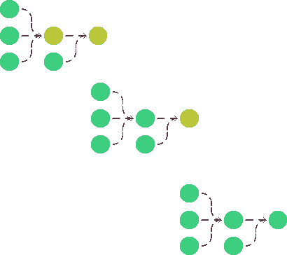

**DAG 使用 4 个处理器，完成 DAG 需要三个步骤**

我将使用多重处理来并行执行更少或相同数量的任务。假设最初在拓扑排序算法的第一次迭代中，有许多可以并行执行的非依赖任务，并且该数目可能大于计算机中可用处理器的数目，则 ParallelProcessor 类将能够仅使用一个具有可用处理器的池来接受和执行这些任务，而其他任务在下一次迭代中执行。方便的是向 pyDag 类发送它可以并行执行多少任务，这将是可以同时执行的非依赖顶点(任务)的数量。


多处理器系统中 pyDag 中任务实例的可能状态

executor 类将帮助我保存状态，并知道 DAG 中每个任务的当前状态

## 4.引擎和处理器

每个任务都与特定类型的引擎相关联，这样就可以实现多功能性，能够与任何云提供商交流采用不同技术实施的任务，但在深入了解之前，让我们先解释一下 pyDag 中任务的基本结构:

**pyDag 中的任务**

正如您在。json 文件，代表 DAG，专门针对一个任务， ***脚本*** 属性给出了关于一个特定任务的所有信息。使用 5 个级别的信息:

> 位置。桶.文件夹.引擎.脚本 _ 名称

*   ***Location:*** 它告诉我们脚本存储在什么类型的平台上，默认情况下最好是在相同类型的云提供商或位置上，不一定是这样，一些选项可以是:gcs、s3、local 或 database。
*   ***桶:*** 这将是托管脚本的桶的名称，它不会影响是否选择“gcs”或“s3”，如果选择“local”，那么这一级和下一级将代表文件夹，如果是“database”，这一级和下一级将代表数据库名称和数据库中的表。建议使用项目名称作为存储桶名称。
*   ***文件夹:*** 是桶内的文件夹，或者是本地文件夹，或者是数据库中的表。这里建议使用项目中模块的名称。
*   ***引擎:*** 它告诉我们下一级“ **Script_name** ”将使用什么类型的引擎，例如，如果我的**引擎= spark** 这意味着脚本在 Dataproc 集群上执行，如果我的**引擎= bq** 这意味着我的脚本将在 BigQuery 中执行，如果我的**引擎= iac** 这意味着我的脚本将在所选的云平台上提供基础设施。
*   ***脚本名称:*** 脚本名称或文件

**举例**:

***【脚本】:" GCS . project-pydag . IAC _ scripts . IAC . data proc _ create _ cluster "***

名为"**data proc _ create _ cluster**的脚本托管在 GCS 中的 bucket " **project-pydag** "文件夹内:" **iac_scripts** "并且它的引擎是:" **iac** ，这个句柄在云中设置 infraestructure。

***【脚本】:" GCS . project-pydag . module _ name . spark . CSV _ GCS _ to _ bq "***

名为" **csv_gcs_to_bq** "的脚本驻留在 gcs 中，在文件夹" **module_name** "内的桶" **project-pydag** "中，其引擎是" **spark** "这意味着脚本将在 Dataproc 集群中执行。

***【脚本】:" GCS . project-pydag . module _ name . bq . create _ table "***

名为" **create_table** "的脚本托管在 GCS 中，在 bucket " **project-pydag** "文件夹" **module_name** "内，其引擎为:" **bq** "这意味着脚本将在 BigQuery 集群中执行。

**运行任务的过程是完全动态的，并且基于以下步骤:**

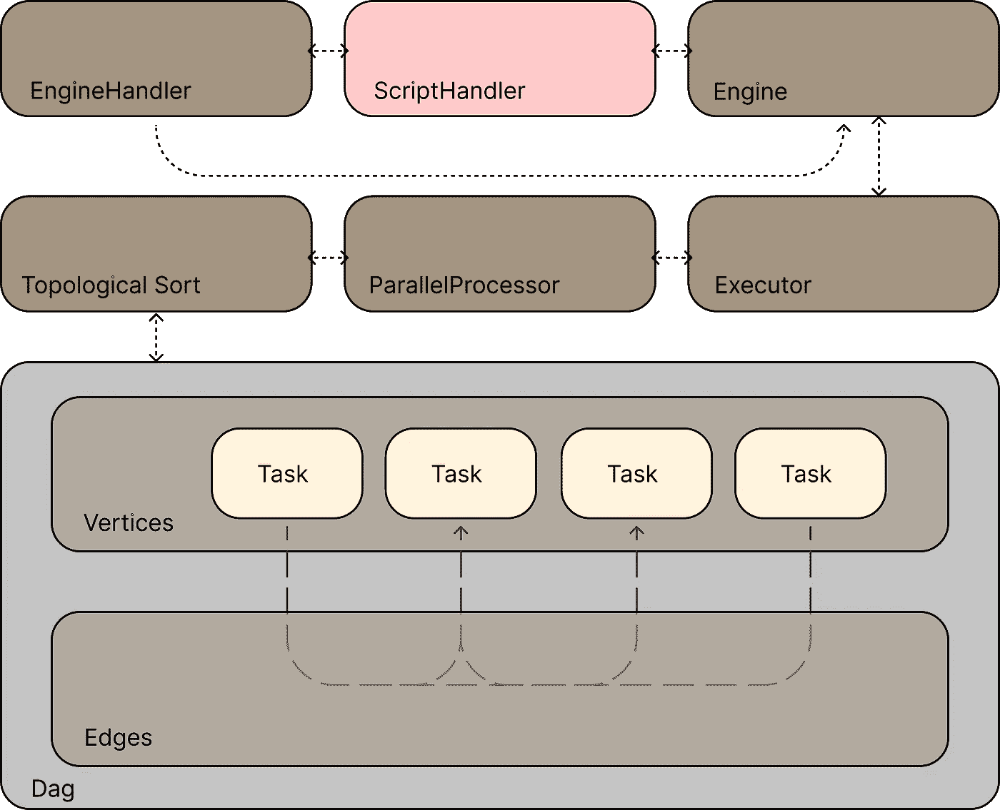

**引擎处理器，脚本处理器，引擎**

*   每当它试图运行一个任务时， **pyDag** 调用属于" **Engine** "类的继承方法" **run** ",在内部，该方法使用另外两个继承方法" **format_script** "来自" **script_handler** "类和" **run_script** "来自" **engine_handler 【T】**
*   首先，“ **format_script** ”方法从其位置获取脚本，并返回脚本接收到的格式良好的参数，以及一个 Engine 类的对象。
*   一旦返回来自上一步的数据，则“**引擎 _ 处理程序**的“**运行 _ 脚本**”方法将负责动态创建引擎，并且它将针对接收到的引擎调用“**运行 _ 脚本**方法，这样我们避免了向库中添加更多代码，并且我们只专注于设计新的引擎，我们具有任务可以在云上或本地使用任何类型的技术的灵活性。

这种方式可能会导致将来的安全问题，但是在下一个版本中我会改进它

引擎是您应该添加到 pyDag 的客户端应用程序，为了向您的任务提供您想要的技术，添加新引擎的步骤是添加到您的引擎所在的 **config.cfg** 文件，并使用名为“ **run_script** 的方法添加您的“ **clientclass.py** ”，该方法将负责接收脚本名称或脚本字符串。

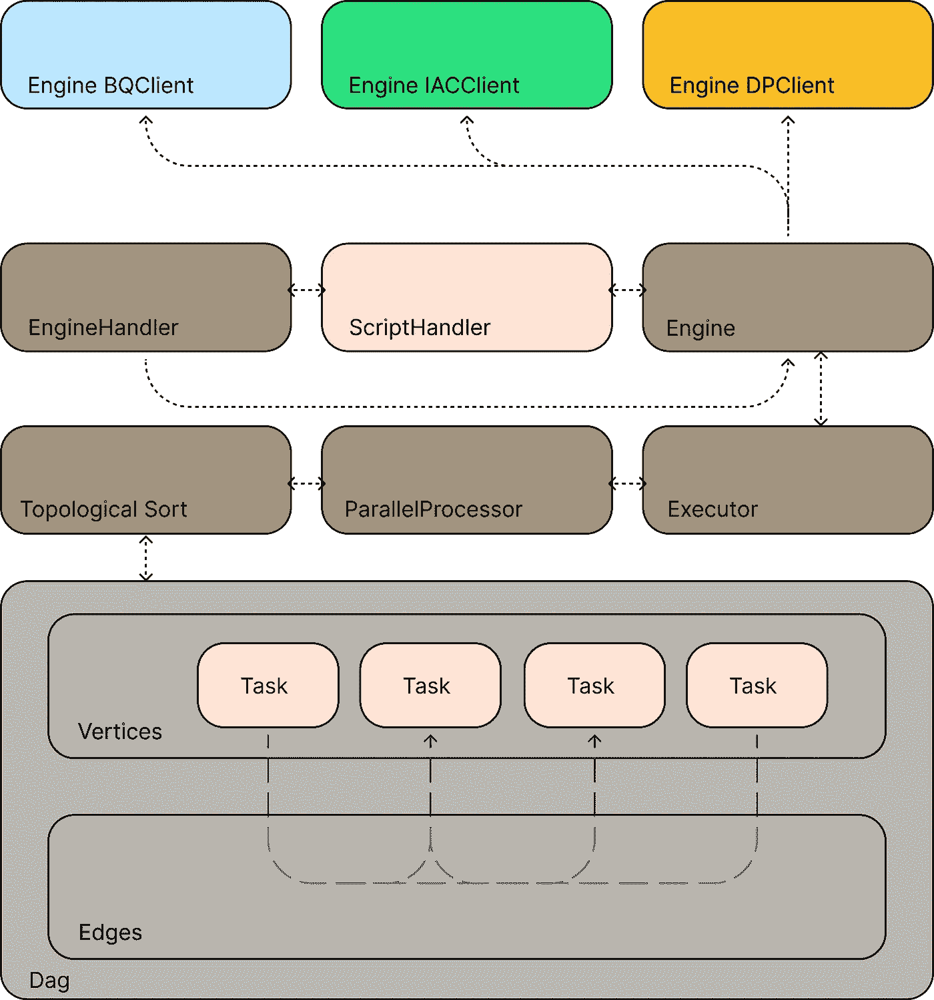

负责与基础设施交互的三个引擎: **BQClient** 、 **IACClient** 和 **DPClient**

默认情况下，pyDag 提供三种类型的引擎:

*   **BQClient** :接收任何 sql 脚本并针对 *BigQuery* 执行的客户端
*   **DPClient** :它是 *Google Cloud Datapro* c 客户端，它接收 pyspark 脚本及其所有相关参数，并针对您应该在参数中指明的集群执行它。
*   这是我发明的一个客户端，所以，有些任务只能作为云中基础设施的构建者，例如:创建一个 dataproc 集群，删除一个 dataproc 集群或者停止一个 dataproc 集群。

一个很好的练习是创建一个 Google Cloud 函数引擎，这样你可以创建只在云中执行 Python 代码的任务。

## 5.通过将流量保持在本地来减少延迟

如果一个 DAG 有 10 个任务，并且在生产中每天运行 4 次，这意味着我们将在一天内提取字符串脚本 40 次，仅仅是为了一个 DAG，那么如果您的业务或企业运营有 10 个以不同间隔运行的 DAG，并且每个 DAG 平均有 10 个任务，那会怎么样呢？对 GCS bucket 会有许多不必要的请求，这会增加成本并增加任务的执行时间，不必要的请求可以使用 redis 在本地缓存。“ **script_handler** ”类将负责保存缓存的脚本。

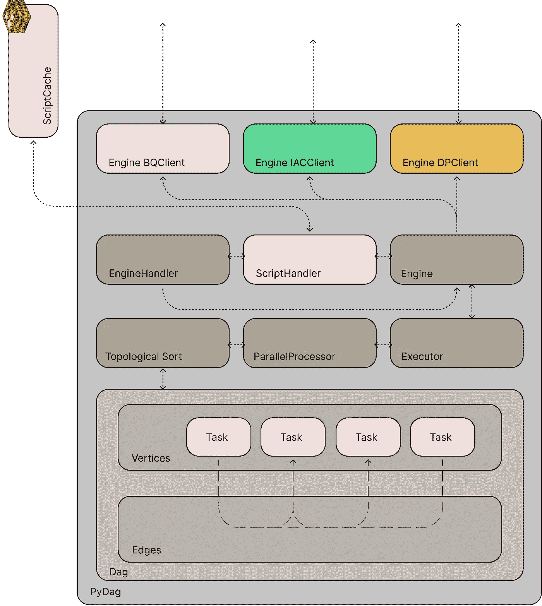

redis 缓存

## 6.pyDag 的多处理器机器体系结构。

正如我们所见， **pyDag** 类的一个对象包含了上面提到的所有东西，架构几乎准备好了。下面我将向您展示整个架构的概况。

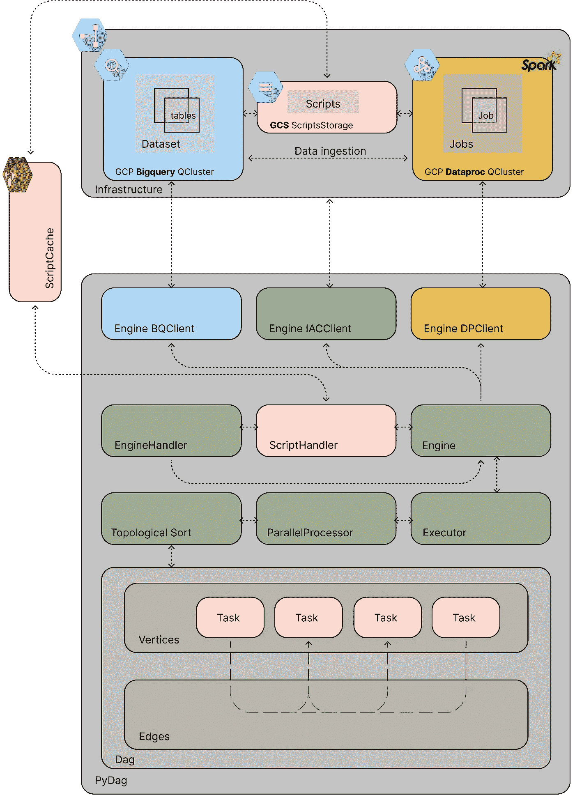

**pyDag**

## 7 .**。让我们运行一个例子**

## GCP-JSON 中的 API 凭证

*   转到谷歌云控制台
*   创建新项目

***按照本视频中的步骤在 Json :*** 中创建 Api 凭证

***在 Json 中创建 Api 凭证***

## GCP -大查询

*   转到 BigQuery
*   创建一个名为 ***的新数据集***


BigQuery 数据集: ***数据集测试***

## GCP 数据公司

*   转到 Dataproc
*   现在点击启用 API

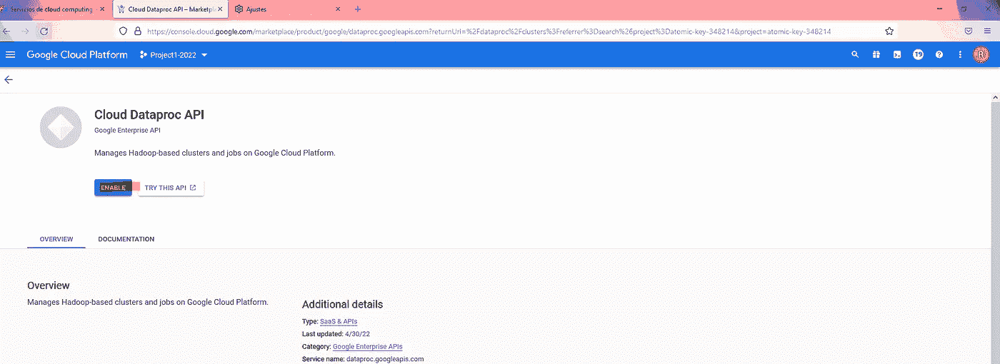

## 本地机器

*   在 Windows 上安装 [***Docker Desktop，它也会安装 Docker Compose，Docker Compose 会让你运行多个容器应用。***](https://docs.docker.com/docker-for-windows/install/)
*   安装[***git-bash for windows***](https://www.stanleyulili.com/git/how-to-install-git-bash-on-windows/)，安装完成后，打开 git bash 并下载这个库，这样就会下载***docker-compose . YAML***文件，以及其他需要的文件。

```
ramse@DESKTOP-K6K6E5A MINGW64 /c
$ git clone [https://github.com/Wittline/pyDag.git](https://github.com/Wittline/uber-expenses-tracking.git)
```

*   一旦从存储库中下载了所有需要的文件，让我们运行所有的程序。我们将再次使用 git bash 工具，转到文件夹 *pyDag* ，我们将运行 Docker Compose 命令:

```
ramse@DESKTOP-K6K6E5A MINGW64 /c
$ cd pyDagramse@DESKTOP-K6K6E5A MINGW64 /c/pyDag
$ cd coderamse@DESKTOP-K6K6E5A MINGW64 /c/pyDag/code
$ cd apps@DESKTOP-K6K6E5A MINGW64 /c/pyDag/code/apps
$ docker-compose up
```

*   转到日志文件夹并检查输出

**我们来解释一下这个例子**

有许多 DAG 配置可用于此示例，最合适且最短的是下图所示的第二种方法，我放弃了第一种方法，这两种方法实现了相同的目标，但是第二种方法有更多机会利用并行性并改善整体延迟。


**DAG 第一次接近**

这个例子只是为了演示这个工具可以达到不同的粒度级别，这个例子可以用更少的步骤构建，实际上使用一个针对 *BigQuery* 的查询，但是这是一个非常简单的例子来看看它是如何工作的。

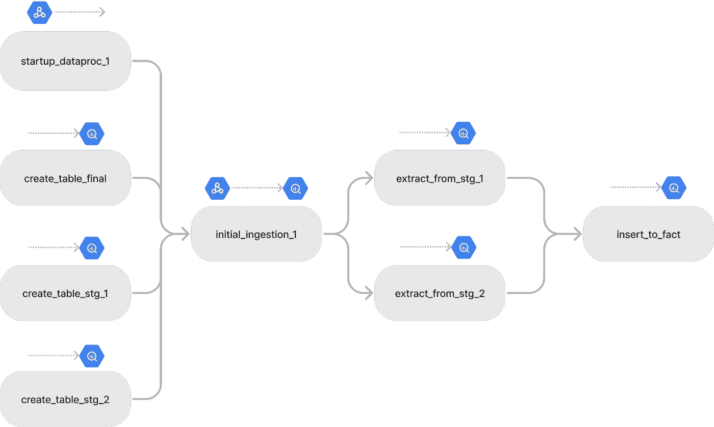

**达格第二次接近**

*   **startup_dataproc_1** :在 GCP 创建一个 dataproc 集群，名称为:“*cluster-data proc-pydag-2022”。*

**data proc _ create _ cluster . IAC**

*   **create_table_final:** 创建最终表"*my table 3***在 BigQuery **，**这里我们要选择和清理的数据。**

****create_table.sql****

*   ****create_table_stg_1:** 在 BigQuery 中创建表***"****my table 1 "*。**

****create_table_stg.sql****

*   ****create_table_stg_2:** 在 BigQuery 中创建表***"****my table 2 "*。**

****create_table_stg.sql****

*   ****initial_ingestion_1:** 此任务将从。CSV 文件存储在 Google 云存储中到 BigQuery，这个脚本将在已经创建的 Dataproc 集群中执行，任务为:" *startup_dataproc_1"* 。在这种情况下，Dataproc 集群将作为摄取层工作，目标表称为“table_stg *”。***

****csv_gcs_to_bq.py****

*   ****extract_from_stg_1:** 该任务将把数据从 *table_stg* 移动到 *mytable1* 中，只记录以下条件 **:** *【年份】:【2022】和【类别】:【汽车】***

****extract_from_stg.sql****

*   ****extract_from_stg_2:** 此任务会将数据从" *table_stg* "移动到" *mytable2* "中，并且只记录以下条件 **:** *【年份】:【2021】和【类别】:【食品】。***

****extract_from_stg.sql****

*   ****insert_to_fact:** 此任务将使用 UNION ALL 将数据从" *mytable1* "和" *mytable2* "填充到" *mytable3 "中。***

****insert_to_fact.sql****

**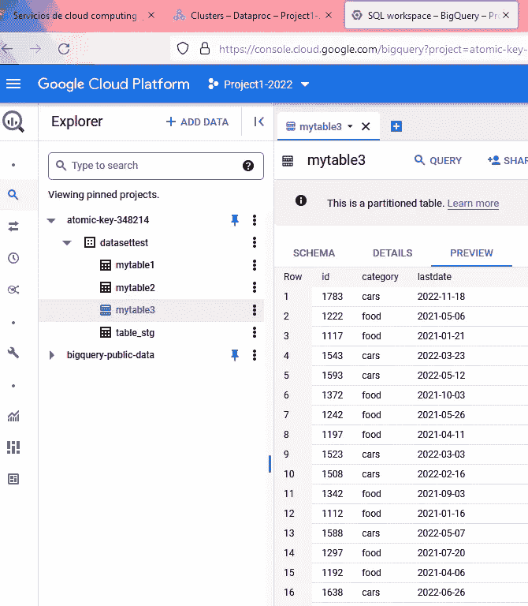**

****期望的结果****

**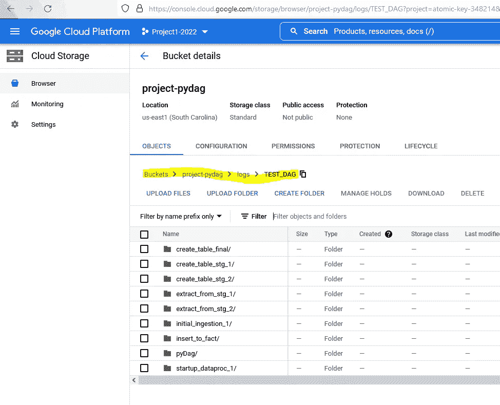**

****日志****

> **记住在这个例子中添加任务来关闭 Google Dataproc 集群，并删除在 BigQuery 中不再使用的临时表**

# **后续步骤**

**为了有一个可接受的产品，需要最少的功能，我将努力增加以下内容:**

1.  **集中式日志**
2.  ***一个元数据库***
3.  ***在多台机器上分布式执行任务***
4.  ***分支***
5.  ***使用 API REST 的 DAG 即服务。***
6.  **带有拖放组件的 GUI**

# **结论**

**您可以清楚地观察到，在所有情况下，都有两个任务需要很长时间才能完成" **startup_dataproc_1** "和" **initial_ingestion_1** "，这两个任务都与使用 *Google DataProc* 有关，避免使用在 dataproc 中创建集群的任务的一个方法是保持已经创建的集群并保持其打开以等待任务，通过水平扩展，这是对通过提交任务而具有高工作负荷的公司的强烈推荐**

**您可以在执行中看到缓存的效果，在打开缓存的情况下， ***短任务更短*** 。**

**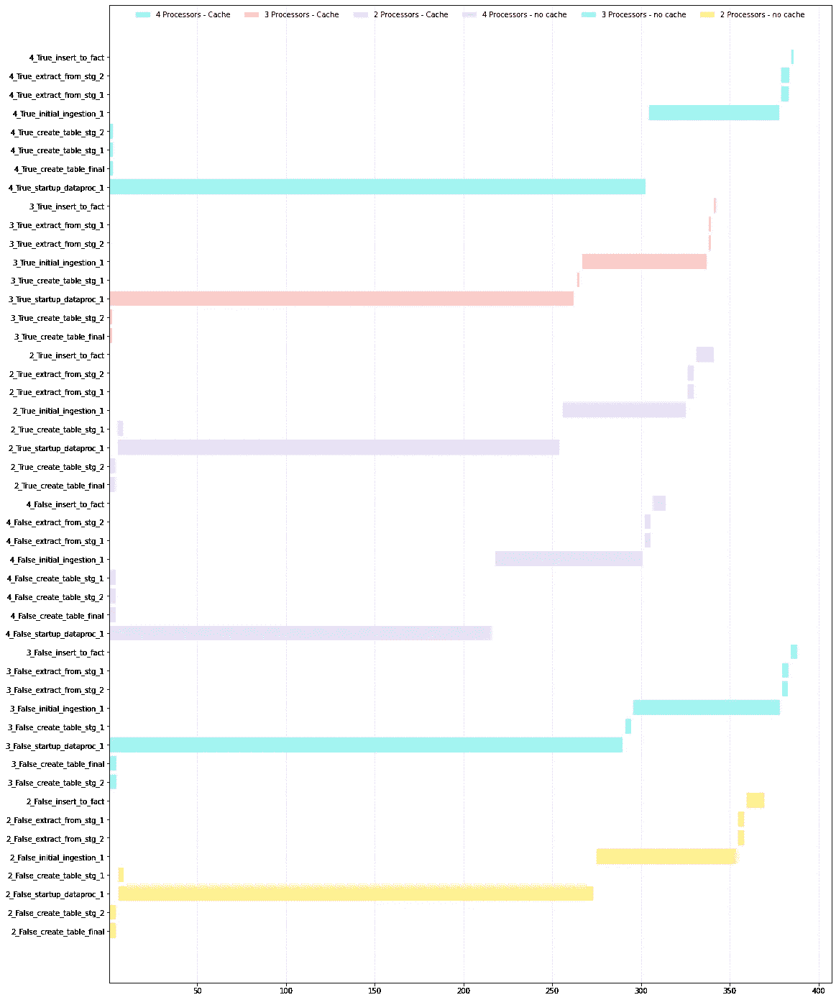**

**甘特图:**具有多处理器和缓存的 pyDag 中的 DAG 行为****

**虽然任务执行中的并行性可以被确认*，*我们可以为每个 DAG 分配一个 ***固定数量的处理器，它代表 DAG* 中可以并行执行的*最大任务数量或者 ***最大并行度*** ，但是这意味着有时会有处理器被浪费， 避免这种情况的一种方法是分配一个动态数量的处理器*，它只适应当前需要执行的任务数量，这样多个 DAGS 可以在一台机器上执行，并利用其他 DAGS 没有使用的处理器。 上述图表的唯一问题是，这些结果来自每个案例的一次执行，每个案例应该执行多次，并且每个案例需要平均时间，但是我没有足够的预算来进行这种测试，代码仍然非常不正式，还没有准备好投入生产，我将致力于这些细节，以便发布更稳定的版本。****

> **查看我的 GitHub 库 [pyDag](https://github.com/Wittline/pyDag) 以获得关于该项目的更多信息**

# **参考**

*   **[https://github.com/victor-gil-sepulveda/pyScheduler](https://github.com/victor-gil-sepulveda/pyScheduler)**
*   **[https://github.com/xianghuzhao/paradag](https://github.com/xianghuzhao/paradag)**
*   **[https://medium . com/@ Apache dolphinscheduler/Apache-dolphinscheduler-is-ranking-on-top-10-open-source-job-schedulers-wla-tools-in-2022-5d 52990 e6b 57](https://medium.com/@ApacheDolphinScheduler/apache-dolphinscheduler-is-ranked-on-the-top-10-open-source-job-schedulers-wla-tools-in-2022-5d52990e6b57)**
*   **[https://medium . com/@ rax shah/system-design-design-a-distributed-job-scheduler-kiss-interview-series-753107 c 0104 c](https://medium.com/@raxshah/system-design-design-a-distributed-job-scheduler-kiss-interview-series-753107c0104c)**
*   **[https://Dropbox . tech/infra structure/asynchronous-task-scheduling-at-Dropbox](https://dropbox.tech/infrastructure/asynchronous-task-scheduling-at-dropbox)**
*   **[https://www . data revenue . com/en-blog/air flow-vs-Luigi-vs-Argo-vs-ml flow-vs-kube flow](https://www.datarevenue.com/en-blog/airflow-vs-luigi-vs-argo-vs-mlflow-vs-kubeflow)**
*   **[https://link . springer . com/chapter/10.1007/978-981-15-5566-4 _ 23](https://link.springer.com/chapter/10.1007/978-981-15-5566-4_23)**
*   **[https://www . researchgate . net/publication/2954491 _ Task _ scheduling _ in _ multi processing _ systems](https://www.researchgate.net/publication/2954491_Task_scheduling_in_multiprocessing_systems)**
*   **[https://conference . scipy . org/proceedings/scipy 2015/Matthew _ rocklin . html](https://conference.scipy.org/proceedings/scipy2015/matthew_rocklin.html)**
*   **[http://article.nadiapub.com/IJGDC/vol9_no9/10.pdf](http://article.nadiapub.com/IJGDC/vol9_no9/10.pdf)**

> **查看我的 GitHub 库 [pyDa](https://github.com/Wittline/pyDag) g 以获得关于该项目的更多信息**