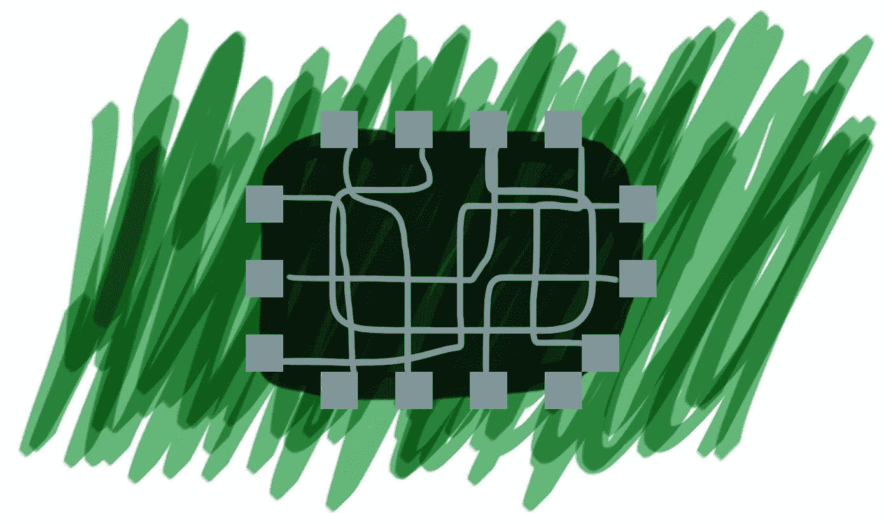

# 如何在 CircleCI 2.0 上缓存 Ruby gems 或 NPM 依赖项

> 原文：<https://itnext.io/how-to-cache-ruby-gems-or-npm-dependencies-on-circleci-2-0-eae8208f9d7b?source=collection_archive---------8----------------------->

CircleCI 2.0 允许我们缓存特定的文件或文件夹。我们可以使用它来缓存随 bundler 安装的 ruby gems，并在运行另一个 CI 构建时恢复它们。这样，新的 CI 构建可以通过使用以前构建的缓存文件运行得更快。本文还向您展示了如何缓存 npm 依赖项。



隐藏物

# 缓存红宝石

第一步是检查对于我们的`Gemfile.lock`是否存在可用的缓存`v1-dependencies-bundler-{{ checksum "Gemfile.lock" }}`。这就是为什么我们将`Gemfile.lock`文件的校验和作为缓存键的一部分。这样，如果不同的 git 提交有不同的`Gemfile.lock`内容，当新的 CI 构建有相同的`Gemfile.lock`校验和时，我们将使用适当的缓存文件。

当您安装新的 gem 并使用更新的内容`Gemfile.lock`推送新的 git commit 时，新的`Gemfile.lock`的缓存键将不存在。在这种情况下，我们希望使用回退缓存键匹配模式`v1-dependencies-bundler-`。

缓存恢复后，我们可以用 bundler 将 gems 安装到指定的目录`vendor/bundle`，然后我们可以在特定的缓存键`v1-dependencies-bundler-{{ checksum "Gemfile.lock" }}`下缓存它

```
*# .circleci/config.yml*
version: 2
jobs:
  build:
    *# other config*

    steps:
      - checkout

      *# Restore bundle cache*
      - type: cache-restore
        keys:
          - v1-dependencies-bundler-{{ checksum "Gemfile.lock" }}
          *# fallback to using the latest cache if no exact match is found*
          - v1-dependencies-bundler-

      *# Bundle install dependencies*
      - run: bundle install --jobs=4 --retry=3 --path vendor/bundle

      *# Store bundle cache*
      - type: cache-save
        key: v1-dependencies-bundler-{{ checksum "Gemfile.lock" }}
        paths:
          - vendor/bundle

      *# other config*
```

如果你想看 Ruby on Rails 项目的 CircleCI 2.0 配置文件的完整示例，请查看这篇文章。

# 缓存 npm 依赖项

缓存 npm 包的流程类似。这里你可以看到一个例子。

```
*# .circleci/config.yml*
version: 2
jobs:
  build:
    *# other config*

    steps:
      *# other config*

      - restore_cache:
          keys:
          - v1-dependencies-{{ checksum "package.json" }}
          *# fallback to using the latest cache if no exact match is found*
          - v1-dependencies-

      - run: npm install

      - save_cache:
          paths:
            - node_modules
          key: v1-dependencies-{{ checksum "package.json" }}

      *# other config*
```

CircleCI 2.0 提供的缓存非常有用，可以帮助我们减少 CI 构建的时间。还有更多的选项来加快我们的 CI 构建。其中之一是 CircleCI 2.0 的 [CI 并行化，您可以在文章中了解更多信息，或者查看](https://docs.knapsackpro.com/2018/improve-circleci-parallelisation-for-rspec-minitest-cypress)[backpack Pro](https://knapsackpro.com/?utm_source=medium&utm_medium=blog_post&utm_campaign=circleci-2-0-cache-ruby-gems-or-npm-dependencies)上的演示。

*原载于*[](https://docs.knapsackpro.com/2018/circleci-2-0-cache-ruby-gems-or-npm-dependencies)**。**