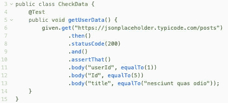
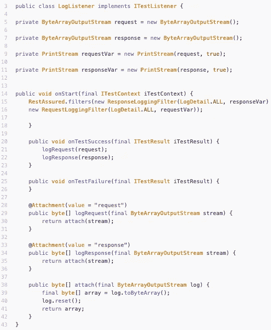
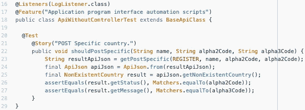
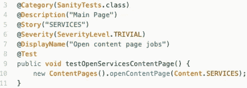
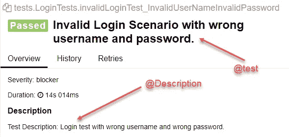
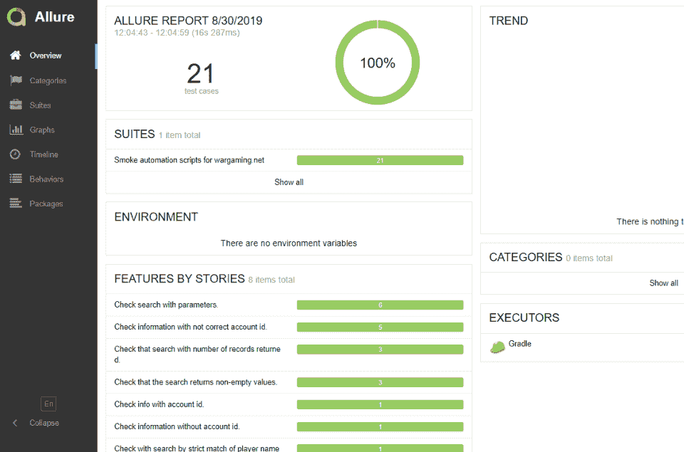
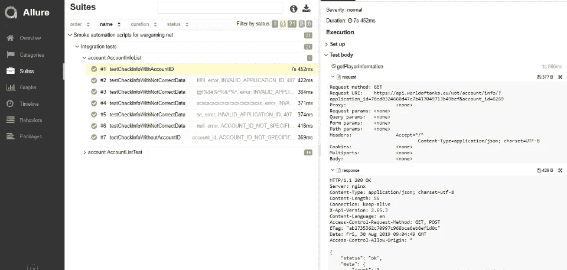

# 如何为放心 API 自动化脚本配置 Allure report？

> 原文：<https://itnext.io/how-to-configure-allure-report-for-rest-assured-api-automation-scripts-fda0d8896cdf?source=collection_archive---------1----------------------->

ny 报告是承包商向客户(客户)传递信息的一种重要而简洁的形式。您可能已经注意到，准备好的报告应该包含有关前一阶段行动的信息。
因此，我们可以将测试报告定义为一个文档，它包含了关于所执行的行为的信息(运行测试用例，检测到的错误，花费的时间，等等)。)和这项工作的结果(失败/通过的测试用例，错误和失败的数量，等等。).
我们需要准备测试报告吗？是的，当然。事实上，准备测试报告至少有 3 个原因:

*   测试报告允许我们(不仅仅是我们)评估项目的当前状态和产品的质量。
*   测试报告可以是决定产品是否可以发布的最终文档。如有必要，可以采取纠正措施

质量和透明度是创建报告的先决条件。因为这是关键的、可见的客户评价我们工作的指标。

检测报告是为谁准备的？

当你创建一个报告时，你必须完全理解它是为谁准备的，谁将阅读它。基于目标受众的优先级，我们需要确定报告应该包含哪些信息。

有三组目标受众:

*   技术用户(测试经理)。对他们来说，理解测试过程、问题是如何产生的、如何解决的、测试过程的构建、所用方法和技术的描述是最重要的。
*   产品经理。他们关注的是实现的时间，没有不必要的技术细节的净测试结果，以及一般的统计数据(只有数字和比较指标)。
*   业务用户(产品所有者)。通常，这些人会在测试结束时做出决定。他们也决定了工作的质量。以最短和最清晰的格式(“是”或“否”)生成的最终结果对他们来说是最重要的。

每份报告必须包括信息的可视化表示(图形、图表)。还有关于产品在工业环境中生产的可能性的专家意见等。信息应以视觉形式呈现(图形、图表)。同样重要的是，在不深入细节的情况下，对释放的可能性有一个专家意见。

当然，写一份适合所有群体的报告几乎是不可能的。因此，在准备测试报告之前，一定要明确目标受众。根据这一点，内容在结构上有很大的不同，并包含特定群体所需的不同细节。

通常，大多数公司目前更喜欢使用**诱惑框架**。

[**Allure Framework**](https://docs.qameta.io/allure/) 是一个灵活的轻量级多语言测试报告工具，它不仅以简洁的 web 报告形式非常简洁地展示了已经测试的内容，还允许参与开发过程的每个人从日常测试执行中提取最大限度的有用信息。

**QA meta . io 公司开发的 Allure 框架**用于获取自动化脚本通过的报告。报告以清晰的形式向测试人员和项目经理显示信息。您可以附加截图、日志和任何其他文件。Allure 允许你将复杂的测试分解成步骤，包括关于测试参数和测试环境的信息。Allure 中的测试可以链接到追踪器中的门票。使用控制台实用程序或插件为持续集成和项目构建系统生成报告。repository Allure 为 Jenkins、MSTest、Maven、PyTest、Spock、NUnit、Codeception、Cucumber、Atlassian Bamboo、ScalaTest 和其他流行的不同编程语言解决方案提供了现成的插件和适配器。

与 UI 测试一样，API 不包含截图等信息。测试专家在测试服务时依赖于请求和响应。正是这些信息需要附在报告中。

**放心**是一个很棒的 Java 库，完全涵盖了自动化工程师需要的一切。放心编写自动化脚本非常舒服。

最简单的放心工作的例子如下:

为了成功地为 Allure 报告收集信息，我们需要创建一个**日志监听器。但是我劝你对此要小心。事实证明，听众带来了很多问题，而很多人很可能甚至不知道。听者不是熟练的人，与其说是有用的工具，不如说是危险的工具。**

事实 1:[@ Listener](http://twitter.com/Listener)注释将监听器应用于所有的类。

事实 2:侦听器的执行顺序没有保证。

可用作特定自动脚本的监听器:

或者，您可以将这个给定的侦听器与基类结合使用:

**Allure framework** 提供了大量的注释，作为自动化测试专家，您可以使用这些注释来描述各种测试情况。

您也可以标记步骤:

**@DisplayName** 以便向任何测试方法添加人类可读的名称。

**@Description** 用于添加每种测试方法的详细描述。

**@步骤**是构成测试场景的任何动作。步骤可以用在不同的测试场景中。

**@Links** 你可以将你的测试链接到一些资源，比如 TMS(测试管理系统)或者 bug tracker。

使用 **@Severity** 注释是为了根据严重性对测试方法进行优先排序。

在一些开发方法中，测试是通过**@特性**和**@故事来分类的。**

附件只是一个用**@ attachment en**注释的方法

典型的诱惑报告

附有请求和响应的典型 Allure 报告

没有必要在报告中写下关于项目活动的所有信息。只需关注重点，总结测试结果的规格。如你所见，写一份有效的测试报告并不容易。目前，最好的测试管理工具会自动生成报告。

[https://test-engineer.site/](https://test-engineer.site/)

# 作者[安东·斯米尔诺夫](https://www.linkedin.com/in/vaskocuturilo/)