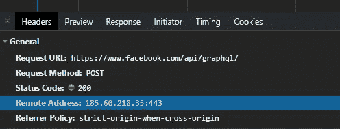

# 如何处理软件漏洞

> 原文：<https://itnext.io/how-to-deal-with-software-vulnerabilities-cb2afa193a26?source=collection_archive---------6----------------------->

下面是一个策略列表，您可以实施这些策略来减少软件漏洞以及这些漏洞在受到攻击时的影响。

# 代码分析

你能做的最好的事情之一就是使用工具不断地分析你的代码中已知的漏洞。毕竟，意识到所有可能出错的事情几乎是不可能的，尤其是对于您的开源组件和依赖项。

这种工具的一个例子是 IAST。您可以在 QA 或测试环境中使用该工具，并让它对您的代码运行实时扫描。它的主要好处是能够检测有问题的代码行中的漏洞，并通知开发人员立即进行修复。

# 服务器和环境安全

实现良好的安全性从底层开始，即服务器和 web 应用程序运行的环境。这不仅会保护您的应用程序免受多种类型的攻击，而且会限制损害，使攻击几乎不值一提。

# 只有使用 ssh 且没有密码的用户

从任何网站打开开发者工具，检查任何请求的标题。

太好了，现在你知道网站所在服务器的 IP 地址了。打开一个有 SSH 的简单控制台，比如 [Putty](https://en.wikipedia.org/wiki/PuTTY) ，写下那个服务器的 IP 并连接到它。

如果它能工作，那么你就能完全控制那个应用程序，它的数据和存储在那台计算机上的所有东西。幸运的是，你还需要写一件事，你的证书。

将服务器的完全控制权交给某人是没有人愿意做的事情。像这样敏感而有价值的目标必须用比简单的密码-用户名组合更安全的方法来保护。

这就是为什么一个好的起点是下面的清单:

*   启用 SSH 密钥登录(使用存储在受保护设备上的 SSH 密钥比使用简单的普通密码更安全)
*   禁用 root 登录—不要让任何人以 root 身份连接到您的服务器，root 是可以访问所有命令的默认帐户；创建单独的用户，并赋予他们适当的角色
*   禁用密码登录

# 保持私密

如果所有的窗户都开着，保护正门是没有效果的。

尽可能保持一切私密。安装一个**防火墙**，屏蔽掉你服务器的所有端口，除了主 TCP 端口 **80** 和其他感兴趣的端口，比如用于 SSH 的 **443** 或用于 SSH 连接的 **2222** 。

有时候黑客会寻找你的数据。因此，增加对数据库的关注是必须的。

如果您只从服务器内部使用数据库，则阻止从外部(公共互联网)访问运行数据库服务器的端口。

同时，使用密码保护数据库，并为连接到主数据库服务器的每个应用程序创建具有有限角色的单独用户。

# 不要给你的应用太多权限

如果有人对你的应用程序或通过你的应用程序进行某种控制，那么黑客将能够做应用程序能够做的任何事情。

如果您的应用程序不需要文件系统访问来运行，那么一定要限制它。

想想你的应用程序的需求是什么，只给它所需要的许可，不要额外的许可。

尤其是在`sudo`(超级用户模式)下。

# 如何编写安全的代码

此时，您可以说外部(公共互联网)与您的系统和数据的唯一连接是通过您的应用程序。

您应该注意自己编写的代码，并检查可能出现的任何漏洞。

# 顶级 Web 应用程序安全风险

第一步是从你自己写的代码开始。在没有意识到的情况下，您可以在那里创建漏洞。

[应用程序面临的大多数风险](https://owasp.org/www-project-top-ten/)都是由于功能实现不正确造成的。

一些例子包括由于缺乏输入净化或白名单而缺乏适当的认证系统。黑客可以通过使用一些代码注入很容易地绕过这些。

另一个问题是用户认证的误用和存储，无论是 cookie 会话还是 JSON web 令牌。

这里没有简单的解决方案，但是不断改进和保持对可能发生的错误的意识会有所帮助。

# 依赖性和公共第三方代码

从广义上讲，开源软件被认为是安全的，主要是因为社区积极参与阅读和改进项目。

问题是怀有不良意图的开发人员可以检查和搜索漏洞，以便为自己的利益使用它们。如果他们针对的组件被广泛使用，他们可以一次攻击影响多个网站。

在这方面，你能做的最好的事情就是始终保持你的包是最新的，并且只使用那些背后有一个大的社区的包。

# 结论

没有什么是 100%安全的，但是通过正确的习惯和工具，我们可以通过不断地监控和修补我们使用的代码来减轻大部分风险。幸运的是，今天，我们有自动化工具可以为我们做到这一点。