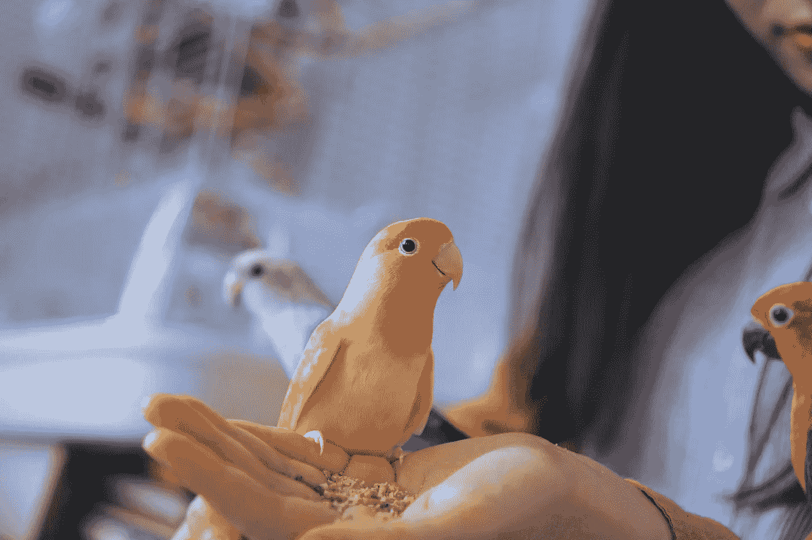

# 如何在 Kubernetes 中部署和使用 Kube-fledged 来缓存图像

> 原文：<https://itnext.io/how-to-deploy-and-use-kube-fledged-to-cache-images-in-kubernetes-8b6b9d6c2733?source=collection_archive---------1----------------------->



MF Evelyn 在 [Unsplash](https://unsplash.com/s/photos/parakeet?utm_source=unsplash&utm_medium=referral&utm_content=creditCopyText) 上的照片

*羽翼未丰是飞行动物生命中从孵化或出生到能够飞行的阶段。当羽毛和翅膀肌肉发育到足以飞行时，所有的鸟都被认为是羽翼丰满的。一只刚刚羽化但仍然依赖父母照顾和喂养的小鸟被称为雏鸟。(来源:维基百科)*

# 什么是 kube-fledged？

kube-friedged 是一个 kubernetes 插件或操作器，用于直接在 kubernetes 集群的工作节点上创建和管理容器图像的缓存。它允许用户定义图像列表以及那些图像应该被缓存(即，拉取)到哪个工作者节点上。因此，应用程序窗格几乎可以立即启动，因为不需要从注册表中提取图像。kube-friedged 提供 CRUD APIs 来管理图像缓存的生命周期，并支持几个可配置的参数来根据个人需求定制功能。(回购网址:[https://github.com/senthilrch/kube-fledged](https://github.com/senthilrch/kube-fledged))

在这篇博文中，我将解释(I)如何部署 kube-成熟的，(ii)配置标志，(iii)在 Kubernetes 集群中创建容器图像缓存，以及(iv)支持的各种图像缓存操作

# 先决条件

*   一个正在运行的 K8s 集群。您应该在集群上拥有*集群管理*权限来部署 kube-friedged
*   安装在本地 Linux 或 Mac 机器上的 kubectl、make 和 git。

# 使用 YAML 清单部署 kube-fledged

这些指令使用 YAML 清单和 [Docker Hub 中的预建映像，将 kube-friended 部署到一个名为“kube-friended”的独立名称空间。](https://hub.docker.com/u/senthilrch)

*   克隆源代码库

```
mkdir -p $HOME/src/github.com/senthilrch
git clone [https://github.com/senthilrch/kube-fledged.git](https://github.com/senthilrch/kube-fledged.git) $HOME/src/github.com/senthilrch/kube-fledged
cd $HOME/src/github.com/senthilrch/kube-fledged
```

*   将 kube-edged 部署到集群

```
make deploy-using-yaml
```

*   验证 kube-edged 是否部署成功

```
kubectl get pods -n kube-fledged -l app=kubefledged
kubectl get imagecaches -n kube-fledged (Output should be: 'No resources found')
```

kube-成熟的支持部署通过舵图表和舵操作员以及。参考项目([https://github.com/senthilrch/kube-fledged](https://github.com/senthilrch/kube-fledged))的自述文件，了解使用这些方法进行部署的步骤。

# 成熟的配置标志

kube-fledged 支持几个配置标志，可以用来定制行为。

`**--image-pull-deadline-duration:**`拉动图像所允许的最大持续时间。在这段时间之后，图像拉取被认为已经失败。默认“5m”

`**--image-cache-refresh-frequency:**`图像缓存会定期刷新，以确保缓存是最新的。将此标志设置为“0s”将禁用刷新。默认“15 米”

`**--image-pull-policy:**`图像提取策略，用于提取图像并刷新缓存。可能的值为“如果不存在”和“总是”。默认值为“IfNotPresent”(没有 or 的图像):总是提取“最新”标签

`**--stderrthreshold:**`日志级别。默认为信息

# 创建图像缓存

在群集上创建映像缓存的第一步是确定要缓存的映像列表，以及这些映像应该缓存到哪些节点上。让我们假设您需要:-

*   缓存图像`quay.io/bitnami/nginx:1.21.1`和`quay.io/bitnami/tomcat:10.0.8` 到**集群中的所有**节点
*   仅将图像`quay.io/bitnami/redis:6.2.5`和`quay.io/bitnami/mariadb:10.5.11`和**缓存到标签为`tier: backend`的节点**

创建一个名为`kubefledged-imagecache.yaml`的文件，内容如下:

```
apiVersion: kubefledged.io/v1alpha2
kind: ImageCache
metadata:
 # Name of the image cache.
  name: imagecache1
  # The namespace to be used for this image cache.
  namespace: kube-fledged
  labels:
    app: kubefledged
    component: imagecache
spec:
  # The "cacheSpec" field allows a user to define a list of images and onto which worker nodes those images should be cached (i.e. pre-pulled).
  cacheSpec:
  # Specifies a list of images (nginx:1.21.1 and tomcat:10.0.8) with no node selector, hence these images will be cached in all the nodes in the cluster
  - images:
    - quay.io/bitnami/nginx:1.21.1
    - quay.io/bitnami/tomcat:10.0.8
  # Specifies a list of images (redis:6.2.5 and mariadb:10.5.11) with a node selector, hence these images will be cached only on the nodes selected by the node selector
  - images:
    - quay.io/bitnami/redis:6.2.5
    - quay.io/bitnami/mariadb:10.5.11
    nodeSelector:
      tier: backend
```

使用 kubectl 创建图像缓存

```
kubectl create -f kubefledged-imagecache.yaml
```

此时，图像缓存清单被提交给 k8s api 服务器。api 服务器创建一个 HTTP POST 请求，并将其发送到 kubefledged-webhook-server。webhook 服务器验证 ImageCache 资源的内容，并向 api 服务器返回成功的响应。

然后，api 服务器将 ImageCache 资源保存在 etcd 中。kubefledged-controller 然后在 worker 节点上创建几个 k8s 作业，用于将图像拉入缓存。一个作业负责将一个图像拉入一个节点。所有作业成功完成后，控制器会更新 ImageCache 资源的状态字段。用户可以查询 ImageCache 资源并查看状态字段，以了解图像缓存是否创建成功。如果有失败，状态字段还会有错误消息和错误描述，指出失败的原因

验证图像缓存创建的状态

```
kubectl get imagecache imagecache1 -n kube-fledged -o yaml
```

# 修改图像缓存

成功创建映像缓存后，可以通过修改映像缓存清单并将其重新提交到群集来对其进行更改。让我们假设您想要从图像缓存中移除图像`quay.io/bitnami/tomcat:10.0.8`。

编辑图像缓存清单文件`kubefledged-imagecache.yaml`，如下所示:-

```
apiVersion: kubefledged.io/v1alpha2
kind: ImageCache
metadata:
 # Name of the image cache.
  name: imagecache1
  # The namespace to be used for this image cache.
  namespace: kube-fledged
  labels:
    app: kubefledged
    component: imagecache
spec:
  # The "cacheSpec" field allows a user to define a list of images and onto which worker nodes those images should be cached (i.e. pre-pulled).
  cacheSpec:
  # Specifies a list of images (nginx:1.21.1) with no node selector, hence these images will be cached in all the nodes in the cluster
  - images:
    - quay.io/bitnami/nginx:1.21.1
  # Specifies a list of images (redis:6.2.5 and mariadb:10.5.11) with a node selector, hence these images will be cached only on the nodes selected by the node selector
  - images:
    - quay.io/bitnami/redis:6.2.5
    - quay.io/bitnami/mariadb:10.5.11
    nodeSelector:
      tier: backend
```

使用 kubectl 将更改应用到图像缓存

```
kubectl apply -f kubefledged-imagecache.yaml
```

kubefledged-controller 将检测对 ImageCache 资源的更改，并确定需要从集群上的图像缓存中删除图像`quay.io/bitnami/tomcat:10.0.8` 。因此，它创建作业从图像缓存中删除图像。这些操作的结果在 ImageCache 资源的 status 字段中更新。

验证图像缓存修改的状态

```
kubectl get imagecache imagecache1 -n kube-fledged -o yaml
```

# 清除图像缓存

如果您决定从图像缓存中删除所有图像，可以通过提交清除请求来完成。通过使用以下命令注释 ImageCache 资源来提交清除请求

```
kubectl annotate imagecaches imagecache1 -n kube-fledged kubefledged.io/purge-imagecache=
```

验证清除图像缓存的状态

```
kubectl get imagecache imagecache1 -n kube-fledged -o yaml
```

# 刷新图像缓存

一旦图像缓存被清除，就可以通过提交刷新请求轻松恢复。通过使用以下命令注释 ImageCache 资源来提交刷新请求

```
kubectl annotate imagecaches imagecache1 -n kube-fledged kubefledged.io/refresh-imagecache=
```

验证图像缓存刷新的状态

```
kubectl get imagecache imagecache1 -n kube-fledged -o yaml
```

# 结论

在这篇博客中，我解释了如何使用 kube-friedged 在 kubernetes 集群上创建容器图像缓存，以及如何对创建的图像缓存执行不同的操作:查看、修改、清除、刷新。前往该项目的 github 资源库:【https://github.com/senthilrch/kube-fledged 

如果你想了解更多关于 Kube-fleeded 的信息，请阅读我之前的博客[Kube-fleeded:在 Kubernetes 中缓存容器图像](/kube-fledged-cache-container-images-in-kubernetes-7880a00bab91)

👉我定期在 Kubernetes 和云原生技术上发微博。 *跟我上* [*推特*](https://twitter.com/senthilrch) *和* [*中*](https://medium.com/@senthilrch)