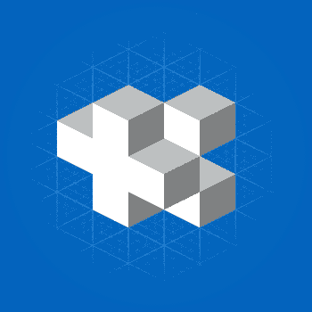

# 如何使用 Jsonnet 用 100 行描述 100 个 Gitlab 作业

> 原文：<https://itnext.io/how-to-describe-100-gitlab-jobs-in-100-lines-using-jsonnet-4e19a4d5bca?source=collection_archive---------3----------------------->

除了[上一篇关于 Kubernetes 中部署工具的文章](https://medium.com/@kvaps/trying-new-tools-for-building-and-automate-the-deployment-in-kubernetes-f96f9684e580)，我想告诉你如何使用 Jsonnet 来简化你的**中的工作描述。gitlab-ci.yml**



# 考虑到

有一种单一回购，其中:

*   10 个 dockerfiles 文件
*   30 个描述的部署
*   3 个环境:**开发**、**阶段**和**生产**

# 工作

配置管道:

*   构建 Docker 映像应该通过添加一个带有版本号的 git 标签来完成。
*   每个部署操作都应该在推送到环境分支时执行，并且只有在特定目录中的文件发生更改时才执行
*   每个环境都有自己的 gitlab-runner，带有不同的标记，只在这个环境中执行部署。
*   不应该在每个环境中部署任何应用程序。我们应该描述管道，以便能够进行例外处理。
*   一些部署使用 git 子模块，并且应该在设置了`**GIT_SUBMODULE_STRATEGY=normal**`环境变量的情况下运行。

描述这一切可能看起来像一个真正的地狱，但不要绝望，有了 Jsonnet 的武装，我们可以轻松做到这一点。

# **解决方案**

**gitlab-ci.yml** 内置了减少重复作业描述的功能，例如，您可以使用[扩展](https://docs.gitlab.com/ee/ci/yaml/#extends)或[包含](https://docs.gitlab.com/ee/ci/yaml/#include)，但是它没有提供完全成熟的模板，无法让您更加简洁高效地描述作业。

为了解决这个问题，我建议使用 jsonnet，它允许您在描述任何数据结构时摆脱代码重复。

> 我强烈推荐你为你的编辑器安装一个插件，以便与***jsonnet****一起工作。*
> 
> *例如，vim 有一个很好的插件****vim-jsonnet****，它打开语法高亮，并在每次保存时自动运行* `*jsonnet fmt*` *(它需要安装****jsonnet****二进制)。*

让我们看看我们的存储库的结构:

```
.
├── deploy
│   ├── analyse
│   ├── basin
│   ├── brush
│   ├── copper
│   ├── dinner
│   ├── dirty
│   ├── drab
│   ├── drunk
│   ├── education
│   ├── fanatical
│   ├── faulty
│   ├── guarantee
│   ├── guitar
│   ├── hall
│   ├── harmonious
│   ├── history
│   ├── iron
│   ├── maniacal
│   ├── mist
│   ├── nine
│   ├── pleasant
│   ├── polish
│   ├── receipt
│   ├── shop
│   ├── smelly
│   ├── solid
│   ├── stroke
│   ├── thunder
│   ├── ultra
│   └── yarn
└── dockerfiles
    ├── dinner
    ├── drunk
    ├── fanatical
    ├── guarantee
    ├── guitar
    ├── harmonious
    ├── shop
    ├── smelly
    ├── thunder
    └── yarn
```

Docker 图像将使用 [**kaniko**](https://medium.com/@kvaps/trying-new-tools-for-building-and-automate-the-deployment-in-kubernetes-f96f9684e580#9bf2) 构建

应用程序将使用 [**qbec**](https://medium.com/@kvaps/trying-new-tools-for-building-and-automate-the-deployment-in-kubernetes-f96f9684e580#4c4b) 部署到集群中。已经针对三种不同的环境描述了每个应用程序，为了将更改应用到集群，只需运行:

```
qbec apply <environment> --root deploy/<app> --yes
```

其中:

*   `<app>` —是应用程序名称
*   `<environment>` —是我们的环境之一: **devel** 、 **stage** 或 **prod** 。

最终，我们的工作应该是这样的:

**构建:**

其中`{{ image }}`将被替换为 **dockerfiles** 中的目录名

**部署:**

其中`{{ app }}`将被替换为**部署**目录中应用的名称，`{{ environment }}`将被替换为我们执行部署的环境的名称。

让我们将我们工作的原型描述为单独库中的对象`**lib/jobs.jsonnet**` **:**

请注意，我故意没有指定`**refs**`和`**tags**`以使我们的库更加灵活，并向您更详细地展示 jsonnet 的功能，我们稍后将在主文件中添加它们。

现在我们来描述一下我们的`**.gitlab-ci.jsonnet**`:

看看文件开头的`**ref**`、`**tag**`和`**submodule**`函数，它们允许您构建一个覆盖对象。

稍微解释一下:对覆盖对象使用`**+:**`而不是`**:**`允许您向现有对象或列表追加一个值。

`**refs**`的示例`**:**`:

将输出:

```
{
   "only": { "refs": [ "prod" ] },
   "script": [ "echo 123" ]
}
```

但是`**+:**`对于`**refs**`:

将输出:

```
{
   "only": { "refs": [ "prod", "tags" ] },
   "script": [ "echo 123" ]
}
```

正如你所看到的，使用 Jsonnet 允许你非常有效地描述和合并你的对象，结果，你总是得到现成的 JSON，我们可以立即将它写入我们的`**.gitlab-ci.yml**`文件:

```
jsonnet .gitlab-ci.jsonnet > .gitlab-ci.yml
```

让我们检查一下行数:

```
# wc -l .gitlab-ci.jsonnet lib/jobs.libsonnet .gitlab-ci.yml
   77 .gitlab-ci.jsonnet
   24 lib/jobs.libsonnet
 1710 .gitlab-ci.yml
```

非常好

可以在官网看到更多例子直接试试 Jsonnet:[【jsonnet.org】T2](https://jsonnet.org/)