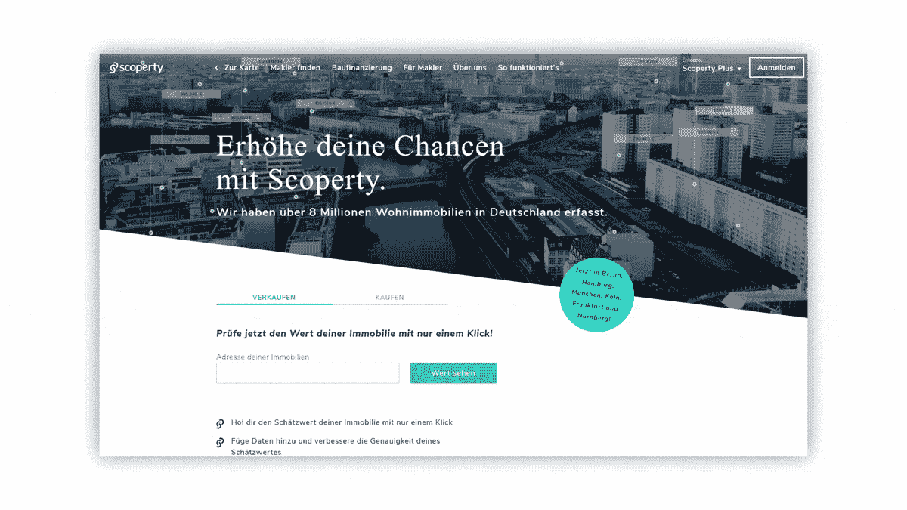
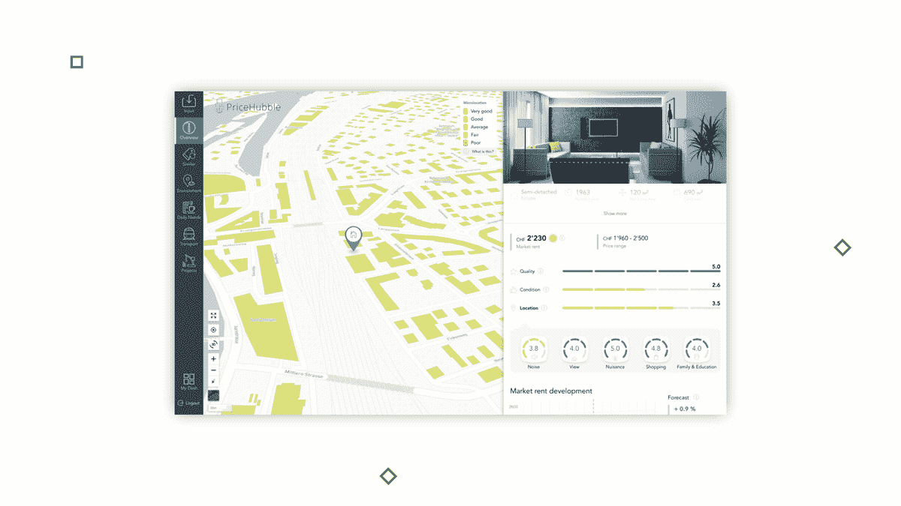
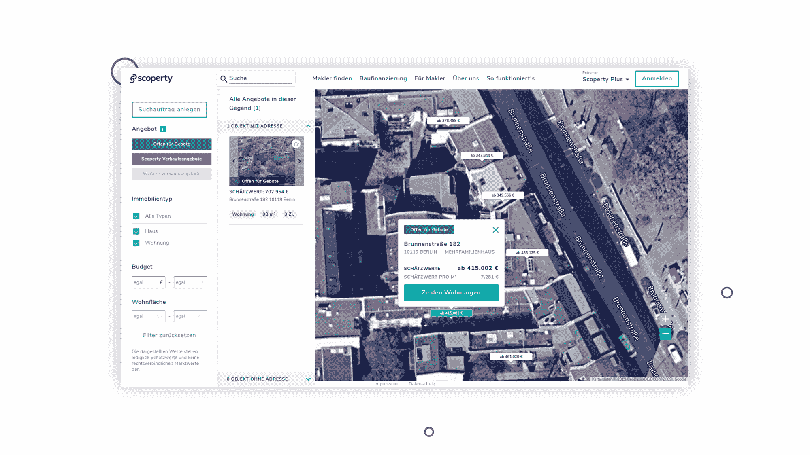
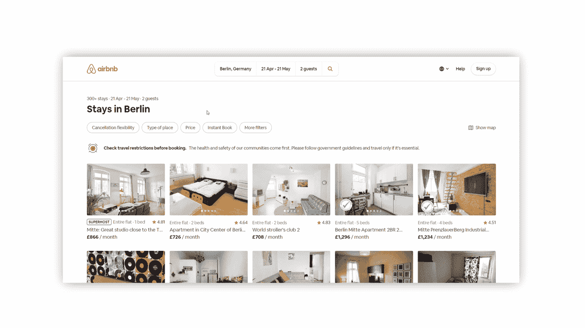
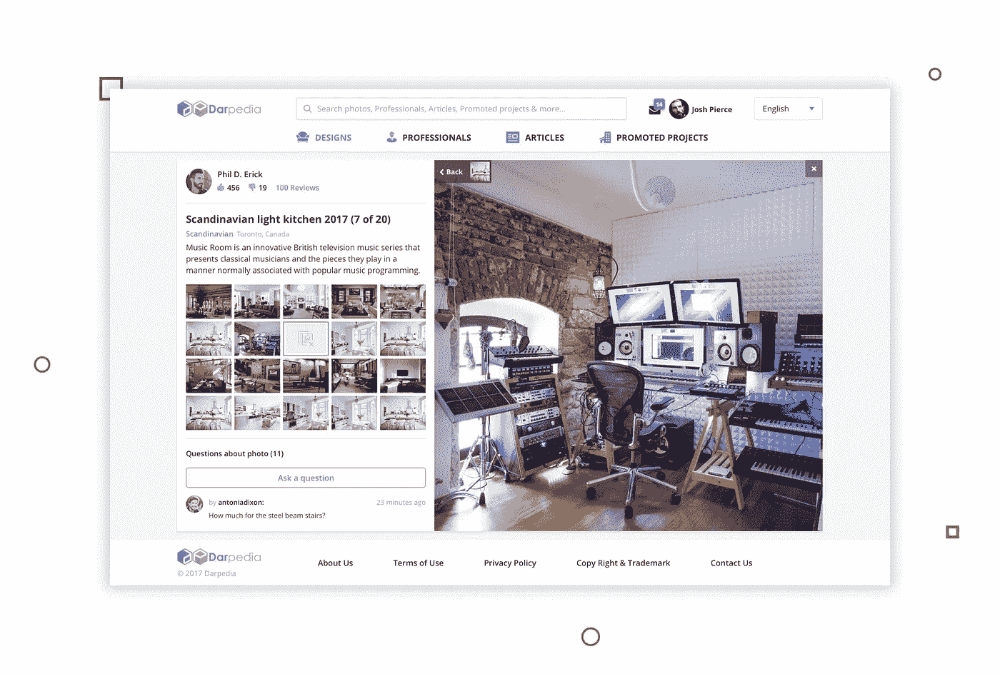
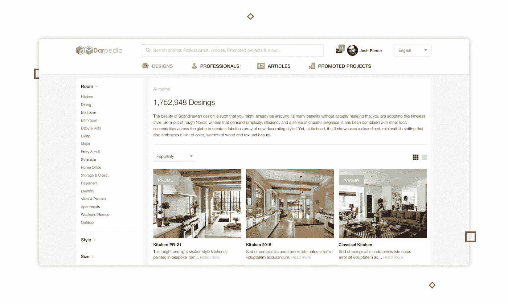

# 如何开发出脱颖而出的房产 App

> 原文：<https://itnext.io/how-to-develop-a-real-estate-app-that-stands-out-3a3c86fa622a?source=collection_archive---------4----------------------->

脱颖而出不仅是应用程序的问题，也是每个产品都在努力解决的问题。但是，像抵押贷款或金融应用程序一样，处理房地产的应用程序需要易于使用、透明(因为并非所有用户都了解该主题或擅长数字)，并且在处理用户的机密个人和金融信息方面绝对无懈可击。

那么，你是怎么做到的呢？

> 这篇关于[如何开发出脱颖而出的房地产应用](https://djangostars.com/blog/writing-investment-proposal/)的文章最初发表在 Django Stars 博客上。由 Gleb Pushkov 撰写，他是 [Django Stars](https://djangostars.com/) 的高级软件开发人员

# 您所在市场的主要问题

传统很难打破。在一些行业，很难引入新的东西，也很难颠覆已经运行了几十年的东西。例如，金融和银行市场正在慢慢让位于金融科技，但仍有一些国家没有做好准备。人们只是习惯了事情一直以来的样子。

另一个难以接受创新的行业是房地产。例如，在德国，很难找到一个运行良好的房地产平台来满足业主和买家的需求。有一些流行的网站，但它们不能正常工作。只有经纪人发布的房源才有效。这项服务对所有者来说是免费的，但对购买者来说相当昂贵。因此，买家会赔钱。业主也是如此，他们可以以更高的价格出售他们的财产，而不是向其他人支付佣金。

此外，现有的平台不提供财产估价。业主不知道他们的房产实际值多少钱，不得不接受经纪人的价格。反过来，经纪人往往会提出更有利于客户的价格，这样房产就会卖得更快。这个问题被 [Scoperty](https://djangostars.com/case-studies/scoperty/) 巧妙地解决了——这是一种连接业主、买家和房地产经纪人的服务，提供最新的估价。

传统房产交易双方都会遇到的另一个问题是成交过程的持续时间。来回处理文件可能需要几周甚至几个月的时间。例如，澳大利亚私人交易所( [PEXA](https://www.afr.com/brand/chanticleer/pexa-triggers-a-digital-revolution-in-property-20171030-gzb3uu) )以一种创新的方式解决了这个问题。他们使用云来快速跟踪这一过程，并以数字化方式完成财务结算。他们的解决方案甚至允许电子签名。

为了让买家更好地了解房产，一些公司现在使用 3D 和虚拟现实技术。这方面的领导者之一是 Matterport，它通过照片、视频和 3D 体验提供“身临其境”的房地产旅游。

你可以从中学到的是，要有所作为，你需要找到一个紧迫的房地产问题，并解决它。

# 如何与你的客户沟通

我们的生活无时无刻不与网络相连。这是可以理解的，因为数字化进程让我们的生活变得更容易。然而，如果你想创造一个人们会喜欢的产品，你需要知道你的客户是谁，并密切关注客户的旅程。房地产平台的用户通常可以分为三类，你需要为每一类开发必要的功能。

**业主和房地产经纪人**应该能够创建列表，填写财产信息，上传图像，管理报价，安排会议和开放房屋。与此同时，**买家**应该能够过滤和选择房产，获取位置和社区信息，添加收藏夹，获得搜索提醒，并联系业主。

产品团队决定这些角色的客户旅程应该是什么样子。用户登录后界面会有所不同吗？或者两种用户类型的界面是相似的，但是每种用户类型的功能不同？例如，“资产所有者”配置文件应该提供上传资产照片及其描述的功能，而“买家”配置文件可以提供高级搜索和更多相关搜索结果的附加过滤选项。这完全取决于用户的角色。

作为服务提供商，你必须找到与客户有效沟通的方法，并让他们相互沟通。确保提供跨所有渠道(web 和移动)的所有平台功能，以及在线或电话(或两者兼有)的客户支持。在平台内部创建一个直接、安全的沟通渠道，让买家能够联系业主或房地产经纪人。

# 你需要的不仅仅是估价

为什么估值很重要？因为当涉及到房地产时，涉及到大量的资金，买家希望确定房产是否物有所值。换句话说，这就是信任和透明。提供房地产估价向你的客户表明你关心他们，并努力与真实的市场价格保持一致。要做到这一点，你可以将你的产品与第三方服务整合，这些服务将提供关于市场上房地产价值的必要信息。

通过这种方式，买家和业主可以获得比房地产经纪人更精确的估计，因为他们获得报酬的方式往往取决于他们出售房屋的速度。

例如，为了让买家更容易做出选择，PriceHubble 使用街道噪音和购物机会等标准来评估房产价值。 [Scoperty](https://scoperty.de/sell?last_land=sell) 反过来提供了一种视觉效果，显示出该房产是否位于城镇的昂贵地段。

像这样展示额外的信息是你接近目标受众的机会，他们会欣赏你的做法。这就是面向客户的方法的样子，它对任何成功的初创公司都至关重要，尤其是房地产网站和移动应用程序开发，以及一般的业务。

例如，我们的另一个客户， [Moneypark](https://djangostars.com/case-studies/moneypark/) ，这是欧洲最大的抵押贷款咨询平台，也使用类似的合作伙伴数据进行估值。

你必须记住的一件事是市场价格是定期变化的。如果你选择与为你提供评估的第三方服务整合，你应该了解他们多久更新一次价格。另一方面，如果你已经决定使用一个自主开发的算法，你应该跟踪新的数据(找到一个可靠的数据来源),并保持算法模型与真实的市场价格相关。

这意味着，如果像 2008 年那样的危机再次发生，你将能够重新评估所有的房产并更新价格。没有最新的信息，这是不可能的。

# 内容为王

开始时这可能是一个挑战，但是你需要在你的平台上有尽可能多的内容。要把买家带到平台上，你需要业主和他们的房源——如果没有买家，业主就不会来。

房地产平台上的内容面临的挑战之一是，用户并不总是提供最近的信息。

例如，业主和房地产经纪人不经常更新他们的财产状况或信息。他们可以表示其列表的状态— *开放待售*，或*待售*(有确定的价格)—但可能会忘记填写所有信息字段或上传足够多的图片来显示该物业。出于这个原因，一定要提醒用户正确填写列表或显示进度条，这将鼓励用户提供更多信息，因为这增加了他们被出售的机会。

内容重要性的另一个很好的例子是 Moneypark。这是一个[抵押贷款](https://djangostars.com/blog/creating-an-online-mortgage-service-tips-and-insights/)平台，用户可以从提供的服务中选择房产，或者 a)自己选择一处房产并申请抵押贷款，或者 b)提供他们想要的标准，并让平台找到匹配。

在这两种情况下，提供尽可能多的信息非常重要，这样系统就可以找到合适的房产。在第一种情况下，卖家提供的房产信息越多，吸引顾客眼球的机会就越大。在第二种情况下，潜在买家应该提供尽可能多的关于他们的标准和他们自己的信息。这将使房地产搜索更容易，客户将更快地得到关于抵押贷款的答案。

# 考虑安全性

除了银行和金融应用，proptech 平台还需要可靠的隐私和客户数据保护安全。例如，在开发类似的服务时，您可能会有兴趣将其托管在云中，如 AWS，因为它们提供了您需要的一切—从虚拟私有云(VPC)中加密的易于扩展的 RDS 实例到用户身份验证服务，如 Cognito，它几乎开箱即可处理注册、登录、电子邮件和电话验证。但是，即使完美的工具也可能配置不当，尤其是巨大的 AWS 云堆栈。这就是为什么你必须确保建立你的基础设施的负责人真正知道如何处理它。因为没有必要提醒你，就数据安全而言，赌注是非常高的。

自从欧盟引入通用数据保护条例(GDPR)，游戏规则已经改变。它不仅影响了 EU-的企业，也影响了世界各地的企业。 **GDPR 适用于任何向 EU-居民提供服务或产品并计划收集、使用或分享其个人信息的人**。

一方面，GDPR 保证了未经用户同意，平台不能共享或存储用户信息。可以识别一个人的所有信息(例如，姓名、电子邮件、电话号码等。)受到 GDPR 的保护。用户可以编辑或删除他们的信息，而以前企业可以在保留客户数据的同时停止与客户的沟通。

另一方面，所有这些导致公司在数据处理和存储方面采取一些额外的措施。对于房地产公司来说，可能需要进行数据审计，以确定从买家、业主和房地产经纪人那里收集和存储数据的法律或业务依据。

# 你需要一张地图

显然，对于一个房产平台来说，地图是至关重要的元素。这是任何用户看到的第一件事——无论他们是业主、买家还是房地产经纪人。我再怎么强调根据价格和可用的工具和功能来仔细选择地图的重要性也不为过，尤其是当你有大量用户的时候。

例如，对于产品开发，你可以使用谷歌地图，因为它有很好的卫星视图。但是在开始使用它们之前，您应该知道一些缺点。

首先，他们的 API 与能处理任何地图的库不兼容。这就是为什么，如果你不喜欢定价或地图本身，你不能只是去更换它，而不改变应用程序本身。这不太方便。

另一个缺点是，由于谷歌地图的使用政策，它不允许使用任何其他地理服务(如使用地址查找坐标)。使用谷歌地图功能比使用其他功能更昂贵。因此，如果卫星视图对你的产品来说是高度优先的，你可能会选择谷歌地图，但如果不是，也有许多可供选择的方案。

# 可扩展技术

在某种程度上，任何初创公司都应该准备好扩大规模。这意味着它需要为技术和业务的变化做好准备。根据我的经验，这里有一些一般性的建议，可能对任何不一定与房地产相关的产品的开发有所帮助。

# 学习使用第三方服务

不要害怕从能够解决你的问题的外部服务中寻求帮助。您可以为您的后台整合 CRM 工具，或者使用认证和授权服务、业务分析、聊天或您能想到的任何其他工具。

让第三方服务为您处理日常任务将为您赢得一些时间，帮助您专注于产品的独特和真实功能，并让您致力于真正为市场带来价值的东西。这也将帮助您更好地了解您的产品和您的需求，从而开发您自己的解决方案，或者迁移到另一个服务提供商。

> 在实现级别，确保有一个特定的接口，允许对与外部服务通信的客户端代码进行简单的更改。请注意，一些服务有供应商锁定，这意味着您将无法切换与您的应用程序集成的服务。

例如，认证和授权服务 AWS Cognito 就是其中之一。它不支持通过 UI 导出用户功能。您仍然可以通过 aws-cli 导出它，但不能导出用户密码哈希。这意味着，如果您决定从 Cognito 迁移，您必须将所有现有的用户数据转移到新的服务或数据库，并要求他们设置新的密码。否则，客户端将无法登录。

## 预先计算技术堆栈的费用

在接受外部服务之前，检查一下你的经济能力。你不希望你的技术账单毁掉你未来的商业计划。试探市场。当您没有很多客户时，有些服务(例如认证和授权)使用起来很方便。它们提供开箱即用的电子邮件/电话验证和重置密码功能——你可以简单地*选择它们中的任何一个，并使用它们最便宜的方案*。但是当你的观众开始增加时，这可能会让你陷入困境。

我已经提到了谷歌地图可能出现的问题。更详细地说，自 2018 年 7 月 16 日起，他们大幅提高了服务价格。每天大约有 1000 个用户会话，账单将达到每月大约 1500 美元(具体金额取决于您最常用的 API—地点 API、地理编码 API 或地图 API)。如果你的目标是每天至少有 10，000 名用户，你必须准备好每月支付大约 15，000 美元。

您可以通过缓存请求或合并不同的地理/地图提供商来节省成本，但在这样做之前一定要检查他们的使用条款和法律限制。值得一提的是:谷歌地图不允许这样做。

## 想想瓶颈

想象一下，有一天早上醒来，发现一个著名的媒体已经写了你的产品。这可能会激发公众对你的应用的兴趣，这是一个你不能错过的机会。一个好的出版物或一次提及会导致应用程序使用量的大幅上升，如果*你的产品不能处理所有的请求*，那将是一个遗憾。

为了让自己为巨大的工作量做好准备，你需要从功能交付中抽出一点时间，让你的技术专家关注产品的可靠性。对于负载测试，你可以使用一个叫做[蝗虫](https://locust.io/)的奇妙工具。根据您获得的结果，有几种方法可供选择:

*   重构或简化 SQL 查询。检查 ORM 生成的 SQL，但是要小心 DISTINCT、ORDER BY、JOIN 和 COUNT，这些都是很费时间和资源的。使用 EXPLAIN 命令查看查询规划器将如何执行查询。
*   **将更多计算移到 DB 级别。这可能比迭代检索到的数据并对代码层进行调整更有效。**
*   **创建数据库的读取副本。**如果您有一个地图，其中每个用户产生大量请求(主要是检索数据)，它们都可以传播到读取优化的副本，并且不会降低其他应用程序功能的速度。
*   **将 CPU 密集型任务移至无服务器** **解决方案。**如果你觉得有必要，你可以使用 AWS Lambda 这样的解决方案，它具有无限的可扩展性。如果很难理解哪个代码降低了产品的速度，那么尝试使用分析工具。
*   **使用应用程序实例的自动缩放。**当 AWS Beanstalk 怀疑负载较大时，它可能会产生更多的 EC2 实例。它不会立即发生，取决于您配置的阈值。但是，如果应用程序中经常使用的部分会向服务器发出大量请求，那么在堆栈中放一个这样的工具是个好主意。但首先，你必须…
*   **…使用缓存！**如果您正确配置了缓存控制 HTTP 头，只有第一个请求会到达您的服务器。所有相同的后续请求将由 CDN 处理，例如 AWS CloudFront。这意味着你甚至不需要配置自动缩放。

**地图缓存。**如果您返回的数据依赖于用户的视口边界，可以考虑传递“ [slippy map tilenames](https://wiki.openstreetmap.org/wiki/Slippy_map_tilenames) ”。这些是为每个缩放级别定义的矩形，相对于用户屏幕位置的唯一坐标。在第一种情况下，对于观察地图上同一地区的多个用户来说，获取数据的 URL 是相同的。这允许您利用 HTTP 缓存。然而，这些用户可能具有独特的附加过滤参数。但是推广它们也是有意义的。例如，如果用户按价格或大小过滤属性，您可以用滑块替换文本输入。因此，用户不用输入自己的价格或占地面积，而是选择带有预定义“步长”的范围，这样更容易缓存。

## 考虑脱钩

当设计每一个新特性时，开发人员应该考虑一件事:*功能必须解耦* **。**换句话说，组件之间应该有界限。为什么这很重要？稍后，当您进行扩展时，您很可能想要拆分一个整体系统。有了界限，这就更容易做到了。

最重要的是，代码库将更容易维护。通常，人们停止在遗留系统上工作，因为它们不能被增量地重构。他们决定从头开始开发一个新的应用程序，这实际上对业务不利，因为花了很多钱只是为了获得他们已经拥有的相同功能。此外，这也意味着在新的应用程序准备好之前，不能开发新的功能。

最后但同样重要的是，确保团队理解构建-测量-学习反馈循环的重要性。我见过对编码和完美架构充满热情的天才工程师，但是缺乏这样的理解可能会损害项目的成功。为了进入正确的心态，我强烈推荐阅读埃里克·里斯的《精益创业》。我相信这本书将有助于从另一个角度看待产品，并在速度和质量之间找到适当的平衡。创业不是关于编码和技术。而是把商业目标放在第一位。

## UX/UI

“设计不仅仅是它的外观和感觉。设计就是它的工作方式，”史蒂夫·乔布斯说。当然，在这个时代，视觉内容必须比以往任何时候都更引人注目。如果用户不喜欢他们在第一秒看到的内容，他们会忽略提供给他们的任何好的内容。但是设计，一个应用或者一个平台运行的方式，会带来很大的不同。如果用户不知道如何使用你的产品，你就无法解决他们的问题。

在房地产业，更大的事情岌岌可危。对于许多人来说，购买房产可能是一生的决定，这就是为什么你必须确保你的*平台有清晰直观的界面和易懂的文本*。即使没有多少技术或金融知识的用户也应该能够找到绕过它的方法。

一些初创公司非常重视开发移动应用，但这取决于你自己。然而，平台的移动优先布局是必须的。那些在非常特殊的位置寻找好的交易或物业的人肯定会希望在旅途中使用你的应用程序，在旅行或出差时追逐他们梦想中的房子或办公室。

在我看来，为房地产开发一个移动应用程序不是一个优先事项，因为这意味着你将有两倍的开发工作要做，并在营销上花两倍的钱。因此，一个*应用可能只有在你的平台已经拥有大量受众的时候才有意义。*

# 在人群中脱颖而出

结束指南，让我们回到商业中最重要的话题之一。正如我之前说过的，你必须脱颖而出。竞争是激烈的，行业和客户的要求和期望也是如此。也就是说，你必须交付。为此，您必须了解:

*   您产品的目标，以及
*   为什么客户需要你的产品

我所说的甚至不是 USP——独特的销售主张。可能有，但更多的是 USP 如何在产品中实现，以及如何呈现给客户。例如，如果你为年轻的创意者或社会创业公司提供商业地产，比如说，网络版的 Internet Explorer 不是你的优先选择。然而，你可以做的是使用一个不那么保守的设计，跟随现代趋势和实验，这肯定会得到年轻观众的赞赏。

最后，让我们回顾一下我们所学的内容。房地产是一个高度传统的行业，但这不应该让你气馁。如果你正确地定义了市场的问题和潜在客户真正需要什么，你就能提供人们会使用的产品。

在这里，下一步将是更多地了解你的客户和接触他们的最佳沟通渠道。当你这样做时，用有价值和有用的内容填充你的产品，提供用户可以信任的安全性，并确保你的产品有一个清晰和直观的设计。这样，你将创造出一个人们不仅会使用，而且喜欢这样做的产品。

最后，但同样重要的是，确保您选择了一种易于扩展和维护的技术，这样，随着用户数量的增长，您可以继续做好工作。