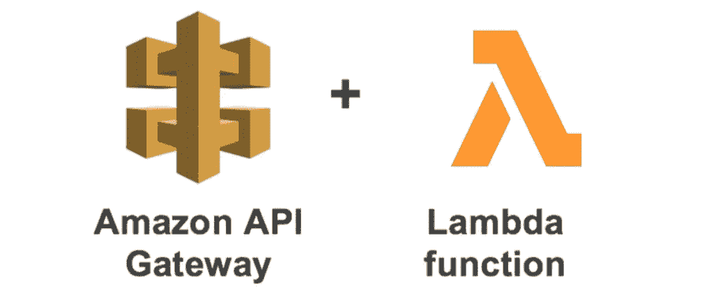
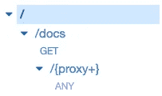

# 如何使用 AWS API 网关轻松创建 HTTP 301 重定向

> 原文：<https://itnext.io/how-to-easily-create-a-http-301-redirection-with-aws-api-gateway-2bf2874ef3f2?source=collection_archive---------1----------------------->



几周前，我重新编写了一个 lambda 函数来服务一个 swagger UI。这里有代码[https://github.com/sylwit/aws-serverless-swagger-ui](https://github.com/sylwit/aws-serverless-swagger-ui)。

# 用例

用例非常明确，你需要重定向的每个请求。

我需要这样做是因为网关限制，即{proxy+}资源的根不能包含在{proxy+}本身中

我的意思是如果你有下面的结构



/docs 不会包含在代理所针对的 lambda 中。我的建议是直接创建一个 301 from /docs to /docs/index.html。

同样，昨天在脸书的 AWS 小组，有人问如何创建从 URL 到另一个微服务的重定向。有些人谈论使用 DNS 没有帮助，有些人说创建另一个 lambda 来返回 301，这是可行的，但我们确实有一个更简单、更有效的方法来实现这一点。

# API 网关和模拟集成

解决方案非常简单。Api Gateway 支持不同的集成类型:AWS、AWS_PROXY、HTTP、HTTP_PROXY 和 MOCK。如果你想了解更多细节，这里有官方文档[https://docs . AWS . Amazon . com/API gateway/latest/developer guide/API-gateway-API-integration-types . html](https://docs.aws.amazon.com/apigateway/latest/developerguide/api-gateway-api-integration-types.html)

模拟集成是这个用例的完美匹配，因为它避免了我们必须编写一些代码，因为这只是一个配置问题。

下面是 terraform 代码，我们来分解一下。我假设您已经有了 API(AWS _ API _ gateway _ rest _ API . API . id)和 lambda(AWS _ lambda _ function . swagger _ lambda)

```
# create the resource /docs at the root of our api
resource "aws_api_gateway_resource" "api_docs" {
  rest_api_id = aws_api_gateway_rest_api.api.id
  parent_id   = aws_api_gateway_rest_api.api.root_resource_id
  path_part   = "docs"
}# create the method GET and assign it to the resource /docs
resource "aws_api_gateway_method" "api_docs" {
  rest_api_id   = aws_api_gateway_rest_api.api.id
  resource_id   = aws_api_gateway_resource.api_docs.id
  http_method   = "GET"
  authorization = "NONE"
}# create the mock integration which will returns the statusCode 301 on the previous method GET of the /docs
resource "aws_api_gateway_integration" "api_docs" {
  rest_api_id = aws_api_gateway_rest_api.api.id
  resource_id = aws_api_gateway_resource.api_docs.id
  http_method = aws_api_gateway_method.api_docs.http_method
  type        = "MOCK"
  request_templates = {
    "application/json" : "{ \"statusCode\": 301 }"
  }
}# create the method response and enable the header Location
resource "aws_api_gateway_method_response" "api_docs_301" {
  rest_api_id = aws_api_gateway_rest_api.api.id
  resource_id = aws_api_gateway_resource.api_docs.id
  http_method = aws_api_gateway_method.api_docs.http_method
  status_code = "301"
  response_parameters = {
    "method.response.header.Location" : true
  }
}# Fill the previous header with the destination. Notice the syntax of the location with single quotes wrapped by doubles.
resource "aws_api_gateway_integration_response" "api_docs" {
  rest_api_id = aws_api_gateway_rest_api.api.id
  resource_id = aws_api_gateway_resource.api_docs.id
  http_method = aws_api_gateway_method.api_docs.http_method
  status_code = aws_api_gateway_method_response.api_docs_301.status_code
  response_parameters = {
    "method.response.header.Location" : "'/docs/index.html'"
  }
}# create the wildecard sub resource of docs. ie /docs/*
resource "aws_api_gateway_resource" "api_docs_proxy" {
  rest_api_id = aws_api_gateway_rest_api.api.id
  parent_id   = aws_api_gateway_resource.api_docs.id
  path_part   = "{proxy+}"
}# configure the method you need
resource "aws_api_gateway_method" "api_docs_proxy" {
  rest_api_id   = aws_api_gateway_rest_api.api.id
  resource_id   = aws_api_gateway_resource.api_docs_proxy.id
  http_method   = "ANY"
  authorization = "NONE"
}# integrate your lambda to this resource
resource "aws_api_gateway_integration" "api_docs_proxy" {
  rest_api_id             = aws_api_gateway_rest_api.api.id
  resource_id             = aws_api_gateway_resource.api_docs_proxy.id
  http_method             = aws_api_gateway_method.api_docs_proxy.http_method
  integration_http_method = "POST"
  type                    = "AWS_PROXY"
  uri                     = aws_lambda_function.swagger_lambda.invoke_arn
}
```

瞧，只需几行配置就可以设置 HTTP 重定向。