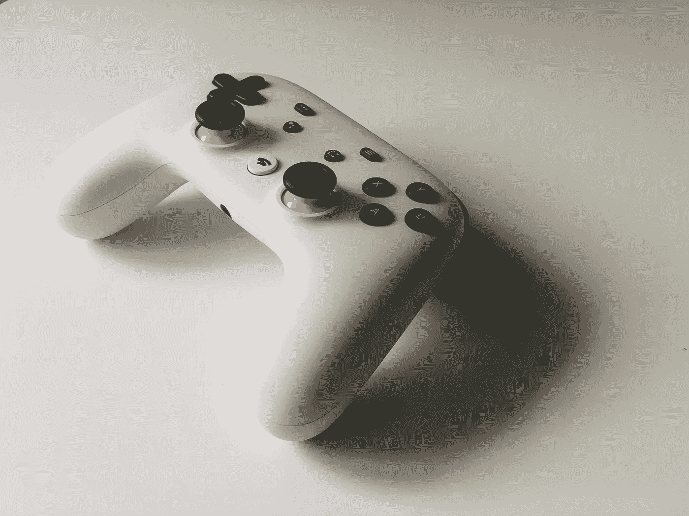

# 如何让 Stadia 在 iOS 上运行

> 原文：<https://itnext.io/how-to-get-stadia-running-on-ios-32495e1df2c1?source=collection_archive---------0----------------------->

克里斯蒂亚诺·平托在 [Unsplash](https://unsplash.com/s/photos/stadia?utm_source=unsplash&utm_medium=referral&utm_content=creditCopyText) 拍摄的照片

每个人都对苹果不允许在 Appstore 上提供 Stadia 这样的服务感到非常沮丧。这是一个很好的服务，应该允许在任何地方运行。

幸运的是，我已经找到了一个在你的 iOS 设备上运行 Stadia 的方法。今天我将解释它是如何工作的，并为你们提供一个可以修改的示例项目。

还可以创建一个自定义的控制器覆盖，这样您就可以在没有控制器的设备上玩游戏。

*注意:这个源码不好看。它可以作为概念的证明，供其他人借鉴。*

但首先，我们需要克服这些主要挑战；

*   我们只能从特定的浏览器访问 stadia，所以我们需要改变我们的用户代理，这样我们就可以访问 stadia 服务。
*   我们需要某种方式登录到我们的谷歌帐户，并重定向到体育场
*   WKWebView 有蹩脚的控制器支持，我们需要想出一个“更好的”方法来支持[游戏手柄 API](https://developer.mozilla.org/en-US/docs/Web/API/Gamepad_API/Using_the_Gamepad_API) 。

第一个问题很容易解决，我们检查允许访问 stadia.google.com 的设备的用户代理，并在我们的浏览器中复制特定的用户代理。

控制器是个难题。iOS 上的 Safari 支持 Gamepad API，但在我的设备上，它永远无法连接；如果有，它会随机停止工作。

我目前的解决方案是自己给 javascript 提供数据，劫持`Navigators.getGamepads()`函数并模拟一个控制器，这样我们就可以决定它何时连接/断开。

# 掌握控制权

首先，我们将制作一个模型，这样我们就可以像`Navigator.getGamepads()`函数通常所做的那样表示控制器。

你可以在这里找到官方规格

我们现在可以构建我们的自定义控制器脚本。我们可以使用苹果公司提供的`GameController`框架来读取我们的控制器。然后我们将它解析到我们的模型中。因为按钮需要按一定的顺序排列，我们用下面的方法来构造它。

**我们假设我们想要控制第一个连接的控制器，我们也只支持一个控制器。*

这段代码将受益于一些错误处理❤

在我的测试中，不需要`timestamp`，所以我将其留空。随意创建实现来完全模拟官方 API。我们已经准备好了控制器数据，剩下的就是在我们的 iOS 应用程序和运行 Stadia 的`WKWebView`之间建立一座沟通桥梁。

在 iOS14 中使用`WKWebView`，我们可以添加一个`addScriptMessageHandler`，这允许我们与 Javascript 通信并返回一个`Promise`，这将帮助我们劫持`Navigators.getGamepads()`函数并返回我们的自定义数据。

使用下面的 javascript，我们可以模拟一个假的控制器。我们劫持了这个方法。每次它被访问时，我们调用一个`messageHandler`，它将通过一个`Promise`给我们控制器数据，并覆盖最后一个已知的状态。(这意味着我们有一帧不同步，但我们在游戏中不会注意到这一点)

感谢我的朋友斯蒂芬·曼特尔帮我解决了这个问题

我们将创建一个类，其中包含一个可以加载文件(以字符串形式)的方法和一个可以设置 WKWebView 以便它可以运行我们的自定义代码的方法

这段代码将受益于错误处理❤

通常情况下，每当我们调用`setup(webview: WKWebView)`时，就会执行我们之前编写的 javascript，覆盖`Navigators.getGamepads()`函数。每当这个函数被调用时，我们现在调用我们的应用程序代码并进入`usercontentController`回调，在那里我们返回我们当前的控制器状态。

瞧，我们应该在任何`WKWebView`中有一个一致的工作控制器。

控制器支持费用

# 回到体育场

现在让 Stadia 工作已经不是很多工作了，我们首先创建一个带有`WKWebView`的`UIViewController`。在我的测试中，我们需要一个有效的 iOS 用户代理来登录我们的谷歌账户。使用自定义代理只需要访问 Stadia。幸运的是`WKWebView`覆盖了我们。

你想测试控制器吗？在加载请求之前，取消对该行的注释并调用 controller.setup(webview )!

我们创建了一个自定义配置，将我们的控制器添加为一个`ScriptMessageHandler`确保这个名称与前面 javascript 脚本中使用的名称相匹配！

使用`WKNavigationDelegate`我们可以检查我们当前是否已经登录，或者我们当前是否仍然忙于尝试登录。

是的，这不太好，我知道它适用于这个概念验证

每当我们登录时，我们会自动导航到 stadia，如果我们到了目的地，我们会启动 javascript magic，瞧，Stadia 在 iOS 上全屏运行，并有控制器支持。

在移动中玩杀手❤

这就是在 iOS 设备上玩球场游戏的有效解决方案。有一些事情可以做得更好，但核心功能在那里。

这触及了一个不同于我通常在媒体上所做的主题。这是一个很有趣的问题。

我在这里打开了回购:[https://github.com/Plnda/Gradia](https://github.com/Plnda/Gradia)如果你愿意，请提交任何公关，这样我们就可以在这个应用程序上合作

*在这里的* [*捏*](https://pinch.nl/en/) *，我们尝试让我们的应用变得更好。你有任何问题或评论吗？请在评论中告诉我们。*