# 如何在一个有根的模拟器上监听 app 的流量？

> 原文：<https://itnext.io/how-to-listen-apps-traffic-on-a-rooted-emulator-471a842e89bd?source=collection_archive---------2----------------------->

嘿！我认为会有相当多的人从事与应用程序相关的有趣工作。例如，流量分析，当然是为了测试这些应用！你有一个困难的负担——你需要调试雇主的应用程序的生产组件(但是还有别的方法吗？)——然后你开始寻找解决问题的方法。
而且一路上你会遇到很多问题。我正在写如何解决这些问题。

传统的方法是从安装一些 Charles 开始，在其中设置一个代理服务器，并尝试监听流量，但是我们很快就遇到了一个问题—所有合适的现代应用程序都使用 HTTPS，因此，您必须在您的设备上安装一个证书，这将允许您监听流量…这就是有趣的地方…

让我们创建一个清单来指导我们完成这一过程:

*   开始安装模拟器的准备工作
*   你在这里
*   安装模拟器
*   为 MITM 安装证书
*   检查监听流量的可操作性
*   失望
*   获取 root 访问权限
*   将证书传输到系统存储
*   失望(？)
*   SSL 取消固定
*   利润！！！

# 安装 Android 模拟器

我不会描述整个安装过程，我希望你可以做[所有](https://developer.android.com/studio/run/emulator)准备[步骤](https://developer.android.com/studio)发现自己处于这样一种情况，你只需在模拟器中选择某一类型的 OS，前面的所有步骤都已经完成。

所以:

1.  我们选择任何合适的选项，有一个重要的警告——它必须是一个没有 Google Play 的程序集，但有 Google Play 服务(后面会看到)。因此，我们选择没有三角形的设备

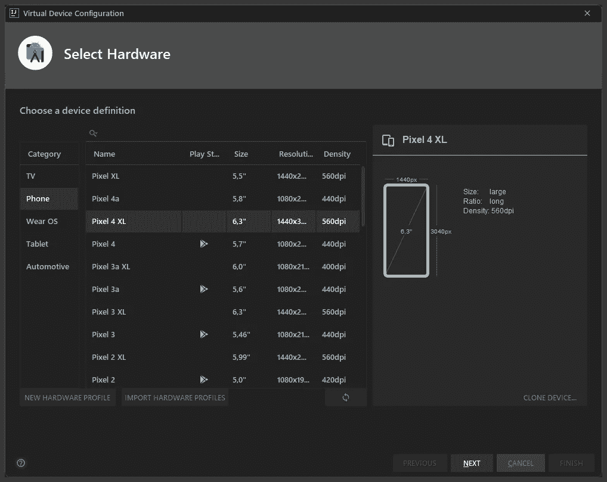

2.我们选择任何包含 Google Play APIs 的感兴趣的图片

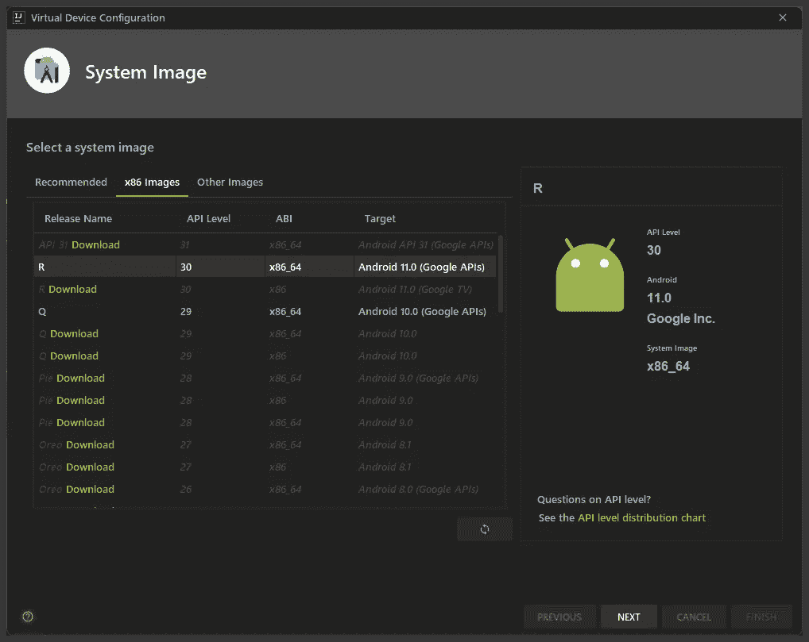

3.将冷启动参数设置为开

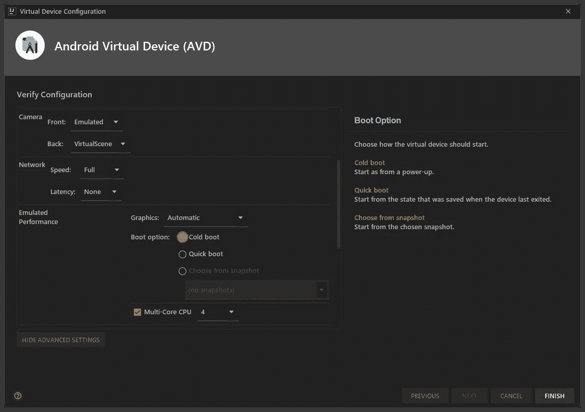

完成了！

*   安装模拟器

# 安装代理嗅探器证书

我将在任何地方使用 Fiddler 来监听流量。我将向您展示设置该软件的步骤，根据该步骤，我们将关闭路线图上的另一个项目。

*这里我要说一点离题的话——这个程序是付费的，甚至是订阅的，最好的情况下，每月 10 美元。但是，你将有 30 天的试用期，之后你需要更多的黄金，所以你可以使用任何其他工具。我尝试使用 Postman——它也有代理工具，但是，Postman 生成的根证书不适合安装在 Android 10/11 中。然而，支持服务已经提高了警惕，我希望，在分配的 30 天试用期内，一切都将正常工作(在 Postman 中),您将能够使用最方便的(从我的角度来看)工具来解决这个问题。出现这种情况，我会补充这篇文章。现在我们回到在设备(模拟器)上安装证书的过程。*

我们需要展开提琴手设置中的**高级设置**项，导出根证书。目前，我是一个 Windows 用户，在这个操作系统上，它会出现在桌面上，将鼠标悬停在问题图标上会显示一个提示。

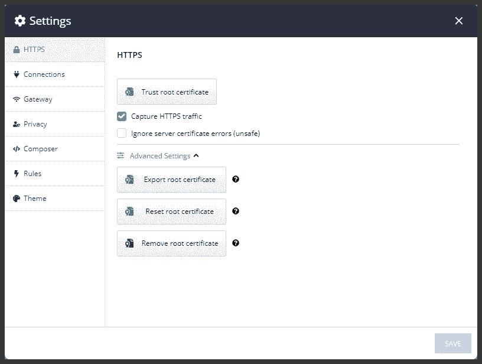

导出证书后，双手平稳地移动，将它传输到正在运行的仿真器中——文件将位于`.../Downloads`文件夹中。之后，您可以立即转到设置并安装我们的证书:

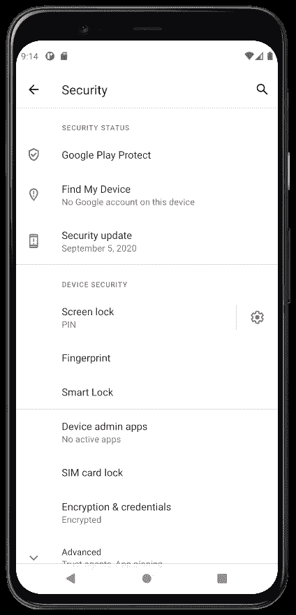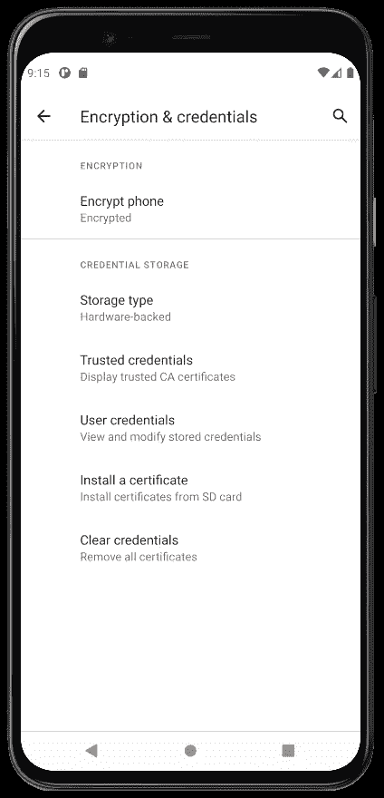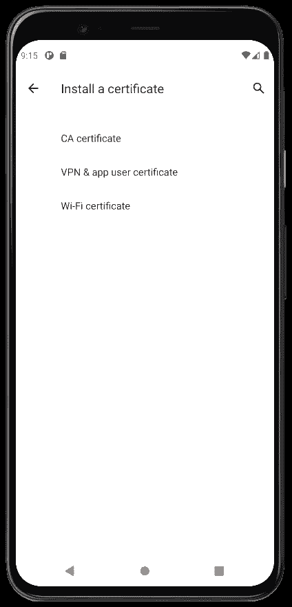

好吧。我们可以在另外一个项目旁边打勾:

*   为 MITM 安装证书

# 检查是否一切正常

是时候检查我们的努力是否至少产生了一些有用的结果了。今天实验的试验品是 Reddit 应用程序，如果我们尝试下载帖子，首先会看到:

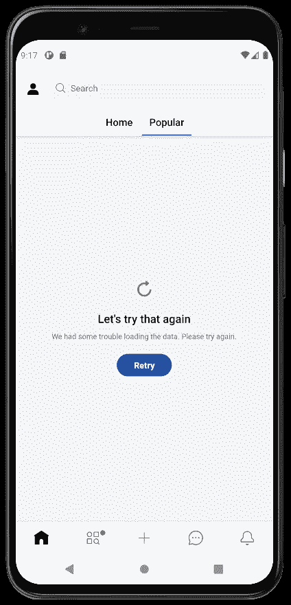

空虚。


还有 Fiddler 中无休止的 SSL 握手尝试。似乎是时候在我们路线图的两点上划一条横线了:

*   检查窃听的可操作性
*   失望

# 我是 root

在我看来，是时候告诉我们为什么我们甚至需要一个根了？这都是关于 Android 7 的臭名昭著的变化，在此之后，用户证书不再被信任。因此，我们需要对我们安装的证书做些什么，以便我们可以使用它来研究我们的工作应用程序的流量。而且这只有在你的设备是 rooted 的情况下才能做到。还有一个使用模拟器的原因，以及相关的功能:如果没有模拟器，你将不得不有一个持续的根设备，如果它是一个单独的专用智能手机，那么这是没有问题的(嗯，除了充电，逐渐过时和特定型号的限制)，但是，如果你有你的设备，那么根的缺点可能是显着的——不工作的安全系统，损坏的 Google Pay 或脱落的相机……嗯， 除此之外，模拟器使更改 Android 版本变得很容易(然而，您将不得不重复这里列出的所有操作，但是您已经有了这篇文章，并且我在没有它的情况下编写所有这些内容)。

现在让我们开始吧。多亏了精彩的[项目](https://github.com/newbit1/rootAVD)，整个过程简化为只运行一个脚本，只需要一点准备工作。另外，注意控制台中显示的内容，如果您使用的是 Windows，那么不要运行`.sh`，而是运行`.bat`。也许 WSL 在这里会派上用场，但是我的系统，比方说，有一些 WSL 不允许使用的功能(如果你知道如何在锐龙 5000 系列上同时获得 WSL 和 Android 模拟器，那么请写一篇评论)…

这是作品本身:

```
./rootAVD.sh ~/Library/Android/sdk/system-images/android-30/google_apis/x86_64/ramdisk.img
```

此外，您需要重新启动模拟器。对于 Windows 用户来说，图像的路径应该是这样的:

```
C:\Users\Me\AppData\Local\Android\Sdk\system-images\android-30\google_apis\x86_64\ramdisk.img
```

在输出中，我们得到一个根，当仿真器重新启动时，它被保存，但是您不应该进行擦除。

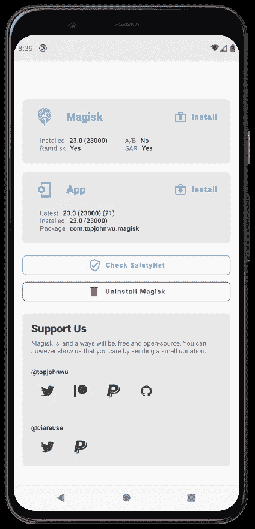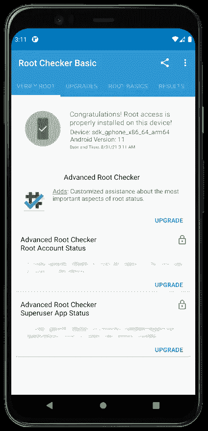

我们放了一只破晓:

*   获取 root 访问权限

# 使证书可信

为此，我们需要将它转移到信任存储中。这里我们需要根(不仅在这里，以后也是)。

为此，我们运行以下命令链:

```
adb shell
su
mkdir -m 700 /data/certs
cp /system/etc/security/cacerts/* /data/certs/
mount -t tmpfs tmpfs /system/etc/security/cacerts
cp /data/misc/user/0/cacerts-added/* /system/etc/security/cacerts/
mv /data/certs/* /system/etc/security/cacerts/
chown root:root /system/etc/security/cacerts/*
chmod 644 /system/etc/security/cacerts/*
chcon u:object_r:system_file:s0 /system/etc/security/cacerts/*
```

然后我们在系统证书中看到下图:

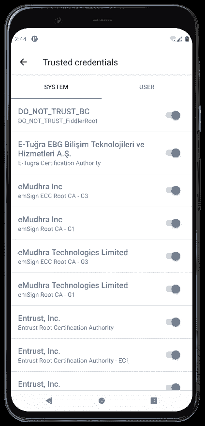

我们的证书已成为系统证书，因此我们将关闭另一个项目:

*   将证书传输到系统存储

让我们马上检查我们的应用程序:

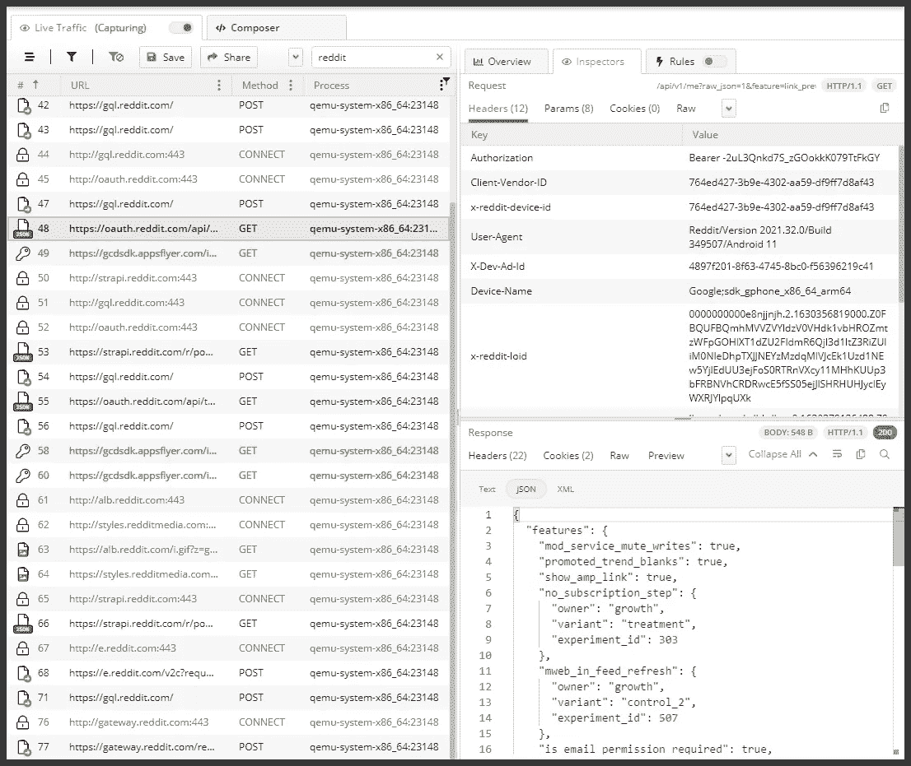

好吧。现在我们可以收听 HTTPS 交通的任何(或？)来自仿真器的应用程序。让我们尝试另一个应用程序— **Avito** 来巩固结果(这是一个在人与人之间销售东西的俄罗斯应用程序)。

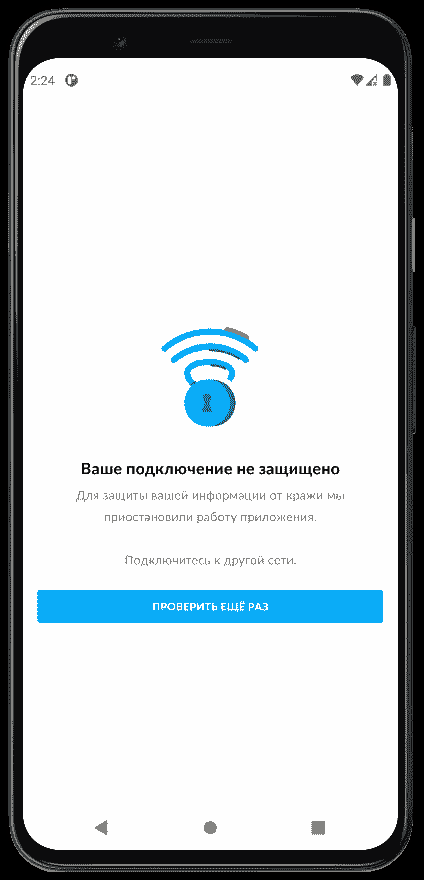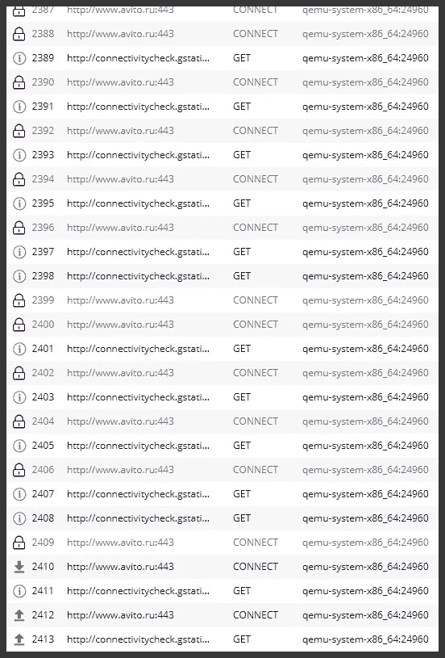

这里好像出了点问题。不过，你已经什么都知道了，既然你一开始就看到了一个巨大的剧透，所以我们再放一个 daw:

*   失望！

# SSL-取消固定

这个主题有许多解决方案，但是，通常来说，它们都围绕着一个想法——重新构建您想要研究的应用程序。这种方法非常麻烦、复杂，并且会导致拖延，因此需要某种东西来使一切变得更简单、更通用。这个东西的配方就在这里，免费而且没有短信:

1.  由于 root 的存在，安装 Xposed
2.  感谢 Xposed，我们将安装解除 SSL 绑定的模块
3.  利润！！！(这两点看起来很无趣)

现在我们按顺序来。

# 安装 x 曝光

考虑到我们最初的计划是监听仿真器上的所有内容和每个人，这一步出现了一些困难——我们需要选择能够在仿真器上工作的软件解决方案的成功组合。由于这篇文章，你将不必花几个小时寻找这些解决方案，只需遵循一个简单的指示:

1.  下载最新版本的 Magisk 模块，并通过 Magisk 安装
2.  关闭模拟器，然后再次运行它(这一步模拟重新启动，由于某种原因，对我不起作用，如果对你起作用，可能就足够了)
3.  在 Magisk 存储库中找到一个名为`Riru - LSPosed`的模块并安装它
4.  再次重启模拟器
5.  打开 LSPosed 应用程序，您需要在其中安装 x posed-module sslunping
6.  我们在这个模块的设置中为所有我们想听的应用程序切换所有寒鸦，并激活模块本身
7.  重启模拟器

之后，您会发现自己处于这样一种情况，您有一个仿真器，它具有:

*   完整根目录(Magisk)
*   在用户空间安装 MITM 证书
*   已安装 x 已展示(已展示)
*   已安装的 SSL 模块-取消固定

在这个过程中，有如下一组图片:

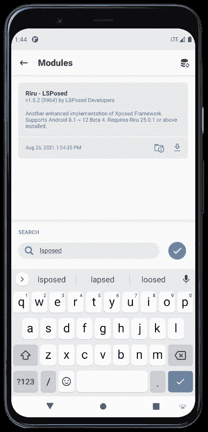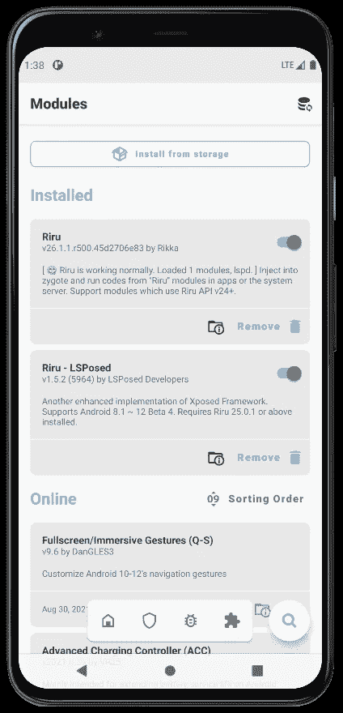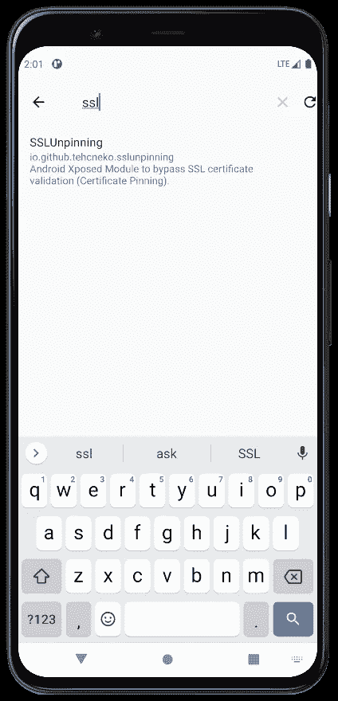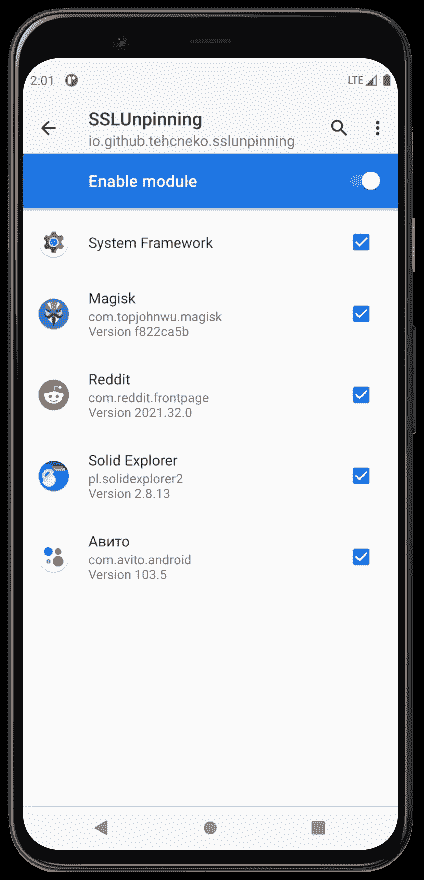

你可以诚实地选择:

*   SSL 取消固定

是时候检查这台机车是否运转了:

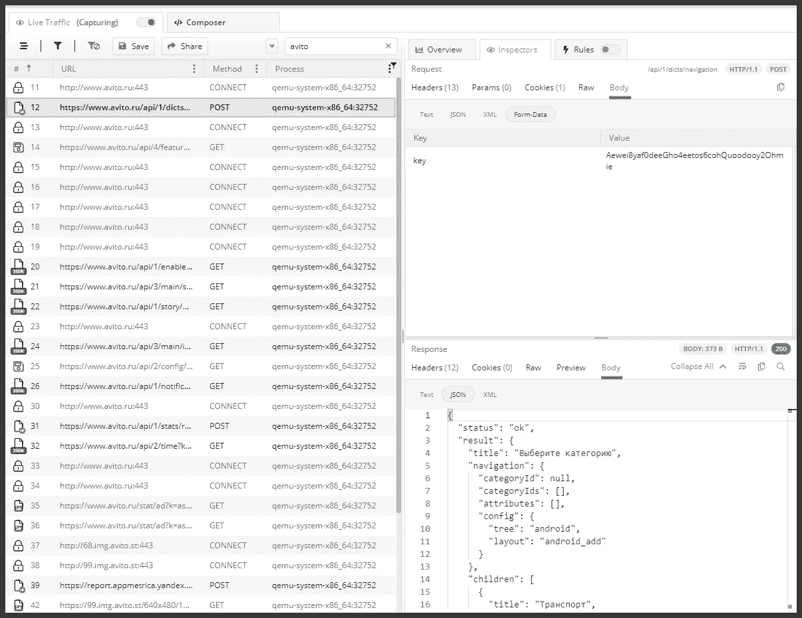

作品！我们也可以把最后一个复选框:

*   利润！！！

有哪些细微差别？首先，每次模拟器打开时，都需要再次使证书可信(原则上，在所有这些过程之后，您可以禁用**冷启动**，然后您将不必这样做，但迟早您将不得不“硬”重启模拟器，然后您将不必使用证书)。也许这里有一个永久的解决方案，或者在最坏的情况下，它可以自动化，但我累了。其次，原则上不是所有的应用程序都想在模拟器上运行。最可靠的选择是拥有一套运行不同版本 Android 的专用手机，所有这些手机都将拥有本手册中的全部工具(略有改动)，但这并不总是可能的。

最后，我将再次逐点复制整个指令，这样算法本身就很清楚了:

*   准备(安装 Android Studio)以安装/运行仿真器
*   用上面定义的参数安装模拟器
*   我们通过拖放光标在模拟器上安装我们感兴趣的应用程序，并确保它们在原则上工作，所有这些都不会是徒劳的
*   按照上面的说明获取 root (Magisk)
*   重启模拟器
*   安装 Riru
*   重启模拟器
*   安装建议
*   重启模拟器
*   安装暴露的模块 SSLUnpinning
*   我们把所有的寒鸦放在我们感兴趣的应用程序和模块本身的模块中(打开它)
*   关闭模拟器
*   关闭冷启动
*   打开模拟器
*   在用户空间安装 MITM CA-certificate(只安装)
*   我们根据上面的说明使证书可信
*   我们根据上面指定的参数或您自己的参数(取决于您要使用哪种流量分析工具)在模拟器上配置代理
*   分析应用程序的运行

如果您在模拟器上安装额外的应用程序，那么您需要在 SSLUnpinning(通过 LSPosed)中将 Daw 放在它们前面，并硬重启模拟器，然后在重启后修复证书。在这，一切，直到我们再次见面！