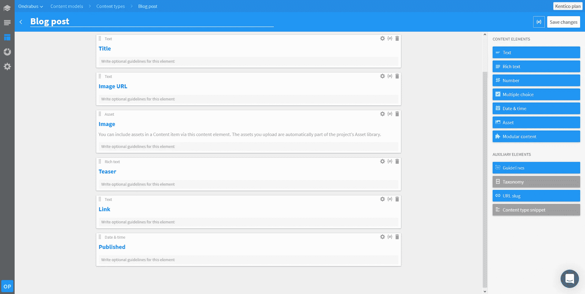
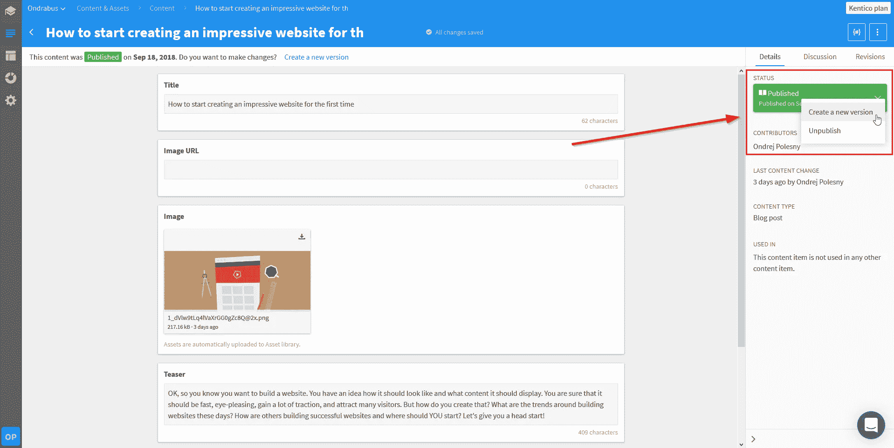
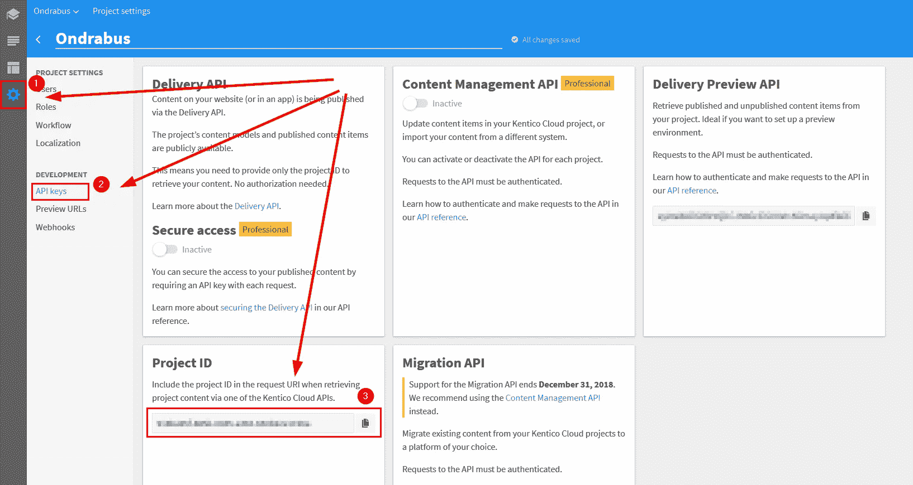
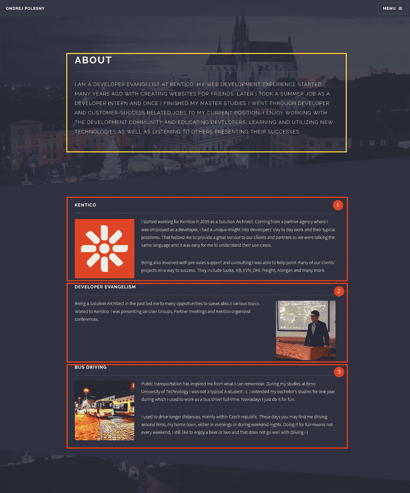
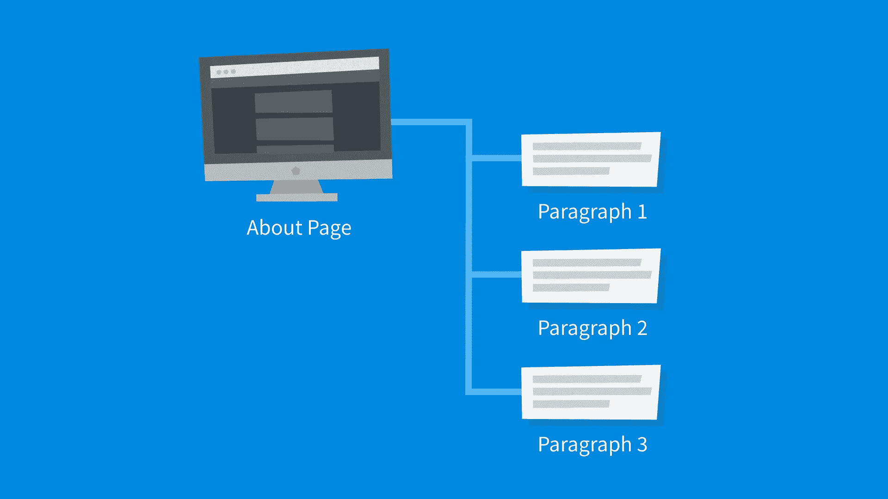
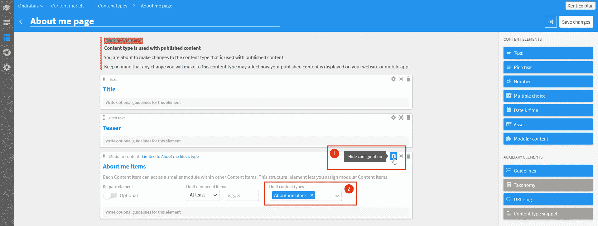
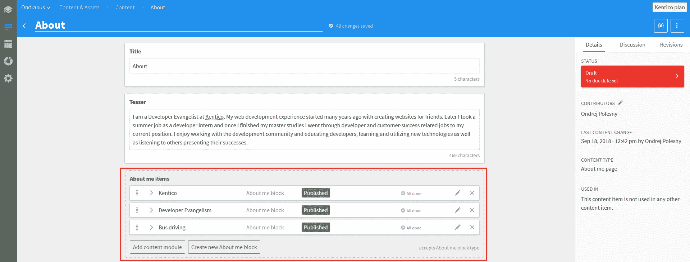

# 如何把无头 CMS 和一个 Vue.js 网站混在一起，零付费

> 原文：<https://itnext.io/how-to-mix-headless-cms-with-a-vue-js-website-and-pay-zero-770cbb0b1442?source=collection_archive---------3----------------------->


我们有一个 Vue.js 网站，上面有一些组件和路线。目前，内容在组件定义中被定义为简单的数组，但是这使得编辑和其他非技术用户的调整变得复杂。这也让我们很不舒服。每当需要小的内容更改时，谁想访问 FTP 或 Git 来更新物理文件呢？

在以前的文章中，我描述了如何开始创建一个网站，如何选择正确的前端框架，以及如何将网站设计分成组件，并使其动态和独立。现在是开始与外部服务合作的时候了。在云中存储内容是每个现代网站的重要组成部分。好处包括:

*   **管理界面**
    漂亮的防 UX 界面，用于管理您不需要自己实现的内容。
*   **灵活性**
*   **云**
    你不需要担心托管内容的任何方面(包括图片和媒体)。通过 API 消费就可以了。
*   **可扩展性**
    如果你的网站吸引了大量的访问者，内容服务会自动处理，你的网站仍然可以访问。
*   **CDN**
    一些内容服务利用内容交付网络来交付内容。这可以确保访问者从离他们最近的服务器上获取内容。
*   **SDK**
    一些内容服务提供了能够轻松消费内容的框架。这意味着我们将只调用一个方法来获取正确的内容，而不是用 REST API 调用来弄脏我们的手。

还有很多。这完全取决于服务提供商。

这种类型的内容服务被称为无头 CMS。无头，因为网站的头在你的应用里。你决定将哪些服务连接在一起，以形成一个工作的现代网站。显然，有许多无头 CMS 系统，你需要选择一个适合你的需求。像我一样把它们写下来:

*   **将内容存储在我自己的内容模型中** 我有博客帖子，关于我的段落也需要定义顺序，将来可能会有一些其他数据类型。所以我需要能够以多种方式定义这些内容模型。
*   **基于云的**
    我想让我的网站尽快运行起来。因此，我正在寻找一个在云中运行的服务，我只需要注册并开始使用它。
*   我的网站是使用 Vue.js 构建的，所以我需要一个 JavaScript SDK 来轻松地从 headless CMS 收集内容。
*   免费计划

虽然我没有展示任何 GDPR 的敏感数据，也没有跟踪访问者的行为，但从我的经验来看，我知道几乎所有的公司都需要考虑将内容存储在哪里。也就是服务器及其数据所在的物理位置。如果是这种情况，请将“**托管在欧盟数据中心**”添加到您的列表中，并确保您选择了正确的无头 CMS，使您能够选择欧洲数据中心。

上面提到的所有要点都让我想到了 [Kentico Cloud](http://bit.ly/2QzUALM) 。它提供了极大的灵活性，以软件即服务的形式提供，提供了一个 JavaScript SDK，对于小型项目是免费的。

内容模型就像是数据的模板。如果您阅读了我以前的文章，那么当您定义组件的数据时，您已经创建了这些模型。让我们再次看看我的博客帖子列表的 Vue.js 组件。

```
Vue.component('blog-list', {
 props: ['limit'],
 data: function(){
 return {
 articles: [
 {
 url: 'https://medium.com',
 header: 'How to start creating an impressive website for the first time',
 image: 'https://cdn-images-1.medium.com/max/2000/1*dVlw9tLq4lVaXrGG0gZc8Q@2x.png',
 teaser: 'OK, so you know you want to build a website. You have an idea how it should look like and what content it should display. You are sure that it should be fast, eye-pleasing, gain a lot of traction, and attract many visitors. But how do you create that? What are the trends around building websites these days? How are others building successful websites and where should YOU start? Let’s give you a head start!'
 },
 …
 ]
 }
 },
 template: `
 <section class="features">
 <article v-for="article in articles">
 <a :href="article.url" class="image">
 
 </a>
 <h3 class="major">{{article.header}}</h3>
 <div v-html="article.teaser"></div>
 <a :href="article.url" class="special">Continue reading</a>
 </article>
 </section>
 `
 });
```

注意文章的排列。每篇文章都有以下字段:

这些是定义我的“博客文章”内容模型的字段。我们总是需要告诉 headless CMS 我们希望用哪种形式来存储内容。还有一个额外的字段， *Published* ，它没有在上面的列表中提到，因为它没有直接显示在我的网站上。然而，我需要使用该字段来订购博客文章，因为我的主页列出了前 4 篇最新文章。

我登录到 [Kentico Cloud](http://bit.ly/2E6W2TC) 并切换到内容模型选项卡，我这样定义我的博客文章内容模型:



您会看到图像有两个字段。我希望能够将博客文章图像直接存储在 headless CMS 中，或者引用第三方服务器上的图像。我添加了两个字段，根据哪个字段包含一个值，我会在现场显示图像。

一旦创建了内容模型，就该添加内容了。在*内容&资产*选项卡上，我添加了四篇发表在各种渠道上的博客文章:


在我的项目中(这也是默认设置),所有内容项目都被分配到默认的内容工作流，这样我就可以在不意外地在我的网站上发布草稿内容的情况下处理它们。与此同时，我已经发表了所有的博客文章，所以当我打开其中任何一篇的细节时，它们都不能被直接更改。相反，我可以创建允许我编辑的内容的新版本，但仍然保持已发布的版本，直到我准备好再次发布。或者，可以取消发布内容项并直接对其进行操作。



让我们回到代码上。正如我之前提到的， [Kentico Cloud](http://bit.ly/2QzUALM) 提供了一个 [JavaScript SDK](http://bit.ly/2xJHK5V) ，这使得消费内容变得非常容易。在 *components.js* 和 *app.js* 文件之前添加以下标记。我们不需要将 SDK 的库添加到`<head>`部分，因为我们只需要它用于 Vue.js 组件。

```
<script type="text/javascript" src="https://unpkg.com/kentico-cloud-delivery@latest/_bundles/kentico-cloud-delivery-sdk.browser.umd.min.js"></script>
```

SDK 包含 DeliveryClient 类，该类提供来自 Kentico Cloud 的内容。在定义第一个组件之前，在 *components.js* 中实例化它:

```
var deliveryClient = new DeliveryClient({
 projectId: '{your project ID}'
});
```

您将在设置选项卡上的 [Kentico Cloud](http://bit.ly/2QzqAyI) 中找到您的项目 ID。



之前我向你展示了我如何设计我的*博客*内容模型，以及我如何创建几个*博客*内容项目。因此，我还将向您展示如何将这些帖子收集到我的博客列表组件中。

首先，我们不再需要在组件数据桶的数组中定义数据。相反，我们可以利用 Vue.js 在创建组件时自动调用的`created`函数。在这个函数中，我们可以指示`deliveryClient`为这个组件获取正确的内容。实现可能如下所示:

```
created: function(){
 var query = deliveryClient
 .items()
 .type('blog_post')
 .elementsParameter(['link', 'title', 'image_url', 'image', 'teaser'])
 .orderParameter('elements.published', SortOrder.desc)
 .getPromise()
 .then(response =>
 this.$data.articles = response.items.map(item => ({
 url: item.link.value,
 header: item.title.value,
 image: item.image_url.value != '' ? item.image_url.value : item.image.assets[0].url,
 teaser: item.teaser.value
 }))
 );
}
```

开始时，我定义了我想要获取类型为`blog-post`的项目。这是我之前定义的*博客*内容模型的代号。您可以在内容模型编辑窗口中的哈希下找到它:


然后我指定了所有我想使用的字段。这是一个可选步骤，但我总是这样做，因为它确保响应的大小最小——它将只包含我在各个组件中使用的数据元素。您可以在每个字段上显示的同一个哈希按钮下找到字段的代码名称。

接下来，我按照发布日期对博客文章进行了排序，因为我希望最新的文章放在页面的顶部。注意，这个发布日期只是*博客*内容模型的另一个字段，我需要为每篇博客文章指定它。在这种情况下，内容项目在 Kentico Cloud 中发布的日期和时间无关。

最后，我得到了承诺对象。Promise 对象支持延迟解析。您看，`deliveryClient`需要在内部构造 REST API 调用，并从云中收集内容。这就是为什么我们需要在进一步处理之前等待一段时间。Promise 允许我们用`.then()`方法做到这一点。在这里，我需要提供一个从 Kentico Cloud 对象到 Article 对象的映射函数，就像我前面在静态数组中定义的那样。我需要做这个映射，因为我的模板是建立在文章对象定义之上的。这个实现确保了旧的文章阵列现在被从 [Kentico Cloud](http://bit.ly/2QzUALM) 收集的动态内容所取代。

也许你已经注意到我在我的两个页面上使用了博客文章组件——主页和博客页面。主页上只显示了 4 篇最新的博客文章，但是我把它们都显示在博客页面上了。这就是为什么我之前介绍了博客列表组件的*限制*属性。

```
Vue.component(‘blog-list’, {
 props: ['limit'],
 data: function(){
 …
```

上面显示的`created`函数的实现还不尊重这个属性，所以我需要做一点调整:

```
created: function(){
 var query = deliveryClient
 .items()
 .type('blog_post')
 .elementsParameter(['link', 'title', 'image_url', 'image', 'teaser'])
 .orderParameter('elements.published', SortOrder.desc);

 if (this.limit)
 {
 query = query.limitParameter(this.limit);
 }

 query
 .getPromise()
 .then(response =>
 …
```

代码的其余部分将是相同的。看看使用 [JavaScript SDK](http://bit.ly/2xJHK5V) 进行内容交付是多么容易。不需要复杂的 REST API 调用，只需要定义你想要什么，以及你想要如何处理它。

如果您开始使用一个 headless CMS，您将很快发现一个内容结构，其中您需要定义与任何字段或时间戳无关的项目顺序。对我来说是关于佩奇的。有三个小段落已经定义了顺序，但它们需要单独添加，因为我可能需要在将来添加/删除它们。



还要注意黄色突出显示的区域。这个文本只出现在关于页面，我需要能够从无头 CMS 调整它。因此，我决定使用以下结构:



当您想要创建这样的结构时，您会发现*模块化内容*字段类型非常有用。它使您能够在其他项目中添加项目，即嵌套它们。我的“关于”页面包含两个简单的字段— *标题*和*摘要* —您可以在上面的黄色区域看到。第三个字段*是关于我的项目*的类型*是模块化内容*并且用作子内容项目的容器。默认情况下，编辑者可以将任何类型的内容项目添加到该字段中。在我的例子中，这不是我想要的，所以我配置了这个字段，只允许*关于我阻止*内容项。*关于我块*内容模型包含*标题*、*文本*和*图像*字段。



让我们也来看看类型为*的关于我的页面*的实际内容项是什么样子的:



所有三个段落现在都作为子内容项添加到该字段中。通过拖放、删除或新建项目，可以轻松地对它们进行重新排序。这些项目的顺序与`deliveryClient`交付项目的顺序相同。

显示这些段落的组件的模板将非常类似于 blog posts 组件。我将重点介绍*创建的*函数的实现。

```
created: function(){
 deliveryClient
 .items()
 .type('about_me_page')
 .elementsParameter(['title', 'teaser', 'image', 'about_me_items'])
 .depthParameter(2)
 .getPromise()
 .then(response =>
 this.$data.articles = response.items[0].about_me_items.map(item => ({
 header: item.title.value,
 teaser: item.teaser.value,
 image: item.image.assets[0].url
 }))
 );
}
```

交付客户端现在只交付类型为`about_me_page`的项目。但是，请注意`depthParameter`规范。通过这种方式，我告诉`deliveryClient`它也应该获得顶级物品的子物品。在映射函数中，可以看到我没有使用顶层条目(`response.items[0]`)，而是使用了它的子条目(`response.items[0].about_me_items`)。这样我就可以获得*中关于我的段落，阻止*项。

使用`deliveryClient`使我们能够轻松地从 Kentico Cloud 收集内容。到目前为止，我描述的所有操作都集中在在[headless CMS Kentico Cloud](http://bit.ly/2QzUALM)中创建内容，并在一个实时站点上显示它。您会看到, [JavaScript SDK](http://bit.ly/2xJHK5V) 使得为每个组件收集正确的内容变得非常容易，并支持进一步的数据处理。用`deliveryClient`连接 Vue.js 使得创建动态组件变得非常愉快，因为它不需要花费大量的开发时间就可以工作。

在大多数网站上，也有让访问者输入数据的组件，比如联系方式。在我的下一篇文章中，我将向你展示如何解决这个问题。再说一遍，不花一分钱！

## 该系列的其他文章:

1.  [第一次如何开始创建一个令人印象深刻的网站](http://bit.ly/2Duglu1)
2.  [如何为你的网站决定最好的技术？](http://bit.ly/2N0kXY4)
3.  [如何用 Vue.js 和最少的努力给你的网站加电](http://bit.ly/2zLRE8a)
4.  **如何把无头 CMS 和一个 Vue.js 网站混在一起，零付费**
5.  [如何在 API 网站上安全提交表单](http://bit.ly/2P0gidP)
6.  用 CMS 建立一个超级快速安全的网站没什么大不了的。或者是？
7.  [如何用 Vue.js 快速生成静态网站](http://bit.ly/2PN46Jy)
8.  [如何快速建立静态站点的构建流程](http://bit.ly/2Dv2UGS)