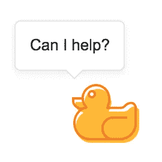

# 如何阅读代码？

> 原文：<https://itnext.io/how-to-read-code-bf478c262932?source=collection_archive---------0----------------------->

代码起初可能看起来很模糊，但是当你开始连接这些部分时，你会看到它。

# 背景

作为开发人员，我们大部分时间都在阅读和试图理解别人的代码。特别是在咨询行业，你被介绍给几个具有大型现有代码库的企业解决方案，在那里你现在是维护者，期望在你没有编写的代码的时间线上提供可交付的东西。即使对于最有经验的开发人员来说，这也是一个挑战，您需要良好的代码浏览技能来理解代码。

通过利用我将在本文中介绍的一些流行的代码浏览技术，您将很快了解处理大型现有代码库所需的一切。

# 问题是

在理想世界中，所有的代码都将被很好地编写、文档化、结构化和可理解地测试，既有自动化工具，如单元测试，也有端到端测试。

然而，我们并不是生活在一个理想的世界里。我们生活在现实世界中，代码永远不会消失，程序员来来去去，这导致人们花费大量时间阅读代码。这使得理解不熟悉的代码变得更加重要。可能比写代码更重要。

不幸的是，这种技能在学校里普遍缺乏教育，在业界也没有得到很好的认可，这导致人们把程序当成书来读，试图把拼图的每一块都连接起来。

这不是正确的心态。你不想去想你不了解的东西的范围，而是，逐渐开始连接这些片段，直到它们适合。

# 解决方案

那么，当你面对一个全新的代码库时，你会怎么做呢？

需求收集通常是任何大型项目的第一阶段，与系统的潜在用户交谈总是其中重要的一部分。为了修复程序，你首先需要理解它试图解决的问题。事情以某种方式进行通常是有原因的。记住。处理其他人的代码是常态，而不是例外，变得熟练并弄清楚其他程序员是如何工作的是其中重要的一部分。通过在继续他们的工作时采用他们的风格，你也可以让下一个开发人员更容易跟随。

## 探索范围

当我们了解了应用程序开发的目的和风格后，就该开始分解了。我们需要把事情缩小到我们可以实际处理的范围。通过理解软件中的各种组件，以及它们之间的相互关系，你将开始弄清楚不同的部分是如何连接的，并开始从整体上理解代码库。

## 分解事物

那么，我们如何开始分解事物呢？社区强烈建议的一种方法是在触发与您相关的行为的方法上设置断点。如果更改一行代码会导致其他地方发生意外的更改，那么在那一行上放置一个断点，看看会发生什么。一旦断点命中，您就有了很多关于运行时状态的信息。断点在某一行停止代码的执行，从那里，您可以从 stacktrace 中看到代码是如何到达那里的。使用单步执行和单步执行函数来查看不同方法的作用以及事件在应用程序中是如何传播的。这将教你一些关于代码库的结构。

## 书签

我最近开始采用的另一种方法是在方法之上添加某种书签，它触发影响我正在探索的功能性的行为。这将指导您完成调试过程，并减少反复搜索方法所花费的时间。

*可以在这里* *查看 VS 代码书签扩展* [*。*](https://marketplace.visualstudio.com/items?itemName=alefragnani.Bookmarks)

## 写作和理解测试

我还需要提到的另一件事是测试的重要性。因为尽管它们很少见，但它们是学习特定代码单元要做什么的重要资源。通过阅读和编写测试，您将开始理解程序的预期行为，然后可以将其与实际结果进行比较。

你构建的越多，你就越有信心你添加的代码不会破坏其他东西。

# 摘要

*   首先收集关于程序应该解决哪些问题以及应该采用哪种代码风格的信息。
*   不要一开始就把所有的时间都花在搞清楚一切是如何运作的。把事情缩小到你可以实际处理的范围。
*   使用调试器单步调试与您相关的行为。堆栈跟踪有很多关于事件如何在应用程序中传播的信息。
*   尽管测试很少见，但它是一个很好的文档工具，是对新代码库的很好介绍。

最后，我真的希望你能分享你处理陌生代码的最佳方法。这是一个被广泛讨论的话题，这里没有蓝图。

只是不要把所有的时间都花在向一只橡皮鸭解释你的问题上。人们会认为你疯了😉