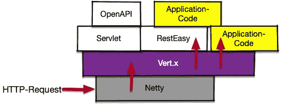

# 如何在 Quarkus 中重写 HTTP-Request-Paths

> 原文：<https://itnext.io/how-to-rewrite-http-request-paths-in-quarkus-aa85c3400d95?source=collection_archive---------7----------------------->

在我们的项目中，我们有一个 REST-Api 监听 *BASE_PATH/v1.0/resource* 。现在人们也想通过调用 *BASE_PATH/v1/resource* 来访问这个。这篇文章向您展示了如何在没有额外外部工具的情况下在 [Quarkus](https://quarkus.io/) 中实现这一点。


Gerald Schmidtkunz auf Pixabay

Quarkus 内部构建了许多技术，其中一项是 [Eclipse Vert.x](https://vertx.io) 。 [Vert.x Web 路由器](https://vertx.io/docs/vertx-web/java/#_basic_vert_x_web_concepts)(及其包含的 Netty)提供了 HTTP-stack 的较低层，其他层如 OpenAPI servlet 或 RestEasy for JAX-RS 构建于其上。这意味着，每个传入的 HTTP 请求都会通过 Vert。x 在它被分派之前。



通过堆栈的 HTTP 请求方式

如果你看了上面的内容，那么很明显 Vert.x 是进行这种重写处理的地方(它可以是 Netty，但是虽然 Netty 很强大，但它也太低级了，无法处理；Vert.x 在那里做了很多繁重的工作，是做这件事的最佳层)。

Vert.x 提供了所谓的 RouteFilters，可以插入内部转发路径。这些过滤器只是 Vert.x 路由处理程序的特殊类型，其中完成工作的方法用*io . quar kus . vertx . web . route filter .*注释

```
**@RouteFilter**(400)                             //  (1)
void myRedirector(RoutingContext rc) {
  String uri = rc.request().uri();            //  (2)

  if (uri.startsWith("*BASE_PATH/v1/"*)) {       //  (3)
    String remain = uri.substring("*BASE_PATH/v1/"*.length());  // (4)

    rc.**reroute**("*BASE_PATH/v1.0/"* +remain);     //  (5)
    return; // <-- This is important here
  }
  rc.next();
}
```

在(1)中，我们需要给过滤器一个优先级；较高的数字意味着该筛选器比优先级较低的筛选器更早被调用。在②中我们确定了请求——URI。如果它匹配我们想要重写的前缀(3)，我们确定 URI 的剩余部分(4)，它也包含查询参数等。在(5)中，我们用新的 URI 调用 route()，通知 Vert.x 它应该进行重写。记住不要在之后调用 *rc.next()* 很重要，因为这会混淆 Vert.x。

## 结论

[Vert.x web 路由器](https://vertx.io/docs/vertx-web/java/#_basic_vert_x_web_concepts)是 Quarkus 中的逻辑点，用于独立于更高层中使用的应用程序框架来修改 HTTP 请求。你也可以在反应路线指南中阅读更多关于 [Quarkus 和 Vert.x 的相互作用。](https://quarkus.io/guides/reactive-routes)