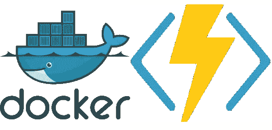

# 如何在 Visual Studio 的 docker-compose 中运行 dockerized Azure 函数

> 原文：<https://itnext.io/how-to-run-a-dockerized-azure-function-within-docker-compose-in-visual-studio-8958e912d3fa?source=collection_archive---------0----------------------->



如果您正在使用 Docker 和 Visual Studio，那么您很可能也在使用 Visual Studio 快速模式容器工具。在容器化的环境中进行快速开发是一种非常方便的集成，类似于一个合适的容器在生产系统中的表现。

如果您正在一次开发多个容器，您可能还会使用 VS 提供的同样惊人的 docker-compose 设置。

这一切都很棒，您可以快速调试自己的服务，甚至可以轻松集成常见的外部容器，如 rabbitmq、sql 或 seq。

然而，**还没有**起作用的是添加一个容器化的 Azure 功能。虽然 Azure 函数支持容器工具，但还不能将其添加到 docker-compose 项目中。

当然，你可以像任何其他服务一样，手动将其添加到 docker-compose.yml 中，但这样你将缺少调试等功能。—当然，除非您安装了远程调试器。

但是，有一种方法可以使它成为第一流的，只需一个小的变通方法，就可以在 docker-compose 网络中调试您的函数，以解决 DNS 解析问题，并且所有这些都在从 VS 中启动/停止调试的常规范围内。

# 怎么做

我是这样做的:

在 Visual Studio 中，在解决方案资源管理器中右键单击您的解决方案，转到“属性”,在“启动项目”部分，选择“多个启动项目”,并将您的 docker-compose 项目以及您各自的 Azure Function 项目设置为“启动”

现在我们需要创建一个 docker 网络，您的 compose 项目和函数将在其中运行，这样服务名 DNS 解析就可以在您的函数容器和 compose 服务之间工作。
我们通过 docker cli 来实现这一点。以下是命令:

```
docker network create yournetworkname
```

当然，*你的网络名*在这里由你决定。

现在，导航到。azure 函数项目的 csproj 文件。在 PropertyGroup 标记中，为了一致性，最好是已经包含由 VS 生成的 docker 设置的标记，我们需要添加另一个标记:

```
<DockerfileRunArguments>--network yournetworkname --network-alias yourservicename</DockerfileRunArguments>
```

当然，同样在这个例子中，用您在步骤 2 中选择的名称替换您的 networkname。此外，yourservicename 将是网络别名，通过它，容器网络中的 DNS 解析将起作用，因此在这里选择适合您的容器的名称。

csproj 文件到此为止，现在就去你的 docker-compose.yml 吧。我们现在需要声明各自的网络，方法是将这个部分添加到 docker-compose 文件中:

```
*networks:* yourcomposenetworkname*:
    external:
      name:* yournetworkname
```

这将把您的 networkname 声明为 docker-compose 设置的外部网络，并在 compose yaml 中使用您的 composenetworkname 的别名。如果您愿意，您可以在这里更改内部别名，但为了保持一致，我只是将两个网络命名为相同的名称。

快到了。我们现在需要做的就是将新网络添加到 docker-compose.yml 文件中声明的所有服务中。我们通过在需要的任何地方将它添加到 networks 属性中来做到这一点。

```
services:
  serviceone:
    ...
    **networks:
      - yourcomposenetworkname**
  servicetwo:
    ...
    **networks:
      - yourcomposenetworkname**
```

仅此而已。如果我们现在开始运行我们设置的东西，VS 将立刻分别启动 docker-compose 项目和函数，但是它将把 runarguments 传递给“松散的”容器，这样一切都将很好地结合在一起。

请记住，我仍然认为这是一个有点黑客的解决办法，所以手指交叉在微软的开发人员将正式支持这很快✌️