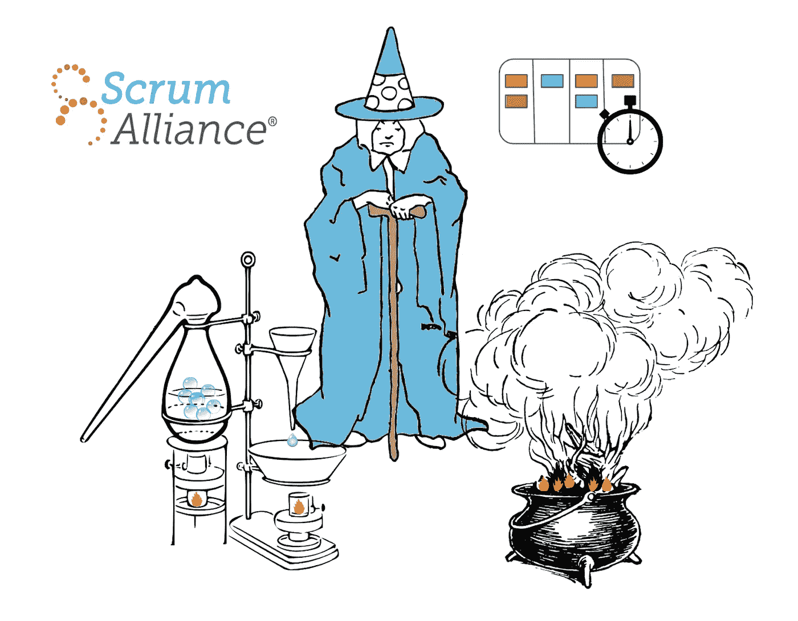
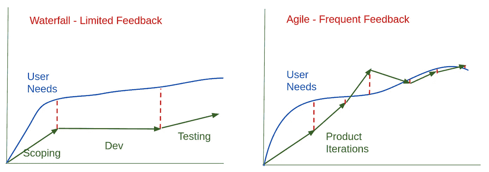
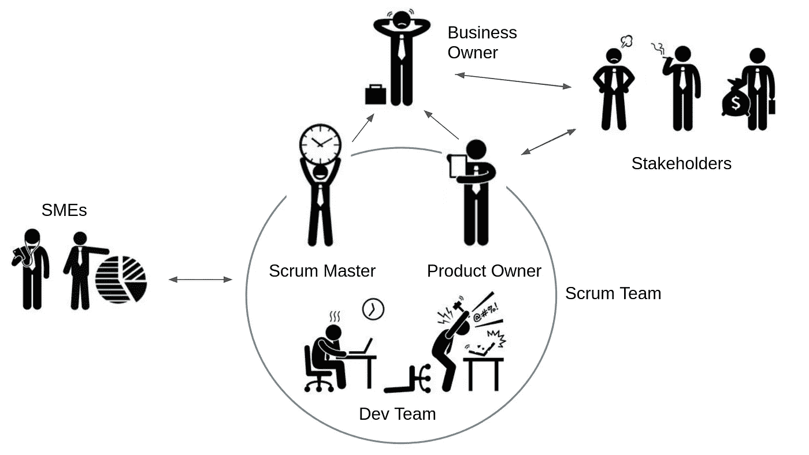
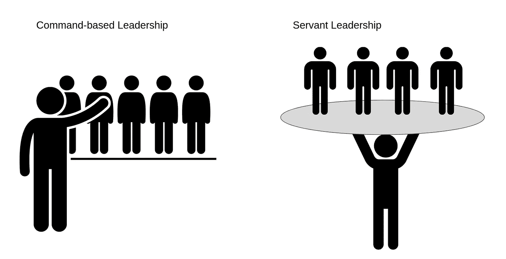

# 如何扩展敏捷:它很微妙，但不是炼金术

> 原文：<https://itnext.io/how-to-scale-agile-its-delicate-but-not-alchemy-6ac24963ffbe?source=collection_archive---------4----------------------->

图片由作者使用来自 Pixabay 上的 OpenClipart-Vectors 和 StarGladeVintage 的设计。

敏捷已经征服了世界。软件开发的迭代反馈是有意义的。

但是在大项目上谈论敏捷，你会得到战争故事。“我们试图变得敏捷，但是……”你听说敏捷并没有产生一个和谐的项目。

让敏捷大规模工作似乎需要某种炼金术。这是一个秘密的公式，还没有被那些没有完成所有框架认证的普通人所使用。

扩展敏捷不是炼金术。但它很脆弱。让我们解开这个谜团。

首先，我们需要提醒自己敏捷的核心。然后，我们将了解为什么难以扩展，以及如何克服这些障碍。在查看扩展敏捷的方法之前，我们将很好地掌握核心概念。

# 为什么我们热爱敏捷

起初有官僚主义。有些人有问题。也有解决问题的人。但是这两个小组只能通过没完没了的文书工作进行交流。

有时是令人困惑的文书工作。但是你不能改变它。一旦你下了订单，就是这样。

然后是敏捷。敏捷宣言是 2001 年从犹他州的一个滑雪小屋传给我们的。

> **流程和工具上的个人和交互**
> 
> **工作软件**全面文档化
> 
> **客户协作**合同谈判
> 
> **根据计划应对变化**

敏捷的神奇之处在于，有问题的人可以和能够解决问题的人交流。

> 业务人员和开发人员必须在整个项目中每天一起工作。

他们可以在过程中解决任何困惑。

> 欢迎不断变化的需求，即使是在开发的后期。

结果证明这是可行的。如果你不断进行小的调整，你就能更好地与你的用户和他们不断变化的需求保持同步。您还可以帮助您的用户更清楚地了解这些需求。

敏捷的反馈。图片作者。

情况有所好转。项目开始[成功一点](https://www.infoq.com/articles/standish-chaos-2015/)。人们变得兴奋起来。

# 敏捷的宿醉

人们可能有点太兴奋了。

大多数大公司都采用了敏捷。咨询公司开始教授敏捷框架。

起初，每个人都想从事敏捷项目。但是当他们这么做的时候，他们发现了文件。开发商被告知要遵循文书工作。

这只[野兽](https://www.slideshare.net/jaxlondon2012/curing-agile-hangover-sandro-mancuso-and-mashooq-badar)被赋予了多个名字。[瓦吉勒](https://www.thoughtworks.com/insights/blog/good-and-bad-wagile)。[暗争](https://ronjeffries.com/articles/016-09ff/defense/)。[假敏捷](https://martinfowler.com/articles/agile-aus-2018.html)。

不好看。僵化的关系。协作性差。冲突和功能障碍。

孔来涵的《棒人》[。作者安排。](https://thenounproject.com/leremy/)

这些大型敏捷项目是如何变得如此支离破碎的？我们如何解决这个问题？

我们需要理解为什么扩展敏捷是微妙的。

# 为什么扩展很难

在较小的项目中，每个人都可以和每个人交谈。有问题的人真的可以和解决问题的人交谈。

每个人都能做一些事情。开发人员了解整个代码库。他们自己做所有的 devops。他们直接与用户对话。大家可以在同一个房间见面。

现在想象这个系统变得更大。现在人们不适合住在同一个房间里。开发人员无法再了解整个代码库。

随着系统的发展，每个人都会做一些更专业的事情。每个人都要缩小关注点。

因此，现在我们将有专门负责不同领域的团队。也许是一个网站中不同的页面。效率更高。

组建团队改变了协作的动力。

一旦事情变得专业化，那么与做完全不同事情的人交谈就需要付出努力。你不明白他们是干什么的。他们的目标不会马上让你明白。

我们可以尝试构建项目，让团队独立。但是有些事情不可避免地会跨越团队。

> "*专业化使我们能够处理不断增长的复杂性，但只有当它所创建的孤岛能够有效连接时，专业化的好处才能充分实现。*Mik kers ten，*项目到产品*

团队有时需要合作。还需要对系统如何整合进行规划。和优先级。

你需要管理。中央计划和优先次序。

这并不完全是敏捷宣言想要表达的意思:

> 围绕有积极性的个人建立项目。给他们所需的环境和支持，相信他们能完成工作…最好的架构、需求和设计来自自组织团队。

扩展需要正式的结构和过程。敏捷宣言支持授权个人自由协作。确实存在紧张局势。

# 为什么会出现伪敏捷？

伪敏捷不仅仅是关于过程。有流程有结构本身不是坏事。人们乐于遵循适合每个人的流程。

问题是当人们变得不灵活时。

想象一下，每个人都对自己的角色做了狭隘的解释。想象一个故事需要建立一个新的集成到另一个系统。你就此询问产品负责人，他们回答说这是一个技术问题，不在他们的职权范围内。你找到一个建筑师，他们说他们不在那个地区做生意。你和谁谈过向前看的问题？

现在想象一下，如果产品负责人说“我认识那个团队的某某人，我会帮你安排一些会议。”这对于一个可能没有权限从另一个团队获得时间的开发人员来说有很大的不同。

想象一下，项目中的每个人都不灵活地解释他们的角色。基础设施变得很难获得。缺陷被来回分配。角色之间的事情或者[需要跨团队协作的事情](https://dzone.com/articles/agile-teamwork)会变得困难。

> "官僚主义是把可能变成不可能的艺术。"归功于哈维尔·帕斯夸尔·萨尔塞多

我们可以将这种不灵活的行为视为伪敏捷的核心症状。这相当于一种[官僚文化](https://cloud.google.com/solutions/devops/devops-culture-westrum-organizational-culture)。

伪敏捷可能还有其他的负面特征，但是考虑官僚文化是关键。这是因为协作文化非常重要。这是谷歌在两年多时间里对 180 多个团队进行的一项大型调查的[关键发现](https://rework.withgoogle.com/blog/five-keys-to-a-successful-google-team/):

> 谁在团队中并不重要，重要的是团队成员如何互动，如何组织他们的工作，以及如何查看他们的贡献朱莉娅·罗佐夫斯基，谷歌

因此，糟糕的合作既打击了士气，也损害了绩效。

糟糕的文化也出现在关于敏捷转换的阻碍因素和有效软件交付的调查中。但是为什么会这样呢？

当不灵活的行为在一个项目中变得广泛而深入时，这很可能是一种防御机制。人们变得不灵活是为了保护自己不被压倒或受到责备。

那么，是什么导致了这种防御性文化的出现呢？我们如何鼓励健康的文化？

人们经常认为，中央计划允许通过后门进行命令和控制管理。然后人们变得不灵活，因为他们已经被指示要做什么。这可能是通向防御性文化的最常见(尽管不是唯一)的途径。这是可以避免的。

有一种领导风格可以促进授权和促进健康的文化。

# 授权微妙但可实现

授权是一个关键的激励因素，也是敏捷宣言的主题。在每个人都自动产生重大影响的小项目中，这往往会自然而然地发生。在大型项目中，这并不是自动的。但是在开发者被充分授权的情况下运行大型项目是可能的。

结构必须牺牲一些平等的影响。对于中央计划来说，必须有某种集中的领导。但这并不意味着要牺牲太多的权利。

领导有可能替别人说话。领导可以是顾问式的。仆人式领导。

图片作者。来自新项目的[指挥员](https://thenounproject.com/search/?q=commander&i=1587086)、[人](https://thenounproject.com/search/?q=person&i=23359)和[举重运动员](https://thenounproject.com/search/?q=weightlifter&i=2838688)图像。灵感来自 [5dvision](https://www.5dvision.com/post/the-scrum-master-is-a-servant-leader/) 。

大型团体有可能因为共同的愿景而团结起来。只要人们能够为共同的愿景做出贡献，他们就会感到被赋予了力量。

# 避免虚假敏捷

当每个人都不知所措，害怕失败时，防御性文化就会产生。

这意味着，如果管理不善，任何可能破坏项目的事情都有导致防御文化的风险。在一个软件项目中，很多事情都可能出错。

使软件项目脱轨的问题有一些共同的模式。成功应对挑战是可能的。咨询式领导有助于形成一种健康的文化，能够更好地管理风险。这也降低了出现严重问题的可能性。我们来看看为什么。

# 规模的微妙挑战

让我们思考一下我们在大型项目中看到的一些关键问题:

*   工作被低估和超支。
*   系统架构变得复杂且难以扩展。
*   团队被困在等待其他团队。
*   由于对目标的不同解释，团队不得不返工。
*   士气低落，员工流动率高。

现在考虑这些补救措施:

*   在提交预算之前，通过咨询和峰值进行协作规划。
*   对实地出现的问题敏感的灵活架构。
*   逻辑团队结构适应架构，并与架构一起发展。
*   清晰的项目愿景和架构方向。
*   鼓舞人心的项目目标和每个人如何贡献的清晰性。

这在很大程度上归结于对产品目标有一个清晰的愿景，以及对我们如何实现目标有一个灵活的咨询式规划。让我们更详细地了解这些关键领域。

## 视力

要让一个项目走上正轨，我们能做的最重要的事情就是定义一个清晰的愿景。高层次的愿景不需要详细描述，但需要准备好具体化到细节中。如果它包含冲突的优先事项或混乱，那么这些需要解决。

将愿景落实到细节中可以解决内部纠纷。许多项目陷入未解决的分歧，因为团队[对目标的解释不同](https://www.infoq.com/articles/silos-politics-software-products/)。明确目标是解决这个问题的唯一方法。

## 规划和设计

这个设计提供了一个结构，团队可以在这个结构中工作。它可以随着项目的发展而发展。但是远见和平衡是重要的。对设计的重大改变可能需要团队结构的改变。

项目实现的关键问题是愿景、设计、优先级和规划问题。我们需要对这些事情做出明确的决定，以确保方向明确。我们还需要根据新的反馈调整这些决策。这是一个敏感的平衡动作。

做好预算和估算也是很微妙的。有多难，源于愿景有多清晰，我们能多好地看到前面的路。

## 赞助

愿景和计划在组织内得到充分的支持是非常重要的。否则预算请求可能不会到来。支持也需要是可见的。否则，其他项目或部门可能无法提供必要的资源。

# 领导力和扩展敏捷

我们倾向于低估软件交付领导活动的重要性。我们看到开发过程中出现的问题，并认为问题从那里开始。这就像停电时试图修理洗衣机一样。

> “85%的失败原因是系统和流程中的缺陷，而不是员工。管理的作用是改变流程，而不是强迫个人做得更好。”爱德华兹·戴明

我们已经看到，在保持项目健康以及如何扩展敏捷方面，我们拥有以下关键要素:

*   视力
*   赞助
*   优先顺序
*   设计
*   规划和预算

我们如何在一个大的敏捷环境中实现这些呢？并以恰当的平衡和语气实现这些目标，让每个人都能看到如何尽自己最大的努力？

# 扩展敏捷井

没有神奇的公式。有一组不同的元素必须集合在一起。

有大规模管理敏捷的框架。SAFe、LeSS、Nexus 和其他公司都有详细说明结构、步骤和实践的指南。这些都是重要而有价值的工具。

我们应该警惕把一个框架当作一个神奇的公式。我们如何将指南应用到我们的特定案例中是至关重要的。

无论你是否选择使用一个衡量框架，它们都可以为我提供一个有价值的参考，帮助我挖掘想法和强调什么。*安全 5.0 精粹*从清晰的领导需求开始，然后从那里进入更多细节。

> “领导者通过指导、授权和调动个人和团队发挥其最大潜力来树立榜样。”安全 5.0 蒸馏

许多*安全*文献被构建成一个灵活的知识库。它让你思考你的案例。但这并不是说你不会从其他框架中获得同样多的价值。重要的是你对框架的应用。也就是说，框架本身并不是中立的，值得考虑一下[他们也面临了什么样的批评(我已经在其他地方写过了)](https://hackernoon.com/agile-is-not-enough-empowered-on-innovation-he9m35s1)。

# 扩展敏捷不是炼金术

看起来好像敏捷框架试图将不可编码的东西编码。好像他们试图为领导的真正本质创造一个机械的公式。

图片作者。基于 [mycutegraphics](https://www.mycutegraphics.com/graphics/book/black-white-bunch-of-books.html) 的书籍和 [pixabay](https://pixabay.com/illustrations/hand-symbol-magic-sign-triangle-5278129/) 上 fluf 的手形符号。

框架所具有的神秘感应该归功于我们。当然，框架不能精确地告诉我们该做什么，不管我们多么希望它们这样做。他们只是向导。

实践和框架之间有一个反馈循环。框架会根据我们如何使用它们而不断改进和适应。它们将随着我们需求的变化而不断变化。

我们没有一个系统可以像牛顿运动定律那样进行软件开发。我们没有精确的公式。我们确实有大量的知识。运用这些知识需要技巧、经验和判断力。

软件交付生活在商业和工程的边界上。软件计划在很大程度上是商业计划。他们继承了商业计划的所有混乱和风险。

如果有一个通用的公式来将商业计划转化为伟大的软件，那么这个公式真的是炼金术。