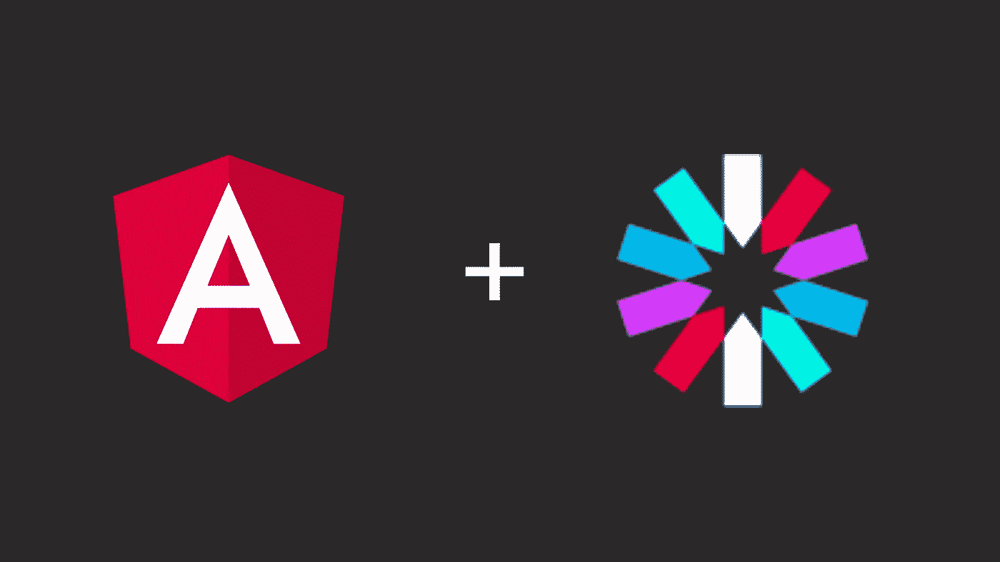

# 如何在角度 HTTP 请求中自动发送 JWT

> 原文：<https://itnext.io/how-to-send-jwt-automatically-in-angular-http-requests-31c1fd060871?source=collection_archive---------4----------------------->



## 使用 HTTP 拦截器自动包含 JWT

Angular 是一个强大的框架，用于开发高度可扩展的企业级应用。它集成了许多功能，如模板，测试支持，动画，路由和 HTTP 请求。由于许多 API 要求对请求者进行身份验证，所以客户端必须发送某种后端可以验证的令牌。

[**【JSON Web 令牌】**](https://jwt.io/) 是一种开放的行业标准方法，用于安全地表示双方之间的索赔。它们包含 JSON 编码的数据。这意味着您可以让您的 JWT 存储任意多的 JSON 数据，并且可以将您的令牌字符串解码成 JSON 对象。这使得它们便于嵌入信息。

我们将使用[**HTTP client**](https://angular.io/api/common/http/HttpClient)**来发出经过认证的 HTTP 请求。由于 Angular 支持 HTTP 拦截器(从版本 4.3 开始)，我们可以在请求被发送到后端之前自动修改它。在本教程中，我将使用现有的库([由 Auth0 的专家开发)](https://github.com/auth0/angular2-jwt)为每个请求自动包含 JWT，这样我们就不需要自己编写 HTTP 拦截器了。请注意，这不适用于已弃用的[*Http*](https://angular.io/api/http/Http)*服务，而仅适用于 HttpClient，因为已弃用的 Http 不支持 Http 拦截器。***

## ***如何用 Angular 在每个 HTTP 请求中发送 JWT***

1.  ***使用 NPM`**npm install @auth0/angular-jwt**`安装[***angular-jwt***](https://github.com/auth0/angular2-jwt)库。或者，[自己创建一个 HTTP 拦截器](https://angular.io/guide/http#intercepting-requests-and-responses)。***
2.  ***在您的 *AppModule* 中，您需要**为拦截器提供检索 JWT** 的方法。这应该使 HttpClient 能够获得 JWT 并将其包含在每个请求中。通常，您将令牌存储在 [cookie](https://developer.mozilla.org/en-US/docs/Web/HTTP/Cookies) (首选)或[浏览器存储器](https://developer.mozilla.org/de/docs/Web/API/Storage)中。***
3.  ***在您的模块中导入[**http client module**](https://github.com/auth0/angular2-jwt)**。为了在组件/服务/管道/指令中注入 HttpClient 服务，这是必需的。*****
4.  *****使用 **HttpClient** 发送 HTTP 请求，该请求现在将自动包含 JWT。*****

## *****导入必要模块的示例 AppModule*****

```
***// called on every request to retrieve the token
export function jwtOptionsFactory(tokenService: TokenService) {
  return {
    tokenGetter: () => tokenService.getToken(),
    whitelistedDomains: ['my-domain', 'my-domain2']
  };
}
// the actual module imports
@NgModule({
  declarations: [...],
  imports: [HttpClientModule, JwtModule.forRoot({
      jwtOptionsProvider: {
        provide: JWT_OPTIONS,
        useFactory: jwtOptionsFactory,
        deps: [TokenService]
      }
    }),
  providers: [...]
}***
```

*****下面是一个示例服务，它使用 HttpClient 发出创建用户的 POST 请求。*****

```
***[@Injectable](http://twitter.com/Injectable)({providedIn: 'root'})
export class UserService { constructor(private httpClient: HttpClient) {} createUser(route: string, body: User) {
    return this.httpClient.post(route, body);
  }

}***
```

## *****结论*****

*****感谢阅读这篇文章。如您所见，很容易在每个 HTTP 请求上自动发送 JWT。如果您需要更多的自定义行为和功能，您可以简单地编写自己的 Angular 支持的 HTTP 拦截器。如果这篇文章对你有帮助，请在评论中告诉我。*****

*****关于 JWT 的进一步推荐文章:*****

*   *****[*JSON Web Token 简介*](https://jwt.io/introduction/)*****
*   *****[*如何以及何时使用 JSON Web 令牌为您服务*](https://blog.codecentric.de/en/2017/08/use-json-web-tokens-services/)*****
*   *****如果你的 JWT 被偷了会怎么样？*****