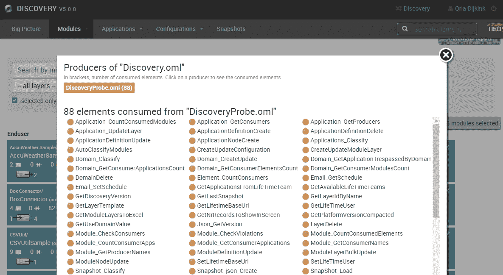

# 如何发现外部系统中的特性嫉妒，以及为什么需要这样做。

> 原文：<https://itnext.io/how-to-spot-feature-envy-in-outsystems-and-why-you-need-to-e15298b6d1b5?source=collection_archive---------1----------------------->

安娜·克雷诺娃/【Shutterstock.com·

在我为硕士论文做的一项调查中，特性嫉妒是大多数低代码开发人员不知道的代码味道。所以我想我会解释什么是特征嫉妒，以及当你发现它时应该怎么做。如果你不知道什么是**码气味**，请阅读[这篇文章](/does-your-outsystems-code-smell-dea38b0dbfc)，在那里我会解释这一切。

**Feature Envy** 是指一个方法从另一个对象收集大量数据，并对这些数据执行计算，而不是要求那个对象给出计算结果。

> 一个方法对一个类比对它实际所在的类更感兴趣—马丁·福勒

一个很好的经验法则是，如果事情在同一时间发生变化，你应该把它们放在同一个地方。通常，数据和使用这些数据的操作会同时更改。

## 它在外部系统中看起来怎么样？

我们在外部系统中没有类和对象，但是代码的味道看起来还是一样的。您的消费者模块收集一些数据和信息来进行计算。您使用的数据应该只来自一个生产者模块。

如果你的模块有很多对一个模块的引用，仔细看看是个好主意。为什么要引用这么多实体和动作？是因为你需要很多实体和多个动作才能得到你需要的吗？在[发现工具](https://www.outsystems.com/forge/component-overview/409/discovery)的模块画布上，您可以看到一个模块有多少个对生产者模块的引用。

Discovery 有 88 次引用 DiscoveryProbe

假设您有一个地址模块和一个向潜在客户发送邮件的应用程序。因此，对于每一个潜在的客户，你得到街道名称和号码，邮政编码和城市。有了这些信息，你就可以打印一张有很大折扣的精美卡片供他们使用。您收集数据并将其组合成一个有效的地址，而不是让地址模块提供一个您可以直接打印的地址。你的应用程序有一个明显的羡慕特性的例子。

在这个例子中，您不需要做太多的工作来编译地址。但是，如果你需要改变什么，因为你也发送卡国际或其他业务与邮政信箱。您不仅需要检索更多的数据，还需要更多的逻辑来编译一个有效的地址。

因此，最好将逻辑和责任一起放在地址模块中。通过这种方式，您的应用程序为将来的地址扩展做好了准备，并且您还保证了所有其他应用程序具有相同的地址结构和可能性。

在我们的例子中，有太多对地址模块的引用并不是问题，但是仔细看看它是一个**指示器**。当我们检查的时候，我们发现了一个问题。解决这个问题将导致更少的代码重复和更好的代码组织。如果您总是试图将处理数据的操作放在实际数据的旁边，那将是最好的。如果您的逻辑有一个非常不同的变化节奏，那么最好将您的逻辑分成不同的功能，在不同的模块中。

Feature Envy 经常与**数据类**代码味道一起出现，其中你的数据保存在一个单独的模块中，只有 [CRUD-wrapper](https://medium.com/@jmjames/outsystems-crud-wrapper-basics-e9a577a3e044) 动作。数据类嗅觉从生产者的角度看问题，功能嫉妒从消费者的角度看问题。对于这两种代码味道，潜在的问题和解决方案是相同的。