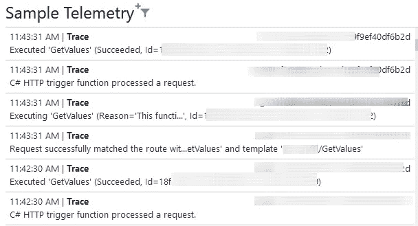

# 如何攻克 Azure Function 无服务器 app 冷启动问题？

> 原文：<https://itnext.io/how-to-tackle-the-cold-start-problem-of-azure-function-serverless-app-e90030cdb0c7?source=collection_archive---------2----------------------->

## 同时保持廉价的消费计划。


图片由 [wikiimages](https://pixabay.com/users/wikiimages-1897/) 提供

成本效益是无服务器应用的同义词之一。但是利益总是有代价的。所以我决定分享我处理一个函数 app 冷启动问题的方法。

> TL；DR:这篇文章是关于如何在 Azuew Logic App 的帮助下为 Azure 函数创建和使用自定义预热器。我还将提供其成本和 ARM 模板 JSON 文件的估计..

## 冷启动问题。

冷启动问题并不像它宣传的那样糟糕。解决这个问题有多种选择。Azure App Service Premium 计划、定期 ping、客户端应用中的重试方法等等。所以我想，不用写一行代码就能分享一个解决方案，会很好。

> 冷启动是一个术语，用来描述未使用的应用程序需要更长时间才能启动的现象。在 Azure 函数的上下文中，延迟是用户必须等待其函数的总时间。从事件发生时启动一个函数，直到该函数完成对事件的响应。[科尔比·特雷内斯文章](https://azure.microsoft.com/en-us/blog/understanding-serverless-cold-start/)。

让我们假设有一个 Azure Functions API 托管，并且只在工作时间使用。功能工作者的冷启动可能导致长达 7-10 秒的延迟，这是不好的。一些客户端应用程序没有以正确的方式实现重试模式。

微软建议的方法是使用高级或专用应用服务计划。但是这些产品要贵得多。

> 高级计划提供了 VNet 连接、无冷启动和高级硬件等功能。[文件](https://docs.microsoft.com/en-us/azure/azure-functions/functions-premium-plan)。

在我的例子中，要求是在办公时间预热应用程序。函数本身包含 C#代码，具有最小的依赖性和实体核心。让一个功能应用程序尽可能的轻量级总是一个好主意。

## 解决方案和成本。

最便宜和最直接的方法是创建 Azure Logic 应用程序，它每一两分钟向指定的 API 发出一次请求。这可能太频繁了，因为根据我的经验，现在每 5 到 10 分钟就会发生一次释放。尽管官方规定超时应该在 20 分钟后发生，但超时似乎在 6 个月的时间内至少改变一次。

下一步是估计这个解决方案的成本。假设 9 小时是一个标准的工作日，那么每天将需要大约 540 次执行来保持 API 一直处于预热状态:)。这个逻辑应用程序的每月执行成本将是 3 美元。但这只会导致每月额外执行 16740 次 Azure 函数，这将导致每月额外增加 3 美元。

我的估计基于以下事实:函数消耗大约 180 Mb 的 RAM，平均执行时间大约为 3 秒，每月的请求总数大约为 300k。

然而，这种方法不能完全解决冷启动问题，因为在额外的工作者加速运转的突发负载期间，一些请求可能需要长达 3 秒的时间。然而，另一方面，这无疑有助于避免 7(10)秒的情况。这个问题可以用稍微复杂一点的 API pinger 来解决。



以稳定的 1 分钟间隔运行的实时功能执行指标流

P.S .在观察了我们用于服务结构服务的 Azure 负载平衡器健康探测器的行为后，我产生了最初的想法。只是在用 Logic 应用程序进行了初步解决之后，我才发现了其他的，大部分是编程性的。

P.P.S .所以，如果写代码对你来说更容易的话，有一个用简单的预定 Azure 函数替换逻辑应用的选项。阅读 Chris O'Brien 的文章，它提供了另一种解决方案。

## 就这样，感谢阅读。干杯！

## 有用的链接。

*   *拔尖的蔚蓝职能内容来自* [*杰夫·霍兰*](https://medium.com/@jeffhollan) *。*
*   *Azure Logic Apps*[*文档*](https://docs.microsoft.com/en-us/azure/logic-apps/) *。*
*   *正确预热实例的* [*App 服务超值计划文档*](https://docs.microsoft.com/en-us/azure/azure-functions/functions-premium-plan) *。*

```
{
    "$schema": "[https://schema.management.azure.com/schemas/2015-01-01/deploymentTemplate.json#](https://schema.management.azure.com/schemas/2015-01-01/deploymentTemplate.json#)",
    "contentVersion": "1.0.0.0",
    "parameters": {
        "workflows_Warmup_name": {
            "defaultValue": "Warmup",
            "type": "String"
        }
    },
    "variables": {},
    "resources": [
        {
            "type": "Microsoft.Logic/workflows",
            "apiVersion": "2017-07-01",
            "name": "[parameters('workflows_Warmup_name')]",
            "location": "northeurope",
            "properties": {
                "state": "Enabled",
                "definition": {
                    "$schema": "[https://schema.management.azure.com/providers/Microsoft.Logic/schemas/2016-06-01/workflowdefinition.json#](https://schema.management.azure.com/providers/Microsoft.Logic/schemas/2016-06-01/workflowdefinition.json#)",
                    "contentVersion": "1.0.0.0",
                    "parameters": {},
                    "triggers": {
                        "Recurrence": {
                            "recurrence": {
                                "frequency": "Minute",
                                "interval": 1
                            },
                            "type": "Recurrence"
                        }
                    },
                    "actions": {
                        "HTTP": {
                            "runAfter": {},
                            "type": "Http",
                            "inputs": {
                                "method": "GET",
                                "uri": "[https://yourfancyFuncApi.azurewebsites.net/api/GetEntity?code=FunctionSecurityCodeAsExample](https://yourfancyFuncApi.azurewebsites.net/api/GetEntity?code=FunctionSecurityCodeAsExample)"
                            }
                        }
                    },
                    "outputs": {}
                },
                "parameters": {}
            }
        }
    ]
}
```