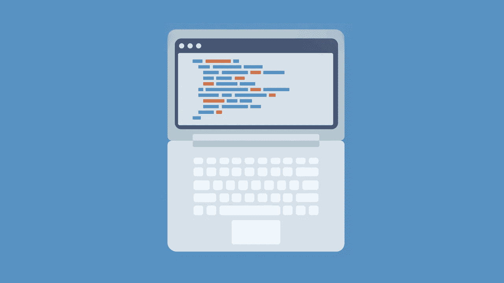

# 如何在 Java 的回调中抛出异常

> 原文：<https://itnext.io/how-to-throw-an-exception-in-a-callback-in-java-ebcf65bac35e?source=collection_archive---------7----------------------->

## 将异步回调转换为同步**方法调用**

这有点奇怪，在一切都是异步的世界里，我需要编写同步代码，甚至抛出异常。但是对于向 Java 实现的遗留 OOP 系统添加新特性来说，这是正常的。最近，我在这种非常健壮并且遵循 OOP 设计模式的系统上做了一些工作。

我的任务之一是在遗留系统中添加对新打印机品牌的支持，在这个任务中我应该实现几个类和接口。通过在遗留系统上抛出异常和几个方法签名抛出`PrintingException`来处理失败。例如，有一个名为`printText`的方法返回 void，如果这个方法可以成功打印什么都没发生并且不返回任何东西(void)，但是如果在打印过程中出现问题，我应该抛出一个`PrintingException`(这篇文章中的所有代码都不是真实的，只是示例代码)

新的打印机提供了用于通信的 Java API，它由监听器(Java 世界中回调的通用名称)工作，在`printText`方法中，我应该调用打印机 Java API 并为其设置一个回调，但是我不能在`onFailure`或`onTimeout`回调方法中抛出异常:

回调适用于异步世界，但不适用于这种同步系统。因为调用`printText`的父方法将它包装成一个 try-catch，并通过检查`PrintingException`的类型来处理失败:

我知道这个设计不好，但我不能改变它。为了使同步方法调用的异步回调能够抛出异常，我需要同步它。一种选择是使用同步块，并在 Java 中使用`wait()`和`notify()`机制。为了实现这个目标，我定义了一个名为`PrintTask`的类:

通过调用`getResult`方法，当前线程停止，直到得到结果或抛出异常。我们在`PrintListener`回调方法中调用`setResult`方法:

除了定义一个新类和使用同步块和`wait()`和`notify()`机制，还有另一种方法，使用`CompletableFuture`类。但是`CompletableFuture`有一个问题，因为在`CompletableFuture` 中导致失败的异常总是被包装在 CompletionException 中，我们应该从 CompletionException 中提取它并重新抛出它: