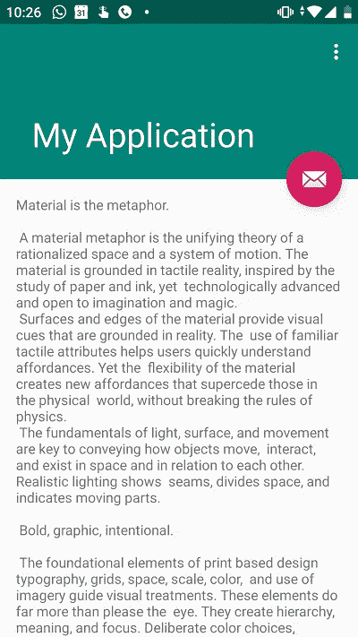
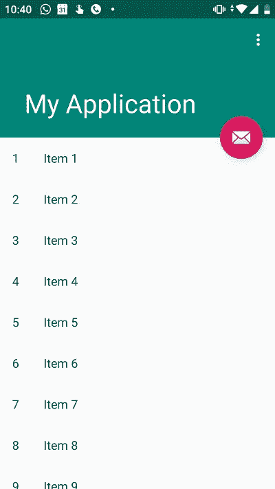
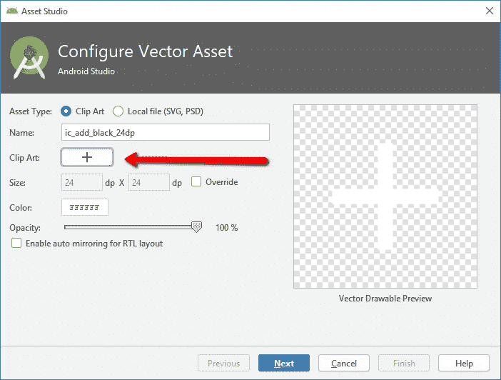
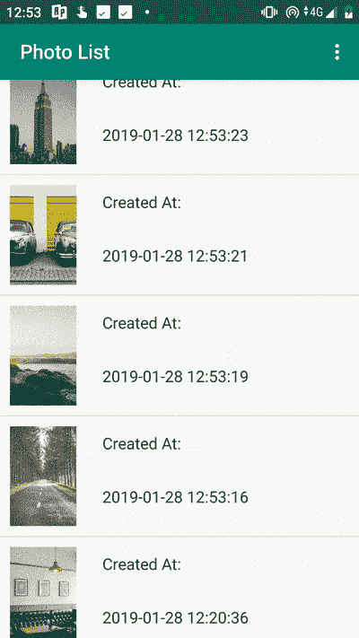

# 如何使用 RecyclerView 显示存储中的图像

> 原文：<https://itnext.io/how-to-use-a-recyclerview-to-show-images-from-storage-c99ac407599f?source=collection_archive---------5----------------------->


# 眼前的问题

[RecyclerView](https://developer.android.com/guide/topics/ui/layout/recyclerview) 小部件是 ListView 的一个更高级、更灵活的版本。它根据滚动位置管理和优化视图固定器绑定，并回收视图，以便只使用少量视图来处理大量列表项。鉴于 RecyclerView [示例应用程序](https://github.com/googlesamples/android-RecyclerView/)已经过时，甚至无法编译，本教程旨在展示一种相对快速的方法来将 RecyclerView 添加到现代 Android Studio 项目中，并使用它来显示我们将下载到设备的随机图像列表。

# 创建新项目

创建新项目(或打开现有项目)。在创建项目时，我们将选择为这个示例添加一个滚动活动，但是您可以选择您想要的任何布局。

现在运行它进行一个小的健全性检查:



# 添加列表片段

右击项目文件夹->添加->片段(列表)->完成

这将创建一个包含大量样板代码的 RecyclerView。让我们回顾一下添加的类:

`MyItemRecyclerViewAdapter` -创建视图持有人，它持有列表中项目的视图，并将数据绑定到视图持有人内部的视图。

`ItemFragment` -保存和初始化适配器的片段。

`Dummy/DummyContent` -填充列表的虚拟项目。我们将用我们的图片项目替换那些。

`fragment_item_list.xml` -包含 RecyclerView 小工具。

`fragment_item.xml` -列表中每个项目的布局。

现在我们需要将我们创建的片段添加到我们的活动中。在`content_scrolling.xml`中，将文本视图替换为:

```
<fragment android:name="com.example.myapplication.ItemFragment"
    android:id="@+id/main_fragment"
    android:layout_width="match_parent"
    android:layout_height="match_parent" />
```

我们还将让活动实现我们的交互监听器接口:

```
implements ItemFragment.OnListFragmentInteractionListener
```

在将它添加到 activity 类之后，您必须实现 onListFragmentInteraction 方法，您可以使用建议窗口自动实现它。这是添加的自动生成的方法:

```
@Override
public void onListFragmentInteraction(DummyContent.DummyItem item) {    
}
```

现在运行项目，查看列表显示和滚动:



# 替换虚拟内容

在 android studio 中，将`DummyContent.java`重命名为`PictureContent.java`(以及类名)，并将其移出`dummy`包。删除虚拟包。我们还将删除`DummyItem`类，并在一个新文件中创建一个 POJO 类`PictureItem`，包含图片 URI 和创建日期:

```
class PictureItem {
    public Uri uri;
    public String date;
}
```

在`PictureContent`中，用`PictureItem`创作替换`DummyItem`创作:

```
public class PictureContent {
    static final List<PictureItem> ITEMS = new ArrayList<>();

    public static void loadImage(File file) {
        PictureItem newItem = new PictureItem();
        newItem.uri = Uri.fromFile(file);
        newItem.date = getDateFromUri(newItem.uri);
        addItem(newItem);
    }

    private static void addItem(PictureItem item) {
        ITEMS.add(0, item);
    }
}
```

现在我们将更新`fragment_item.xml`来显示我们的图像项，用`ImageView`表示图像，用`TextView`表示创建日期:

```
<?xml version="1.0" encoding="utf-8"?>
<LinearLayout xmlns:android="http://schemas.android.com/apk/res/android"
    android:layout_width="wrap_content"
    android:layout_height="wrap_content"
    android:orientation="horizontal">

    <ImageView
        android:id="@+id/item_image_view"
        android:layout_width="wrap_content"
        android:layout_height="wrap_content"
        android:contentDescription="@string/app_name"
        android:scaleType="centerInside"
        android:padding="10dp" />

    <LinearLayout xmlns:android="http://schemas.android.com/apk/res/android"
        android:layout_width="wrap_content"
        android:layout_height="wrap_content"
        android:orientation="vertical">
    <TextView
        android:layout_width="wrap_content"
        android:layout_height="wrap_content"
        android:layout_margin="@dimen/text_margin"
        android:text="@string/created_at"
        android:textAppearance="?attr/textAppearanceListItem" />

    <TextView
        android:id="@+id/item_date_tv"
        android:layout_width="wrap_content"
        android:layout_height="wrap_content"
        android:layout_margin="@dimen/text_margin"
        android:textAppearance="?attr/textAppearanceListItem" />
    </LinearLayout>
</LinearLayout>
```

最后，在`MyItemRecyclerViewAdapter`中，替换内容以将新的数据字段绑定到新的视图:

```
public class MyItemRecyclerViewAdapter extends RecyclerView.Adapter<MyItemRecyclerViewAdapter.ViewHolder> {

    private final List<PictureItem> mValues;
    private final OnListFragmentInteractionListener mListener;

    public MyItemRecyclerViewAdapter(List<PictureItem> items, OnListFragmentInteractionListener listener) {
        mValues = items;
        mListener = listener;
    }

    @Override
    public ViewHolder onCreateViewHolder(ViewGroup parent, int viewType) {
        View view = LayoutInflater.from(parent.getContext())
                .inflate(R.layout.fragment_item, parent, false);
        return new ViewHolder(view);
    }

    @Override
    public void onBindViewHolder(final ViewHolder holder, int position) {
        holder.mItem = mValues.get(position);
        holder.mImageView.setImageURI(mValues.get(position).uri);
        holder.mDateView.setText(mValues.get(position).date);

        holder.mView.setOnClickListener(new View.OnClickListener() {
            @Override
            public void onClick(View v) {
                if (null != mListener) {
                    // Notify the active callbacks interface (the activity, if the
                    // fragment is attached to one) that an item has been selected.
                    mListener.onListFragmentInteraction(holder.mItem);
                }
            }
        });
    }

    @Override
    public int getItemCount() {
        return mValues.size();
    }

    public class ViewHolder extends RecyclerView.ViewHolder {
        public final View mView;
        public final ImageView mImageView;
        public final TextView mDateView;
        public PictureItem mItem;

        public ViewHolder(View view) {
            super(view);
            mView = view;
            mImageView = view.findViewById(R.id.item_image_view);
            mDateView = view.findViewById(R.id.item_date_tv);
        }
    }
}
```

# 加载图片

现在，我们将用保存在设备存储器中的图像填充列表。将图像加载方法添加到`PictureContent`:

```
public static void loadSavedImages(File dir) {
    ITEMS.clear();
    if (dir.exists()) {
        File[] files = dir.listFiles();
        for (File file : files) {
            String absolutePath = file.getAbsolutePath();
            String extension = absolutePath.substring(absolutePath.lastIndexOf("."));
            if (extension.equals(".jpg")) {
                loadImage(file);
            }
        }
    }
}

private static String getDateFromUri(Uri uri){
    String[] split = uri.getPath().split("/");
    String fileName = split[split.length - 1];
    String fileNameNoExt = fileName.split("\\.")[0];
    SimpleDateFormat format = new SimpleDateFormat("yyyy-MM-dd HH:mm:ss");
    String dateString = format.format(new Date(Long.parseLong(fileNameNoExt)));
    return dateString;
}

public static void loadImage(File file) {
    PictureItem newItem = new PictureItem();
    newItem.uri = Uri.fromFile(file);
    newItem.date = getDateFromUri(newItem.uri);
    addItem(newItem);
}
```

我们将从我们的活动`ScrollingActivity`中调用`loadSavedImages`，因此我们首先需要获得对回收器视图的引用。添加两个字段:

```
private RecyclerView.Adapter recyclerViewAdapter; private RecyclerView recyclerView;
```

在`onCreate`中哪个会被懒加载:

```
if (recyclerViewAdapter == null) {
    Fragment currentFragment = getSupportFragmentManager().findFragmentById(R.id.main_fragment);
    recyclerView = (RecyclerView) currentFragment.getView();
    recyclerViewAdapter = ((RecyclerView) currentFragment.getView()).getAdapter();
}
```

在`onResume`中，我们将添加对`loadSavedImages`的调用:

```
@Override
protected void onResume() {
    super.onResume();

    runOnUiThread(new Runnable() {
        @Override
        public void run() {
            loadSavedImages(context.getExternalFilesDir(Environment.DIRECTORY_DOWNLOADS));
            recyclerViewAdapter.notifyDataSetChanged();
        }
    });
}
```

> *注意，我们正在从* `*DIRECTORY_DOWNLOADS*` *加载文件，这是一个存储下载文件的传统文件夹。*

# 下载图片

每当点击浮动动作按钮时，我们将使用内置的 DownloadManager 类从 Lorem Picsum 下载随机图片。

将下载方法添加到`PictureContent`:

```
public static void downloadRandomImage(DownloadManager downloadmanager, Context context) {
    long ts = System.currentTimeMillis();
    Uri uri = Uri.parse(context.getString(R.string.image_download_url));

    DownloadManager.Request request = new DownloadManager.Request(uri);
    request.setTitle("My File");
    request.setDescription("Downloading");
    request.setNotificationVisibility(DownloadManager.Request.VISIBILITY_VISIBLE);
    request.setVisibleInDownloadsUi(false);
    String fileName = ts + ".jpg";
    request.setDestinationInExternalFilesDir(context, Environment.DIRECTORY_DOWNLOADS, fileName);

    downloadmanager.enqueue(request);
}
```

这会将文件下载到`DIRECTORY_DOWNLOADS`，并以当前时间戳作为文件名。

在`strings.xml`中设置`image_download_url`:

```
<string name="image_download_url">https://picsum.photos/200/300/?random</string>
```

> 不要忘记将互联网权限添加到清单中

现在我们需要处理下载完成事件。将以下内容添加到活动的`onCreate`:

```
onComplete = new BroadcastReceiver() {
    public void onReceive(Context context, Intent intent) {
        String filePath="";
        DownloadManager.Query q = new DownloadManager.Query();
        q.setFilterById(intent.getExtras().getLong(DownloadManager.EXTRA_DOWNLOAD_ID));
        Cursor c = downloadManager.query(q);

        if (c.moveToFirst()) {
            int status = c.getInt(c.getColumnIndex(DownloadManager.COLUMN_STATUS));
            if (status == DownloadManager.STATUS_SUCCESSFUL) {
                String downloadFileLocalUri = c.getString(c.getColumnIndex(DownloadManager.COLUMN_LOCAL_URI));
                filePath = Uri.parse(downloadFileLocalUri).getPath();
            }
        }
        c.close();
        PictureContent.loadImage(new File(filePath));
        recyclerViewAdapter.notifyItemInserted(0);
        progressBar.setVisibility(View.GONE);
        fab.setVisibility(View.VISIBLE);
    }
};

context.registerReceiver(onComplete, new IntentFilter(DownloadManager.ACTION_DOWNLOAD_COMPLETE));
```

当下载管理器完成下载时，这是获取下载文件名称的(相当冗长)方式。在得到`filePath`之后，我们调用`PictureContent.loadImage`，将它添加到我们的列表中。

> *通知调用* `*recyclerViewAdapter.notifyItemInserted(0)*` *。这将导致列表用我们插入的新项目(在索引 0 处)刷新*

# 旁白:用 Asset Studio 创建加号图标

作为最后的润色，我们将使用 Android Studio 的 Asset Studio 更新 FAB 的图标，以创建一个矢量材质图标。右键单击 res 文件夹，然后选择“新建>矢量资源”。点击按钮，搜索关键字`add`:



这将为我们提供正材质图标。将颜色改为白色，并将 xml 保存在 drawable 文件夹中。

就是这样！现在我们有一个滚动循环视图显示下载的图片:



> *全源可见* [*此处*](https://github.com/syonip/android-recycler-example)

*最初发表于*[*https://www.learningsomethingnew.com*](https://www.learningsomethingnew.com/how-to-use-a-recycler-view-to-show-images-from-storage)*。*