# 如何在 HTTP 请求到达 Lambda 之前验证它们

> 原文：<https://itnext.io/how-to-validate-http-requests-before-they-reach-lambda-2fff68bfe93b?source=collection_archive---------1----------------------->

阿萨埃尔·培尼亚在 [Unsplash](https://unsplash.com/?utm_source=unsplash&utm_medium=referral&utm_content=creditCopyText) 拍摄的照片

*如今，我正在写* [*子栈*](https://themirrorworld.substack.com) *。*

将应用程序设计为无服务器功能的众多吸引力之一是，您可以花更多的时间编写核心应用程序逻辑。然而，默认情况下，当涉及到 [AWS Lambdas](https://aws.amazon.com/lambda/) 时，您仍然负责编写验证传递给 Lambda 函数的请求的功能。让我们看看如何将它交给 [AWS API Gateway](https://aws.amazon.com/api-gateway/) ，这样您就可以避免在您的函数中编写相同的样板验证代码。

在这篇简短的指南中，我将演示如何使用 API Gateway 和 Lambda 验证 API 请求。我们将建立一个简单的 Lambda 函数，将其连接到 API Gateway，并在请求到达我们的函数之前对其进行验证。

假设我们想要创建一个 API，用于查询您正在操作的不同自动驾驶车辆的状态。

*抬头！本文中使用的代码片段可以通过这个要点* *获得* [*。*](https://gist.github.com/tiivik/cf43b96357f28407fdcfc06179561673)

## 设置 Lambda 函数

1.  从 AWS Lambda 控制台，点击*创建功能*并从头选择*作者*。在这种情况下，我们调用我们的函数 *Fleet* ，选择 *Python 3.6* 作为我们的运行时环境，并为 AWS 创建一个名为*λrole*的新角色来设置该函数的权限。

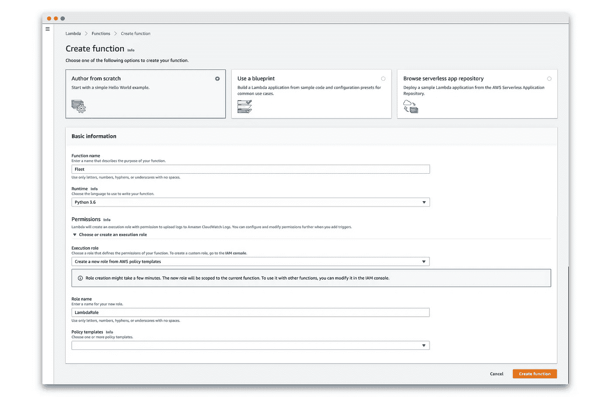

2.创建函数时，您会看到一些模板代码:

3.添加一些预先制作的数据。

出于本教程的目的，Lambda 将包括一个带有一些预制数据的字典。我们可以看到，我们的车队中有两辆轿车和两辆卡车，每一类都有一辆*在途中*，另一辆*在待命*。

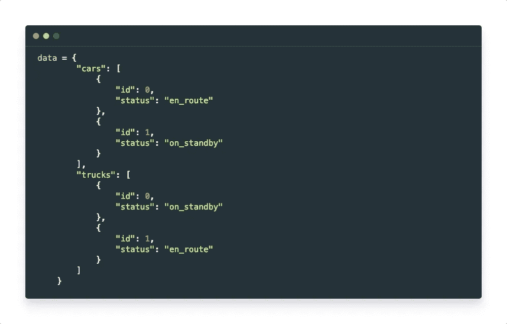

4.获取请求的类别。

让我们修改模板代码，以返回关于所请求类别的信息。我们的函数代码现在看起来像这样:

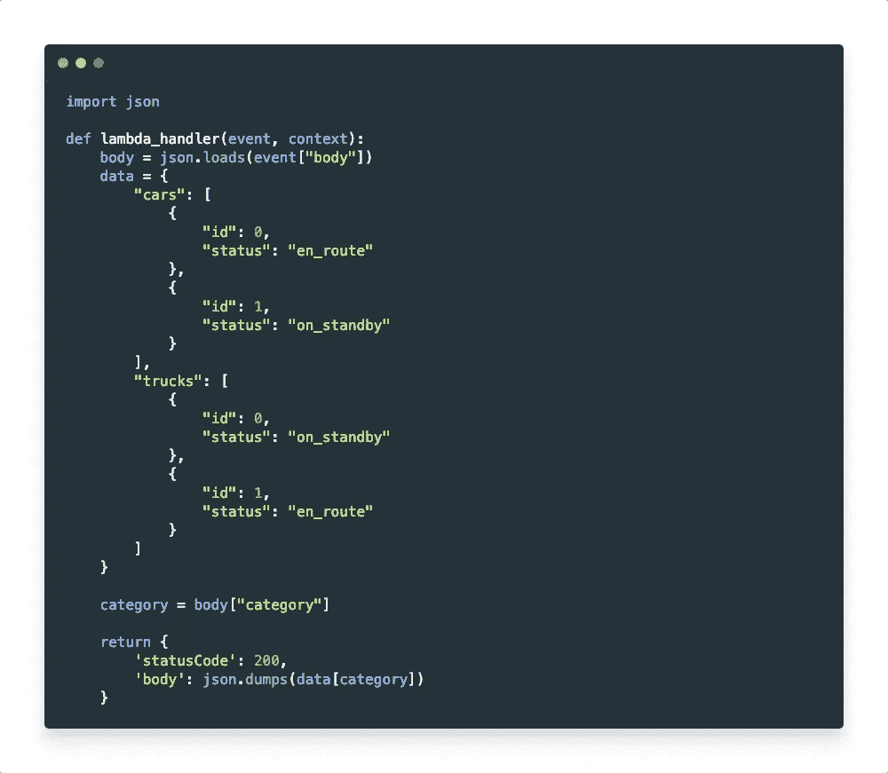

最终功能代码

5.在 Lambda 控制台中设置测试事件。点击*配置测试事件*。

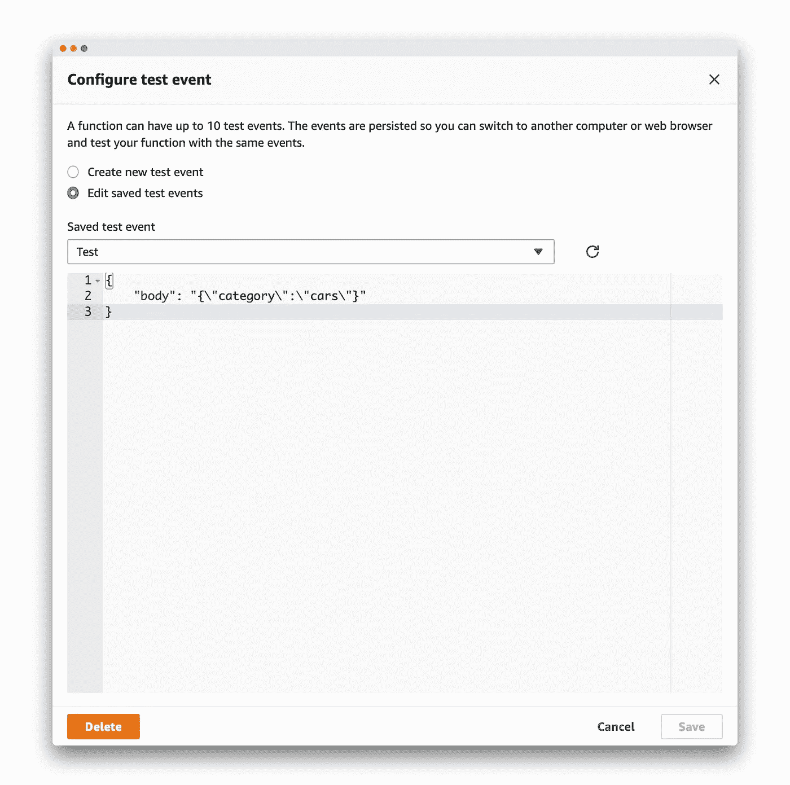

我们将在 API Gateway 中使用 Lambda 代理集成，它将把所有内容作为一个 JSON 文档传递给我们的后端资源(在本例中是我们的 Lambda 函数),包括整个资源路径，而不仅仅是事件体本身。这就是为什么我们在测试事件中包含“*body”*key:

λ测试事件

让我们试着通过点击*测试*按钮来查询所有汽车的状态。您应该会看到以下响应，它向我们提供了车队中属于*【汽车】*类别的所有车辆的状态:

在我们继续设置 API 网关之前，让我们查询一个在我们的数据字典中不存在的类别。

修改测试事件，改为查询类别*“列车”*:

点击*测试*按钮，Lambda 用 Python *KeyError* 进行响应，因为*“trains”*键在我们的数据字典中不存在:

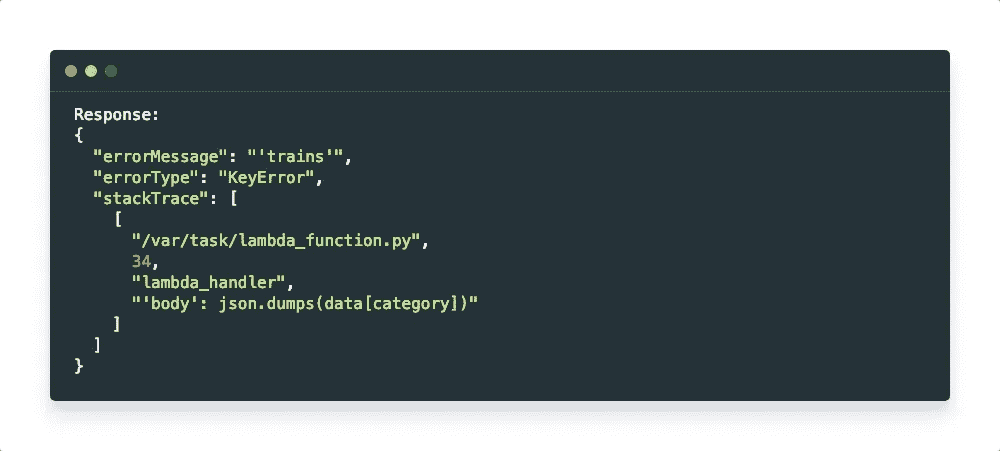

我们可以编写应用程序逻辑来检查是否有一个 KeyError，并在我们的函数中处理这个问题，或者我们可以探索如何首先验证什么到达我们的 Lambda 函数。让我们做后者。(*当然，在严重的情况下，您也可以在函数中进行异常处理)。*

## 设置 API 网关

1.  从 AWS API 网关控制台，点击*创建 API* 。选择 *REST* 作为 API 类型，并将其命名为 *FleetAPI* :

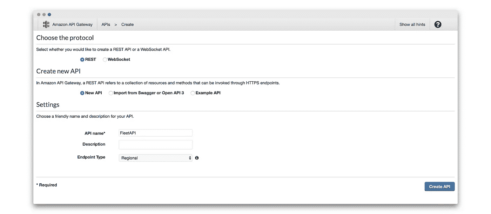

2.设置发布方法。

将*集成类型*设置为 *Lambda 功能*，并确保点击*使用 Lambda 代理集成*。这使得与 Lambda 的集成变得无缝，因为它使请求能够被代理到 Lambda，请求细节在我们的处理函数的事件中可用。在您创建函数的 *Lambda 区域*中选择 *Lambda 函数*。点击*保存*。

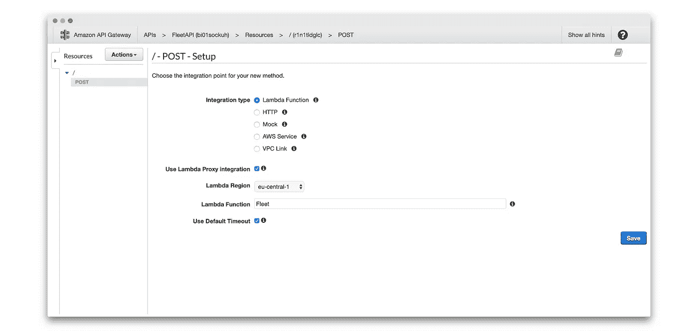

让我们在部署 API 之前测试它。

点击 API Gateway 中的*客户端测试*按钮，并提供一个样本请求主体(注意这是主体本身的 json 对象)，您应该会收到 Lambda 的响应，向我们提供所有汽车的状态:

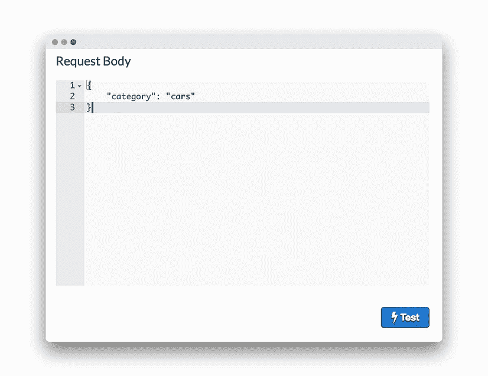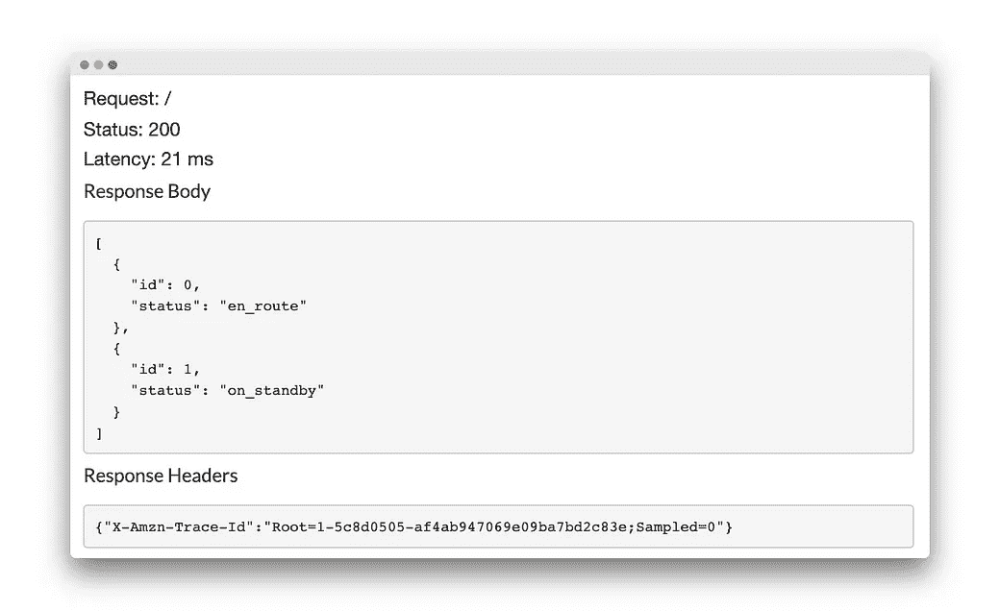

和以前一样，如果我们请求一个不存在的类别，Lambda 函数将不能为我们提供一个成功的响应，而是用一个*内部服务器错误*来响应。

为了避免这种情况，我们需要创建一个模型模式来定义 API 可以接受的主体结构。

## 构建模型架构

这将是一个 JSON 对象，它定义了 HTTP 请求体的预期结构。截至撰写本文时，AWS API Gateway 使用的是 [JSON 模式 *draft-04*](http://json-schema.org/) *。*

在 API Gateway 控制台中选择 *Models* 并创建一个名为 *FleetSchema* 的新模型，其内容如下。

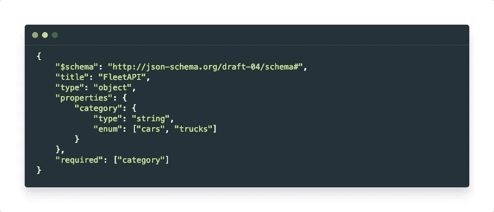

模型模式

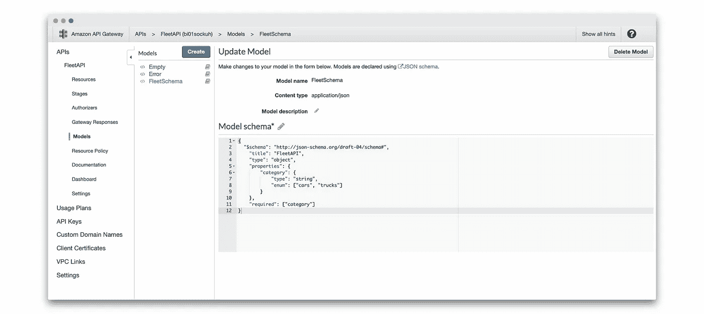

您可以看到 *enum* 键定义了接受的类别— *“汽车”*和*“卡车”*。

值为*类别*的*必需*键定义了*类别*键必须在请求体中传递。

导航到 *POST 方法请求*，设置*请求主体*接受*申请/json* ，并选择我们刚刚创建的 *FleetSchema* 模型:

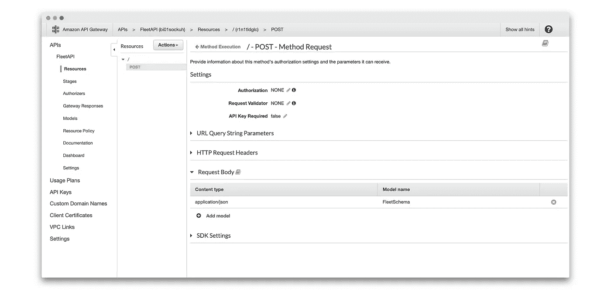

在 *HTTP 请求头*下设置*请求中需要的内容类型*头:

在*请求验证器*下设置验证方法为*验证主体，查询字符串参数和头*:

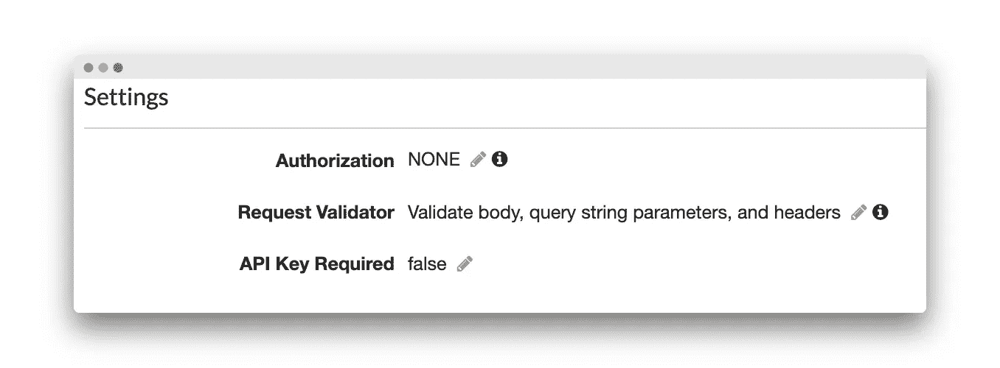

现在，如果您通过提供*“trains”*作为类别来测试 API，请求主体将得到验证，而不是*内部服务器错误*，我们将得到*无效的请求主体*消息。请求没有传递给我们的 Lambda 函数。

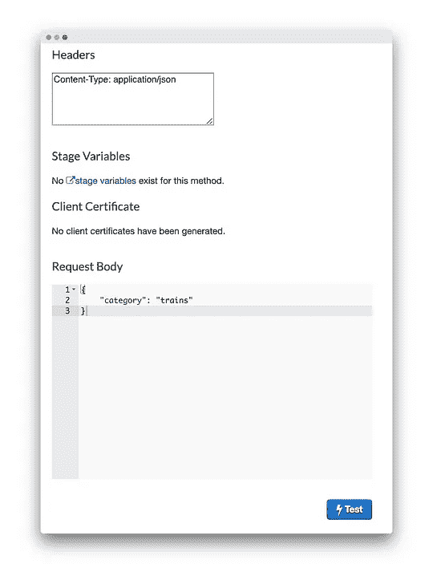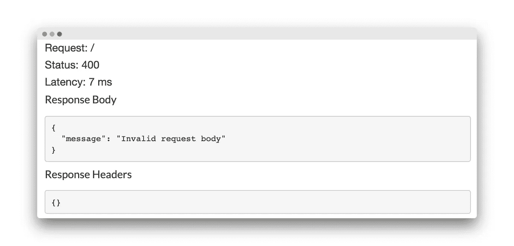

通过一个可接受的类别(*“轿车”*或*“卡车”*)为我们提供了所需的信息。太好了！

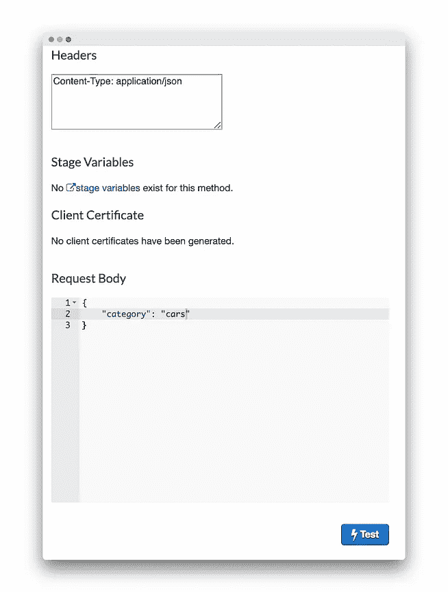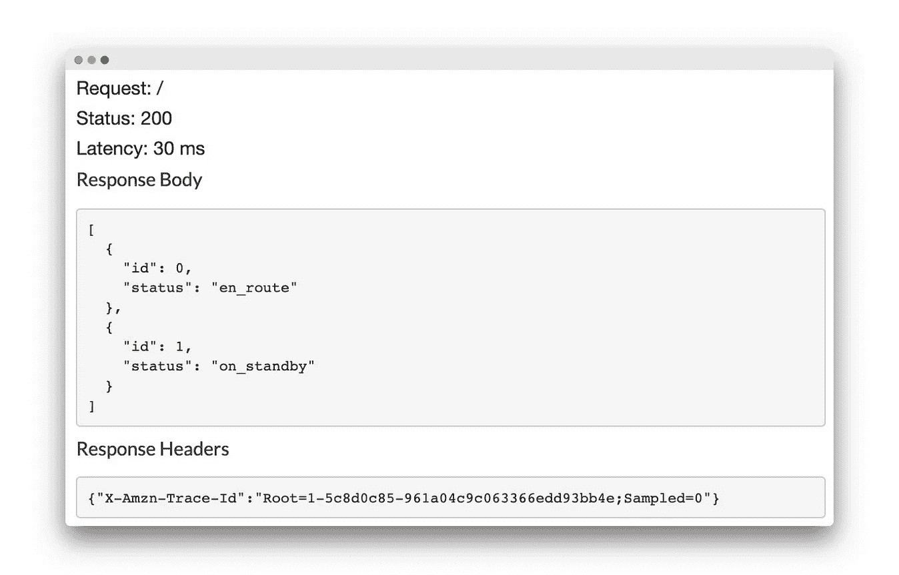

让我们通过点击*动作* > *部署 API 来部署我们的 API。*

创建一个新的*部署阶段*，在本例中我们将其命名为*开发*。

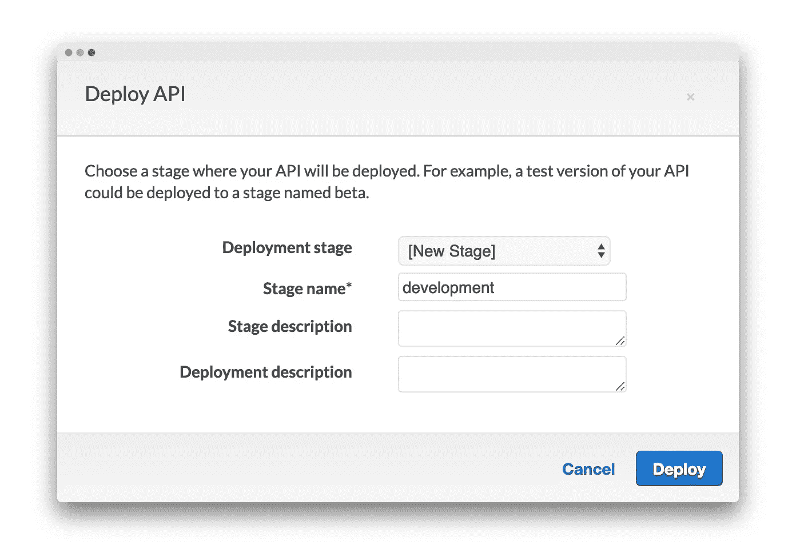

部署之后，我们会得到一个链接来调用我们的 API。

[https://XXXX.execute-api.XXXX.amazonaws.com/development](https://bi01sockuh.execute-api.eu-central-1.amazonaws.com/development)

## 让我们测试部署的 API

我们将使用 curl 调用 API。

通过一个接受的类别，我们得到了所请求车辆的状态:

成功查询

传递未接受的类别会导致请求被拒绝:

不成功的查询

就这些，希望你觉得这个指南有用！如果你有，你可以在这里订阅未来的文章[或者在](https://medium.com/@tiivik) [Twitter](https://twitter.com/tiivik) 上找到我。👏