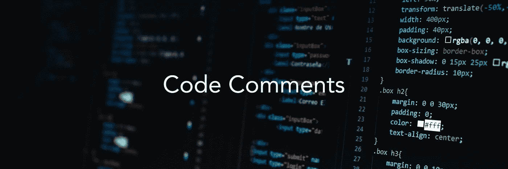

# 如何像专业人士一样写代码注释

> 原文：<https://itnext.io/how-to-write-code-comments-like-a-pro-c830e68cec92?source=collection_archive---------3----------------------->

多年来，我已经多次改变了对代码注释的看法。

在这篇文章中，我将解释我的评论实践(是的，这是一件事:p)是如何发展的，以及我目前推荐的内容，无论你是一名刚毕业的学生，一名经验丰富的开发人员还是一名团队领导。

# 演变

在我作为一名软件开发人员的职业生涯之初，我曾经写了大量的评论来提醒我*为什么*和*事情是如何*工作的。

随着我越来越习惯于重复出现的模式，也越来越习惯于一些库的怪异的(比如:*可怕的*)API，我写的注释越来越少。

这种演变背后的原因是，随着你经验的增长，你越来越不需要关于如何做的解释。

不管你的经验水平如何，基本不变的是需要**理解某些实现细节背后的基本原理/推理**。

对所使用的语言/技术有深刻的理解是关键，但这并不能说明全部。如果没有关于代码意图的提示，事情很快就会变得模糊不清。

我曾经参加过一个非常大的项目，团队中没有人知道为什么系统的某些部分会在那里。这意味着麻烦…

现在，我倾向于写评论来解释为什么一些子系统存在，为什么它们是这样构造的，或者为什么选择了某种数据结构而不是另一种(例如，出于性能原因)。

UML 模式和 wiki 文档对于更高层次的解释也很有用，但是我倾向于避免创建太多这样的东西，因为它们远离代码并且很难维护。

我仍然喜欢用评论来强调“危险区域”。也就是说:代码的关键部分应该只在*小心*的情况下接触。这些都很有用，因为系统中最敏感的代码路径通常都经过了实战测试，并且*能够正常工作*。这并不是说我们不能重构这样的代码，但是必须小心地去做(即使自动化测试已经到位)。有时有一个微妙的错误修复；有时候是表现的问题。

我也经常做的是添加参考文献作为注释；例如，指向正在使用的特定 API 或特性的文档，或者指向相关堆栈溢出问题的指针。

# 为什么写太多评论不是一件好事

作为一名初级开发人员，当代码库中充斥着注释时，你可能会感到安全，因为你会看到大量有用的信息来指导/消除你的疑虑。

虽然，随着时间的推移，你会意识到，这些注释经常与代码不同步。当你多次注意到这一点时，你会开始越来越少关注那些评论；直到你忽略它们。至少这是一种可能的反应。这与破窗理论有关；糟糕/丑陋的代码和缺乏对技术债务的关注也是如此。另一种选择是系统地尝试修复评论，这更好，但也有相关的*成本*。

拥有太多注释的主要问题是那些不“安全”/“类型安全”/“已编译”的注释。除了我们，人类读/写它们，没有什么能确保它们仍然是正确的/相关的。在某种意义上，我们是注释解析器；我们有责任保持它们的相关性。

评论是*元数据*；他们生活在另一个“维度”，独立于代码本身。更重要的是，评论有相关的维护成本。每个注释行实际上都是项目中需要维护的东西。对我来说，代码注释*衰退*也是一种技术债务。

代码库中的注释越多，维护的成本就越大。单单这个事实就是少写*评论*的好理由。

虽然，写评论太少也不好；这总是一个平衡的问题。您至少应该记录重要设计选择背后的基本原理，即系统中存在哪些元素的原因。

诸如作者是谁，文件名是什么，什么时候修改的等等都没有任何意义。源代码控制会处理这些。

版权头也没有任何意义；如果你需要这些，那么把它们从你的代码中拿出来，放到你的构建中。创建一个模板，让您的构建系统在生成的工件中插入您需要的任何通知。

# 关于注释掉的代码的旁注

令人惊讶的是(至少对我来说)，许多有经验的软件工程师倾向于注释掉部分代码，认为他们*可能*需要在以后恢复那些代码或者“重新启用”那些代码。

我当然不是唯一一个这么说的人，但是不要。只是*不要*。注释掉的代码是[纯噪声](https://en.wikipedia.org/wiki/Signal-to-noise_ratio)。不仅如此，甚至*危险*。

另外，**被注释掉的代码仍然是需要维护的代码**。但在大多数情况下，事实并非如此。你看到的注释掉的代码越多，你就越不会注意它。不幸的是，如果您真的决定在一段时间后取消对代码行的注释，那么如果该代码没有与其余代码一起维护，那么它可能会引入 bug(或者更糟)。

每当你想注释掉一些代码的时候，忘掉它吧。不要。删除它。就在那里。

如果代码从未被提交，那就没关系；这只是一个想法；别提了。

如果该代码以前存在于代码库中，那么现在将其完全移除并不意味着它永远消失了。您的源代码控制管理系统正是为此目的而存在的。如果您最终再次需要该代码，那么您将深入到您的项目的历史中，并且您将安全可靠地找到它。

每当我注意到被注释掉的代码，我会毫不犹豫地立即删除它。你也应该这样做。少就是*多就是*。

# 更喜欢用日志语句来解释正在发生的事情

代码注释与维护相关；他们帮助你的队友，你的继任者，甚至你未来的自己了解*为什么*事情在那里，以及架构/设计选择背后的基本原理是什么。

另一方面，正如我上面解释的，详细说明*代码正在做什么的注释大多是无用的、误导性的，并且维护起来成本很高。相反，解释代码正在做什么的日志语句对于任何生产系统都非常有价值。当生产中出现问题时，您会很高兴地发现日志文件中充满了有用的故障排除信息。*

如果您考虑写一个注释来解释代码在做什么，那么您应该添加一个日志语句，以正确的粒度(我很快会写一篇关于这方面的文章！).

如今，当我注意到有太多评论时，我倾向于立即删除那些无用/过时的评论。如果我注意到没有或没有足够的日志记录，那么我会添加一些日志语句。

# 更喜欢编写自动化测试来解释事情是如何工作的

[行为驱动开发(BDD)](https://en.wikipedia.org/wiki/Behavior-driven_development) 就是创造一个对系统如何工作的共同理解。通过应用 BDD，您将创建测试，这些测试同时也是它所覆盖的代码的规格说明。

这太棒了，因为测试与被测试的代码紧密相连，很难让它落后。测试可以和代码的其余部分一起进行静态检查。此外，如果一个测试失败了，那么你知道你要么需要修改规格/测试，要么修复损坏的代码。这不是很好吗？对我来说是的，而且肯定比虚假的评论更有帮助！

帮自己一个忙；每当你想写一个解释“如何做”的评论时，就写测试吧。

顺便说一句，BDD 因为许多其他原因而令人敬畏，所以如果您不熟悉它，请确保阅读一些关于它的文章，并在您的下一个项目中尝试一下。

# 结论

在这篇文章中，我分享了一些关于代码注释的想法。

这听起来可能很无聊，但是这些代表了你项目的一个重要部分。如果它们是相关的和最新的，它们可能是有帮助的，但是当它们过时的时候，它们也可能会分散注意力、误导人或者完全危险。

有用的评论大多是关于为什么，而不是如何。

TLDR；

*   不要写太多评论。当你这样做时，着重解释理由/意图，或者添加重要的警告、外部参考
*   维护注释和代码的其余部分；它们也是“技术债务”的一部分，所以不要忽视它。删除虚假的注释，在修改代码时修改注释
*   为了解释正在发生的事情，最好使用日志语句；这些也将有助于生产故障排除
*   为了解释事物为什么存在以及它们是如何工作的，我更喜欢编写自动化 BDD 测试
*   不要注释掉代码；删除它。如果你看到注释掉的代码，不要犹豫，删除它。

今天到此为止！

# 喜欢这篇文章吗？点击下面“喜欢”按钮查看更多内容，并确保其他人也能看到！

PS:如果你想了解大量关于软件开发、Web 开发、TypeScript、Angular、React、Vue、Kotlin、Java、Docker/Kubernetes 和其他酷主题的其他酷东西，那么不要犹豫，订阅[我的简讯](https://mailchi.mp/fb661753d54a/developassion-newsletter)！