# 在 AWS 上使用基于日志的变更数据捕获(CDC)、Debezium、Apicurio 和 Kafka Connect 来修复数据湖

> 原文：<https://itnext.io/hydrating-a-data-lake-using-log-based-change-data-capture-cdc-with-debezium-apicurio-and-kafka-799671e0012f?source=collection_archive---------0----------------------->

## 使用亚马逊 MSK、Apache Kafka Connect、Debezium、Apicurio Registry 和亚马逊 EKS 将数据从亚马逊 RDS 导入亚马逊 S3

在上一篇文章[中，我们利用](/hydrating-a-data-lake-using-query-based-cdc-with-apache-kafka-connect-and-kubernetes-on-aws-cd4725b58c2e) [Kafka Connect](https://kafka.apache.org/documentation/#connect) 从亚马逊 RDS for PostgreSQL 关系数据库中导出数据，并将数据导入到构建在亚马逊简单存储服务(亚马逊 S3)上的数据湖中。导入到 S3 的数据被转换为 Apache Parquet 列存储文件格式，进行压缩和分区，以实现最佳分析性能，所有这些都使用 Kafka Connect。为了提高数据的新鲜度，当在 PostgreSQL 数据库中添加或更新数据时，Kafka Connect 会自动检测这些更改，并使用基于查询的更改数据捕获(CDC)将它们传输到数据湖中。

[](/hydrating-a-data-lake-using-query-based-cdc-with-apache-kafka-connect-and-kubernetes-on-aws-cd4725b58c2e) [## 在 AWS 上使用基于查询的 CDC 和 Apache Kafka Connect 和 Kubernetes 来补充数据湖

### 使用亚马逊 EKS、亚马逊 MSK 和 Apache Kafka Connect 将数据从亚马逊 RDS 数据库导入到基于亚马逊 S3 的数据湖中

itnext.io](/hydrating-a-data-lake-using-query-based-cdc-with-apache-kafka-connect-and-kubernetes-on-aws-cd4725b58c2e) 

这篇后续文章将研究基于日志的 CDC，这是对基于查询的 CDC 的一个显著改进，可以持续地将变化从 PostgreSQL 数据库传输到数据湖。我们将使用 [Debezium 的 Kafka Connect Source Connector for PostgreSQL](https://debezium.io/documentation/reference/connectors/postgresql.html)来执行基于日志的 CDC，而不是在之前的文章中用于基于查询的 CDC 的 Confluent 的 Kafka Connect JDBC 源连接器。我们将把消息作为 [Apache Avro](https://avro.apache.org/) 存储在 Kafka 中，Kafka 运行在亚马逊管理的 Apache Kafka(亚马逊 MSK)流上。Avro 消息模式将存储在 [Apicurio 注册表](https://www.apicur.io/registry/)中。模式注册中心将与 Kafka Connect 一起运行在 Amazon Elastic Kubernetes 服务(Amazon EKS)上。


这篇文章演示的高级架构

# 变更数据捕获

据参与 Debezium 和 Hibernate 项目的 Red Hat 首席软件工程师 Gunnar Morling 和著名的行业发言人说，有两种类型的[变更数据捕获](https://en.wikipedia.org/wiki/Change_data_capture)——基于查询和基于日志的 CDC。Gunnar 在 2021 年 2 月的 [Joker](https://jokerconf.com/en/) 国际 Java 大会上的演讲中详细介绍了这两种 CDC 的区别，[用 Debezium 和 Kafka Streams](https://youtu.be/-PugtDeJQFs?t=1320) 改变数据捕获管道。

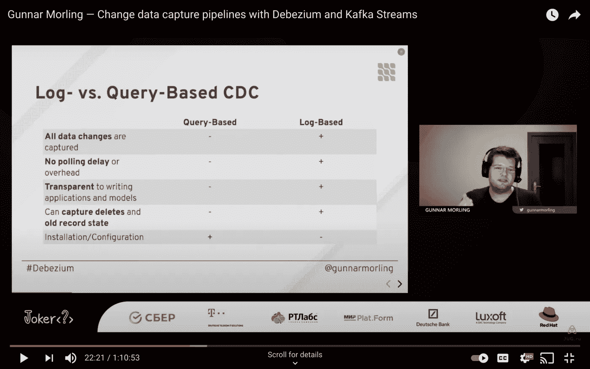

小丑 2021:用 Debezium 和 Kafka 流改变数据捕获管道(图片: [YouTube](https://www.youtube.com/watch?t=1320&v=-PugtDeJQFs&feature=youtu.be) )

你可以在 Rockset 的 Lewis Gavin 最近的帖子中找到对 CDC 的另一个精彩解释，[更改数据捕获:它是什么以及如何使用它](https://rockset.com/blog/change-data-capture-what-it-is-and-how-to-use-it/)。

## 基于查询与基于日志的 CDC

为了展示基于查询的 CDC 和基于日志的 CDC 之间的高级差异，让我们检查用这两种 CDC 方法捕获的简单 SQL UPDATE 语句的结果。

```
UPDATE public.address
**SET address2 = 'Apartment #1234'** WHERE address_id = 105;
```

下面是如何使用在[上一篇文章](/hydrating-a-data-lake-using-query-based-cdc-with-apache-kafka-connect-and-kubernetes-on-aws-cd4725b58c2e)中描述的基于查询的 CDC 方法将这种变化表示为 JSON 消息负载。

```
{
  "address_id": 105,
  "address": "733 Mandaluyong Place",
 **"address2": "Apartment #1234",**  "district": "Asir",
  "city_id": 2,
  "postal_code": "77459",
  "phone": "196568435814",
  "last_update": "2021-08-13T00:43:38.508Z"
}
```

下面是如何使用基于日志的 CDC 和 Debezium 将相同的变化表示为 JSON 消息负载。注意与基于查询的消息相比，基于日志的 CDC 消息的元数据丰富的结构。

```
{
  "after": {
    "address": "733 Mandaluyong Place",
 **"address2": "Apartment #1234",**    "phone": "196568435814",
    "district": "Asir",
    "last_update": "2021-08-13T00:43:38.508453Z",
    "address_id": 105,
    "postal_code": "77459",
    "city_id": 2
  },
  "source": {
    "schema": "public",
    "sequence": "[\"1090317720392\",\"1090317720392\"]",
    "xmin": null,
    "connector": "postgresql",
    "lsn": 1090317720624,
    "name": "pagila",
    "txId": 16973,
    "version": "1.6.1.Final",
    "ts_ms": 1628815418508,
    "snapshot": "false",
    "db": "pagila",
    "table": "address"
  },
 **"op": "u",**  "ts_ms": 1628815418815
}
```

# Avro 和模式注册表

根据[文档](https://avro.apache.org/docs/current/)，Apache Avro 是一种紧凑、快速的二进制数据格式。Avro 依赖于模式。读取 Avro 数据时，写入数据时使用的模式始终存在。这允许写入每个数据时没有每个值的开销，使得序列化既快又小。这也有助于使用动态脚本语言，因为数据及其模式是完全自描述的。

我们可以通过使用像[汇合模式注册中心](https://docs.confluent.io/platform/current/schema-registry/index.html)或 [Apicurio 注册中心](https://www.apicur.io/registry/)这样的模式注册中心将数据从模式中分离出来。根据 Apicurio 的说法，在消息和事件流架构中，发布到主题和队列的数据通常必须使用模式进行序列化或验证(例如， [Apache Avro](https://avro.apache.org/docs/current/) 、 [JSON 模式](https://json-schema.org/)或 [Google 协议缓冲区](https://developers.google.com/protocol-buffers))。当然，模式可以打包在每个应用程序中。尽管如此，在外部系统[schema registry]中注册模式，然后从每个应用程序中引用它们通常是更好的架构模式。

> 在外部系统中注册模式，然后从每个应用程序中引用它们，这通常是更好的架构模式。

使用 Debezium 的 PostgreSQL source 连接器，我们将把 PostgreSQL 数据库的[预写日志](https://debezium.io/documentation/reference/connectors/postgresql.html#postgresql-streaming-changes) (WAL)中的更改存储为 Kafka 中的 Avro，运行在亚马逊 MSK 上。消息的模式将单独存储在 Apicurio 注册表中，而不是与消息一起存储，从而减少 Kafka 中消息的大小，并允许[模式验证](https://www.apicur.io/registry/docs/apicurio-registry/2.0.1.Final/getting-started/assembly-intro-to-the-registry.html#client-serde)和[模式演化](https://docs.confluent.io/platform/current/schema-registry/avro.html)。


显示`pagila.public.film`模式版本的 Apicurio 注册表

# Debezium

据 Debezium 的网站称，它会持续监控你的数据库，并让你的任何应用程序按照提交给数据库的顺序来处理每一个行级的变化。事件流可用于清除缓存、更新搜索索引、生成派生视图和数据，以及保持其他数据源同步。Debezium 是一组分布式服务，可以捕获数据库中行级别的变化。Debezium 在一个事务日志中记录提交给每个数据库表的所有行级更改。然后，每个应用程序读取它们感兴趣的事务日志，并且它们以事件发生的相同顺序看到所有事件。Debezium 构建在 Apache Kafka 之上，并与 Kafka Connect 集成。

Debezium 的最新版本包括对监控 [MySQL 数据库服务器](https://debezium.io/documentation/reference/1.0/connectors/mysql/)、 [MongoDB 副本集或分片集群](https://debezium.io/documentation/reference/1.0/connectors/mongodb/)、 [PostgreSQL 服务器](https://debezium.io/documentation/reference/1.0/connectors/postgresql/)和 [SQL 服务器数据库](https://debezium.io/documentation/reference/1.0/connectors/sqlserver/)的支持。我们将使用 Debezium 的 PostgreSQL 连接器来捕获 Pagila PostgreSQL 数据库中的行级变化。根据 Debezium 的[文档](https://debezium.io/documentation/reference/1.6/connectors/postgresql.html)，第一次连接到 PostgreSQL 服务器或集群时，连接器会对所有模式进行一致的快照。快照完成后，连接器会连续捕获行级更改，这些更改会插入、更新和删除提交到数据库的数据库内容。连接器生成数据变更事件记录，并将它们传输到 Kafka 主题。对于每个表，默认行为是连接器将所有生成的事件流式传输到该表的一个单独的 Kafka 主题。应用程序和服务使用该主题的数据更改事件记录。

# 先决条件

与[上一篇文章](/hydrating-a-data-lake-using-query-based-cdc-with-apache-kafka-connect-and-kubernetes-on-aws-cd4725b58c2e)类似，这篇文章将关注数据移动，而不是如何部署所需的 AWS 资源。要跟进这篇文章，您需要在 AWS 上已经部署和配置了以下资源:

1.  Amazon RDS for PostgreSQL 实例(数据*来源*)；
2.  亚马逊 S3 桶(数据*汇*)；
3.  亚马逊 MSK 集群；
4.  亚马逊 EKS 集群；
5.  亚马逊 RDS 实例和亚马逊 MSK 集群之间的连接；
6.  亚马逊 EKS 集群和亚马逊 MSK 集群之间的连通性；
7.  确保亚马逊 MSK 配置有`auto.create.topics.enable=true`。该设置默认为`false`；
8.  与 Kubernetes 服务帐户(称为 [IRSA](https://docs.aws.amazon.com/eks/latest/userguide/iam-roles-for-service-accounts.html) )相关联的 IAM 角色，将允许从 EKS 访问 MSK 和 S3 ( *见下面的详细信息*)；

如上面的架构图所示，我在同一个 AWS 账户和 AWS 区域`us-east-1`内使用了三个独立的 VPC，分别用于亚马逊 RDS、亚马逊 EKS 和亚马逊 MSK。使用 [VPC 对等](https://docs.aws.amazon.com/vpc/latest/peering/what-is-vpc-peering.html)连接三个 VPC。确保您在亚马逊 RDS、亚马逊 EKS 和亚马逊 MSK 安全组上公开了正确的入口端口和相应的 CIDR 范围。为了增加安全性和节约成本，使用一个 [VPC 端点](https://docs.aws.amazon.com/vpc/latest/privatelink/vpc-endpoints-s3.html)来确保亚马逊 EKS 和亚马逊 S3 之间的私人通信。

# 源代码

这篇文章和上一篇文章的所有源代码，包括 Kafka Connect 和 connector 配置文件以及 Helm 图表，都是开源的，位于 GitHub 上。

[](https://github.com/garystafford/kafka-connect-msk-demo) [## GitHub——garystaf 得起/kafka-connect-msk-demo:对于帖子，使用变更数据为数据湖补水…

### 在这篇文章中，使用变更数据捕获(CDC)、Apache Kafka 和 Kubernetes on AWS-GitHub 来补充数据湖…

github.com](https://github.com/garystafford/kafka-connect-msk-demo) 

# 认证和授权

亚马逊 MSK 提供多种[认证和授权方法](https://docs.aws.amazon.com/msk/latest/developerguide/kafka_apis_iam.html)来与 Apache Kafka APIs 交互。例如，您可以使用 IAM 对客户端进行身份验证，并允许或拒绝 Apache Kafka 操作。或者，您可以使用 TLS 或 SASL/SCRAM 来验证客户端，并使用 Apache Kafka ACLs 来允许或拒绝操作。在我的上一篇文章中，我演示了 SASL/SCRAM 和 Kafka ACLs 在亚马逊 MSK 上的使用:

[](/securely-decoupling-applications-on-amazon-eks-using-kafka-with-sasl-scram-48c340e1ffe9) [## 使用带有 SASL/SCRAM 的 Kafka 安全地解耦亚马逊 EKS 上的应用

### 使用具有 IRSA、SASL/SCRAM 和数据加密的亚马逊 MSK，安全地分离亚马逊 EKS 上基于 Go 的微服务

itnext.io](/securely-decoupling-applications-on-amazon-eks-using-kafka-with-sasl-scram-48c340e1ffe9) 

假设您正确配置了亚马逊 MSK、亚马逊 EKS 和 Kafka Connect，任何 MSK 身份验证和授权都应该与 Kafka Connect 一起工作。在这篇文章中，我们使用 [IAM 访问控制](https://docs.aws.amazon.com/msk/latest/developerguide/iam-access-control.html#kafka-actions)。与 Kubernetes 服务帐户( [IRSA](https://docs.aws.amazon.com/emr/latest/EMR-on-EKS-DevelopmentGuide/setting-up-enable-IAM.html) )相关联的 IAM 角色允许 EKS 使用 IAM 访问 MSK 和 S3(*参见下面的更多细节*)。

# 示例 PostgreSQL 数据库

对于这篇文章，我们将继续使用 PostgreSQL 的 [Pagila 数据库](https://www.postgresql.org/ftp/projects/pgFoundry/dbsamples/pagila/pagila/)。该数据库包含模拟电影租赁数据。数据集相对较小，这使得它不太适合“大数据”用例，但也足够小，可以快速安装并最大限度地降低数据存储和分析查询成本。

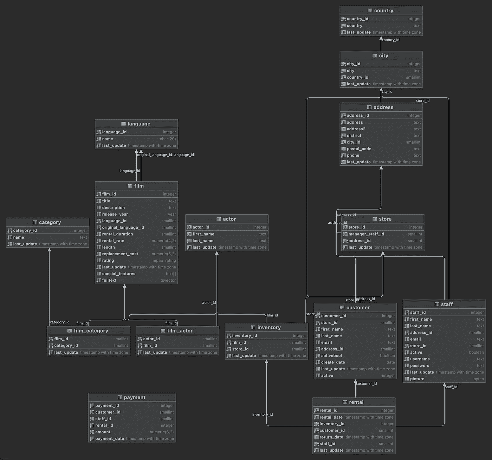

Pagila 数据库模式图

在继续之前，在 Amazon RDS PostgreSQL 实例上创建一个新数据库，并用 Pagila 示例数据填充它。一些人发布了这个数据库的更新版本，带有易于安装的 SQL 脚本。查看 Devrim Gündüz 在 [GitHub](https://github.com/devrimgunduz/pagila) 上提供的 Pagila 脚本，以及 Robert Treat 在 [GitHub](https://github.com/xzilla) 上提供的 pagi la 脚本。

## 上次更新的触发器

Pagila 数据库中的每个表都有一个`last_update`字段。检测 Pagila 数据库变化的一个简单方法是使用`last_update`字段。这是使用基于查询的 CDC 来确定是否以及何时对数据进行了更改的常用技术，如前一篇文章中所演示的。当这些表中的记录发生变化时，现有的数据库函数和每个表的触发器将确保`last_update`字段自动更新到当前日期和时间。你可以在 Dominick Lombardo 的文章 [kafka connect in action，part 3](https://lombardo-chcg.github.io/tools/2017/11/25/database-update-event-stream.html) 中找到关于数据库函数和触发器如何与 Kafka Connect 一起工作的更多信息。

```
CREATE OR REPLACE FUNCTION *update_last_update_column*()
    RETURNS TRIGGER AS
$$
BEGIN
    NEW.last_update = now();
    RETURN NEW;
END;
$$ language 'plpgsql';CREATE TRIGGER update_last_update_column_address
    BEFORE UPDATE
    ON address
    FOR EACH ROW
EXECUTE PROCEDURE *update_last_update_column*();
```

# Kafka 连接和模式注册表

部署和管理 Kafka Connect、Kafka 管理 API 和命令行工具以及 Apicurio 注册表有几个选项。我更喜欢在亚马逊 EKS 的 Kubernetes 上部署一个容器化的解决方案。一些受欢迎的集装箱化卡夫卡选项包括 [Strimzi](https://strimzi.io/) 、[Kubernetes](https://docs.confluent.io/operator/current/overview.html)(CFK)和 [Debezium](https://hub.docker.com/r/debezium/server) 。另一个选择是使用官方的 Apache Kafka 二进制文件构建你自己的 Docker 映像。在这篇文章中，我选择使用最新的 Kafka 二进制文件来构建自己的 Kafka Connect Docker 映像。然后，我将必要的 Confluent 和 Debezium 连接器及其相关的 Java 依赖项安装到 Kafka 安装中。虽然没有使用现成的容器有效，但在我看来，构建自己的映像会教你如何使用 Kafka、Kafka Connect 和 Debezium。

关于模式注册中心，[汇合](https://hub.docker.com/r/confluentinc/cp-schema-registry)和 [Apicurio](https://hub.docker.com/r/apicurio/apicurio-registry-mem) 都提供了容器化的解决方案。Apicurio 有三个版本的注册表，每个版本都有不同的存储机制:内存、SQL 和 Kafka。因为我们已经有一个现有的 Amazon RDS PostgreSQL 实例作为演示的一部分，所以我为这篇文章选择了基于 Apicurio SQL 的 registry Docker 映像，`apicurio/apicurio-registry-sql:2.1.0.Final`。

如果你选择使用我在这篇文章中使用的相同的 Kafka Connect 和 Apicurio 解决方案，这篇文章的 GitHub 资源库中有一个 Helm Chart，`kafka-connect-msk-v2`。Helm chart 将把一个 Kubernetes pod 部署到亚马逊 EKS 上的`kafka`名称空间。pod 由 Kafka Connect 和 Apicurio 注册容器组成。该部署旨在进行演示，而不是设计用于生产。

```
apiVersion: v1
kind: Service
metadata:
  name: kafka-connect-msk
spec:
  type: NodePort
  selector:
    app: kafka-connect-msk
  ports:
    - port: 8080
---
apiVersion: apps/v1
kind: Deployment
metadata:
  name: kafka-connect-msk
  labels:
    app: kafka-connect-msk
    component: service
spec:
  replicas: 1
  strategy:
    type: Recreate
  selector:
    matchLabels:
      app: kafka-connect-msk
      component: service
  template:
    metadata:
      labels:
        app: kafka-connect-msk
        component: service
    spec:
 **serviceAccountName: kafka-connect-msk-iam-serviceaccount**      containers:
        - image: garystafford/kafka-connect-msk:1.1.0
          name: kafka-connect-msk
          imagePullPolicy: IfNotPresent
        - image: apicurio/apicurio-registry-sql:2.1.0.Final
          name: apicurio-registry-mem
          imagePullPolicy: IfNotPresent
          env:
            - name: REGISTRY_DATASOURCE_URL
 **value: jdbc:postgresql://your-pagila-database-url.us-east-1.rds.amazonaws.com:5432/apicurio-registry**            - name: REGISTRY_DATASOURCE_USERNAME
              value: apicurio_registry
            - name: REGISTRY_DATASOURCE_PASSWORD
              value: 1L0v3Kafka!
```

在部署图表之前，在 RDS 实例上创建新的 PostgreSQL 数据库、用户和授权，以便 Apicurio 注册表用于存储:

```
CREATE DATABASE "apicurio-registry";CREATE USER apicurio_registry WITH PASSWORD '1L0v3KafKa!';

GRANT CONNECT, CREATE ON DATABASE "apicurio-registry" to apicurio_registry;
```

用您与 Kafka Connect pod ( `serviceAccountName`)关联的 [Kubernetes 服务帐户](https://kubernetes.io/docs/tasks/configure-pod-container/configure-service-account/)的名称和您的 RDS URL ( `registryDatasourceUrl`)更新 Helm chart 的`value.yaml`文件。附加到与 pod 的服务帐户相关联的 IAM 角色的 IAM 策略应该提供从 EKS 对运行在亚马逊 MSK 集群上的 Kafka 的足够访问。该策略还应该提供对您的 S3 存储桶的访问，如 Confluent 在此处[详述的那样。下面是一个(*过于宽泛* ) IAM 策略的示例，该策略允许完全访问亚马逊 MSK 上运行的任何 Kafka 集群，以及亚马逊 EKS 上运行的 Kafka Connect 中的 S3 bucket。](https://docs.confluent.io/kafka-connect-s3-sink/current/overview.html#iam-policy-for-s3)

变量更新后，使用以下命令部署舵图:

```
helm install kafka-connect-msk-v2 ./kafka-connect-msk-v2 \
  --namespace $NAMESPACE --create-namespace
```

通过检查 pod 的状态确认图表安装成功:

```
kubectl get pods -n kafka -l app=kafka-connect-msk
```

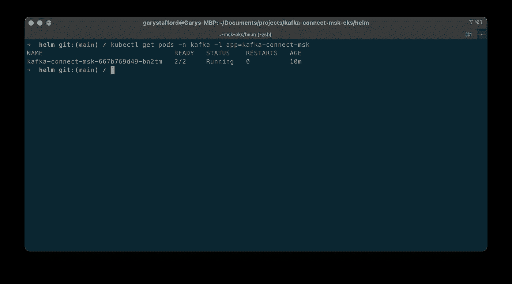

成功运行两个容器且没有错误的 pod 视图

如果您在部署时对任何一个容器有任何问题，请查看单个容器的日志:

```
export KAFKA_CONTAINER=$(
  kubectl get pods -n kafka -l app=kafka-connect-msk | \
    awk 'FNR == 2 {print $1}')kubectl logs $KAFKA_CONTAINER -n kafka kafka-connect-mskkubectl logs $KAFKA_CONTAINER -n kafka apicurio-registry-mem
```

## 卡夫卡连接

使用`kubectl exec`命令获取正在运行的 Kafka Connect 容器的 shell:

```
export KAFKA_CONTAINER=$(
  kubectl get pods -n kafka -l app=kafka-connect-msk | \
    awk 'FNR == 2 {print $1}')kubectl exec -it $KAFKA_CONTAINER -n kafka -c kafka-connect-msk -- bash
```

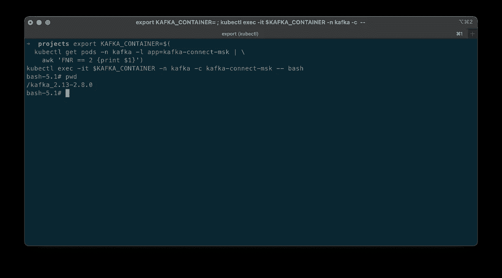

与 EKS 上运行的 Kafka Connect 容器交互

## 确认从 Kafka Connect 访问注册表

如果 Helm 图表部署成功，您现在应该在新的`apicurio-registry`数据库的`public`模式中观察到 11 个新表。下面，我们看到了新的数据库和表格，如 [pgAdmin](https://www.postgresql.org/ftp/pgadmin/pgadmin4/v5.6/macos/) 所示。

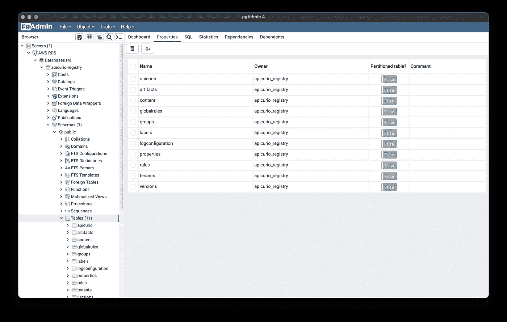

通过调用注册表的`system/info` REST API 端点，确认注册表正在运行并且可以从 Kafka Connect 容器访问:

```
curl -s [http://localhost:8080/apis/registry/v2/system/info](http://localhost:8080/apis/registry/v2/system/info) | jq
```

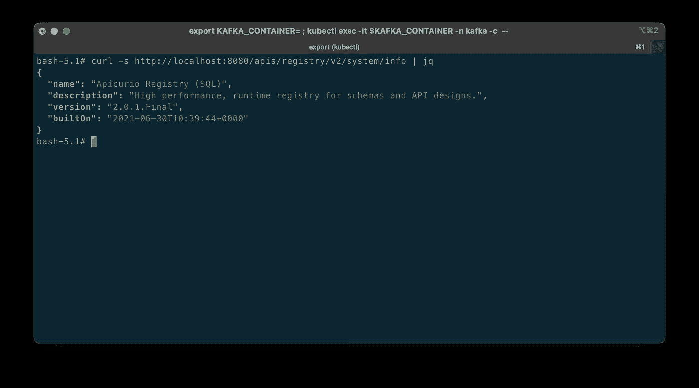

从 Kafka 连接容器调用 Apicurio 注册表的 REST API

Apicurio 注册表的服务目标是 TCP 端口 8080。该服务在 Kubernetes worker 节点的外部 IP 地址的一个静态端口`NodePort`上公开。要获得服务的`NodePort`，使用以下命令:

```
kubectl describe services kafka-client-msk -n kafka
```

要访问 Apicurio Registry 的基于 web 的 UI，将`NodePort`添加到 EKS 节点的安全组，源是您的 IP 地址，一个`/32` CIDR 块。

要获取任何 Amazon EKS 工作节点的外部 IP 地址(`EXTERNAL-IP`)，请使用以下命令:

```
kubectl get nodes -o wide
```

使用`<NodeIP>:<NodePort>`组合从网络浏览器访问用户界面，例如`http://54.237.41.128:30433`。在演示的这一点上，注册表将是空的。

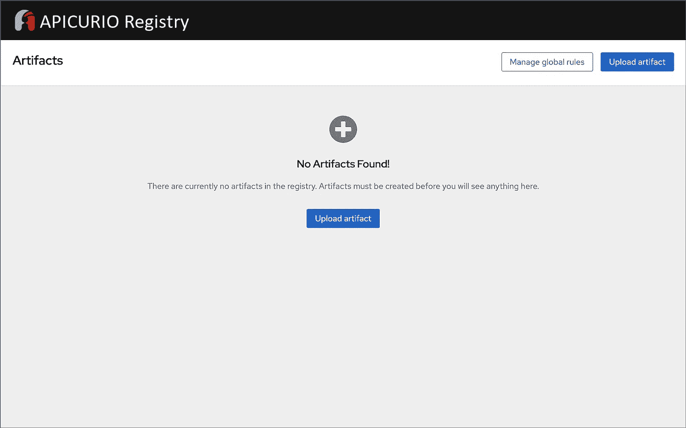

Apicurio 注册表用户界面

## 配置引导代理

在启动 Kafka Connect 之前，您需要修改 Kafka Connect 的配置文件。Kafka Connect 能够以独立或分布式模式运行工作线程。因为我们将使用 Kafka Connect 的分布式模式，修改`config/connect-distributed.properties`文件。我在这篇文章中使用的配置文件的完整示例如下所示。

Kafka Connect 和 schema registry 将在亚马逊 EKS 上运行，而 Kafka 和 Apache ZooKeeper 将在亚马逊 MSK 上运行。更新`bootstrap.servers`属性以反映亚马逊 MSK Kafka Bootstrap Brokers 的逗号分隔列表。要获得 Amazon MSK 集群的引导代理列表，请使用 AWS 管理控制台或以下 AWS CLI 命令:

```
# get the msk cluster's arn
aws kafka list-clusters --query 'ClusterInfoList[*].ClusterArn'# use msk arn to get the brokers
aws kafka get-bootstrap-brokers --cluster-arn **your-msk-cluster-arn**# alternately, if you only have one cluster, then
aws kafka get-bootstrap-brokers --cluster-arn $(
  aws kafka list-clusters | jq -r '.ClusterInfoList[0].ClusterArn')
```

更新`config/connect-distributed.properties`文件。

```
**# ***** CHANGE ME! *****
bootstrap.servers=b-1.your-cluster.123abc.c2.kafka.us-east-1.amazonaws.com:9098,b-2.your-cluster.123abc.c2.kafka.us-east-1.amazonaws.com:9098, b-3.your-cluster.123abc.c2.kafka.us-east-1.amazonaws.com:9098**group.id=connect-clusterkey.converter.schemas.enable=true
value.converter.schemas.enable=trueoffset.storage.topic=connect-offsets
offset.storage.replication.factor=2
#offset.storage.partitions=25config.storage.topic=connect-configs
config.storage.replication.factor=2status.storage.topic=connect-status
status.storage.replication.factor=2
#status.storage.partitions=5offset.flush.interval.ms=10000plugin.path=/usr/local/share/kafka/plugins# kafka connect auth using iam
ssl.truststore.location=/tmp/kafka.client.truststore.jks
security.protocol=SASL_SSL
sasl.mechanism=AWS_MSK_IAM
sasl.jaas.config=software.amazon.msk.auth.iam.IAMLoginModule required;
sasl.client.callback.handler.class=software.amazon.msk.auth.iam.IAMClientCallbackHandler# kafka connect producer auth using iam
producer.ssl.truststore.location=/tmp/kafka.client.truststore.jks
producer.security.protocol=SASL_SSL
producer.sasl.mechanism=AWS_MSK_IAM
producer.sasl.jaas.config=software.amazon.msk.auth.iam.IAMLoginModule required;
producer.sasl.client.callback.handler.class=software.amazon.msk.auth.iam.IAMClientCallbackHandler# kafka connect consumer auth using iam
consumer.ssl.truststore.location=/tmp/kafka.client.truststore.jks
consumer.security.protocol=SASL_SSL
consumer.sasl.mechanism=AWS_MSK_IAM
consumer.sasl.jaas.config=software.amazon.msk.auth.iam.IAMLoginModule required;
consumer.sasl.client.callback.handler.class=software.amazon.msk.auth.iam.IAMClientCallbackHandler
```

为了在执行 Kafka 命令时方便起见，将`BBROKERS`环境变量设置为相同的 Kafka 引导程序代理的逗号分隔列表，例如:

```
export BBROKERS="b-1.your-cluster.123abc.c2.kafka.us-east-1.amazonaws.com:9098,b-2.your-cluster.123abc.c2.kafka.us-east-1.amazonaws.com:9098, b-3.your-cluster.123abc.c2.kafka.us-east-1.amazonaws.com:9098"
```

## 确认从 Kafka Connect 访问亚马逊 MSK

要确认您可以从运行在亚马逊 EKS 上的 Kafka Connect 容器访问运行在亚马逊 MSK 上的 Kafka，请尝试列出现有的 Kafka 主题:

```
bin/kafka-topics.sh --list \
  --bootstrap-server $BBROKERS \
  --command-config config/client-iam.properties
```

你也可以尝试列出现有的卡夫卡消费群体:

```
bin/kafka-consumer-groups.sh --list \
  --bootstrap-server $BBROKERS \
  --command-config config/client-iam.properties
```

如果其中任何一个失败，你可能有网络或安全问题阻止从亚马逊 EKS 到亚马逊 MSK 的访问。检查您的 VPC 对等、路由表、IAM/IRSA 和安全组入口设置。这些项目中的任何一个都可能导致容器和亚马逊 MSK 上运行的 Kafka 之间的通信问题。

## 卡夫卡连接

配置完成后，作为后台进程启动 Kafka Connect。

```
bin/connect-distributed.sh \
  config/connect-distributed.properties > /dev/null 2>&1 &
```

为了确认 Kafka Connect 正确启动，请立即跟踪`connect.log`文件。该日志将捕获任何启动错误，以便进行故障排除。

```
tail -f logs/connect.log
```


显示 Kafka Connect 作为后台进程启动的 Kafka Connect 日志

您还可以使用`ps`命令检查后台进程，以确认 Kafka Connect 正在运行。注意 PID 4915 的过程，如下所示。如有必要，使用`kill`命令和 PID 来停止 Kafka Connect。

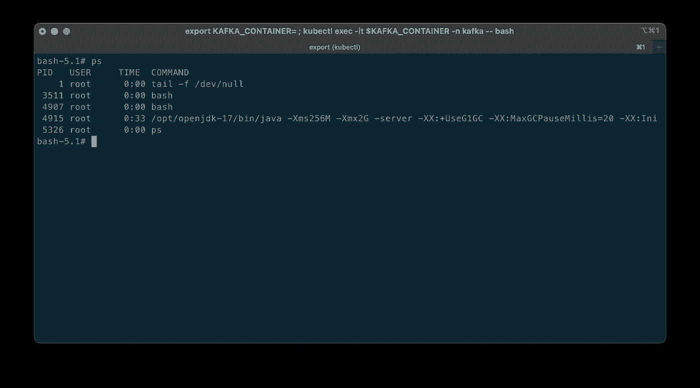

Kafka Connect 作为后台进程运行

如果配置正确，当 Kafka Connect 启动时，Kafka Connect 将创建三个新主题，称为 Kafka Connect 内部主题。主题在`config/connect-distributed.properties`文件中定义:`connect-configs`、`connect-offsets`和`connect-status`。根据[汇合](https://docs.confluent.io/home/connect/userguide.html#kconnect-internal-topics)，Connect 在这些主题中存储连接器和任务配置、偏移和状态。内部主题必须具有高复制系数、压缩清理策略和适当数量的分区。使用以下命令可以确认这些新主题。

```
bin/kafka-topics.sh --list \
  --bootstrap-server $BBROKERS \
  --command-config config/client-iam.properties \
  | grep connect-
```

# Kafka 连接连接器

这篇文章演示了一组 Kafka Connect 源和接收器连接器的使用。源连接器基于 PostgreSQL 的 Debezium 源连接器和 Apicurio 注册表。sink 连接器基于合流[亚马逊 S3 Sink 连接器](https://docs.confluent.io/kafka-connect-s3-sink/current/overview.html)和 Apicurio 注册表。

## 连接器源

创建或修改文件，`config/debezium_avro_source_connector_postgresql_05.json`。更新第 3–6 行，如下所示，以反映您的 RDS 实例连接细节。

源连接器从 Pagila 数据库的`public`模式中的六个相关表中导出现有数据和正在进行的更改:`actor`、`film`、`film_actor`、`category`、`film_category`和`language`。数据将被导入到相应的一组六个新的 Kafka 主题中:`pagila.public.actor`、`pagila.public.film`等等。(*见*上方第 9 行)。

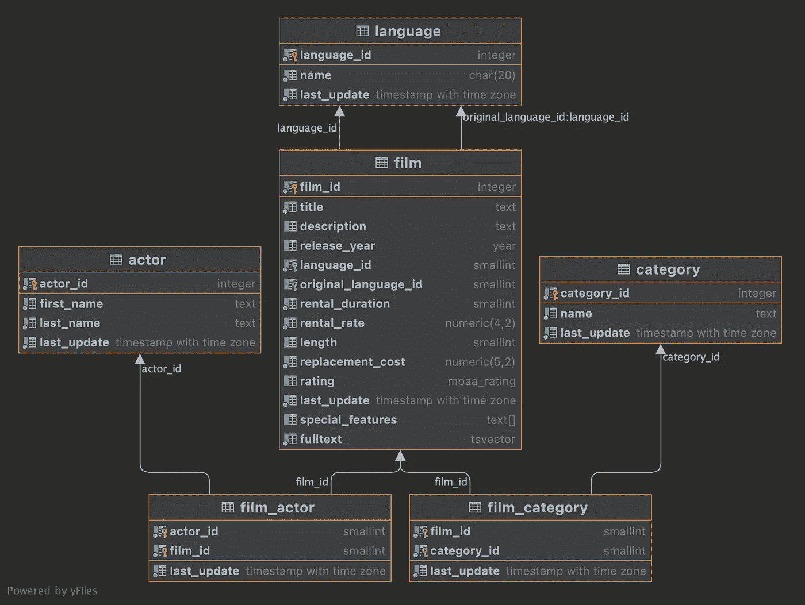

显示要导出的六个表的模式图

表中的数据以 Apache Avro 格式存储在 Kafka 中，模式单独存储在 Apicurio 注册表中(*第 11-18 行，见*)。

## 连接器接收器

创建或修改文件，`config/s3_sink_connector_05_debezium_avro.json`。更新第 7 行，如下所示，以反映您的亚马逊 S3 桶的名称。

接收器连接器每 300 条记录或 60 秒从六个 Kafka 主题向 S3 刷新新数据(*第 4–5、9–10 行，在*上面)。写入 S3 的数据的模式是从 Apicurio 注册表中提取的(*第 17–24 行，在*上面)。

sink connector 通过将 GZIP 压缩的 [Apache Parquet](https://parquet.apache.org/) 文件写入亚马逊 S3，优化了导入 S3 的原始数据，以便进行下游处理。使用 Parquet 的列式文件格式和文件压缩应该有助于针对 S3 的原始数据优化[ELT](https://www.stitchdata.com/resources/what-is-elt/)(*第 12–13 行，在*上面)。

## 部署连接器

使用 Kafka Connect REST 接口部署源和接收器连接器:

```
curl -s -d @"config/debezium_avro_source_connector_postgresql_05.json" \
    -H "Content-Type: application/json" \
    -X PUT http://localhost:8083/connectors/debezium_avro_source_connector_postgresql_05/config | jqcurl -s -d @"config/s3_sink_connector_05_debezium_avro.json" \
    -H "Content-Type: application/json" \
    -X PUT http://localhost:8083/connectors/s3_sink_connector_05_debezium_avro/config | jq
```

## 确认部署

使用以下命令确认新的连接器集已部署并正确运行。

```
curl -s -X GET http://localhost:8083/connectors | jqcurl -s -H "Content-Type: application/json" \
    -X GET http://localhost:8083/connectors/debezium_avro_source_connector_postgresql_05/status | jqcurl -s -H "Content-Type: application/json" \
    -X GET http://localhost:8083/connectors/s3_sink_connector_05_debezium_avro/status | jq
```

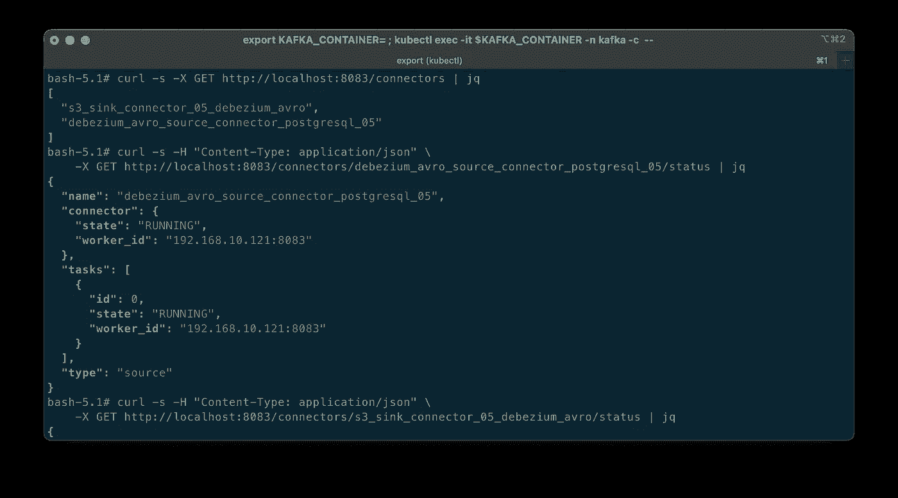

Kafka 连接源和接收器连接器成功运行

存储在 Apicurio 注册表中的项目，例如事件模式和 API 设计，被称为注册表*工件*。如果我们重新访问 Apicurio 注册表的 UI，我们应该观察到 12 个工件——从 Pagila 数据库导出的 6 个表中的每一个都有一个“key”和“value”工件。

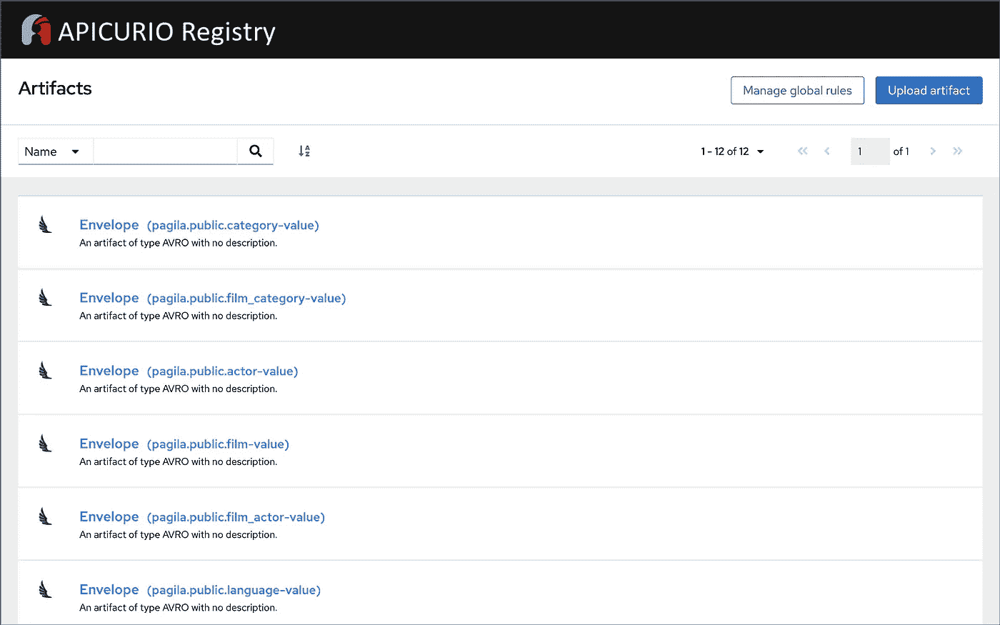

检查亚马逊 S3，您应该注意到在按主题名组织的`/topics/`对象关键字前缀中有六组 S3 对象。

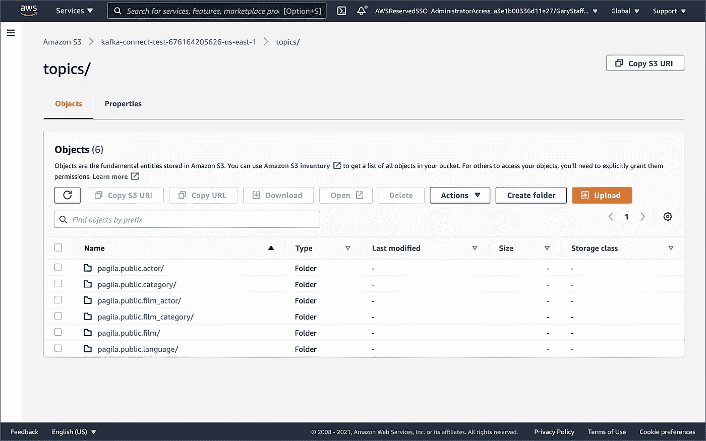

亚马逊 S3 桶显示卡夫卡连接 S3 接收器连接器的结果，按主题名称组织

在每个主题名称键中，应该有一组 GZIP 压缩的拼花文件。

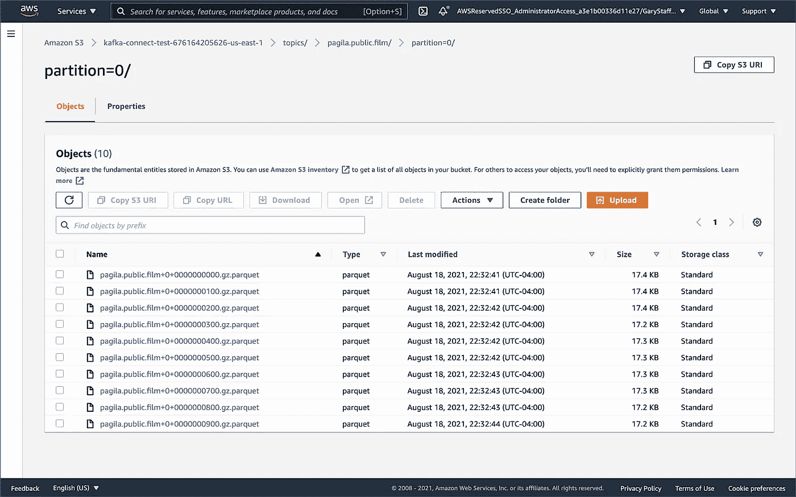

显示 GZIP 压缩的 Apache 拼花格式文件的亚马逊 S3 桶

再次使用亚马逊 S3 控制台的“用 S3 选择查询”来查看拼花格式文件中包含的数据。或者，您可以将 AWS CLI 与`s3` API 一起使用:

```
export SINK_BUCKET="your-s3-bucket"export KEY="topics/pagila.public.film/partition=0/pagila.public.film+0+0000000000.gz.parquet"aws s3api select-object-content \
    --bucket $SINK_BUCKET \
    --key $KEY \
    --expression "select * from s3object limit 5" \
    --expression-type "SQL" \
    --input-serialization '{"Parquet": {}}' \
    --output-serialization '{"JSON": {}}' "output.json" \
  && cat output.json | jq \
  && rm output.json
```

在下面的示例数据中，请注意基于日志的 CDC 消息的元数据丰富的结构，与我们在上一篇文章中观察到的基于查询的消息相比:

```
{
  "after": {
    "special_features": [
      "Deleted Scenes",
      "Behind the Scenes"
    ],
    "rental_duration": 6,
    "rental_rate": 0.99,
    "release_year": 2006,
    "length": 86,
    "replacement_cost": 20.99,
    "rating": "PG",
    "description": "A Epic Drama of a Feminist And a Mad Scientist who must Battle a Teacher in The Canadian Rockies",
    "language_id": 1,
    "title": "ACADEMY DINOSAUR",
    "original_language_id": null,
    "last_update": "2017-09-10T17:46:03.905795Z",
    "film_id": 1
  },
  "source": {
    "schema": "public",
    "sequence": "[null,\"1177089474560\"]",
    "xmin": null,
    "connector": "postgresql",
    "lsn": 1177089474560,
    "name": "pagila",
    "txId": 18422,
    "version": "1.6.1.Final",
    "ts_ms": 1629340334432,
    "snapshot": "true",
    "db": "pagila",
    "table": "film"
  },
  "op": "r",
  "ts_ms": 1629340334434
}
```

# 基于日志的 CDC 的数据库更改

当我们更改 Debezium 和 Kafka Connect 正在监控的表中的数据时会发生什么？为了回答这个问题，让我们对 Pagila 数据库做一些 [DML](https://www.geeksforgeeks.org/sql-ddl-dql-dml-dcl-tcl-commands/) 更改:插入、更新和删除:

```
INSERT INTO public.category (name)
VALUES ('Techno Thriller');UPDATE public.film
SET release_year = 2021,
    rental_rate  = 2.99
WHERE film_id = 1;UPDATE public.film
SET rental_duration = 3
WHERE film_id = 2;UPDATE public.film_category
SET category_id = (
    SELECT DISTINCT category_id
    FROM public.category
    WHERE name = 'Techno Thriller')
WHERE film_id = 3;UPDATE public.actor
SET first_name = upper('Kate'),
    last_name  = upper('Winslet')
WHERE actor_id = 6;DELETE
FROM public.film_actor
WHERE film_id = 375;
```

要了解这些变化是如何传播的，首先，检查 Kafka Connect 日志。下面，我们将看到与上面显示的一些数据库更改相对应的示例日志事件。Kafka Connect 源连接器检测更改，然后将更改从 PostgreSQL 导出到 Kafka。然后，接收器连接器将这些更改写入亚马逊 S3。

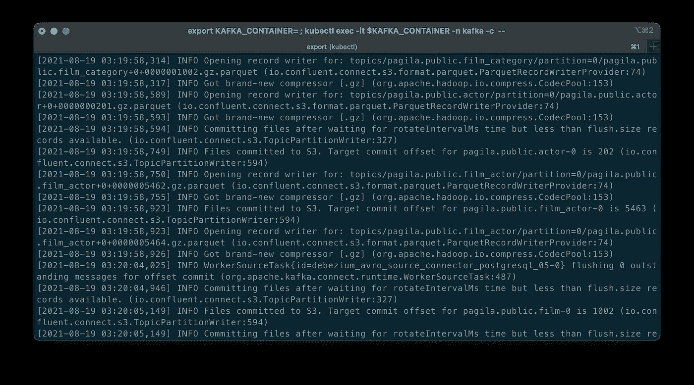

Kafka 连接日志显示正在导出/导入的 Pagila 数据库的更改

我们可以查看 S3 存储桶，它现在应该有与我们的更改相对应的新拼花文件。例如，我们用 1 的`film_id`对电影记录进行的两次更新。注意操作是更新(`"op": "u"`)和数据出现在`after`块中。

```
{
  "after": {
    "special_features": [
      "Deleted Scenes",
      "Behind the Scenes"
    ],
    "rental_duration": 6,
 **"rental_rate": 2.99,
    "release_year": 2021,**    "length": 86,
    "replacement_cost": 20.99,
    "rating": "PG",
    "description": "A Epic Drama of a Feminist And a Mad Scientist who must Battle a Teacher in The Canadian Rockies",
    "language_id": 1,
    "title": "ACADEMY DINOSAUR",
    "original_language_id": null,
    "last_update": "2021-08-19T03:19:57.073053Z",
    "film_id": 1
  },
  "source": {
    "schema": "public",
    "sequence": "[\"1177693455424\",\"1177693455424\"]",
    "xmin": null,
    "connector": "postgresql",
    "lsn": 1177693471392,
    "name": "pagila",
    "txId": 18445,
    "version": "1.6.1.Final",
    "ts_ms": 1629343197100,
    "snapshot": "false",
    "db": "pagila",
    "table": "film"
  },
 **"op": "u",**  "ts_ms": 1629343197389
}
```

在另一个例子中，我们看到在`film_actor`表中删除了`film_id`为 375 的记录。注意操作是删除(`"op": "d"`)和`before`程序块的存在，但没有`after`程序块。

```
{
 **"before": {
    "last_update": "1970-01-01T00:00:00Z",
    "actor_id": 5,
    "film_id": 375
  },**  "source": {
    "schema": "public",
    "sequence": "[\"1177693516520\",\"1177693516520\"]",
    "xmin": null,
    "connector": "postgresql",
    "lsn": 1177693516520,
    "name": "pagila",
    "txId": 18449,
    "version": "1.6.1.Final",
    "ts_ms": 1629343198400,
    "snapshot": "false",
    "db": "pagila",
    "table": "film_actor"
  },
 **"op": "d",**  "ts_ms": 1629343198426
}
```

# Debezium 事件扁平化 SMT

上面在 S3 展示的 Debezium 消息结构面临的挑战是负载的冗长性和数据的嵌套性。因此，针对此类记录开发 SQL 查询会很困难。例如，给定上面显示的消息结构，即使是 Amazon Athena 中最简单的查询也会变得非常复杂:

```
SELECT after.actor_id, after.first_name, after.last_name, after.last_update
FROM 
    (SELECT *,
         ROW_NUMBER()
        OVER ( PARTITION BY after.actor_id
    ORDER BY  after.last_UPDATE DESC) AS row_num
    FROM "pagila_kafka_connect"."pagila_public_actor") AS x
WHERE x.row_num = 1
ORDER BY after.actor_id;
```

为了专门解决不同消费者的需求，Debezium 提供了[事件扁平化单消息转换](https://debezium.io/documentation/reference/configuration/event-flattening.html) (SMT)。事件扁平化转换是一个 [Kafka Connect SMT](https://kafka.apache.org/documentation/#connect_transforms) 。我们在上一篇文章中讨论了 Kafka Connect SMTs。使用事件扁平化 SMT，我们可以使 Kafka 接收到的消息更适合我们数据湖的特定消费者。要实现事件扁平化 SMT，请修改并重新部署源连接器，添加额外的配置(*第 19–23 行，在*下面)。

我们将在转换后的消息中包含`op`、`db`、`schema`、`lsn`和`source.ts_ms`元数据字段，以及实际的记录数据(`table`)。这意味着我们已经选择从消息中排除所有其他字段。转换将使消息的嵌套结构变平。

通过添加转换对消息结构进行这种更改会导致消息模式的新版本被源连接器自动添加到 Apicurio 注册表中:


显示修订版`pagila.public.film`模式的 Apicurio 注册表

由于源连接器对 SMT 的事件扁平化，我们的消息结构得到了显著简化:

```
{
  "actor_id": 7,
  "first_name": "BOB",
  "last_name": "MOSTEL",
  "last_update": "2021-08-19T21:01:55.090858Z",
  "__op": "u",
  "__db": "pagila",
  "__schema": "public",
  "__table": "actor",
  "__lsn": 1191920555344,
  "__source_ts_ms": 1629406915091,
  "__deleted": "false"
}
```

注意新的`__deleted`字段，它来自源连接器配置的第 21–22 行，如上所示。Debezium 为事件流中的删除操作保留 tombstone 记录，并添加`__deleted`，设置为`true`或`false`。下面，我们看一个在`film_actor`表上的两个删除操作的例子。

```
{
  "actor_id": 52,
  "film_id": 376,
  "last_update": "1970-01-01T00:00:00Z",
  "__op": "d",
  "__db": "pagila",
  "__schema": "public",
  "__table": "film_actor",
  "__lsn": 1192390296016,
  "__source_ts_ms": 1629408869556,
 **"__deleted": "true"** }
{
  "actor_id": 60,
  "film_id": 376,
  "last_update": "1970-01-01T00:00:00Z",
  "__op": "d",
  "__db": "pagila",
  "__schema": "public",
  "__table": "film_actor",
  "__lsn": 1192390298976,
  "__source_ts_ms": 1629408869556,
 **"__deleted": "true"** }
```

# 查看数据湖中的数据

在我们的数据湖中检查现有数据和正在发生的数据变化的一种便捷方式是[抓取](https://docs.aws.amazon.com/glue/latest/dg/add-crawler.html)并用 [AWS Glue](https://docs.aws.amazon.com/glue/latest/dg/what-is-glue.html) 对 S3 桶的内容进行编目，然后用 [Amazon Athena](https://docs.aws.amazon.com/athena/latest/ug/what-is.html) 查询结果。AWS Glue 的数据目录是一个与 Apache Hive 兼容的、完全管理的、持久的元数据存储。AWS Glue 可以在 S3 存储我们数据的模式、元数据和位置。Amazon Athena 是一个无服务器的[基于 Presto](https://prestodb.io/) 的( [PrestoDB](https://prestodb.io/) ) ad-hoc 分析引擎，可以查询 AWS Glue 数据目录表和底层基于 S3 的数据。

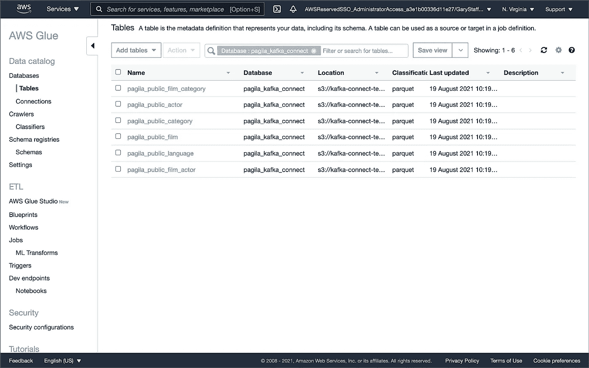

显示六个新表格的 AWS 粘合数据目录(metastore)

在 Glue 中抓取并编目数据后，让我们对 Pagila 数据库的`film`表进行一些额外的更改。

```
UPDATE public.film
SET release_year = 2019,
    rental_rate  = 3.99
WHERE film_id = 1;

UPDATE public.film
SET rental_duration = 4
WHERE film_id = 2;

UPDATE public.film
SET rental_duration = 7
WHERE film_id = 2;INSERT INTO public.category (name)
VALUES ('Steampunk');UPDATE public.film_category
SET category_id = (
    SELECT DISTINCT category_id
    FROM public.category
    WHERE name = 'Steampunk')
WHERE film_id = 3;UPDATE public.film
SET release_year = 2017,
    rental_rate  = 3.99
WHERE film_id = 4;UPDATE public.film_actor
SET film_id = 100
WHERE film_id = 5;

UPDATE public.film_category
SET film_id = 100
WHERE film_id = 5;

UPDATE public.inventory
SET film_id = 100
WHERE film_id = 5;

DELETE
FROM public.film
WHERE film_id = 5;
```

通过使用 Amazon Athena 执行查询，我们应该能够几乎立即观察到这些数据库变化。根据连接器配置，Kafka Connect 会在几秒钟或更短的时间内将更改从 PostgreSQL 传播到 Kafka，再传播到 S3。在 Athena 中执行一个典型的查询将返回所有的原始记录以及我们所做的任何更新或删除，作为重复记录(记录等同于`film_id`主键)。

```
SELECT film_id, title, release_year, rental_rate, rental_duration,
         date_format(from_unixtime(__source_ts_ms/1000), '%Y-%m-%d %h:%i:%s') AS timestamp
FROM "pagila_kafka_connect"."pagila_public_film"
ORDER BY film_id, timestamp
```

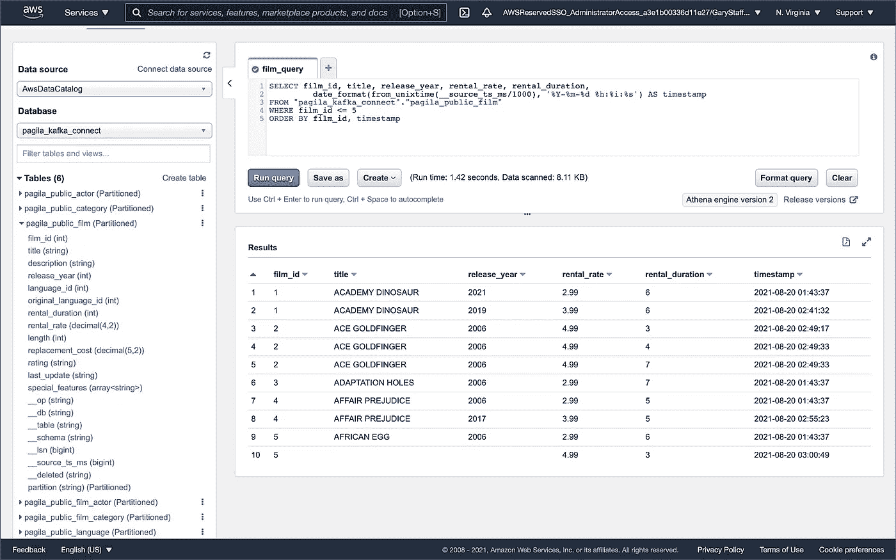

Amazon Athena 显示 SQL 查询和带有重复记录的结果集

请注意原始记录以及我们之前所做的每个更改。根据 [Debezium](https://debezium.io/documentation/reference/1.6/connectors/postgresql.html#postgresql-meta-information) ，从`__source_ts_ms`元数据字段导出的`timestamp`字段表示提交事务的服务器时间。另外，请注意查询结果中那些`film_id`为 5 的记录——我们从`film`表中删除的记录。在最新记录中，字段值(*大部分是*)为空，除了在 Pagila 表定义中具有默认值的任何字段。如果在字段上设置了默认值(例如，`rental_duration smallint default 3 not null`或`rental_rate numeric(4,2) default 4.99 not null`),则在使用事件平展 SMT 时，这些值最终会出现在已删除的记录中。除了给 tombstone 记录增加额外的大小之外，它不会产生任何负面影响(*不清楚这是 Debezium 的预期行为还是 WAL 条目的产物*)。

要仅查看*最新的数据并忽略已删除的记录，我们可以使用`ROW_NUMBER()` [函数](https://prestodb.io/docs/current/release/release-0.75.html#row-number-optimizations)并添加一个谓词来检查`__deleted`字段的值:*

```
SELECT film_id, title, release_year, rental_rate, rental_duration,
         date_format(from_unixtime(__source_ts_ms/1000), '%Y-%m-%d %h:%i:%s') AS timestamp
FROM 
    (SELECT *,
         ROW_NUMBER()
        OVER ( PARTITION BY film_id
    ORDER BY  __source_ts_ms DESC) AS row_num
    FROM "pagila_kafka_connect"."pagila_public_film") AS x
WHERE x.row_num = 1
    AND __deleted != 'true'
ORDER BY film_id
```

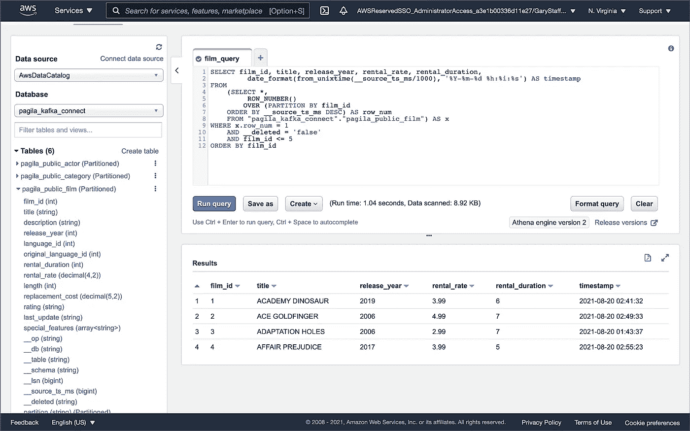

Amazon Athena 显示 SQL 查询和带有最新记录的结果集

现在，我们只看到最新的记录，包括删除任何已删除的记录。虽然这种方法对于单个记录集是有效的，但是在我看来，这个查询太复杂了，不适用于复杂的连接和聚合。

# 数据传送

使用 Amazon Athena，我们可以轻松地将我们的`ROW_NUMBER()`查询结果写回到数据湖中，以便进一步丰富或分析。Athena 的`CREATE TABLE AS SELECT` ( [CTAS](https://docs.aws.amazon.com/athena/latest/ug/ctas.html) ) SQL 语句根据子查询中`SELECT`语句的结果在 Athena(AWS 粘合数据目录中的外部表)中创建新表。Athena 将 CTAS 语句创建的数据文件存储在 Amazon S3 的指定位置，并创建一个新的 AWS Glue 数据目录表来存储结果集的模式和元数据信息。CTAS 支持多种文件格式和存储选项。


这篇文章演示的高级架构

将最后一个查询包装在 Athena 的 CTAS 语句中，如下所示，我们可以将查询结果作为快速压缩的 Parquet 格式文件写入亚马逊 S3 桶中的一个新位置，该文件由电影`rating`进行分区。使用[通用数据湖术语](https://www.jamesserra.com/archive/2019/10/databricks-delta-lake/)，我将通过 Kafka 将过滤和清理后的数据集称为*精炼的*或*银的*，而不是来自我们的数据源 PostgreSQL 的*原始摄取的*或*青铜的*数据。

```
CREATE TABLE pagila_kafka_connect.pagila_public_film_refined
WITH (
  format='PARQUET',
  parquet_compression='SNAPPY',
  partitioned_by=ARRAY['rating'],
  external_location='s3://my-s3-table/refined/film/'
) AS
SELECT film_id, title, release_year, rental_rate, rental_duration,
         date_format(from_unixtime(__source_ts_ms/1000), '%Y-%m-%d %h:%i:%s') AS timestamp, rating
FROM 
    (SELECT *,
         ROW_NUMBER()
        OVER ( PARTITION BY film_id
    ORDER BY  __source_ts_ms DESC) AS row_num
    FROM "pagila_kafka_connect"."pagila_public_film") AS x
WHERE x.row_num = 1
    AND __deleted = 'false'
ORDER BY film_id
```

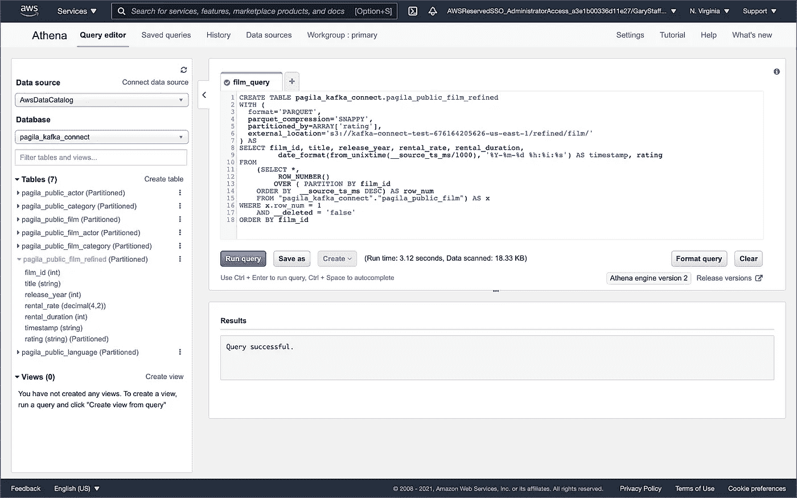

Amazon Athena 在左侧显示 CTAS 语句和生成的新表

再次检查亚马逊 S3 桶，您应该观察到在`/refined/film/`键路径中由`rating`划分的一组新的 S3 对象。

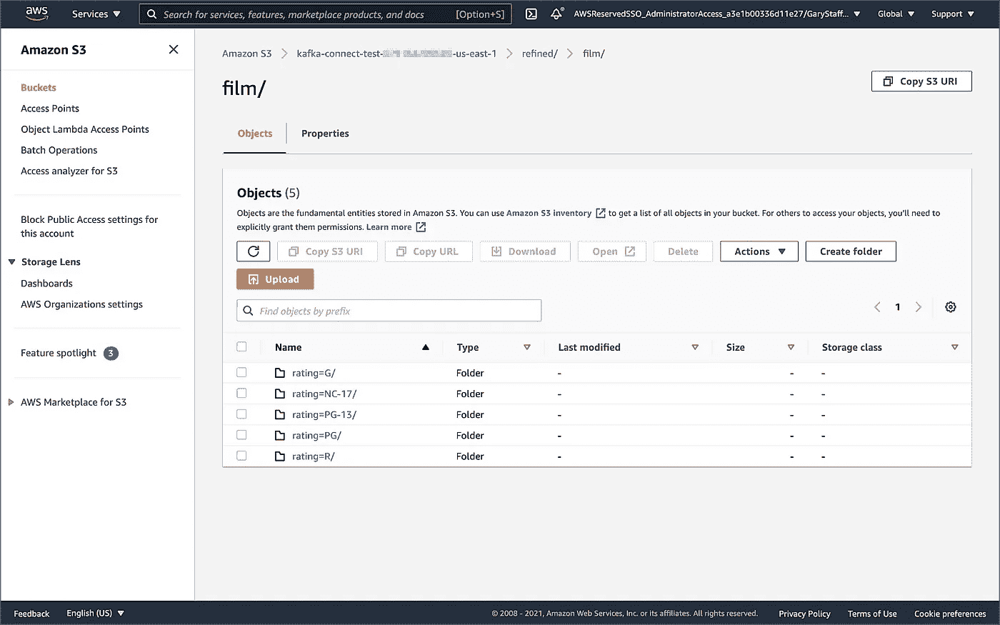

显示 CTAS 报表结果的亚马逊 S3 存储桶

我们还应该在同一个 AWS Glue 数据目录中看到一个新表，其中包含我们使用 CTAS 语句写入 S3 的数据的元数据、位置和模式信息。我们可以在*细化的*数据集上执行额外的查询。

```
SELECT *
FROM "pagila_kafka_connect"."pagila_public_film_refined"
ORDER BY film_id
```

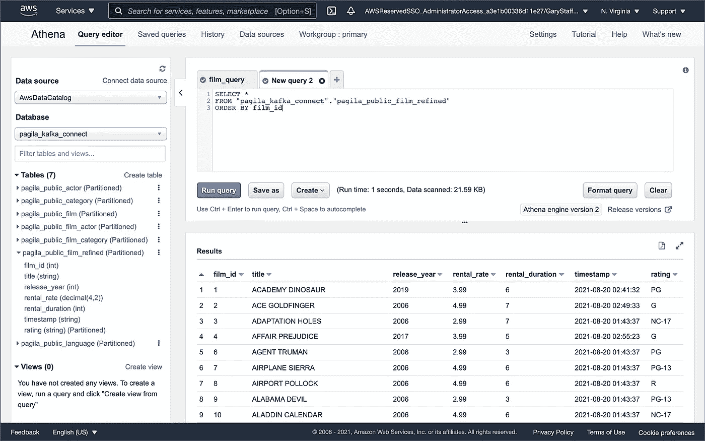

Amazon Athena 显示了来自精确电影数据的查询结果

# 数据湖中的 CRUD 操作

为了充分利用 CDC 并最大化数据湖中数据的新鲜度，我们还需要采用现代数据湖文件格式，如 [Apache 胡迪](https://hudi.apache.org/)、 [Apache 冰山](https://iceberg.apache.org/)或 [Delta 湖](https://delta.io/)，以及分析引擎，如 [Apache Spark](https://spark.apache.org/) 和 [Spark 结构化流](https://spark.apache.org/docs/latest/structured-streaming-programming-guide.html)来处理数据变化。使用这些技术，可以在像亚马逊 S3 这样的对象存储中执行记录级的数据增删。胡迪、Iceberg 和 Delta Lake 提供的功能包括 ACID 事务、模式演化、增插、删除、时间旅行和数据湖中的增量数据消耗。像 Spark 这样的 ELT 引擎可以从 Kafka 读取流 Debezium 生成的 CDC 消息，并使用胡迪、冰山或三角洲湖处理这些变化。

# 结论

这篇文章探讨了基于日志的 CDC 如何帮助我们将来自亚马逊 RDS 数据库的数据合并到基于亚马逊 S3 的数据湖中。我们利用了亚马逊 MSK、亚马逊 EKS、Apache Kafka Connect、Debezium、Apache Avro 和 Apicurio Registry 的功能。在随后的帖子中，我们将了解数据湖文件格式，如 Apache 胡迪、Apache Iceberg 和 Delta Lake，以及 Apache Spark 结构化流，如何帮助我们积极管理数据湖中的数据。

这篇博客代表我自己的观点，而不是我的雇主亚马逊网络服务公司(AWS)的观点。所有产品名称、徽标和品牌都是其各自所有者的财产。