# 在 AWS 上使用基于查询的 CDC 和 Apache Kafka Connect 和 Kubernetes 来补充数据湖

> 原文：<https://itnext.io/hydrating-a-data-lake-using-query-based-cdc-with-apache-kafka-connect-and-kubernetes-on-aws-cd4725b58c2e?source=collection_archive---------2----------------------->

## 使用亚马逊 EKS、亚马逊 MSK 和 Apache Kafka Connect 将数据从亚马逊 RDS 数据库导入到基于亚马逊 S3 的数据湖中

根据 AWS 的说法，数据湖是一个集中的存储库，允许你存储任何规模的结构化和非结构化数据。数据从多个来源收集，并转移到数据湖中。一旦进入数据湖，数据就会被组织、编目、转换、丰富并转换为常见的文件格式，为分析和机器学习进行优化。

组织在构建数据湖时首先面临的挑战之一是如何从不同的数据源持续导入数据，如关系和非关系数据库引擎、企业 ERP、SCM、CRM 和 SIEM 软件、平面文件、消息传递平台、物联网设备以及日志和指标收集系统。每个数据源都有自己独特的连接方法、安全性、数据存储格式和数据导出功能。有许多闭源和开源工具可以帮助从不同的数据源提取数据。

一个流行的开源工具是 [Kafka Connect](https://kafka.apache.org/documentation/#connect) ，它是 [Apache Kafka](https://kafka.apache.org/) 生态系统的一部分。Apache Kafka 是一个开源的分布式事件流平台，被数千家公司用于高性能数据管道、流分析、数据集成和任务关键型应用程序。Kafka Connect 是一个工具，用于在 Apache Kafka 和其他系统之间可扩展和可靠地传输数据。Kafka Connect 使得快速定义将大量数据移入和移出 Kafka 的连接器*变得简单。*

在接下来的文章中，我们将学习如何使用 Kafka Connect 将数据从我们的数据源(一个用于 PostgreSQL 的关系数据库 [Amazon RDS)导出到 Kafka。然后，我们会将 Kafka 中的数据导出到我们的数据接收器中——一个建立在亚马逊简单存储服务(亚马逊 S3)上的数据湖。导入 S3 的数据将被转换为](https://aws.amazon.com/rds/postgresql/) [Apache Parquet](https://parquet.apache.org/) 列存储文件格式，进行压缩和分区，以实现最佳分析性能，所有这些都使用 Kafka Connect。

最重要的是，为了保持数据湖的数据新鲜度，当在 PostgreSQL 中添加或更新数据时，Kafka Connect 会自动检测这些变化，并将这些变化传输到数据湖中。这个过程通常被称为[变更数据捕获](https://en.wikipedia.org/wiki/Change_data_capture) (CDC)。


这篇文章演示的高级架构

# 变更数据捕获

据参与 Debezium 和 Hibernate 项目的 Red Hat 首席软件工程师 Gunnar Morling 和著名的行业发言人说，有两种类型的[变更数据捕获](https://en.wikipedia.org/wiki/Change_data_capture)——基于查询和基于日志的 CDC。Gunnar 在 2021 年 2 月的 [Joker](https://jokerconf.com/en/) 国际 Java 大会上的演讲中详细介绍了这两种 CDC 的区别，[用 Debezium 和 Kafka Streams](https://youtu.be/-PugtDeJQFs?t=1320) 改变数据捕获管道。

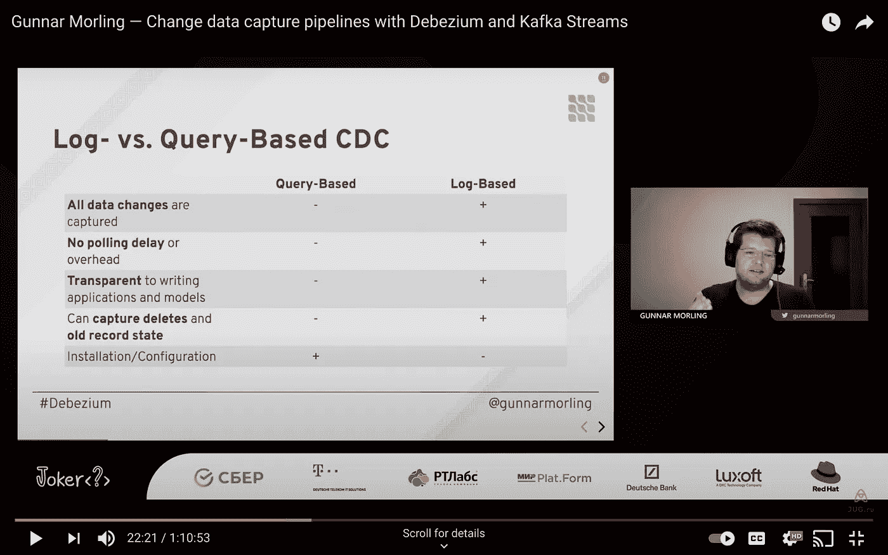

小丑 2021:用 Debezium 和 Kafka 流改变数据捕获管道(图片: [YouTube](https://www.youtube.com/watch?t=1320&v=-PugtDeJQFs&feature=youtu.be) )

你可以在 Rockset 的 Lewis Gavin 最近的帖子中找到对 CDC 的另一个很好的解释，[更改数据捕获:它是什么以及如何使用它](https://rockset.com/blog/change-data-capture-what-it-is-and-how-to-use-it/)。

## 基于查询与基于日志的 CDC

为了有效地展示基于查询的 CDC 和基于日志的 CDC 之间的区别，请检查用这两种方法捕获的 SQL UPDATE 语句的结果。

```
UPDATE public.address
**SET address2 = 'Apartment #1234'** WHERE address_id = 105;
```

下面是如何使用本文中描述的基于查询的 CDC 方法将更改表示为 JSON 消息有效负载。

```
{
  "address_id": 105,
  "address": "733 Mandaluyong Place",
 **"address2": "Apartment #1234",**  "district": "Asir",
  "city_id": 2,
  "postal_code": "77459",
  "phone": "196568435814",
  "last_update": "2021-08-13T00:43:38.508Z"
}
```

下面是如何使用基于日志的 CDC 和 Debezium 将相同的变化表示为 JSON 消息负载。注意与基于查询的消息相比，基于日志的 CDC 消息的元数据丰富的结构。

```
{
  "after": {
    "address": "733 Mandaluyong Place",
 **"address2": "Apartment #1234",**    "phone": "196568435814",
    "district": "Asir",
    "last_update": "2021-08-13T00:43:38.508453Z",
    "address_id": 105,
    "postal_code": "77459",
    "city_id": 2
  },
  "source": {
    "schema": "public",
    "sequence": "[\"1090317720392\",\"1090317720392\"]",
    "xmin": null,
    "connector": "postgresql",
    "lsn": 1090317720624,
    "name": "pagila",
    "txId": 16973,
    "version": "1.6.1.Final",
    "ts_ms": 1628815418508,
    "snapshot": "false",
    "db": "pagila",
    "table": "address"
  },
  "op": "u",
  "ts_ms": 1628815418815
}
```

在[即将发布的](/hydrating-a-data-lake-using-log-based-change-data-capture-cdc-with-debezium-apicurio-and-kafka-799671e0012f)中，我们将探索 [Debezium](https://debezium.io/) 以及 [Apache Arvo](https://avro.apache.org/) 和[模式注册表](https://docs.confluent.io/platform/current/schema-registry/index.html)，使用 PostgreSQL 的[预写日志](https://debezium.io/documentation/reference/connectors/postgresql.html#postgresql-overview) (WAL)构建一个基于日志的 CDC 解决方案。在本帖中，我们将使用“更新时间戳”技术来研究基于查询的 CDC。

# Kafka 连接连接器

在这篇文章中，我们将使用来自[汇合](https://www.confluent.io/)的源和宿连接器。融合是通过他们的[融合云](https://www.confluent.io/confluent-cloud)和[融合平台](https://www.confluent.io/product/confluent-platform)产品提供企业级托管 Kafka 的无可争议的领导者。Confluent 提供了几十个源和汇连接器，涵盖了最流行的数据源和汇。本文中使用的连接器包括:

*   Confluent 的 Kafka Connect [JDBC 源连接器](https://docs.confluent.io/kafka-connect-jdbc/current/source-connector/index.html)使用 JDBC 驱动程序将数据从任何关系数据库导入 Apache Kafka 主题。Kafka Connect JDBC 接收器连接器将数据从 Kafka 主题导出到任何具有 JDBC 驱动程序的关系数据库。
*   Confluent 的 Kafka Connect [亚马逊 S3 接收器连接器](https://docs.confluent.io/kafka-connect-s3-sink/current/overview.html)以 Avro、Parquet、JSON 或 Raw 字节的形式将数据从 Apache Kafka 主题导出到 S3 对象。

# 先决条件

这篇文章将关注 Kafka Connect 的数据移动，而不是如何部署所需的 AWS 资源。要跟进这篇文章，您需要在 AWS 上已经部署和配置了以下资源:

1.  Amazon RDS for PostgreSQL 实例(数据*来源*)；
2.  亚马逊 S3 水桶(数据*水槽*)；
3.  亚马逊 MSK 集群；
4.  亚马逊 EKS 集群；
5.  亚马逊 RDS 实例和亚马逊 MSK 集群之间的连接；
6.  亚马逊 EKS 集群和亚马逊 MSK 集群之间的连通性；
7.  确保亚马逊 MSK 配置有`auto.create.topics.enable=true`。该设置默认为`false`；
8.  与 Kubernetes 服务帐户(称为 [IRSA](https://docs.aws.amazon.com/eks/latest/userguide/iam-roles-for-service-accounts.html) )相关联的 IAM 角色，将允许从 EKS 访问 MSK 和 S3 ( *见下面的详细信息*)；

如上面的架构图所示，我在同一个 AWS 账户和 AWS 区域`us-east-1`内使用了三个独立的 VPC，分别用于亚马逊 RDS、亚马逊 EKS 和亚马逊 MSK。使用 [VPC 对等](https://docs.aws.amazon.com/vpc/latest/peering/what-is-vpc-peering.html)连接三个 VPC。确保您在亚马逊 RDS、亚马逊 EKS 和亚马逊 MSK 安全组上公开了正确的入口端口和相应的 CIDR 范围。为了增加安全性和节约成本，使用一个 [VPC 端点](https://docs.aws.amazon.com/vpc/latest/privatelink/vpc-endpoints-s3.html)来确保亚马逊 EKS 和亚马逊 S3 之间的私人通信。

# 源代码

这篇文章的所有源代码，包括 Kafka Connect 配置文件和 Helm 图表，都是开源的，位于 GitHub 上。

[](https://github.com/garystafford/kafka-connect-msk-demo) [## GitHub-garystafter/Kafka-connect-MSK-demo:对于这篇文章，使用变更数据为数据湖补水…

### 对于这篇文章，在 AWS - GitHub 上使用变更数据捕获(CDC)、Apache Kafka 和 Kubernetes 来补充数据湖…

github.com](https://github.com/garystafford/kafka-connect-msk-demo) 

# 认证和授权

亚马逊 MSK 提供多种[认证和授权方法](https://docs.aws.amazon.com/msk/latest/developerguide/kafka_apis_iam.html)来与 Apache Kafka APIs 交互。例如，您可以使用 IAM 对客户端进行身份验证，并允许或拒绝 Apache Kafka 操作。或者，您可以使用 TLS 或 SASL/SCRAM 来验证客户端，并使用 Apache Kafka ACLs 来允许或拒绝操作。在我的上一篇文章中，我演示了 SASL/SCRAM 和 Kafka ACLs 在亚马逊 MSK 上的使用:

[](/securely-decoupling-applications-on-amazon-eks-using-kafka-with-sasl-scram-48c340e1ffe9) [## 使用带有 SASL/SCRAM 的 Kafka 安全地解耦亚马逊 EKS 上的应用

### 使用具有 IRSA、SASL/SCRAM 和数据加密的亚马逊 MSK，安全地分离亚马逊 EKS 上基于 Go 的微服务

itnext.io](/securely-decoupling-applications-on-amazon-eks-using-kafka-with-sasl-scram-48c340e1ffe9) 

假设您正确配置了亚马逊 MSK、亚马逊 EKS 和 Kafka Connect，任何 MSK 身份验证和授权都应该与 Kafka Connect 一起工作。在这篇文章中，我们使用 [IAM 访问控制](https://docs.aws.amazon.com/msk/latest/developerguide/iam-access-control.html#kafka-actions)。与 Kubernetes 服务帐户( [IRSA](https://docs.aws.amazon.com/emr/latest/EMR-on-EKS-DevelopmentGuide/setting-up-enable-IAM.html) )相关联的 IAM 角色允许 EKS 使用 IAM 访问 MSK 和 S3(*参见下面的更多细节*)。

# 示例 PostgreSQL 数据库

我们可以使用许多示例 PostgreSQL 数据库来探索 Kafka Connect。我最喜欢的，虽然有点过时，是 PostgreSQL 的 Pagila 数据库。该数据库包含模拟电影租赁数据。数据集相当小，这使得它不太适合“大数据”用例，但也足够小，可以快速安装并最大限度地降低数据存储和分析成本。


Pagila 数据库模式图

在继续之前，在 Amazon RDS PostgreSQL 实例上创建一个新数据库，并用 Pagila 示例数据填充它。一些人发布了这个数据库的更新版本，带有易于安装的 SQL 脚本。查看 Devrim Gündüz 在 [GitHub](https://github.com/devrimgunduz/pagila) 上提供的 Pagila 脚本，以及 Robert Treat 在 [GitHub](https://github.com/xzilla) 上提供的 pagi la 脚本。

## 上次更新的触发器

Pagila 数据库中的每个表都有一个`last_update`字段。检测 Pagila 数据库中的更改并确保这些更改从 RDS 传到 S3 的一种简便方法是让 Kafka Connect 使用`last_update`字段。这是使用基于查询的 CDC 来确定是否以及何时对数据进行了更改的常用技术。

当这些表中的记录发生变化时，现有的数据库函数和每个表的触发器将确保`last_update`字段自动更新到当前日期和时间。你可以在 Dominick Lombardo 的文章 [kafka connect in action，part 3](https://lombardo-chcg.github.io/tools/2017/11/25/database-update-event-stream.html) 中找到关于数据库函数和触发器如何与 Kafka Connect 一起工作的更多信息。

```
CREATE OR REPLACE FUNCTION *update_last_update_column*()
    RETURNS TRIGGER AS
$$
BEGIN
    NEW.last_update = now();
    RETURN NEW;
END;
$$ language 'plpgsql';

CREATE TRIGGER update_last_update_column_address
    BEFORE UPDATE
    ON address
    FOR EACH ROW
EXECUTE PROCEDURE *update_last_update_column*();
```

# 基于 Kubernetes 的卡夫卡连接

在亚马逊 EKS 上的 Kubernetes 上部署和管理 Kafka Connect 和其他必需的 Kafka 管理工具有几种选择。流行的解决方案包括 Kubernetes (CFK)的 [Strimzi](https://strimzi.io/) 和 [Confluent，或者使用官方的](https://docs.confluent.io/operator/current/overview.html) [Apache Kafka](https://kafka.apache.org/downloads) 二进制文件构建你自己的 Docker 映像。在这篇文章中，我选择使用最新的 Kafka 二进制文件构建自己的 Kafka Connect Docker 映像。然后，我将 Confluent 的连接器及其依赖项安装到 Kafka 安装中。虽然不如使用现成的 OSS 容器高效，但在我看来，构建自己的映像确实可以教会你 Kafka 和 Kafka Connect 是如何工作的。

如果你选择使用这篇文章中使用的相同的 Kafka Connect 图像，这篇文章的 GitHub 资源库中会包含一个 Helm 图表。Helm chart 将在亚马逊 EKS 上的`kafka`名称空间部署一个 Kubernetes pod。

```
apiVersion: apps/v1
kind: Deployment
metadata:
  name: kafka-connect-msk
  labels:
    app: kafka-connect-msk
    component: service
spec:
  replicas: 1
  strategy:
    type: Recreate
  selector:
    matchLabels:
      app: kafka-connect-msk
      component: service
  template:
    metadata:
      labels:
        app: kafka-connect-msk
        component: service
    spec:
 **serviceAccountName: kafka-connect-msk-iam-serviceaccount**      containers:
        - image: garystafford/kafka-connect-msk:1.0.0
          name: kafka-connect-msk
          imagePullPolicy: IfNotPresent
```

在部署图表之前，用与 Kafka Connect pod ( `serviceAccountName`)关联的 [Kubernetes 服务帐户](https://kubernetes.io/docs/tasks/configure-pod-container/configure-service-account/)的名称更新`value.yaml`文件。附加到与 pod 的服务帐户相关联的 IAM 角色的 IAM 策略应该提供从 EKS 对运行在亚马逊 MSK 集群上的 Kafka 的足够访问。该策略还应该提供对您的 S3 存储桶的访问，如 Confluent 在此处所详述的[。下面是一个(*过于宽泛* ) IAM 策略的示例，该策略允许完全访问 MSK 上运行的任何 Kafka 集群，并允许从 EKS 上运行的 Kafka Connect 访问 S3。](https://docs.confluent.io/kafka-connect-s3-sink/current/overview.html#iam-policy-for-s3)

更新服务帐户变量后，使用以下命令部署 Helm 图表:

```
helm install kafka-connect-msk ./kafka-connect-msk \
  --namespace $NAMESPACE --create-namespace
```

要获得正在运行的 Kafka Connect 容器的 shell，请使用下面的`kubectl exec`命令:

```
export KAFKA_CONTAINER=$(
  kubectl get pods -n kafka -l app=kafka-connect-msk | \
    awk 'FNR == 2 {print $1}')kubectl exec -it $KAFKA_CONTAINER -n kafka -- bash
```

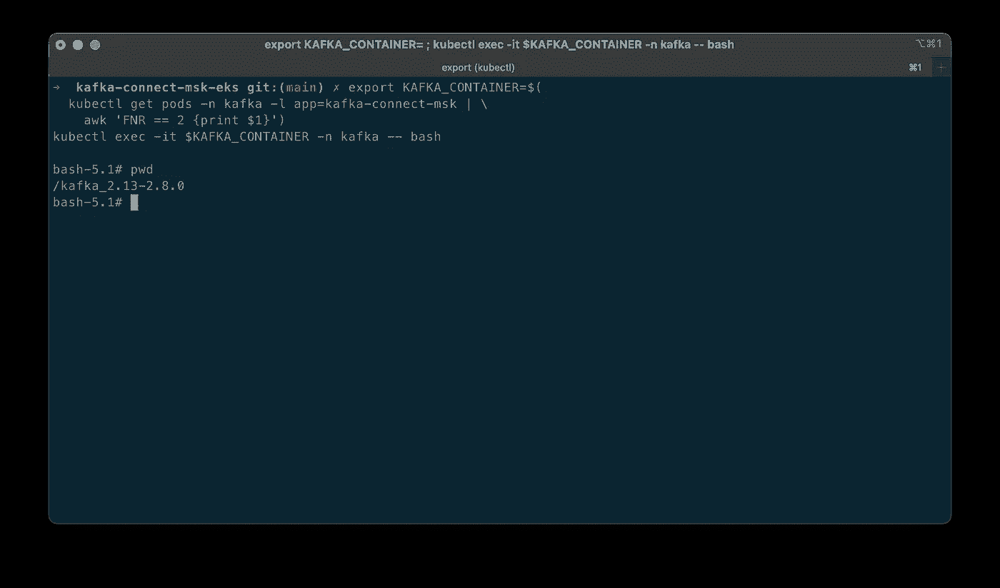

与 EKS 上运行的 Kafka Connect 容器交互

## 配置引导代理

在启动 Kafka Connect 之前，您需要修改 Kafka Connect 的配置文件。Kafka Connect 能够以独立和分布式模式运行工作线程。由于我们将使用 Kafka Connect 的分布式模式，修改`config/connect-distributed.properties`文件。我在这篇文章中使用的配置文件的完整示例如下所示。

Kafka Connect 将在 pod 的容器内运行，而 Kafka 和 [Apache ZooKeeper](https://zookeeper.apache.org/) 则在亚马逊 MSK 上运行。更新`bootstrap.servers`属性以反映您自己的逗号分隔的亚马逊 MSK Kafka Bootstrap Brokers 列表。要获得 Amazon MSK 集群的引导代理列表，请使用 AWS 管理控制台或以下 AWS CLI 命令:

```
# get the msk cluster's arn
aws kafka list-clusters --query 'ClusterInfoList[*].ClusterArn'# use msk arn to get the brokers
aws kafka get-bootstrap-brokers --cluster-arn **your-msk-cluster-arn**# alternately, if you only have one cluster, then
aws kafka get-bootstrap-brokers --cluster-arn $(
  aws kafka list-clusters | jq -r '.ClusterInfoList[0].ClusterArn')
```

更新`config/connect-distributed.properties`文件。

```
**# ***** CHANGE ME! *****
bootstrap.servers=b-1.your-cluster.123abc.c2.kafka.us-east-1.amazonaws.com:9098,b-2.your-cluster.123abc.c2.kafka.us-east-1.amazonaws.com:9098, b-3.your-cluster.123abc.c2.kafka.us-east-1.amazonaws.com:9098**group.id=connect-clusterkey.converter.schemas.enable=true
value.converter.schemas.enable=trueoffset.storage.topic=connect-offsets
offset.storage.replication.factor=2
#offset.storage.partitions=25config.storage.topic=connect-configs
config.storage.replication.factor=2status.storage.topic=connect-status
status.storage.replication.factor=2
#status.storage.partitions=5offset.flush.interval.ms=10000plugin.path=/usr/local/share/kafka/plugins# kafka connect auth using iam
ssl.truststore.location=/tmp/kafka.client.truststore.jks
security.protocol=SASL_SSL
sasl.mechanism=AWS_MSK_IAM
sasl.jaas.config=software.amazon.msk.auth.iam.IAMLoginModule required;
sasl.client.callback.handler.class=software.amazon.msk.auth.iam.IAMClientCallbackHandler# kafka connect producer auth using iam
producer.ssl.truststore.location=/tmp/kafka.client.truststore.jks
producer.security.protocol=SASL_SSL
producer.sasl.mechanism=AWS_MSK_IAM
producer.sasl.jaas.config=software.amazon.msk.auth.iam.IAMLoginModule required;
producer.sasl.client.callback.handler.class=software.amazon.msk.auth.iam.IAMClientCallbackHandler# kafka connect consumer auth using iam
consumer.ssl.truststore.location=/tmp/kafka.client.truststore.jks
consumer.security.protocol=SASL_SSL
consumer.sasl.mechanism=AWS_MSK_IAM
consumer.sasl.jaas.config=software.amazon.msk.auth.iam.IAMLoginModule required;
consumer.sasl.client.callback.handler.class=software.amazon.msk.auth.iam.IAMClientCallbackHandler
```

为了方便执行 Kafka 命令，请将`BBROKERS`环境变量设置为相同的 Kafka 引导程序代理的逗号分隔列表，例如:

```
export BBROKERS="b-1.your-cluster.123abc.c2.kafka.us-east-1.amazonaws.com:9098,b-2.your-cluster.123abc.c2.kafka.us-east-1.amazonaws.com:9098, b-3.your-cluster.123abc.c2.kafka.us-east-1.amazonaws.com:9098"
```

## 确认从 Kafka Connect 访问亚马逊 MSK

要确认您可以从运行在亚马逊 EKS 上的 Kafka Connect 容器访问运行在亚马逊 MSK 上的 Kafka，请尝试列出现有的 Kafka 主题:

```
bin/kafka-topics.sh --list \
  --bootstrap-server $BBROKERS \
  --command-config config/client-iam.properties
```

你也可以尝试列出现有的卡夫卡消费群体:

```
bin/kafka-consumer-groups.sh --list \
  --bootstrap-server $BBROKERS \
  --command-config config/client-iam.properties
```

如果其中任何一个失败，你可能有网络或安全问题阻止从亚马逊 EKS 到亚马逊 MSK 的访问。检查您的 VPC 对等、路由表、IAM/IRSA 和安全组入口设置。这些项目中的任何一个都可能导致容器和亚马逊 MSK 上运行的 Kafka 之间的通信问题。

## 卡夫卡连接

我建议使用下面显示的任一种方法作为后台进程启动 Kafka Connect。

```
bin/connect-distributed.sh \
  config/connect-distributed.properties > /dev/null 2>&1 &# alternately use nohup
nohup bin/connect-distributed.sh \
  config/connect-distributed.properties &
```

要确认 Kafka Connect 正确启动，请立即跟踪`connect.log`文件。该日志将捕获任何启动错误，以便进行故障排除。

```
tail -f logs/connect.log
```

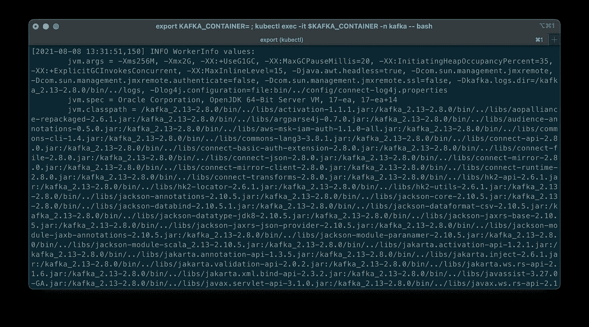

显示 Kafka Connect 作为后台进程启动的 Kafka Connect 日志

您还可以使用`ps`命令检查后台进程，以确认 Kafka Connect 正在运行。注意下面 PID 4915 的过程。如有必要，使用`kill`命令和 PID 停止 Kafka 连接。


Kafka Connect 作为后台进程运行

如果配置正确，Kafka Connect 将在第一次启动时创建三个新主题，称为 Kafka Connect 内部主题，如`config/connect-distributed.properties`文件中定义的:`connect-configs`、`connect-offsets`和`connect-status`。根据[汇合](https://docs.confluent.io/home/connect/userguide.html#kconnect-internal-topics)，Connect 存储这些主题中的连接器和任务配置、偏移和状态。内部主题必须具有高复制系数、压缩清理策略和适当数量的分区。使用以下命令可以确认这些新主题。

```
bin/kafka-topics.sh --list \
  --bootstrap-server $BBROKERS \
  --command-config config/client-iam.properties \
  | grep connect-
```

# Kafka 连接连接器

这篇文章展示了三个越来越复杂的 Kafka 连接源和接收器连接器。每个人都将展示不同的连接器功能，以便在 Amazon RDS for PostgreSQL 和 Amazon S3 之间导入/导出和转换数据。

## 连接器源#1

创建一个名为`config/jdbc_source_connector_postgresql_00.json`的新文件(或者修改现有文件，如果使用我的 Kafka Connect 容器的话)。修改第 3–5 行，如下所示，以反映您的 RDS 实例的 JDBC 连接细节。

第一个 Kafka Connect 源连接器使用 Confluent 的 Kafka Connect [JDBC 源连接器](https://docs.confluent.io/kafka-connect-jdbc/current/source-connector/index.html) ( `io.confluent.connect.jdbc.JdbcSourceConnector`)通过 JDBC 驱动程序从 RDS 导出数据，并将数据导入一系列 Kafka 主题。我们将从 Pagila 的`public`模式中的三个表中导出数据:`address`、`city`和`country`。我们将把这些数据写到一系列主题中，任意加上数据库名称和模式前缀`pagila.public.`。源连接器将自动创建三个新主题:`pagila.public.address`、`pagila.public.city`和`pagila.public.country`。

注意连接器的`mode`属性值被设置为`timestamp`，并且`last_update`字段在`timestamp.column.name`属性中被引用。回想一下，我们在前面的文章中向这三个表添加了数据库函数和触发器，每当在 Pagila 数据库中创建或更新记录时，它们都会更新`last_update`字段。除了初始导出整个表之外，源连接器将每 5 秒钟轮询一次数据库(`poll.interval.ms`属性)，查找比最近导出的`last_modified`日期更新的更改。这是由源连接器使用参数化查询完成的，例如:

```
SELECT *
FROM "public"."address"
**WHERE "public"."address"."last_update" > ?
  AND "public"."address"."last_update" < ?
ORDER BY "public"."address"."last_update" ASC**
```

## 连接器接收器#1

接下来，创建并配置第一个 Kafka Connect sink 连接器。创建新文件或修改`config/s3_sink_connector_00.json`。修改第 7 行，如下所示，以反映您的亚马逊 S3 桶的名称。

第一个 Kafka Connect sink 连接器使用 Confluent 的 Kafka Connect [亚马逊 S3 Sink 连接器](https://docs.confluent.io/kafka-connect-s3-sink/current/overview.html) ( `io.confluent.connect.s3.S3SinkConnector`)以 JSON 格式将数据从 Kafka 主题导出到亚马逊 S3 对象。

## 部署连接器#1

使用 [Kafka Connect REST 接口](https://docs.confluent.io/platform/current/connect/references/restapi.html)部署源和接收器连接器。许多教程演示了针对`/connectors`端点的`POST`方法。然而，这需要一个`DELETE`和一个额外的`POST`来更新连接器。针对`/config`端点使用`PUT`，您可以更新连接器，而无需首先发出`DELETE`。

```
curl -s -d @"config/jdbc_source_connector_postgresql_00.json" \
    -H "Content-Type: application/json" \
    -X PUT [http://localhost:8083/connectors/jdbc_source_connector_postgresql_00/config](http://localhost:8083/connectors/jdbc_source_connector_postgresql_00/config) | jqcurl -s -d @"config/s3_sink_connector_00.json" \
    -H "Content-Type: application/json" \
    -X PUT [http://localhost:8083/connectors/s3_sink_connector_00/config](http://localhost:8083/connectors/s3_sink_connector_00/config) | jq
```

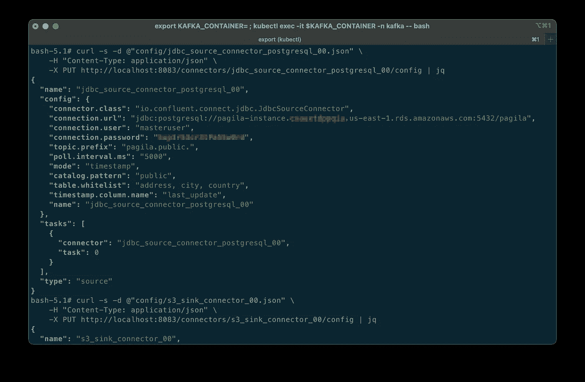

您可以使用以下命令确认源连接器和接收器连接器已部署并正在运行:

```
curl -s -X GET [http://localhost:8083/connectors](http://localhost:8083/connectors) | \
  jq '. | sort_by(.)'curl -s -H "Content-Type: application/json" \
    -X GET [http://localhost:8083/connectors/jdbc_source_connector_postgresql_00/status](http://localhost:8083/connectors/jdbc_source_connector_postgresql_00/status) | jqcurl -s -H "Content-Type: application/json" \
    -X GET [http://localhost:8083/connectors/](http://localhost:8083/connectors/jdbc_source_connector_postgresql_00/status)s3_sink_connector_00[/status](http://localhost:8083/connectors/jdbc_source_connector_postgresql_00/status) | jq
```

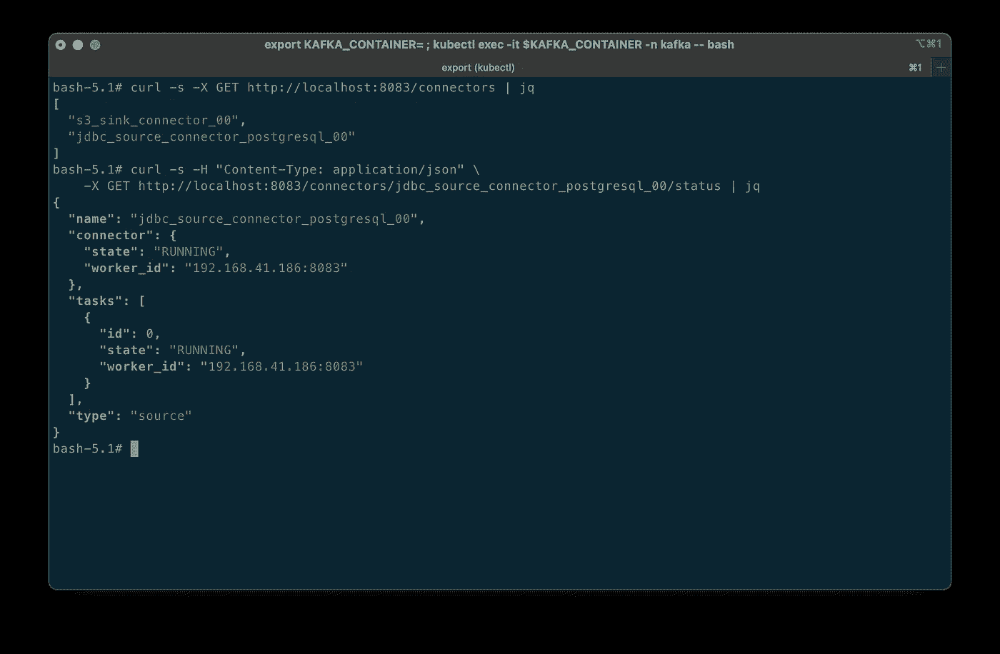

Kafka Connect 源连接器运行成功

阻止连接器正确启动的错误将使用`/status`端点显示，如下例所示。在这种情况下，与 pod 相关联的 Kubernetes 服务帐户缺少对亚马逊 S3 目标存储桶的适当 IAM 权限。

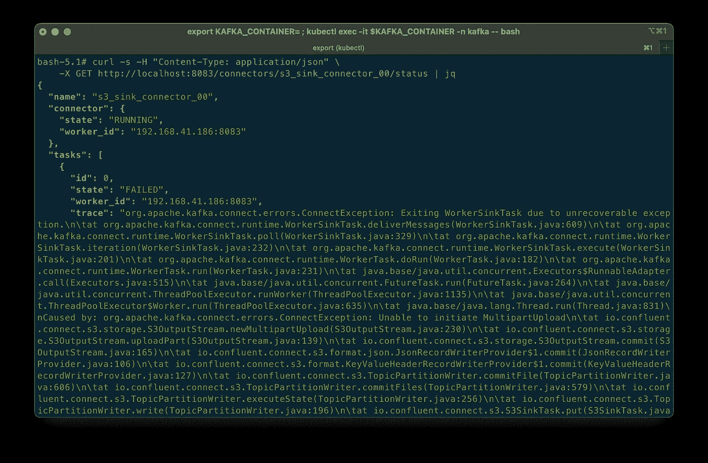

Kafka Connect 接收器连接器运行失败，出现错误

## 确认连接器#1 成功

这三个表的全部内容将通过 source 连接器从 RDS 导出到 Kafka，然后通过 sink 连接器从 Kafka 导出到 S3。为了确认源连接器工作正常，验证应该已经创建的三个新 Kafka 主题是否存在:`pagila.public.address`、`pagila.public.city`和`pagila.public.country`。

```
bin/kafka-topics.sh --list \
  --bootstrap-server $BBROKERS \
  --command-config config/client-iam.properties \
  | grep pagila.public.
```

为了确认接收器连接器工作正常，验证新的 S3 对象已经在数据湖的 S3 桶中创建。如果您使用 AWS CLI v2 的`s3` API，我们可以查看我们的目标 S3 存储桶的内容:

```
aws s3api list-objects \
  --bucket your-s3-bucket \
  --query 'Contents[].{Key: Key}' \
  --output text
```

您应该在 S3 桶中看到大约 15 个新的 S3 对象(JSON 文件),它们的键是按照它们的主题名组织的。接收器连接器每 100 条记录或 60 秒向 S3 刷新一次新数据。

您还可以使用 AWS 管理控制台来查看 S3 桶的内容。

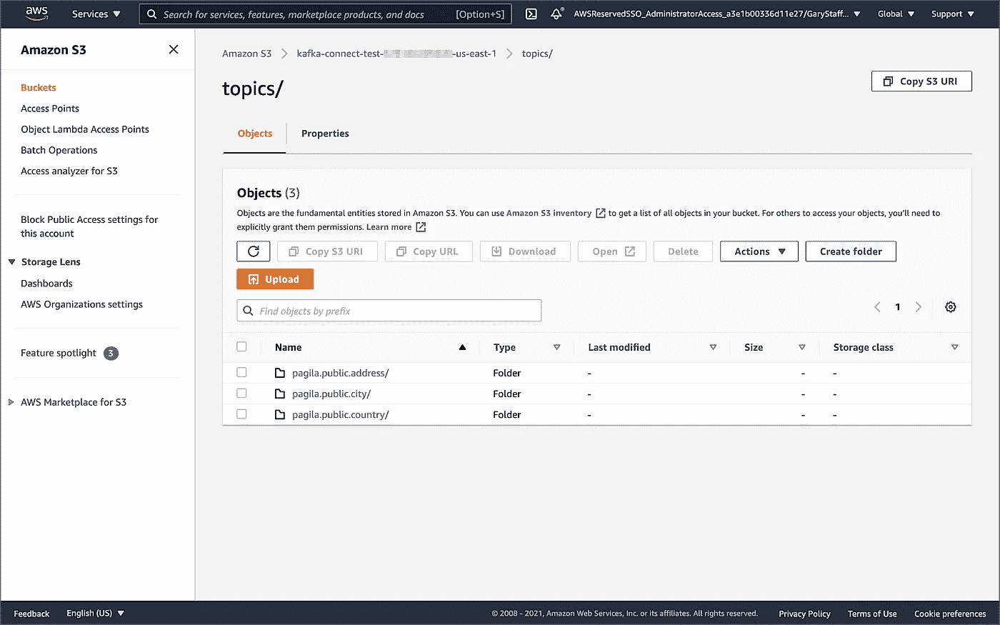

亚马逊 S3 桶显示卡夫卡连接 S3 接收器连接器的结果，按主题名称组织

使用亚马逊 S3 控制台的“使用 S3 选择查询”来查看 JSON 格式文件中包含的数据。或者，您可以使用 s3 API:

```
export SINK_BUCKET="your-s3-bucket"export KEY="topics/pagila.public.address/partition=0/pagila.public.address+0+0000000100.json"aws s3api select-object-content \
    --bucket $SINK_BUCKET \
    --key $KEY \
    --expression "select * from s3object limit 5" \
    --expression-type "SQL" \
    --input-serialization '{"JSON": {"Type": "DOCUMENT"}, "CompressionType": "NONE"}' \
    --output-serialization '{"JSON": {}}' "output.json" \
  && cat output.json | jq \
  && rm output.json
```

例如，通过控制台或 API 使用“使用 S3 选择进行查询”功能，`address`表的数据将类似于以下内容:

```
{
  "address_id": 100,
  "address": "1308 Arecibo Way",
  "address2": "",
  "district": "Georgia",
  "city_id": 41,
  "postal_code": "30695",
  "phone": "6171054059",
  "last_update": 1487151930000
}
{
  "address_id": 101,
  "address": "1599 Plock Drive",
  "address2": "",
  "district": "Tete",
  "city_id": 534,
  "postal_code": "71986",
  "phone": "817248913162",
  "last_update": 1487151930000
}
{
  "address_id": 102,
  "address": "669 Firozabad Loop",
  "address2": "",
  "district": "Abu Dhabi",
  "city_id": 12,
  "postal_code": "92265",
  "phone": "412903167998",
  "last_update": 1487151930000
}
```

恭喜您，您已经使用 Kafka Connect 成功地将关系数据库中的数据导入到您的数据湖中！

## 连接器源#2

创建新文件或修改`config/jdbc_source_connector_postgresql_01.json`。修改第 3–5 行，如下所示，以反映您的 RDS 实例连接细节。

第二个 Kafka Connect 源连接器也使用 Confluent 的 Kafka Connect JDBC 源连接器，通过 JDBC 驱动程序从 just `address`表中导出数据，并将该数据导入到新的 Kafka 主题`pagila.public.alt.address`。这个源连接器的不同之处在于[转换](https://docs.confluent.io/platform/current/connect/transforms/overview.html)，称为单消息转换(SMTs)。当消息通过 Connect 从 RDS 流到 Kafka 时，SMT 被应用于消息。

在此连接器中，有四个转换，它们执行以下常见功能:

1.  提取`address_id`整数字段作为 Kafka 消息键，详见本[博文](https://www.confluent.io/blog/kafka-connect-deep-dive-jdbc-source-connector/)由 Confluence ( *见*“设置 Kafka 消息键”)。
2.  将 Kafka 主题名称作为新的静态字段添加到消息中；
3.  将数据库名称作为新的静态字段追加到消息中；

## 连接器接收器#2

创建新文件或修改`config/s3_sink_connector_01.json`。修改第 6 行，如下所示，以反映您的亚马逊 S3 桶的名称。

第二个接收器连接器与第一个接收器连接器几乎相同，只是它只将数据从一个 Kafka 主题`pagila.public.alt.address`导出到 S3。

## 部署连接器#2

使用 [Kafka Connect REST 接口](https://docs.confluent.io/platform/current/connect/references/restapi.html)部署第二组源和接收器连接器，就像第一对连接器一样。

```
curl -s -d @"config/jdbc_source_connector_postgresql_01.json" \
    -H "Content-Type: application/json" \
    -X PUT [http://localhost:8083/connectors/jdbc_source_connector_postgresql_01/config](http://localhost:8083/connectors/jdbc_source_connector_postgresql_00/config) | jqcurl -s -d @"config/s3_sink_connector_01.json" \
    -H "Content-Type: application/json" \
    -X PUT [http://localhost:8083/connectors/s3_sink_connector_01/config](http://localhost:8083/connectors/s3_sink_connector_00/config) | jq
```

## 确认连接器#2 成功

使用与前面相同的命令，确认新的一组连接器已经部署并正在运行，与第一组连接器一起，总共有四个连接器。

```
curl -s -X GET [http://localhost:8083/connectors](http://localhost:8083/connectors) | \
  jq '. | sort_by(.)'curl -s -H "Content-Type: application/json" \
    -X GET [http://localhost:8083/connectors/jdbc_source_connector_postgresql_01/status](http://localhost:8083/connectors/jdbc_source_connector_postgresql_00/status) | jqcurl -s -H "Content-Type: application/json" \
    -X GET [http://localhost:8083/connectors/](http://localhost:8083/connectors/jdbc_source_connector_postgresql_00/status)s3_sink_connector_01[/status](http://localhost:8083/connectors/jdbc_source_connector_postgresql_00/status) | jq
```

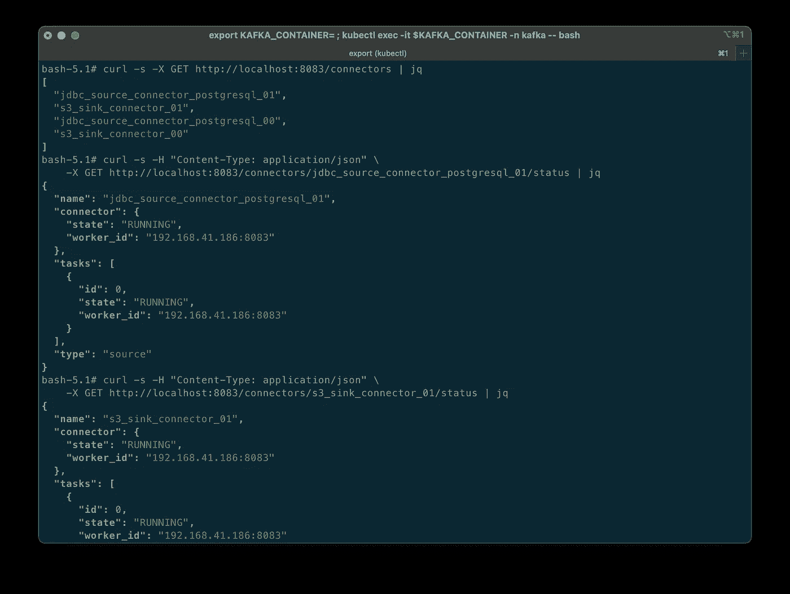

Kafka 连接源和接收器连接器成功运行

要查看第一次转换的结果，提取`address_id`整数字段作为 Kafka 消息密钥，我们可以使用 Kafka 命令行消费者:

```
bin/kafka-console-consumer.sh \
  --topic pagila.public.alt.address \
  --offset 102 --partition 0 --max-messages 5 \
  --property print.key=true --property print.value=true \
  --property print.offset=true --property print.partition=true \
  --property print.headers=false --property print.timestamp=false \
  --bootstrap-server $BBROKERS \
  --consumer.config config/client-iam.properties
```

在下面的输出中，注意每条消息的开头，它显示 Kafka 消息密钥，与`address_id`相同。比如`{"type":"int32","optional":false},"payload":**100**}`。

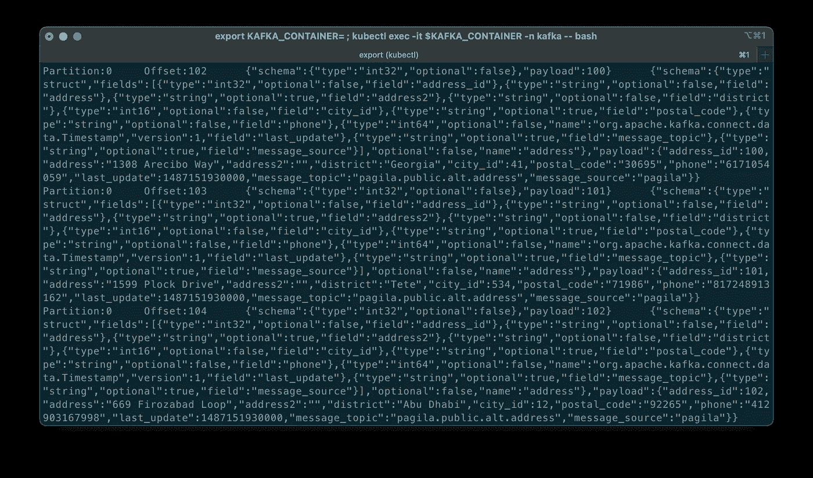

显示 Kafka pagi la . public . alt . address主题中消息的输出

使用 AWS 管理控制台或 CLI 检查 Amazon S3 bucket，您应该注意到在`/topics/pagila.public.alt.address/`对象关键字前缀中的第四组 S3 对象。

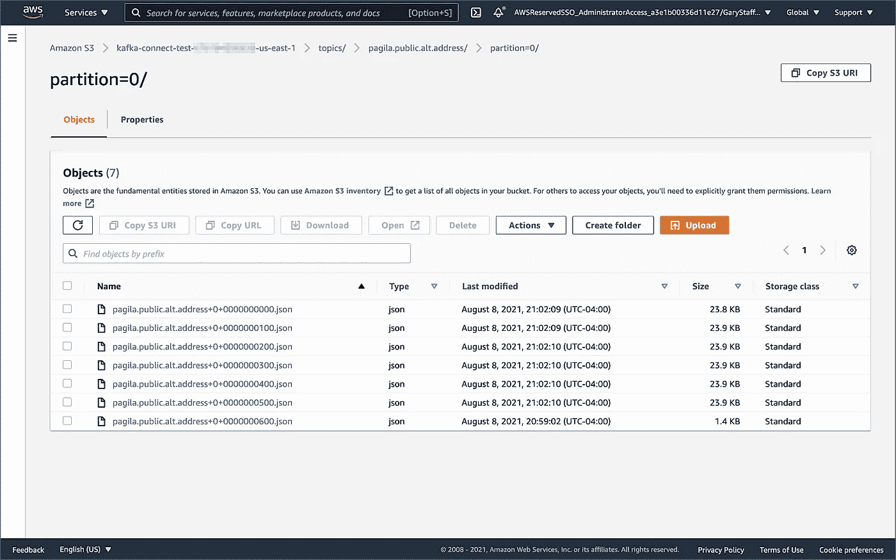

显示包含地址数据的 JSON 格式文件的亚马逊 S3 桶

使用亚马逊 S3 控制台的“使用 S3 选择查询”来查看 JSON 格式文件中包含的数据。或者，您可以使用 s3 API:

```
export SINK_BUCKET="your-s3-bucket"export KEY="topics/pagila.public.alt.address/partition=0/pagila.public.address+0+0000000100.json"aws s3api select-object-content \
    --bucket $SINK_BUCKET \
    --key $KEY \
    --expression "select * from s3object limit 5" \
    --expression-type "SQL" \
    --input-serialization '{"JSON": {"Type": "DOCUMENT"}, "CompressionType": "NONE"}' \
    --output-serialization '{"JSON": {}}' "output.json" \
  && cat output.json | jq \
  && rm output.json
```

在下面的示例数据中，请注意添加到每个记录中的两个新字段，这是 Kafka 连接器转换的结果:

```
{
  "address_id": 100,
  "address": "1308 Arecibo Way",
  "address2": "",
  "district": "Georgia",
  "city_id": 41,
  "postal_code": "30695",
  "phone": "6171054059",
  "last_update": 1487151930000,
 **"message_topic": "pagila.public.alt.address",
  "message_source": "pagila"** }
{
  "address_id": 101,
  "address": "1599 Plock Drive",
  "address2": "",
  "district": "Tete",
  "city_id": 534,
  "postal_code": "71986",
  "phone": "817248913162",
  "last_update": 1487151930000,
 **"message_topic": "pagila.public.alt.address",
  "message_source": "pagila"** }
{
  "address_id": 102,
  "address": "669 Firozabad Loop",
  "address2": "",
  "district": "Abu Dhabi",
  "city_id": 12,
  "postal_code": "92265",
  "phone": "412903167998",
  "last_update": 1487151930000,
 **"message_topic": "pagila.public.alt.address",
  "message_source": "pagila"** }
```

恭喜您，您已经成功地将更多的数据从关系数据库导入到您的数据湖中，包括使用 Kafka Connect 执行一系列简单的转换！

## 连接器源#3

创建或修改`config/jdbc_source_connector_postgresql_02.json`。修改第 3–5 行，如下所示，以反映您的 RDS 实例连接细节。

与前两个从表中导出数据的源连接器不同，这个连接器使用 SELECT 查询从 Pagila 数据库的`address`、`city`和`country`表中导出数据，并将该 SQL 查询数据的结果导入到新的 Kafka 主题`pagila.public.alt.address`中。源连接器配置中的 SQL 查询如下:

```
SELECT a.address_id,
             a.address,
             a.address2,
             city.city,
             a.district,
             a.postal_code,
             country.country,
             a.phone,
             a.last_update
      FROM address AS a
               INNER JOIN city ON a.city_id = city.city_id
               INNER JOIN country ON country.country_id = city.country_id
      ORDER BY address_id) AS addresses
```

由源连接器执行的最终参数化查询允许它基于`last_update`字段检测更改，如下所示:

```
SELECT *
FROM (SELECT a.address_id,
             a.address,
             a.address2,
             city.city,
             a.district,
             a.postal_code,
             country.country,
             a.phone,
             a.last_update
      FROM address AS a
               INNER JOIN city ON a.city_id = city.city_id
               INNER JOIN country ON country.country_id = city.country_id
      ORDER BY address_id) AS addresses
**WHERE "last_update" > ?
  AND "last_update" < ?
ORDER BY "last_update" ASC**
```

## 连接器接收器#3

创建或修改`config/s3_sink_connector_02.json`。修改第 6 行，如下所示，以反映您的亚马逊 S3 桶的名称。

这个接收器连接器与前两个接收器连接器有很大的不同。除了在相应的源连接器中利用 SMT 之外，我们还在这个接收连接器中使用它们。当记录被写入亚马逊 S3 时，sink connect 使用 [InsertField](https://docs.confluent.io/platform/current/connect/transforms/insertfield.html#insertfield) 转换向每个记录追加三个任意静态字段— `message_source`、`message_source_engine`和`environment`。接收器连接器还使用 [ReplaceField](https://docs.confluent.io/platform/current/connect/transforms/replacefield.html#replacefield) 转换将`district`字段重命名为`state_province`。

前两个 sink 连接器将未压缩的 JSON 格式文件写入亚马逊 S3。第三个接收器连接器优化了导入 S3 的数据，以便进行下游数据分析。接收器连接器将 GZIP 压缩的 Apache Parquet 文件写到亚马逊 S3。此外，压缩的拼花文件由`country`字段[分区](https://docs.aws.amazon.com/athena/latest/ug/partitions.html)。使用列文件格式、压缩和分区，对数据的查询应该更快、更有效。

## 部署连接器#3

使用 Kafka Connect REST 接口部署最终的源和接收器连接器，就像前两对连接器一样。

```
curl -s -d @"config/jdbc_source_connector_postgresql_02.json" \
    -H "Content-Type: application/json" \
    -X PUT [http://localhost:8083/connectors/jdbc_source_connector_postgresql_02/config](http://localhost:8083/connectors/jdbc_source_connector_postgresql_00/config) | jqcurl -s -d @"config/s3_sink_connector_02.json" \
    -H "Content-Type: application/json" \
    -X PUT [http://localhost:8083/connectors/s3_sink_connector_02/config](http://localhost:8083/connectors/s3_sink_connector_00/config) | jq
```

## 确认连接器#3 成功

使用与前面相同的命令，确认新的连接器集与前两组连接器一起部署并运行，总共有六个连接器。

```
curl -s -X GET [http://localhost:8083/connectors](http://localhost:8083/connectors) | \
  jq '. | sort_by(.)'curl -s -H "Content-Type: application/json" \
    -X GET [http://localhost:8083/connectors/jdbc_source_connector_postgresql_02/status](http://localhost:8083/connectors/jdbc_source_connector_postgresql_00/status) | jqcurl -s -H "Content-Type: application/json" \
    -X GET [http://localhost:8083/connectors/](http://localhost:8083/connectors/jdbc_source_connector_postgresql_00/status)s3_sink_connector_02[/status](http://localhost:8083/connectors/jdbc_source_connector_postgresql_00/status) | jq
```

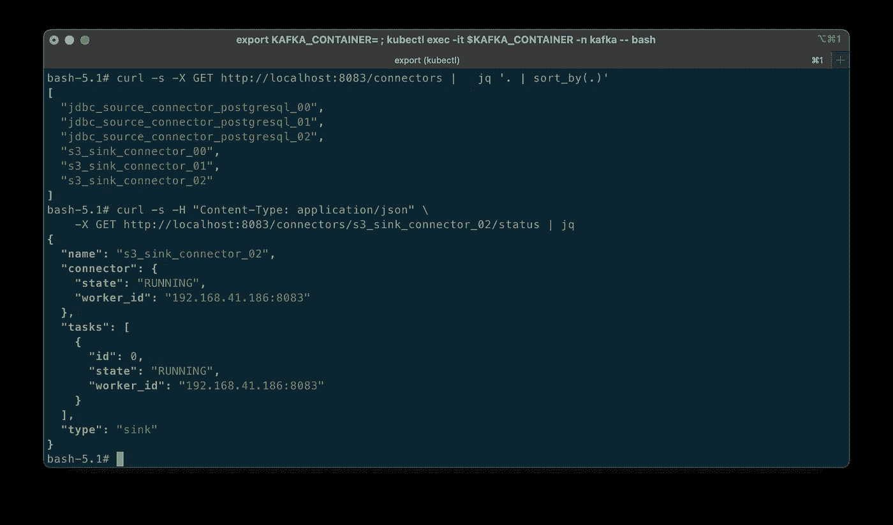

Kafka 连接源和接收器连接器成功运行

查看新的`pagila.query`主题中的消息，注意源连接器已经将`message_topic`字段附加到消息中，但没有将`message_source`、`message_source_engine`和`environment`字段附加到消息中。接收器连接器在将邮件写入 S3 时会附加这些字段。另外，注意`district`字段还没有被接收器连接器重命名为`state_province`。

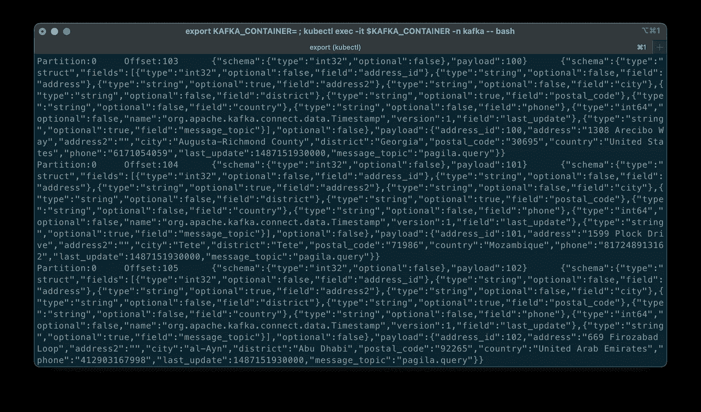

显示 Kafka `pagila.query` 主题中消息的输出

再次检查亚马逊 S3 存储桶，您应该注意到在`/topics/pagila.query/`对象关键字前缀中的第五组 S3 对象。其中的拼花格式文件由`country`进行分区。

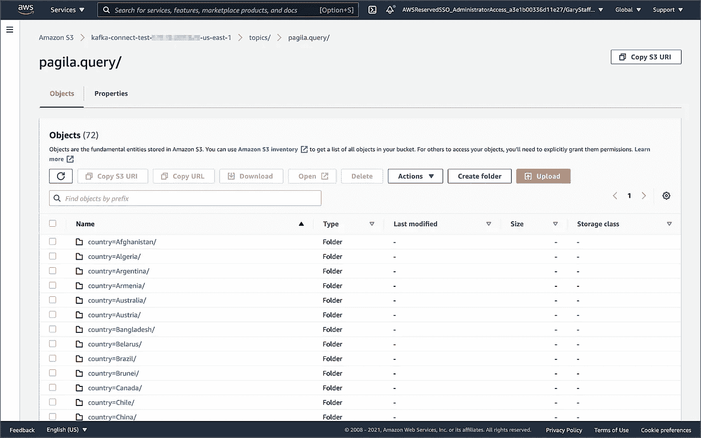

显示按国家划分的数据的亚马逊 S3 存储桶

在每个`country`分区中，都有拼花文件，其记录包含这些国家的地址。

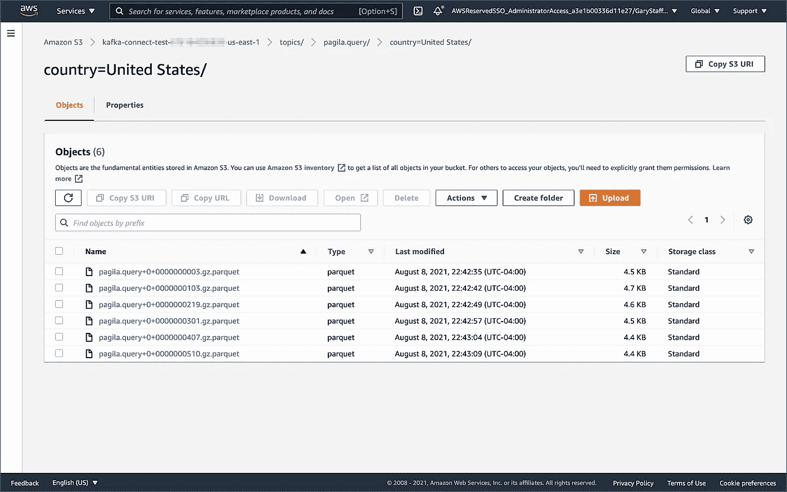

显示 GZIP 压缩的 Apache 拼花格式文件的亚马逊 S3 桶

再次使用亚马逊 S3 控制台的“用 S3 选择查询”来查看拼花格式文件中包含的数据。或者，您可以使用`s3` API:

```
export SINK_BUCKET="your-s3-bucket"export KEY="topics/pagila.query/country=United States/pagila.query+0+0000000003.gz.parquet"aws s3api select-object-content \
    --bucket $SINK_BUCKET \
    --key $KEY \
    --expression "select * from s3object limit 5" \
    --expression-type "SQL" \
    --input-serialization '{"Parquet": {}}' \
    --output-serialization '{"JSON": {}}' "output.json" \
  && cat output.json | jq \
  && rm output.json
```

在下面的示例数据中，注意添加到每个记录中的四个新字段，这是源和接收器连接器 SMT 的结果。另外，请注意重命名的`district`字段:

```
{
  "address_id": 599,
  "address": "1895 Zhezqazghan Drive",
  "address2": "",
  "city": "Garden Grove",
 **"state_province": "California",**  "postal_code": "36693",
  "country": "United States",
  "phone": "137809746111",
  "last_update": "2017-02-15T09:45:30.000Z",
 **"message_topic": "pagila.query",
  "message_source": "pagila",
  "message_source_engine": "postgresql",
  "environment": "development"** }
{
  "address_id": 6,
  "address": "1121 Loja Avenue",
  "address2": "",
  "city": "San Bernardino",
 **"state_province": "California",**  "postal_code": "17886",  "country": "United States",
  "phone": "838635286649",
  "last_update": "2017-02-15T09:45:30.000Z",
 **"message_topic": "pagila.query",
  "message_source": "pagila",
  "message_source_engine": "postgresql",
  "environment": "development"** }
{
  "address_id": 18,
  "address": "770 Bydgoszcz Avenue",
  "address2": "",
  "city": "Citrus Heights",
 **"state_province": "California",**  "postal_code": "16266",
  "country": "United States",
  "phone": "517338314235",
  "last_update": "2017-02-15T09:45:30.000Z",
 **"message_topic": "pagila.query",
  "message_source": "pagila",
  "message_source_engine": "postgresql",
  "environment": "development"** }
```

# 记录更新和基于查询的 CDC

当我们更改 Kafka Connect 每 5 秒轮询一次的表中的数据时会发生什么？要回答这个问题，让我们做一些 [DML](https://www.geeksforgeeks.org/sql-ddl-dql-dml-dcl-tcl-commands/) 更改:

```
-- update address field
UPDATE public.address
SET address = '123 CDC Test Lane'
WHERE address_id = 100; -- update address2 field
UPDATE public.address
SET address2 = 'Apartment #2201'
WHERE address_id = 101;-- second update to same record
UPDATE public.address
SET address2 = 'Apartment #2202'
WHERE address_id = 101; -- insert new country
INSERT INTO public.country (country)
values ('Wakanda');-- should be 110
SELECT country_id FROM country WHERE country='Wakanda';-- insert new city
INSERT INTO public.city (city, country_id)
VALUES ('Birnin Zana', 110);-- should be 601
SELECT city_id FROM public.city WHERE country_id=110;-- update city_id to new city_id
UPDATE public.address
SET phone = city_id = 601
WHERE address_id = 102;-- second update to same record
UPDATE public.address
SET district = 'Lake Turkana'
WHERE address_id = 102;-- delete an address record
UPDATE public.customer
SET address_id = 200
WHERE customer_id IN (
    SELECT customer_id FROM customer WHERE address_id = 104);DELETE
FROM public.address
WHERE address_id = 104;
```

要了解这些变化是如何传播的，首先，检查 Kafka Connect 日志。下面，我们将看到与上面显示的一些数据库更改相对应的示例日志事件。三个 Kafka Connect 源连接器检测更改，这些更改从 PostgreSQL 导出到 Kafka。然后，三个接收器连接器将这些对新 JSON 和 Parquet 文件的更改写入目标 S3 存储桶。

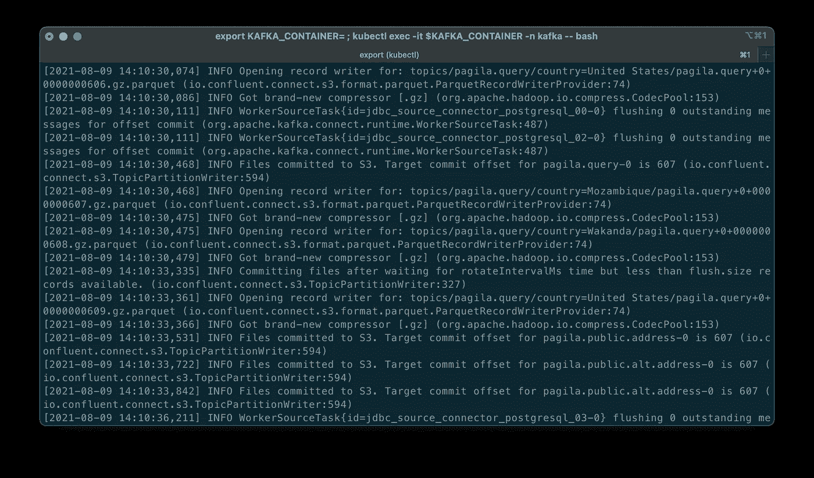

Kafka 连接日志显示正在导出/导入的 Pagila 数据库的更改

## 查看数据湖中的数据

在我们的数据湖中检查现有数据和正在发生的数据变化的一种便捷方式是[抓取](https://docs.aws.amazon.com/glue/latest/dg/add-crawler.html)并用 [AWS Glue](https://docs.aws.amazon.com/glue/latest/dg/what-is-glue.html) 对 S3 桶的内容进行编目，然后用 [Amazon Athena](https://docs.aws.amazon.com/athena/latest/ug/what-is.html) 查询结果。AWS Glue 的数据目录是一个与 Apache Hive 兼容的、完全管理的、持久的元数据存储。AWS Glue 可以在 S3 存储我们数据的模式、元数据和位置。Amazon Athena 是一个基于 Presto(PrestoDB)的无服务器特别分析引擎，它可以查询 AWS Glue 数据目录表和基于 S3 的底层数据。

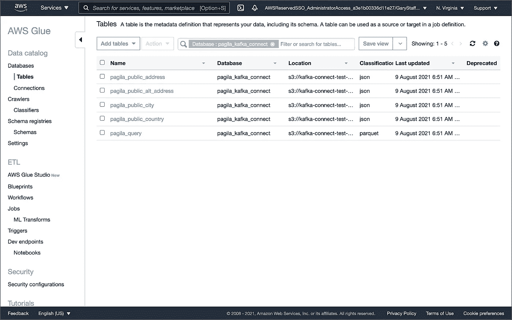

AWS Glue 数据目录显示了五个新表，这是 AWS Glue Crawler 的结果

当将拼花写到分区中时，Kafka Connect S3 接收器连接器的一个缺点是在 AWS 胶中重复列名。因此，任何用作分区的列都会在粘合数据目录的数据库表模式中复制。该问题将导致在执行查询时出现类似于`HIVE_INVALID_METADATA: Hive metadata for table pagila_query is invalid: Table descriptor contains duplicate columns`的错误。要解决这个问题，请预定义表和表的模式。或者，在搜索后编辑粘合数据目录表的模式，并删除重复的非分区列。下面，这意味着删除重复的`country`列 7。

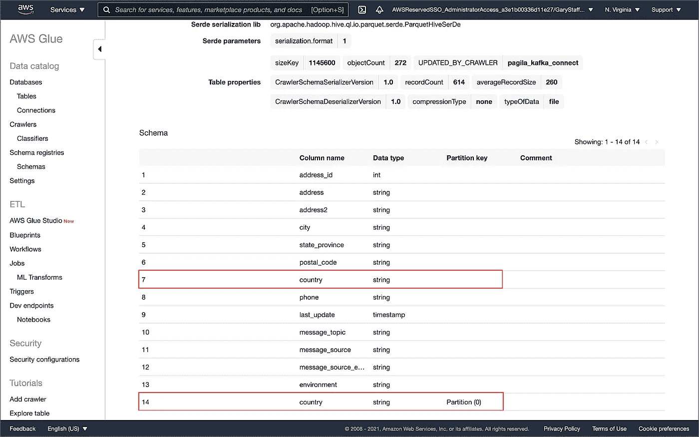

显示重复列的 AWS 粘附数据目录表架构

在 Athena 中执行一个典型的 SQL SELECT 查询将返回所有原始记录以及我们之前所做的更改，作为重复记录(相同的`address_id`主键)。

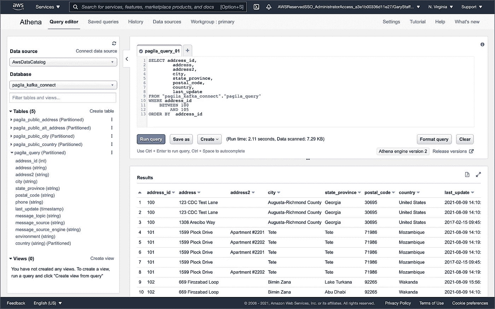

Amazon Athena 展示了 SQL 查询和结果集

```
SELECT address_id, address, address2, city, state_province,
         postal_code, country, last_update
FROM "pagila_kafka_connect"."pagila_query"
WHERE address_id BETWEEN 100 AND 105
ORDER BY address_id;
```

请注意`address_id`100–103 的原始记录以及我们之前所做的每个更改。`last_update`字段反映了记录创建或更新的日期和时间。另外，请注意查询结果中带有`address_id` 104 的记录。这是我们从帕吉拉数据库中删除的记录。

要仅查看*的*最新数据，我们可以使用 Athena 的`ROW_NUMBER()` [函数](https://prestodb.io/docs/current/release/release-0.75.html#row-number-optimizations):

```
SELECT address_id, address, address2, city, state_province,
         postal_code, country, last_update
FROM (SELECT *, ROW_NUMBER() OVER (
                  PARTITION BY address_id
                  ORDER BY last_UPDATE DESC) AS row_num
      FROM "pagila_kafka_connect"."pagila_query") AS x
WHERE x.row_num = 1
  AND address_id BETWEEN 100 AND 105
ORDER BY address_id;
```

现在，我们只看到最新的记录。不幸的是，我们用`address_id` 104 删除的记录仍然存在于查询结果中。

在 Debezium 中使用基于日志的 CDC，而不是基于查询的 CDC，我们会在 S3 收到一条指示删除的记录。如下所示，空值消息在 Kafka 中被称为[墓碑消息](https://rmoff.net/2020/11/03/kafka-connect-ksqldb-and-kafka-tombstone-messages/)。注意 delete 记录的“before”语法，这与我们前面观察到的 update 记录的“after”语法相反。

```
{
 **"before": {
    "address": "",
    "address2": null,
    "phone": "",
    "district": "",
    "last_update": "1970-01-01T00:00:00Z",
    "address_id": 104,
    "postal_code": null,
    "city_id": 0
  },**
  "source": {
    "schema": "public",
    "sequence": "[\"1101256482032\",\"1101256482032\"]",
    "xmin": null,
    "connector": "postgresql",
    "lsn": 1101256483936,
    "name": "pagila",
    "txId": 17137,
    "version": "1.6.1.Final",
    "ts_ms": 1628864251512,
    "snapshot": "false",
    "db": "pagila",
    "table": "address"
  },
  "op": "d",
  "ts_ms": 1628864251671
}
```

使用基于查询的 CDC 进行复制和删除的一个*低效的*解决方案是每次从 Pagila 数据库中批量接收整个查询结果集，而不仅仅是基于`last_update`字段的更改。对大型数据集重复执行无限制的查询会对数据库性能产生负面影响。尽管如此，除非在重新导入新的查询结果之前先清除 S3 中的数据，否则数据湖中仍然会有重复的数据。

## 数据传送

使用 Amazon Athena，我们可以轻松地将`ROW_NUMBER()`查询的结果写回到数据湖中，以便进一步丰富或分析。Athena 的`CREATE TABLE AS SELECT` ( [CTAS](https://docs.aws.amazon.com/athena/latest/ug/ctas.html) ) SQL 语句根据子查询中`SELECT`语句的结果在 Athena(AWS 粘合数据目录中的外部表)中创建新表。Athena 将 CTAS 语句创建的数据文件存储在 Amazon S3 的指定位置，并创建了一个新的 AWS Glue 数据目录表来存储结果集的模式和元数据信息。CTAS 支持多种文件格式和存储选项。


这篇文章演示的高级架构

将最后一个查询封装在 Athena 的 CTAS 语句中，如下所示，我们可以将查询结果写成快速压缩的 Parquet 格式文件，由`country`进行分区，写入亚马逊 S3 桶中的一个新位置。使用[公共数据湖术语](https://www.jamesserra.com/archive/2019/10/databricks-delta-lake/)，我将把过滤和清理后的数据集称为*精炼的*或*银的*，而不是通过 Kafka 从我们的数据源 PostgreSQL 获得的*原始摄取的*或*青铜的*数据。

```
CREATE TABLE pagila_kafka_connect.pagila_query_processed
WITH (
  format='PARQUET',
  parquet_compression='SNAPPY',
  partitioned_by=ARRAY['country'],
  external_location='s3://your-s3-bucket/processed/pagila_query'
) AS
SELECT address_id, last_update, address, address2, city,
         state_province, postal_code, country
FROM (SELECT *, ROW_NUMBER() OVER (
                  PARTITION BY address_id
                  ORDER BY last_update DESC) AS row_num
      FROM "pagila_kafka_connect"."pagila_query") AS x
WHERE x.row_num = 1 AND address_id BETWEEN 0 and 100
ORDER BY address_id;
```

检查亚马逊 S3 桶，最后一次，你应该在`/processed/pagila_query/`键路径中新建一组 S3 对象。按国家划分的拼花格式文件是 CTAS 查询的结果。

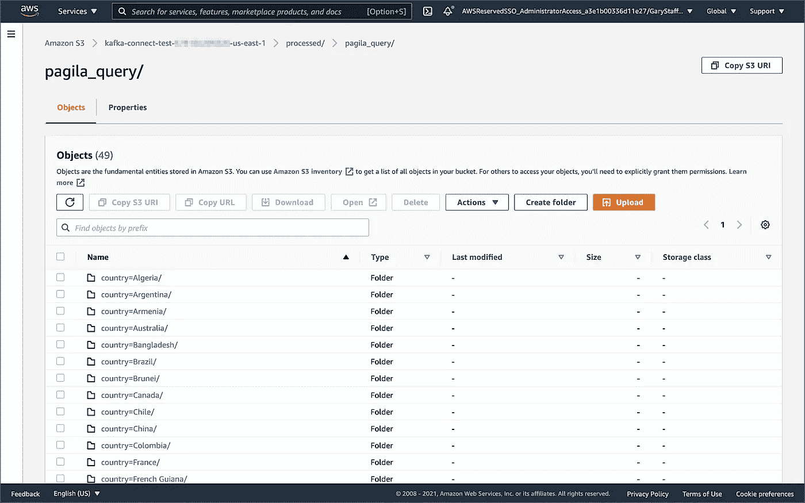

亚马逊 S3 桶显示包含 CTAS 查询结果的快速压缩拼花格式文件

现在，我们应该在同一个 AWS Glue 数据目录中看到一个新表，其中包含我们使用 CTAS 查询写入 S3 的数据的元数据、位置和模式信息。我们可以对处理后的数据执行额外的查询。

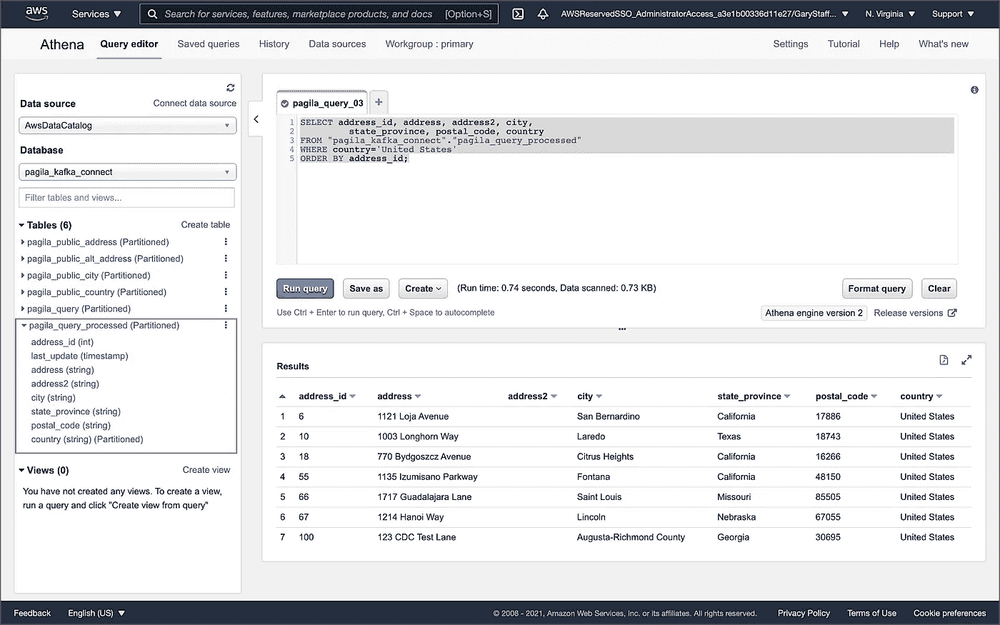

Amazon Athena 显示来自 AWS Glue 数据目录中已处理数据表的查询结果

# 具有数据湖的 ACID 事务

为了充分利用 CDC 并最大化数据湖中数据的新鲜度，我们还需要采用现代数据湖文件格式，如 [Apache 胡迪](https://hudi.apache.org/)、 [Apache 冰山](https://iceberg.apache.org/)或 [Delta 湖](https://delta.io/)，以及分析引擎，如 [Apache Spark](https://spark.apache.org/) 和 [Spark 结构化流](https://spark.apache.org/docs/latest/structured-streaming-programming-guide.html)来处理数据变化。使用这些技术，可以在像亚马逊 S3 这样的对象存储中执行记录级的数据更新和删除。胡迪、Iceberg 和 Delta Lake 提供的功能包括 ACID 事务、模式演化、增插、删除、时间旅行和数据湖中的增量数据消耗。像 Spark 这样的 ELT 引擎可以从 Kafka 读取流 Debezium 生成的 CDC 消息，并使用胡迪、冰山或三角洲湖处理这些变化。

# 结论

这篇文章探讨了 CDC 如何帮助我们将来自亚马逊 RDS 数据库的数据合并到基于亚马逊 S3 的数据湖中。我们利用了亚马逊 EKS、亚马逊 MSK 和 Apache Kafka Connect 的功能。我们学习了基于查询的 CDC，用于捕获对源数据的持续更改。在随后的[文章](/hydrating-a-data-lake-using-log-based-change-data-capture-cdc-with-debezium-apicurio-and-kafka-799671e0012f)中，我们将使用 Debezium 探索基于日志的 CDC，并了解数据湖文件格式，如 Apache Avro、Apache 胡迪、Apache Iceberg 和 Delta Lake，如何帮助我们管理数据湖中的数据。

本博客代表我自己的观点，不代表我的雇主亚马逊网络服务公司(AWS)的观点。所有产品名称、徽标和品牌都是其各自所有者的财产。