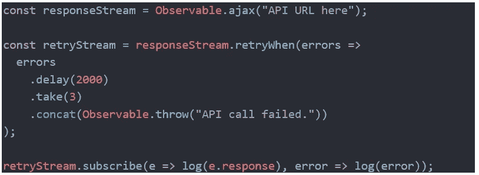
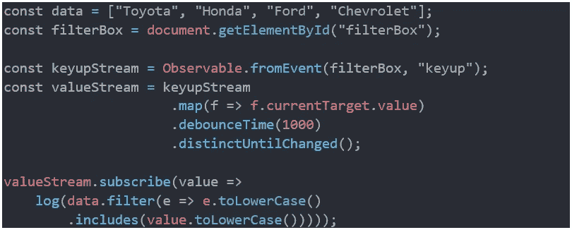

# "我希望看到你在没有反应式编程的情况下做得更好更干净."

> 原文：<https://itnext.io/i-would-love-to-see-you-do-it-better-and-cleaner-without-reactive-programming-545face12e1a?source=collection_archive---------3----------------------->

几天前，我和一位杰出的高级软件工程师谈论反应式编程(RP ),他告诉我我们不需要它；他说我们已经有了*的承诺*，这就足够了。我不得不说，这不是我第一次听到一个开发者这么说，但是我已经知道为什么他们大多数人这么说了。我们经常开始学习一个框架或如何使用一个库，而没有首先理解底层编程语言或相关技术是如何工作和连接的。我看到大多数开发人员在没有完全了解和理解诸如 Typescript 或 RP，甚至 JavaScript 之类的东西的情况下就开始了角度之旅。我意识到我的程序员同事将 RP 和它的主要角色、观察者和可观察对象联系起来，只需要对服务器进行 *ajax* 调用，检索数据并对其进行处理。如果你这样想，你肯定会把 RP 和承诺联系在一起，会说你不需要另一种方式来做那件事，我不会怪你。

再一次，在不理解 RP 的情况下学习 Angular，并使用它(RP)来创建从服务器检索数据的服务，让一些人相信这就是观察者和可观察物的全部。所以我决定创建三个简单的挑战，我会让我的朋友使用普通的 JavaScript 和任何其他库或框架来解决，除了我将在我的解决方案中使用的 **RxJS** 。我递给他 3 个挑战，并说，“我希望看到你在没有反应式编程的情况下做得更好更干净”，这样他就可以看一眼 RP 的价值，或者我可以学到更酷的东西。“还有一件事”，我说，“你当然可以自由使用*承诺*”。

请在您的 HTML 页面中添加一个指向[https://cdnjs . cloud flare . com/Ajax/libs/rxjs/5 . 5 . 11/rx . min . js](https://cdnjs.cloudflare.com/ajax/libs/rxjs/5.5.11/Rx.min.js)的脚本标记后，在您的 JavaScript 文件顶部添加接下来的两行代码。

**挑战#1:**

*点击按钮三次后，每次点击之间至少间隔一秒钟，在浏览器控制台上打印一次“挑战#1 已解决”。进一步点击将不会有任何影响。*

我的解决方案:

我们使用 vanilla JavasScript 从 DOM 中抓取按钮，然后奇迹开始了。我们让客户端事件成为一个可观察的事件，我们使用三个可观察的操作符来表示，“如果前一个值是在不到一秒钟之前发出的，就不要发出一个值，等待三个发出的值继续进行，只取一个，就这样”。最后，我们订阅了一个观察器，当浏览器控制台收到发出的值的通知时，该观察器会将所需的结果打印到浏览器控制台。我将不再赘述，因为这篇文章的目的并不是解释 RP，已经有很多关于它的文章了。

现在考虑一下，如果你要在没有 RP 的情况下这样做，你将不得不添加一个变量来跟踪点击次数，添加一些 **if/else** 并可能使用 **setTimeout** (你将不得不手动清除它，因为如果你正在处理一个生产应用程序，我知道你不希望你的代码有能力导致内存泄漏)。但是你猜怎么着，我不必担心我代码中的这三件事，我保证代码中没有错误，你能多快确定你的代码中没有错误？

**挑战二:**

*对 API 进行 ajax 调用以获取一些数据，在失败的情况下重试调用最多 3 次，但每次 ajax 调用之间要间隔 2 秒。如果三次调用失败，将“API 调用失败”写入浏览器控制台* *，如果任何一次调用成功，则显示检索到的数据。*

我的解决方案:

代码非常简单明了。我们创建一个表示 ajax 调用的可观察对象，然后我们使用几个操作符将每次重试延迟 2 秒，我们只进行 3 次尝试，如果所有尝试都失败，我们就抛出错误。最后，我们订阅一个知道如何处理成功和失败的观察者。再想一想，如果没有 RP，这将花费多少代码，并且更容易出错。

**挑战#3:**

*当用户键入时，根据文本框中的用户输入过滤数组，但在触发过滤之前等待一秒钟，并在浏览器控制台中显示过滤后的数组。*

我的解决方案:

我们从 DOM 中获取*输入*元素，并使其 *keyup* 事件成为可观察事件。之后，我们映射它以在用户释放按键后检索文本框中的文本。然后，我们丢弃前一个值发出后不到一秒钟内发出的任何值，如果文本框中的文本与之前相同，则限制它不再发出。最后，我们订阅了一个观察器，它根据当前输入过滤数组，并将其打印到浏览器控制台。

我有一个有趣的故事，关于这最后一个挑战背后的逻辑。我曾经看过一个为 Google 工作的人的演示，他们在演示中解释了当他们第一次不得不为他们的产品编写自动完成功能时是多么困难。他们认为非常简单的事情，结果变得非常复杂，因为他们必须解决他们面临的两个有趣的问题。第一，在每次击键后触发对服务器的 ajax 请求来获取数据，这会降低应用程序的性能；第二，异步编程的本质会导致旧的结果覆盖新的结果，造成糟糕的用户体验。如果他们让 RP 编写与我们上一次编写的代码非常相似的代码，只需为 *ajax* 调用更改数组过滤(当然，还要处理一些其他真实的场景，如失败或数据显示)，完成任务会容易得多。

最近，我听马修·波德威索基、说，他用 jQuery 编写代码来实现一些类似的结果(根据 *ajax* 调用的结果自动完成)，他花了两页代码才完成。我不怀疑有人能做到这一点，但我想看看它是否比 RP 解决方案更好、更干净。

如果你是服务器端开发人员，并且相信 RP 对你不适用，可以直接去找我上一篇文章[的最后一段 https://medium . com/@ ericrey 85/functional-reactive-programming-explained-in-a-simple-way-in-a-simple-way-yes-in-a-simple-way-925 b 14 cddf 75](https://medium.com/@ericrey85/functional-reactive-programming-explained-in-a-simple-way-in-javascript-yes-in-a-simple-way-925b14cddf75)，或者干脆去找[http://reactivex.io/](http://reactivex.io/)，你会发现你错了。

如果你想看另一篇使用函数式反应编程(FRP)解决这三个挑战的文章，请随时通过评论或给[ericrey85@gmail.com](mailto:ericrey85@gmail.com)发邮件告诉我。如果你想先知道 FRP 是关于什么的，你可以看看我之前的文章，我在上一段已经链接过了。

故事结尾，我很高兴看到我的程序员同伴爱上了 RP；虽然我不得不承认，我真的希望他能提出一些我不知道或想象不到的东西，让我大吃一惊。

编码快乐！