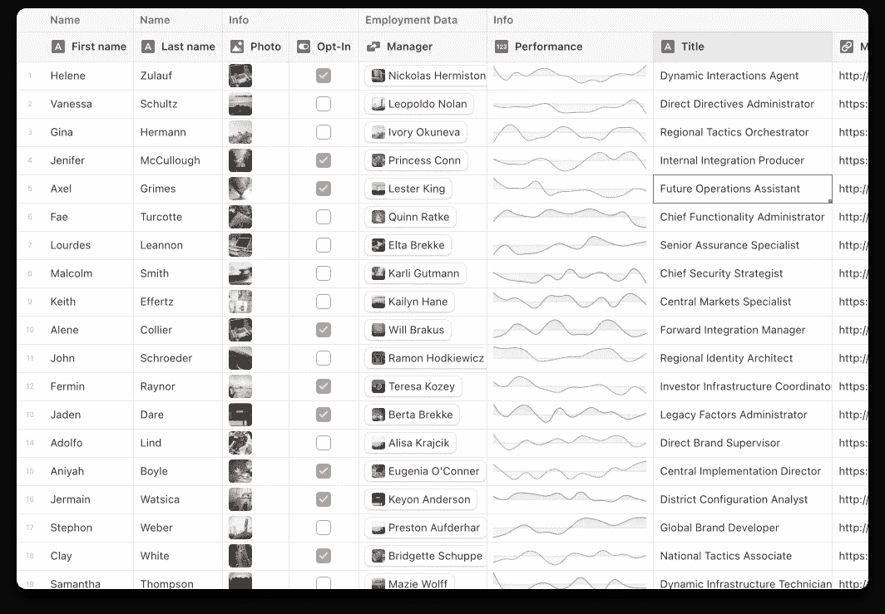

# 我写了一个 HTML 画布数据网格，所以你不必

> 原文：<https://itnext.io/i-wrote-an-html-canvas-data-grid-so-you-dont-have-to-d945aa4780b4?source=collection_archive---------1----------------------->



滑翔数据网格在其所有的画布上的荣耀

HTML 5 canvas 对于 web 开发人员来说是一个非常强大但却没有得到充分利用的工具。它也很难以一种高性能、美观和易接近的方式使用。我写 [Glide Data Grid](https://grid.glideapps.com) 是因为 [Glide](https://glideapps.com) 需要一个包含所有这些东西的数据网格，我选择 HTML 5 canvas 是因为这是唯一一个我可以付出非凡努力实现所有目标的东西。

在我们谈论我创造的傲慢纪念碑之前，让我告诉你所有你不应该自己尝试这个的理由。

## 你可能不需要表演

你有 1000 多行数据吗？你的用户真的需要以 60FPS 的速度无视觉障碍地滚动吗？加载所有单元格需要几秒钟，这有什么关系吗？如果不是，你应该坚持使用 HTML。

现代浏览器在真正开始挣扎之前，会很好地处理大量的 HTML。一百万个细胞？可能需要一分钟或五分钟，但最终会渲染。如果你能等到所有的都膨胀起来，你可能会更好的那样做。

## 你可能没有这种经历

用画布画东西很容易。用画布画一些东西，让它达到完美的像素，调整高 DPI 显示，并且不陷入各种可怕的性能问题和渲染工件，这真的很难。我不是说我比你更好的程序员，我不是，我只是花了我职业生涯中不自然的大部分时间被 2D 的绘图库打败。

## 有时你需要文本换行

Canvas 不能为您做到这一点，我希望您喜欢编写文本换行引擎。[我知道我做到了](https://github.com/glideapps/canvas-hypertxt)。

## 可访问性已经够难的了，不应该再想了

我们生活在一个社会中；使您的网站易于访问。如果您打算忽略我上面所说的一切，继续前进，请记住，无论如何，您都必须实现数据网格的 HTML 版本，以使其可访问。您仍然必须确保屏幕阅读器可以看到数据，并且他们不会说 canvas，但他们会说 canvas subdom。您需要确保输入可以被路由到这些子 dom 组件。对你来说，它将是乐趣的对立面。

## 其他糟糕的事情

一个非详尽的列表列出了其他一些糟糕的东西:阴影、滤镜、带下划线的文本、删除线的文本、任何不简单的文本、图像加载、绘制 svg、为 hidpi 显示器绘制图像、在不降低 fps 的情况下处理 hidpi、意识到 GPU 而不是 CPU 已经饱和。不要忘记，即使你只想画一条 1px 的线，你也要考虑半像素值。

# 如果我忽略你刚才说的一切会怎么样？

据我所知，有两种可能的结果。

1.  你失败了，最终使用 ag-grid 或 handsontable
2.  你可以制作类似滑动数据网格的东西

让自己看起来像什么？首先让我们忽略所有简单的问题，不管渲染解决方案如何，这些问题对每个人来说都是一样的。问题比如

*   你需要一种获取数据的方法
*   如果数据是声明性的，你需要一种廉价的方法来获取大量数据
*   您需要一种对数据进行排序、过滤和重新排列的机制
*   你需要大量的输入编辑器
*   更加

此外，您将不得不处理许多晦涩而有趣的问题，这些问题是基于画布的解决方案所特有的。

# 绘图状态机现在由您来管理

通常浏览器会想出如何以一种表现的方式为你绘制东西。现在这是你的问题了。对 CanvasRenderingContext2D 的每个调用、每个状态更改都必须小心管理。以下是一些帮助你度过难关的建议。

## 将您的绘图呼叫分组在一起

尽最大努力在一次描边调用中描边所有的线条，在一次填充调用中完成尽可能多的填充。请记住，您可以跟踪多条路径，并为每个呼叫定义多个区域。使用它。如果您正在绘制网格线，请一次全部绘制。

## 修剪受损部位

如果您知道只有一个单元格发生了更改，请将片段设定到该单元格，然后只重新绘制该单元格。确保不要对剪辑区域之外的内容发出 draw 调用，否则不会使事情变得更快。

## 避免状态改变并保存/恢复

HTML 画布的状态更改和保存/恢复非常慢。比你想象的要慢几个数量级。画布的简单实现可能会花费一半的 CPU 时间来完成不必要的状态转换。您可能认为在第一个单元格之后为每个单元格调用`ctx.font = myFont;`是无效的，但是性能分析器会很快消除您的这种想法。

事实上，简单地从`ctx`中读取是非常昂贵的，比访问简单的 JavaScript 对象属性慢几个数量级。这意味着维护最后一次属性设置的缓存通常比经常检查它实际设置的要快得多。将这种策略与大量的`save`或`restore`电话混在一起会让人头疼，所以你可能也想尽量减少这种情况。

## 批量加载您的图像

加载图像是你现在的问题，有效地创建和分发图像下载是困难的。使用`HTMLImageElements`池来管理您的下载。不要忘记，无论你创建多少，一次只能下载这么多，浏览器限制打开的连接。因此，你不仅需要自己管理这些图像，还要确保取消那些已经滚动出视图的单元格的下载。

当然，这里也有 gatchyas。

```
const image = new Image(); // expensive
image.src = "<https://myimage.server/image.png>"; // very expensive// discover you are no longer on screenimage.src = ""; // cancels download and is shockingly expensive
```

由于将`image.src`设置回空字符串(取消下载的唯一可靠方法)的成本，你需要权衡何时值得，何时应该将它放回池中而不取消。我的建议是:让你的参数可调，并进行测试，直到它按照你喜欢的方式工作。

## 快乐地生活…你自己

`CanvasRenderingContext2D.drawImage`命令能够使用相同的画布作为源和目标。如果您正在垂直滚动，请使用此功能快速上下复制像素，这样您只需绘制新显示的区域。

例如`ctx.drawImage(ctx.canvas, 0, 0 10, 10, 0, 5, 10, 10);`

注意，这只适用于垂直或水平偏移。当你对角地向自己进行位块传送时，所有主流浏览器似乎都进入了一个缓慢的 draw 调用路径，这极大地增加了 GPU 的利用率，并且几乎抵消了位块传送带来的任何节省。

## requestAnimationFrame 有点烂

`window.requestAnimationFrame`是惊人的，直到它不是。它的优点是受限于垂直同步速率，缺点是仅受限于垂直同步速率。您可能会发现您的数据网格实现工作得很好，有精彩的动画，直到有人用 120hz 的监视器开始抱怨它吃了 50%的 CPU，坐在那里渲染一个旋转器。哦，太好了。

这里有很多解决方案，但是它们的要点都可以归结为只有在第 n 次调用`window.requestAnimationFrame`时，当你觉得已经过了足够的时间时才工作。我选择全速运行 10 秒钟，然后在动画过程中每隔一帧切换一次。这让短暂的动画全速前进，同时防止长动画消耗太多的电池寿命。

## 逐列呈现

大多数单元格样式在一列中是同质的，这为优化提供了机会。设置你的字体一次，你的颜色一次，你也许可以在一次调用中渲染许多单元格，这取决于它们是什么。将剪辑区域设置为整列，而不是逐个单元格地剪辑。

## 避免阿尔法混合

如果可以的话，渲染纯色要快得多。它避免了在图形库中逐个像素进行 alpha 混合的需要。关闭画布上下文中的 alpha 通道。不要用一种透明的颜色在彼此的顶部绘制多个框，而是预先计算所有分层的最终结果颜色，并绘制一次该颜色。它看起来一样，但速度至少快 5 倍。

## 规范化您的画布

将画布缩放到显示器的 DPI。如果数学对你和对我一样可怕，你可能想把它四舍五入到最接近的整数。这将让您编写大部分代码，就像 hi-dpi 不存在一样，直到您需要将画布 blit 到自身上，然后您将需要考虑它。

# 可访问性比你想象的要容易得多

无障碍很难，真的很难。你不会得到正确的答案，幸运的是，你基本上可以毫不犹豫地从 W3C 复制并粘贴可访问性的例子，而不是真的关心它们看起来怎么样！为什么？

```
<canvas>
  <p>This doesn't render normally, but screen readers see me.</p>
  <button>and they can click me!</button>
</canavas>
```

事实上，屏幕阅读器拥有检查画布子区域的超能力。他们可以关注对用户隐藏的元素，他们可以检查所有数据，如果您足够聪明，您可以非常高效地虚拟化该子 dom。确保你关注了来自 DOM 的事件，并且你准备好了！

这意味着您的 DOM 可能看起来像

```
<canvas>
  <!-- You will want to place more aria-tags, but keeping the example clean -->
  <table>
    <tr aria-rowindex="2">
      <td aria-colindex="5">Cell 1</td>
      <td aria-colindex="8">A picture of a dog</td>
    </tr>
    <!-- More stuff here -->
  </table>
</canvas>
```

> *注意:上面的内容并不是要展示如何格式化一个表格，只是说你可以按照你想要的方式来格式化它。*

与其他基于 HTML 的解决方案相比，一旦他们开始需要诸如固定列、排序、虚拟化等东西。，您会发现他们通常不能以一种对屏幕阅读器来说有效的方式来组织 DOM。这些解决方案中的许多都有特殊的可访问性模式，这会严重影响性能，其中一些甚至会默认关闭这些模式，将需要可访问性工具的人视为二等公民。如果您已经在使用其中一个主要的数据网格，您可能想检查一下这个…

然而，你不会犯这个错误。默认情况下，您将拥有这个子窗体渲染，您不允许它被关闭，您将使它成为您的网格的主要输入机制。下一次有人对你说“祝你在 ADA 上好运”，当你提到你的基于 canvas 的解决方案时，你可以说每个程序员最喜欢的两个词:“嗯，实际上……”

## 这不仅仅是关于屏幕阅读器

除了屏幕阅读器之外，还有更多可访问性。您应该尝试尊重其他设置，如黑暗模式(是的，这应该被视为辅助功能的一部分)，并喜欢减少运动。这两者都可以在 JavaScript 中读取，如果你对动画进行了合理的编码，你可以直接跳到结尾，或者最好有低运动或者没有运动的替代方案。

# 处理输入

当一个单元格有焦点时，不要试图在画布上呈现输入，只需弹出一个包含`<input>`的覆盖 html 元素。如果它对 Google Sheets 足够好，它对你也足够好！

# 渲染字体很慢，真的很慢

一个实现良好的数据网格将在`fillText`函数中花费大约 50%的 CPU 时间。为什么？因为[字体在渲染](http://rastertragedy.com/)时过于复杂，你需要为文本渲染调用跨越 JS/Native 桥，而浏览器在渲染 HTML 时却不需要。有几件事你可以做得更快。

## 保守截断

测量文本也很慢，尽可能避免测量文本。为了避免测量文本，请考虑在单元格的边缘剪切文本，而不是考虑在哪里放置省略号。如果出现一个特别长的字符串，它将被剪切成一个小区域，那么首先将字符串截断成更小的部分。您需要支付字符串的全部渲染和布局成本，而不考虑剪辑区域。

如果你处理的是非罗马语言，要小心不要不小心漏掉半个字母。

## 使用 textAlign 避免测量

如果您想右对齐文本，使用`textAlign`参数来右对齐文本，而不是自己测量文本。切记尽量减少设置`textAlign`参数的次数，因为设置该参数非常昂贵。

当你这样做的时候，可以考虑使用`textBaseline`使文本居中而不需要测量。有些字体对此的反应会比其他字体更好。

# 当一切都失败的时候

通常这是我向你推销 [Glide 数据网格](https://grid.glideapps.com)的部分，告诉你与其自己构建，不如让我为你构建。问题是，我不卖 Glide 数据网格，所以来帮我建立它，[提交一个 PR](https://github.com/glideapps/glide-data-grid) ，让我知道你的项目需要什么功能，我们可以一起建立一个疯狂的快速，零妥协，高度可访问的 react 数据网格。