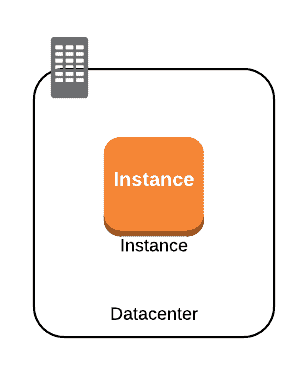
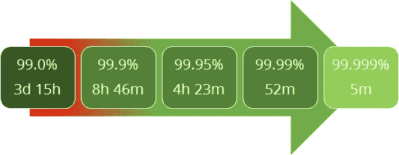
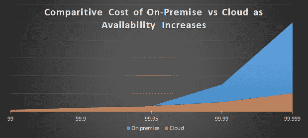
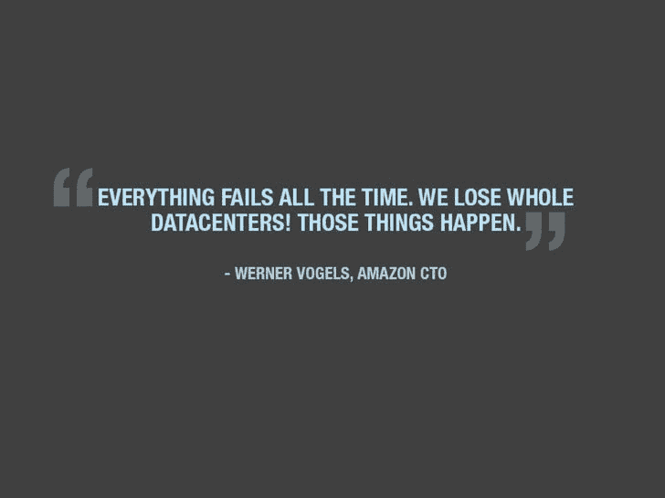

# 如果你对可用性很认真，云是唯一的选择

> 原文：<https://itnext.io/if-youre-serious-about-availability-cloud-is-the-only-option-f8cb142fecda?source=collection_archive---------0----------------------->

内部可用性的统计数据通常是完全虚构的。如果我们诚实地对待实现高可用性，唯一真正的解决方案就是云。

首席技术官和他们的经理经常被赋予以下绩效目标:“利用这堆旧技术，让它以 99.99%的正常运行时间工作，同时跟上我们要求的所有随机变化和升级”。

旧世界的技术领导者既不疯狂也不愚蠢:他们生活在现实生活中*m . c .埃舍尔*的草图中，其中的技巧是捕捉悖论并对外界隐藏。这通常意味着他们必须:

*   调整正常运行时间的计算，排除随机事件、外力和任何他们不想包含的东西。
*   根据风险承受能力，而不是客户的利益，有选择地选择即将到来的项目和变更。
*   通过省略测量，对可用性撒了弥天大谎——基本上，如果没有人注意到可用性下降了，那么它就没有下降。

这解释了为什么我们中的许多人都在那些吹嘘疯狂的高运行时间数字的公司里，而这些数字并没有反映我们都知道是真实的现实。这也表明了为什么这么多严重的停机被转移到供应商和第三方的责任上——因为在这些墙之外，他们的故障不是*我们的*故障。

我在一家公司工作，该公司使用复杂的公式来衡量正常运行时间，确保重大停机不会导致关键指标下降到 99.9%以下。对 CYA 有利，对客户服务不利。尽管如此，仅仅因为我们可以巧妙地改变视角，所以瀑布总是走下坡路，并不意味着它就是这样。

虽然这对于许多内部系统来说可能并不重要，但是当涉及到面向客户的软件时，我们需要完全诚实地度量和报告可用性。

# 真实故事:99.999%的谎言。

我有一个客户，他正在建立一个商品交易平台。我的第一个问题是关于高可用性的架构，因为我很确定我的客户希望它一直工作。他的供应商不情愿地画出了这张基础架构图:

他的供应商选择的托管公司在其 SLA 中“保证”了 99.999%的可用性，因此可用性的整个问题被匆忙地作为供应商的问题搁置一旁。

但是在“五个 9”的情况下，全年*的停机时间只有 5 分 26 秒。当你考虑到补丁、重启、崩溃和墨菲定律时，这很难做到(尤其是在 Windows server 上)。*

*正如我在 Rackspace 工作时了解到的那样(Rackspace 经常不得不与声称成本接近 100%的不太谨慎的主机竞争)，首先要看的是服务水平协议中的法律术语。在这种情况下，我发现了魔术的秘密:*

*   *停机时间不包括定期维护或紧急维护。5 分钟以下的中断不被视为停机。*
*   *客户必须在 72 小时内报告停电(他们不必坦白)，他们的日志是事实的来源，而不是你的。任何信用上限为 2%，可用于未来的服务，而不是退款。*
*   *他们无法控制的事件——ISP 中断、DDOS、电源故障、实习生被电源线绊倒——不包括在内。*

*对于该供应商来说，他们可能每小时停机 4 分 59 秒，但仍能满足其 SLA 要求。尽管环境被描述为每月 300 美元的“云服务器”,但它更类似于可用性高达 99%的共享主机模型。*

*回到客户在这个平台上构建 HA 交易系统的愿望，这就像试图用手推车的底盘建造法拉利一样。这个托管平台一点也不好笑。*

# *为什么可用性对 IT 来说很难说。*

*可用性是一个女孩，她离开了许多 IT 团队。甚至讨论它也可能重新点燃旧的争论，可能难以面对，并打开一个完整的蠕虫罐:*

*   *可用性首先触及系统架构的基础。当它不像预期的那样稳定时，就有归因于设计的内在缺陷。它讨厌外来的指责(尽管经常是外向指责的支持者)。*
*   *通常对可用性没有初始要求——在构建系统时，它只是被简单地假设或忽略了。在没有明确说明的情况下，没有做任何事情来使系统特别可靠。假设不是系统设计的良好基础。*
*   *随着系统老化，开发团队转移到其他工作上，可用性问题通常会变得更加明显，他们通常不愿意支持旧系统。开发人员倾向于喜欢新的和闪亮的东西，讨厌重复的维护和支持。*
*   *开发人员几乎总是高估他们构建的东西的可靠性，并且忽略当东西损坏时的折叠失效模式。开发人员的 DNA 中没有为超出直接范围的事情做计划。*
*   *可用性并不是免费的，通常赞助企业或客户会因为系统真正可用的成本而犹豫不决。*
*   *具有讽刺意味的是，只有当系统变得更繁忙、更关键时，可用性才可能成为一个问题。断电会给自己带来最大的不便，通常会在黑色星期五的中间进行计划。*

*这就是为什么我们需要在产品设计和架构的开始就将可用性作为一个话题，而不仅仅是在事后对自己撒谎。我们需要一个处理失败的计划。*

# *99%之后，一切都变得非常非常困难。*

**

*可用性连续体:让我们面对现实吧——高达 99%很容易。*

*任何高达 99%的可用性都很容易。我桌子下的电脑使用率达到 99%，它生活在 Windows 10、时代华纳和我的清洁工的掌控之下，他们在吸尘时会拔掉插头。99%允许一年停机 3 天。没问题。*

*当您放大到 99%以上的范围时，HA 的复杂性才变得更加明显，并且范围从“便宜且简单”变为“昂贵且不可能”:*

**

*可用性%和等效年停机时间。*

*对于一个基础 app 来说，99.9%大概可以通过大多数 5 美元/月的共享托管解决方案实现。甚至一个不起眼的 EC2 实例的可用性也达到了 99.95%，不需要额外的架构。*

*但是，当您插入额外的 9 时，我们开始追逐可用性之龙，并发现我们没有想到的事情开始成为一个问题:*

*   *主机的网络、电源、ISP 和一般设施的可用性如何？*
*   *考虑到维护、帐户硬件故障和意外失误，硬件的可用性如何？*
*   *整个数据中心出现故障的几率有多大？*

*你不得不“超越框架”思考的地方就是它变得难以置信的困难之处。事实上，在 99.95%附近，传统的内部部署环境和云环境之间的性价比权衡开始出现非常明显的差异。*

**

*詹姆斯的餐巾纸数学用图表“看起来很科学”。*

*在这之前，您可以住在一个数据中心，甚至可能只使用 1 或 2 台机器来运行您的应用程序。此后，您必须开始考虑第二个数据中心、多个设施、专家安装、人员配备和维护。*

# *真的，99.95%之后唯一理智的选择就是云。*

*许多本地支持者没有意识到可用性实际上是关于自动化和容错，而不是神奇的硬件或超快的超负荷支持人员。物理定律仍然适用于云，但我们敢于提出关于事物失败的尴尬问题。*

**

*当您进入真正的高可用性领域时，您会添加更多的区域、更多的可用性区域、更多的负载平衡器、更多的实例和更多的备份。这在云中变得越来越便宜，因为你不需要实际构建或购买任何东西，也不需要雇佣大量人员来管理它。*

*现场观众通常不知道推动整个想法的自动化。当我演示了自动扩展或区域故障转移在没有人的情况下如何工作时，我对传统 IT 的反应感到震惊，有时人们甚至对此感到愤怒。*

*从本质上来说，这并不奇怪，因为这就是为什么首先要构思云，尤其是 AWS。云是脸书、谷歌和 Amazon.com 的核心——每个人都在使用的真正永不停机的服务——它是他们如何以接近 100%的可用性运营的基础。*

*我相信我们已经非常接近企业对其基础架构得出相同结论的那一点——如果他们想要最高级别的可用性，云是愿意并且能够做到的。仅仅为了表明观点而试图建立自己的 AWS 副本是徒劳的，在财政上也是不负责任的。*