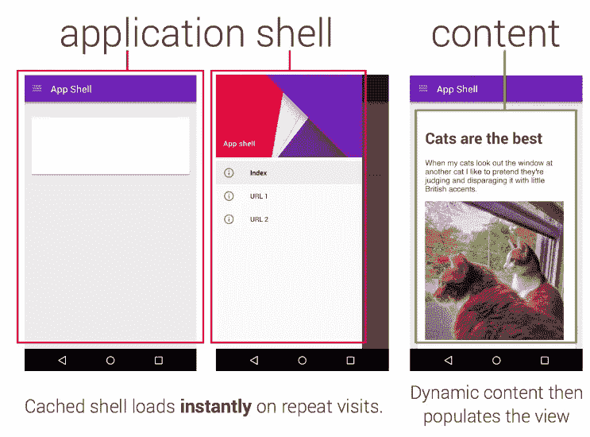
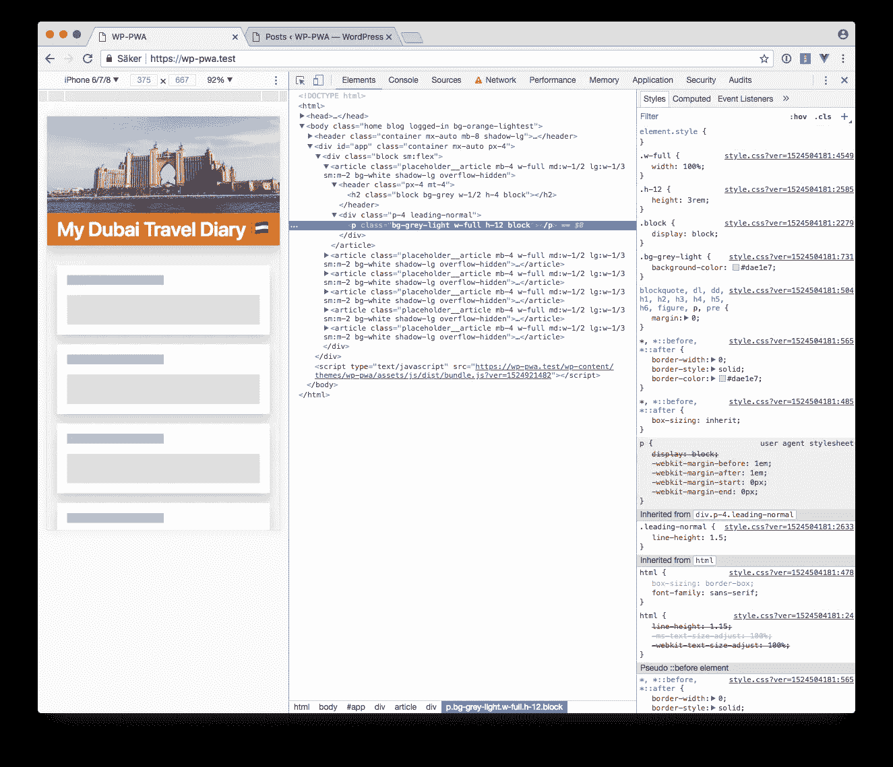
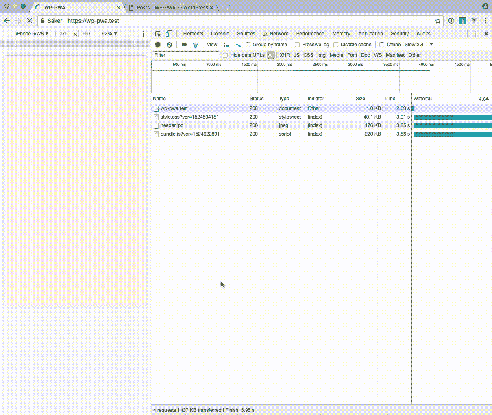
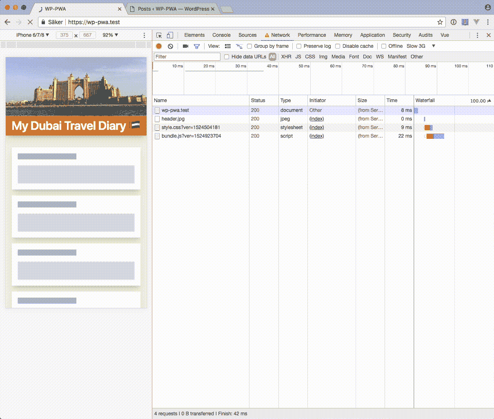

# 我正在做一个离线的第一个 WordPress PWA，第 4 部分

> 原文：<https://itnext.io/im-making-an-offline-first-wordpress-pwa-part-4-be2d06e6ff28?source=collection_archive---------2----------------------->

## 应用程序外壳模型

该系列由以下部分组成:

> [第一部分——HTTPS](/im-making-an-offline-first-wordpress-pwa-part-1-6ae90ea672a4)
> 
> [第 2 部分— Manifest.json](/im-making-an-offline-first-wordpress-pwa-part-2-b313659bfc9c)
> 
> [第 3 部分—带工具箱的维修工人](/im-making-an-offline-first-wordpress-pwa-part-3-1ddf61891121)
> 
> [第 4 部分— App 外壳模型](/im-making-an-offline-first-wordpress-pwa-part-4-be2d06e6ff28)(此部分)
> 
> [第 5 部分—离线优先](/im-making-an-offline-first-wordpress-pwa-part-5-e3293faefb88)
> 
> [第 6 部分——单页应用](/im-making-an-offline-first-wordpress-pwa-part-6-1f4beea6e641)
> 
> [第 7 部分—优化](/im-making-an-offline-first-wordpress-pwa-part-7-5d1ee68ec6bd)

在最后一部分中，我使用[工具箱](https://developers.google.com/web/tools/workbox/)创建了一个服务工人。这是它在这个时间点上的样子:

它做两件事:

*   缓存目录`wp-content/themes/wp-pwa/assets/`中的所有文件
*   缓存首页，即使用户离线或连接不稳定也能加载博客。

我在两种情况下都使用了`cacheFirst()`策略，这意味着文件将总是从缓存中提供。如果文件不在缓存中，它当然会像往常一样从服务器下载，然后存储在缓存中。

> 这意味着用户使用的带宽更少，由于网络请求量最小，加载博客的速度非常快。

这种策略的缺点是，无论如何，文件总是由缓存而不是服务器提供。这意味着，如果在服务器上更新 CSS 文件，用户仍将从缓存中获得旧文件。

这当然可以通过添加一个版本号作为查询字符串来解决:`style.css?version=1.1`浏览器会将它视为一个新文件，下载并存储在缓存中。

问题是 HTML 文件本身当前存储在缓存中。如果 HTML 没有更新，`href`不会从`style.css?version=1.0`更新到`style.css?version=1.1`

但最大的问题是博客本身不会更新。如果存储在缓存中的 HTML 没有更新，用户将看不到任何新的博客文章。

## 新策略？

这种策略似乎不可持续，至少在博客的 HTML 页面上是如此。对我来说，[应用外壳模型](https://developers.google.com/web/fundamentals/architecture/app-shell)可能是一种选择。
简而言之，通过使用应用程序外壳模型，我可以在缓存中保存一个博客的“空”版本，一个没有内容的外壳。外壳将使用 JavaScript 在客户端填充内容。

App Shell 模型的可视化。图片来自谷歌

但是，无论我多么喜欢 JavaScript，我都不愿意过多依赖客户端渲染。当然，没有 JavaScript，脸书或 YouTube 就无法运行，但这是一个简单的博客，不是那种网络应用。博客应该或多或少地在没有 CSS 和 JavaScript 的情况下工作！

> 另一方面，PWA 更宽容一些，因为您不必等待脚本加载。这意味着客户端渲染速度更快。

但是记住并非所有的浏览器都支持服务人员还是很重要的。仅仅因为你做了 PWA 并不意味着每个人都会体验到 PWA 的好处。

## App 外壳模型和 Vue.js

但是我不应该不先测试就拒绝任何东西。使用像 React 和 Vue 这样的 JS 框架构建整个网站变得越来越普遍，所以我决定给应用程序外壳模型一个机会，并做了以下工作:

我现在使用 WordPress 循环来呈现占位符，而不是在服务器端呈现博客文章。

服务器端呈现的脸书样式占位符。

在上面代码示例的第 4 行，您可能已经注意到了`<blog-post />`元素。这是一个 [Vue 组件](https://vuejs.org/v2/guide/single-file-components.html)，当博客文章已经加载了 JSON API 内建的 WordPress 中的`fetch()`时就会呈现出来。

`app.js`现在看起来是这样的:

这里是`blogPost.vue`:

这是动画。GIF 显示了当博客在 Chrome 开发者工具中将网速调至慢 3G 时的样子:

请注意，服务人员此时并不活跃。的。GIF 展示了第一次访问的经历。加载时间大约是 13 秒，但是这个数字在下次访问时会大大提高。

网速仍然被限制为慢 3G，但是博客加载只需两秒多一点！如果网速提升到快 3G，加载时间提升到 1，7 秒！

这是可能的，因为 HTML、CSS、JavaScript 和标题图像存储在缓存中。唯一通过网络加载的是来自 WordPress API 的少量 JSON 数据。

## 离线？

内容将始终是最新的，因为它不再存储在缓存中。这种方法的缺点是博客不能离线工作。它当然会加载，但是带有占位符的外壳永远不会被实际内容替换。

好的一面是，这可以通过在缓存中保存来自 WordPress API 的数据来解决。但这是下一部分的任务…