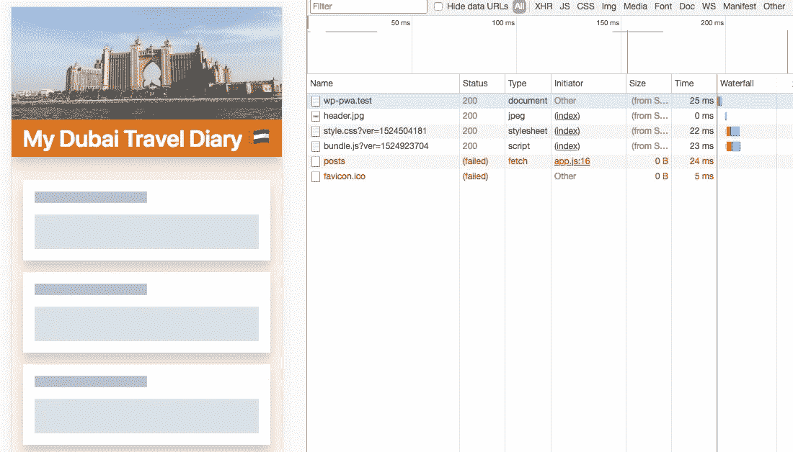

# 我正在做一个离线的第一个 WordPress PWA，第 5 部分

> 原文：<https://itnext.io/im-making-an-offline-first-wordpress-pwa-part-5-e3293faefb88?source=collection_archive---------5----------------------->

## 先离线

在这个系列之前:我反对我的原则，用 [Vue.js](https://vuejs.org) 从服务器端切换到客户端渲染。这种方法的优点是我可以使用[应用程序外壳模型](https://developers.google.com/web/fundamentals/architecture/app-shell)并将博客的“外壳”保存在缓存中。博客文章是用 AJAX 从 WordPress JSON API 获取的，这意味着只需要通过网络下载非常少量的数据。

缺点是，如果用户离线或处于不稳定的“虚假”连接中，他/她将只能看到占位符，而没有实际内容。

如果没有网络连接，对 JSON API 的 fetch 调用将会失败。

它仍然比浏览器内置的“您没有连接到互联网”页面要好，但它可以用更好的方式来完成！

## 重新验证时过时

解决方案是使用服务工作器将来自 JSON API 的数据保存在缓存中。无论何种连接方式或网速，访问者都可以阅读博客文章。

问题是哪种策略是最好的。被排除了，因为它会再次给我同样的问题——访问者将永远看不到新的博客文章。

`staleWhileRevalidate()`是一种可能的策略。它直接从缓存中提供数据，但无论如何都会在后台发出网络请求。然后，新数据被保存在缓存中，并将在下次访问时使用。

> 博客几乎可以即时加载，但问题当然是用户需要访问博客两次才能看到新帖子。

下面的视频对此进行了说明。新帖子发布后，博客必须重新加载两次。

## 网络优先

在这种情况下，新数据的优先级高于速度。`staleWhileRevalidate()`更适合 CSS 和 JavaScript，它们不像内容那样重要。

这就是为什么`networkFirst()`策略更适合的原因。顾名思义，它将首先通过网络发送请求。如果服务器由于某种原因没有响应，以前缓存的响应将作为后备。

当 JSON API 被处理时，这就是服务人员现在的样子。

在下面的电影中，你可以看到一篇新的博客文章是如何在一次重新加载后发布和显示的。如果你在 Chrome 开发工具中切换到离线模式并再次重新加载，博客仍然可以工作，因为 JSON 数据现在也存储在缓存中。

随着这个目标的实现，我实际上已经用 WordPress 制作了一个离线的第一个渐进式网络应用程序。但是我仍然有一些有趣的问题要解决。到目前为止，博客只包含一个页面，所以需要创建一个`single.php`页面。问题是怎么做？

以前的零件:

*   第一部分:HTTPS
*   第二部分:Manifest.json
*   [第 3 部分:带工具箱的服务人员](https://medium.com/@stefanledin/im-making-an-offline-first-wordpress-pwa-part-3-1ddf61891121)
*   [第四部分:应用外壳模型](https://medium.com/@stefanledin/im-making-an-offline-first-wordpress-pwa-part-4-be2d06e6ff28)