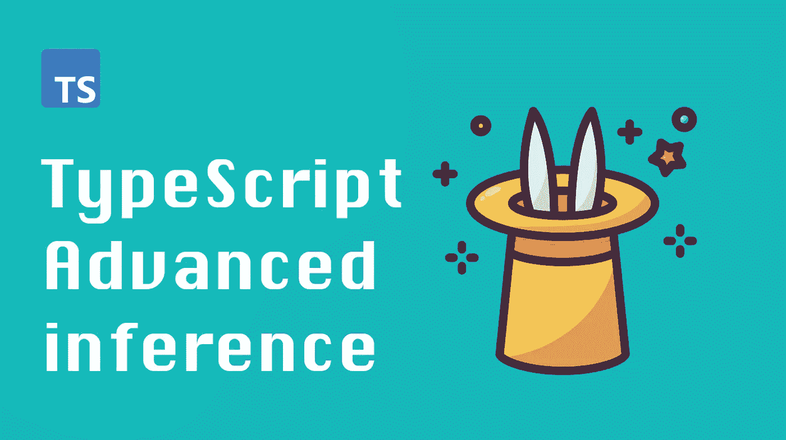

# 深入了解 TypeScript 泛型:第 2 部分—高级推理

> 原文：<https://itnext.io/in-depth-look-at-typescript-generics-part-2-advanced-inference-5c75638ee6bf?source=collection_archive---------4----------------------->



欢迎来到我们关于类型脚本泛型系列的第二篇文章！在这篇文章中，我们将仔细看看 TypeScript 推理。我们将讨论高级推理、映射和条件类型等主题。

如果你还没有，你应该阅读关于[泛型基础](https://isamatov.com/typescript-generics-in-depth-basics/)的系列文章的第一部分，以便更好地理解。

# 打字稿中的高级推理

通过结合泛型和类型推断，我们可以创建基于彼此之上的高级类型。通过以这种方式创建新类型，您可以为您的项目创建一个易于维护的健壮的类型系统，因为所有子类型都将自动采用其父类型中的更改。

开始时，您可能会发现高级类型推理的语法有点棘手，但是稍加练习，您应该能够掌握它。

让我们从映射类型开始。

# 映射类型

映射类型派生自其他类型。当我们将映射类型与泛型相结合时，我们可以形成强大而灵活的类型定义。

使用`keyof`创建新类型就是一个例子。在第一篇的[中，我们简单的提到了`keyof`。现在让我们更深入地探讨一下。](https://isamatov.com/typescript-generics-in-depth-basics/)

`keyof`是一个 TypeScript 操作符，它允许你根据他人的属性派生出新的类型。它接受一个输入类型，并返回一个新类型，该类型具有原始类型的所有属性。

这里有一个例子:

```
type KeysOfObject<T> = keyof T;type User = {
  id: number;
  name: string;
  address: string;
}type UserKeys = KeysOfObject<User>const accessUser = (user: User, key:UserKeys) => {
  return user[key]
}const user = {
  id: 1,
  name: "John Doe",
  address: "private"
}accessUser(user, "address");
accessUser(user, "SSN") // ERROR: Argument of type '"SSN"' is not assignable to parameter of type 'keyof User'.
```

我们在通用类型`KeysOfObject`中使用`keyof`，我们可以用它来创建其他映射类型。我们使用`KeysOfObject`来基于`User`的属性创建一个新的`UserKeys`类型。

我们在第`accessUser(user, "SSN")`行得到一个错误。原因是我们使用了类型`UserKeys`来确保我们的函数只接受现有的用户字段。

创建映射类型是这样一个基本特性，TypeScript 在语言中添加了实用工具类型。这些实用程序类型，如 Partial、Readonly、Pick 等，使得创建自定义映射类型变得更加容易。

这些实用程序类型使用泛型来处理它们作为输入接收的类型。让我们更详细地介绍这三种实用程序类型。

## 部分的

Partial 用于创建所有字段都设置为可选的新类型。这对于处理不完整的对象实例非常有用，因为您事先不知道哪些字段可能会丢失:

```
type User = {
  id: number;
  name: string;
  address: string;
}function updateUserObj(id: number, body: Partial<User>) {
  return makeUpdateAPIRequest(); // Updates the user using partial user object as a body;
}
```

因为我们将我们的`body`参数设置为类型`Partial<User>`，我们不需要向这个函数提供整个用户对象，只需要提供我们试图更新的字段。

## 只读

`Readonly`实用程序类型用于创建一个新类型，所有字段都设置为只读。TypeScript 不允许您在初始化后更改此类对象的任何字段值:

```
type User = {
  id: number;
  name: string;
  address: string;
}const readonlyUser: Readonly<User> = { id: 0, name:"John Doe", address: "private" };
readonlyUser.address = "public"; //ERROR: Cannot assign to 'address' because it is a read-only property.
```

这里，我们创建了一个新的类型`Readonly<User>`，除了只读权限之外，它的字段与用户类型相同。当我们创建一个`readonlyUser`的新实例并试图修改它时，TypeScript 抛出一个错误。

## 挑选

`Pick`实用程序用于通过指示您想要复制的字段来创建新类型。要选择字段，需要将它们作为联合类型传递:

```
type PickedUser = Pick<User, "id" | "name">const pickedUser: PickedUser = {
  id: 1,
  name: "John Doe"
}
```

参见我在[上发表的另一篇关于 React 最有用的实用工具类型的文章](https://isamatov.com/typescript-utility-types-for-react/)，了解更多关于实用工具类型以及它们如何帮助你。

# 条件类型

现在让我们来看看条件类型。我们知道 JavaScript 中的条件表达式:

```
const myLabel = isEven ? "even" : "odd";
```

事实证明，我们可以使用相同的语法来定义类型。TypeScript 的条件类型允许我们根据收到的输入类型的值返回不同的类型:

```
type Cat = { catName: string }
type Dog = { dogName: string }type BarkOrMeow<T> = T extends Dog ? { barkSound: "Bark!" } : { meowSound: "Meow!" };type CatSound = BarkOrMeow<Cat>;
```

上面的代码定义了一个条件类型`BarkOrMeow<T>`，它根据输入`T`返回一个带有`barkSound`或`meowSound`的类型。然后我们通过将`Cat`类型传递给`BarkOrMeow`来创建一个`CatSound`类型。

即使通过这个简单的例子，您也可以看到 TypeScript 条件类型是多么有用。

# 分布式条件类型

在定义条件类型时，我们可以返回几个分布式类型，而不是返回一个类型作为条件语句的一部分。

分布式类型允许您为代码增加另一个级别的灵活性，并处理更复杂的边缘情况:

```
type dateOrNumberOrString<T> = T extends Date ? Date : T extends number ? Date | number : neverfunction compareValues<T extends Date | number> (value1: T, value2: dateOrNumberOrString<T>) {
  // do the comparison
}
```

在上面的例子中，我们使用分布式条件类型`dateOrNumberOrString`来强制我们的`compareValues`函数的第二个参数的类型。如果`value1`是一个`Date`，我们希望`value2`也是一个`Date`。如果`value1`是一个数字，我们希望`value2`要么是日期，要么是数字。

# 条件类型推理

条件类型的一个更复杂的情况是推断新类型作为条件语句的一部分。我们可以使用`infer`关键字根据接收到的输入的某种属性或签名来推断新的类型。

如果没有具体的例子，这听起来可能有点太抽象了，所以让我们来看一个例子:

```
type inferFromFieldType<T> = T extends { id: infer U } ? U : never;
```

在这个例子中，我们从类型`T`的`id`字段中推断出类型`U`。如果`T`有`id`属性，那么 TypeScript 推断该属性的类型为`U`。然后，您可以在同一个条件类型语句中使用`U`。

条件类型推理允许创建健壮的类型检查逻辑，可以处理深度嵌套的对象。

# 从函数签名进行类型推断

与我们从对象字段推断类型的方式相同，我们也可以从函数签名推断类型。

我们可以从函数参数以及函数返回类型中推断类型:

```
type inferFromFunctionParam<T> = T extends (a: infer F) => void ? F : never;
type inferFromFunctionReturnType<T> = T extends () => infer F ? F : never;
```

这里我们有两个泛型类型，它们从输入函数类型推断类型。第一个使用函数参数，另一个使用函数的返回类型。

让我们来看看如何使用其中一种类型:

```
function executeFunction<T extends (param: any) => void> (fn: T, arg: inferFromFunctionParam<T>) {
  fn(arg);
}function sampleFunction(param: string) {
  // Do something here!
}
executeFunction(sampleFunction, "Hello world");
```

我们有`executeFunction`函数，它使用了我们之前在第二个参数`arg`上创建的`inferFromFunctionParam`泛型类型。

`executeFunction`的第一个参数是一个带一个参数的函数，`param`。TypeScript 将从`param`的类型中推断第二个参数`arg`的类型。

换句话说，如果`fn`应该接收一个字符串，TypeScript 确保我们只能传递一个字符串作为`executefunction`的第二个`arg`参数的值。

如果我们试图用一个数字调用`executeFunction`，TypeScript 会抛出一个错误:

```
executeFunction(sampleFunction, 1); //ERROR: Argument of type 'number' is not assignable to parameter of type 'string'
```

基于您收到的函数参数的函数签名来强制类型的能力允许一个完全不同级别的类型安全。

# 结论

在这篇文章中，我们介绍了高级类型推理，并将其与泛型相结合，在其他类型的基础上构建灵活的类型。凭借对泛型和类型推断的深刻理解，我们可以确保流经我们应用程序的所有数据都具有很强的类型安全性。

这就结束了我们对 TypeScript 泛型的深入研究。同样，如果你还没有阅读第一部分，我鼓励你这样做，因为它为理解 TypeScript 泛型奠定了[基础。](https://isamatov.com/typescript-generics-in-depth-basics/)

如果你想获得更多的网络开发、反馈和打字技巧，可以考虑[在 Twitter 上关注我，](https://twitter.com/IskanderSamatov)在那里我分享我学到的东西。
打字快乐！

*原载于 2022 年 2 月 21 日*[](https://isamatov.com/typescript-generics-in-depth-advanced-type-inference/)**。**