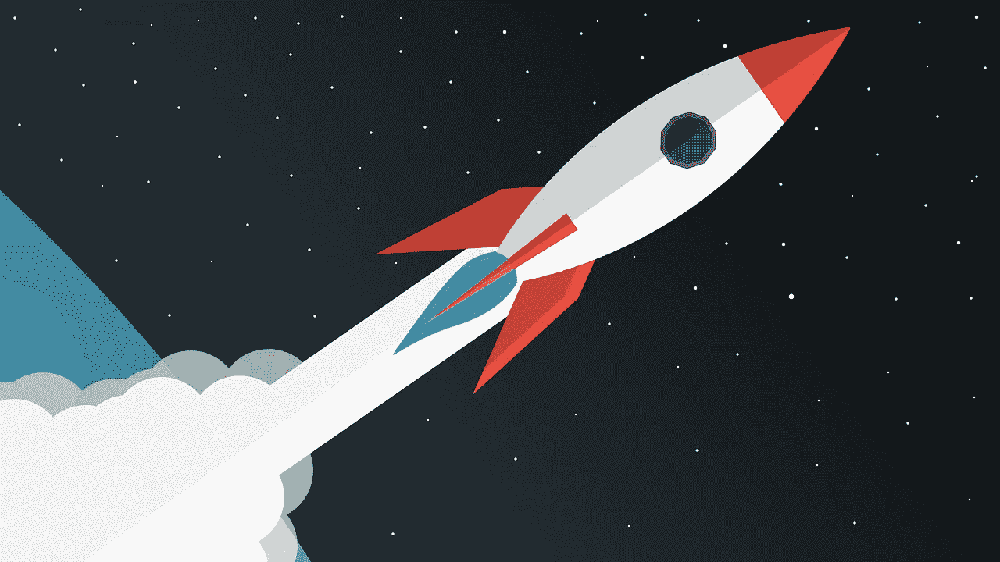

# 提高库贝瓦尔林挺速度🚀

> 原文：<https://itnext.io/increasing-kubeval-linting-speeds-9607d1141c6a?source=collection_archive---------2----------------------->



在 Mettle，我们所有的工作负载都在 Kubernetes 上运行，它们是使用名为 Flux([https://github.com/fluxcd/flux](https://github.com/fluxcd/flux))的 GitOps 运营商部署的。

# 什么是 GitOps？

那么什么是 GitOps 呢？从表面上看，这很简单。GitOps 的核心是使用一个版本控制系统(比如 Git)来存放 Kubernetes 部署的所有信息、文档和代码，然后使用自动化控制器将更改部署到集群。GitOps 为开发人员提供了一种使用 Git 和他们自己的版本控制系统来管理操作工作流的方法，特别是对于 Kubernetes。

简而言之，使用 pull 请求合并代码的过程也用于将工作负载部署到 Kubernetes。

# 连续累计

像任何好的拉式请求(PR)工作流一样，我们需要运行持续的集成测试，以验证我们的更改可合并到我们的代码库中。这与我们在源代码控制中维护的 Kubernetes 清单没有什么不同。

我们在 Mettle 的所有定制头盔图表都存储在一个名为 **mettle/k8s-helm-charts 的集中存储库中。**然后使用 Flux HelmReleases 将这些图表部署到我们的 Kubernetes 集群中，要了解更多信息，请参见[https://docs . Flux CD . io/projects/helm-operator/en/latest/references/helm release-custom-resource . html](https://docs.fluxcd.io/projects/helm-operator/en/latest/references/helmrelease-custom-resource.html)

# CI 问题

我们通过执行`helm template`来验证我们的 helm 图表，然后将每个图表的输出依次传送到`kubeval`([https://github.com/instrumenta/kubeval](https://github.com/instrumenta/kubeval))(见下文)，以验证清单与特定版本的 Kubernetes 的模式定义一致。

问题是每次执行`kubeval`似乎都要花费很长时间，我们意识到这是因为 kubeval 每次都必须拉下所有的模式来验证舵图。这意味着，如果我们向存储库添加更多的图表，只会混淆问题。

**图式:**[**https://github.com/instrumenta/kubernetes-json-schema**](https://github.com/instrumenta/kubernetes-json-schema)

# 竞争情报解决方案

在查看 Kubeval 可用的旗帜时，我注意到以下一个:

```
-s, --schema-location string Base URL used to download schemas. Can also be specified with the environment variable KUBEVAL_SCHEMA_LOCATION.
```

如果我们可以在本地下载必要的模式，然后将 kubeval 指向它们，这将大大减少显示我们的舵图所需的时间。

我着手创建了一个名为`kubernetes-toolkit`的容器，其中包含了我们用来验证 kubernetes 清单的所有包和二进制文件(例如 kubectl、helm，当然还有 kubeval)。

此外，也是最重要的一点，我会在构建时在容器中下载特定版本的 kubectl 的模式。这方面的 bash 脚本如下所示

Kubernetes 的版本在构建时作为参数传递给`Dockerfile`，以确保安装了正确的`kubectl`版本，最重要的是**容器中只存储了该版本的模式定义。**

维护特定模式集的逻辑如下所示:

此外，我们需要将运行`kubeval`的 bash 脚本调整为:

我们现在设置`KUBEVAL_SCHEMA_LOCATION`环境变量，以确保使用容器内的模式。此外，我们使用
`—- kubernetes-version`标志明确告诉 kubeval 要验证哪个版本的 Kubernetes，这是必需的，因为容器只包含 1.17 版本的模式。

最后，我们需要在 CircleCI 配置文件(如下)中将这一切联系起来

我们的目标是为 kubernetes 的每个版本构建一个新版本的`kubernetes-toolkit`容器，并相应地更新我们相应的 CI 作业。

# 退关货物

我想为这个想法大声喊出来[https://twitter.com/karlstoney](https://twitter.com/karlstoney)它以最小的改变将我们的构建时间从 20 分钟减少到大约 5 秒。