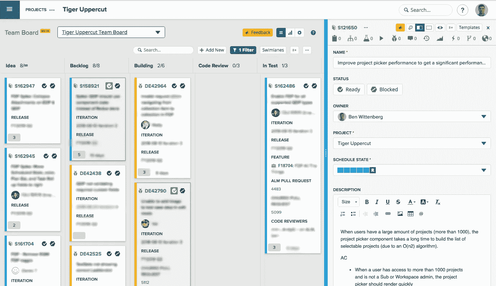

# 面向函数式程序员的信息隐藏

> 原文：<https://itnext.io/information-hiding-for-the-functional-programmer-b56937bdb789?source=collection_archive---------4----------------------->

我从事一个帮助软件团队跟踪他们工作的产品。几年后，我们将我们的实现转变为 React，我们的编程范式从面向对象转变为函数式。我们产品的一个核心特性是工作项编辑器，我们的团队负责在 React 中构建下一个版本。此编辑器允许用户更新其工作项上的字段，例如名称、所有者、描述以及该项被分配到的项目。经过许多单元的工作，我们慢慢地向客户发布了编辑器，并开始听取反馈。

新的侧面板编辑器

我们发现了一个性能问题，这个问题困扰着工作区中有许多项目的客户。一些快速调查揭示了根本原因。我们的系统将项目权限存储为一个列表，为了找到所有可编辑的项目，项目选择器使用了一个 O(n)算法，如下所示:

为了解决这个问题，我们决定将项目列表存储为一个地图。下面显示了一个更改和 O(n)算法的示例。

虽然有针对性的修复很简单，但也有副作用。原始权限数据(存储为列表)用于许多不同的模块，一些消费者依赖于列表接口。

# 为什么代码很难修改？

我们希望将权限数据的表示从列表更改为地图，但是因为数据的消费者可以直接访问表示，所以对它的任何更改都有可能引入错误。

面向对象(OO)程序员在设计类时使用类可见性来抽象数据的表示。大多数 OO 语言都有内置的可见性特性，因此将数据的表示存储为类的私有成员是惯用的。在面向对象的世界中，我们可以想象下面的权限类:

如果这个类被传递，那么私有许可数据的表示的变化被隔离到许可类。

类成员可见性背后的设计原则被称为“信息隐藏”。

我在研究生学习期间正式了解了信息隐藏，后来阅读了 D.L. Parnas (1972)的论文“关于将系统分解成模块时使用的标准”,该论文讨论了这个概念。

# 什么是信息隐藏？

D.L. Parnas 在 20 世纪 70 年代引入了术语信息隐藏，并在[1]和[2]中讨论了它在系统设计中的应用。主要思想是每个模块应该对系统的其他部分隐藏一些设计决策，特别是那些如果改变就会产生交叉影响的决策。

在[2]中，他提出了两种截然不同的系统设计。第一种基于流程图，第二种基于信息隐藏。在对两者进行比较后，他描述了一些具体的变化，前者成本高，后者成本低。

> 第二次分解中的每个模块的特征在于它对所有其他模块隐藏的设计决策的知识。它的接口或定义被选择来尽可能少地揭示其内部工作原理。”[2]

除了每个模块应该对系统的其他部分隐藏一些设计决策的一般规则之外，他还提供了一些更具体的设计标准，用于将系统分解成模块。与此讨论最相关的标准是:

> *“数据结构、其内部链接、访问过程和修改过程是单个模块的一部分。”[2]*

# 这个概念在函数范式中是如何应用的？

上面的故事激发了人们对信息隐藏在函数式程序中的应用的兴趣。其他人也有同样的兴趣。Daniel Kaplan 在[栈交换](https://softwareengineering.stackexchange.com/questions/213440/does-functional-programming-ignore-the-benefits-gained-from-the-on-the-criteria)【4】上问了一个关于信息隐藏和函数式编程的问题，通过阅读讨论，我了解到被广泛引用的经典文本《计算机程序的结构和解释》(SICP)对该主题有很多话要说。

我在几个使用函数范例的代码库上工作。在这些代码库中，模块之间传递的数据结构通常是列表或映射，而不是专门的对象。在给 SICP 的信中提到:

> *“100 个函数操作一个数据结构比 10 个函数操作 10 个数据结构要好。”【3】*[*前进*](https://mitpress.mit.edu/sites/default/files/sicp/full-text/book/book-Z-H-5.html)

*如果不进一步阅读文本，人们可以得出结论，函数式程序应该传递列表和映射，因为函数式程序如此“强大”，数据抽象对于可修改的代码是不必要的。*

*在某些情况下，传递列表和映射不会导致不可修改的代码。但是正如我们在上面的故事中所观察到的，因为 list 和 map 有不同的接口，如果模块依赖于数据的具体表示，就很难做出改变。对于一个模块来说，公开它所管理的数据的抽象表示是谨慎的，这样对该表示的更改就包含在模块中。*

*艾贝尔森和苏斯曼同意。SICP 的第二章专门讨论这个问题。*

> *将处理数据对象如何表示的程序部分与处理数据对象如何使用的程序部分隔离开来的一般技术是一种称为数据抽象的强大设计方法。我们将看到数据抽象如何使程序更容易设计、维护和修改。”【3、 [*第二章*](https://mitpress.mit.edu/sites/default/files/sicp/full-text/book/book-Z-H-13.html)*

**我相信数据抽象是信息隐藏的一种策略，也是与本次讨论相关的特定策略。以下摘自 SICP 的文章告诉我们如何使用数据抽象方法:**

> ***“数据抽象的基本思想是构建使用复合数据对象的程序，以便它们对“抽象数据”进行操作。也就是说，我们的程序应该以这样一种方式使用数据，即不要对数据做任何假设，这些假设对于执行手头的任务来说并不是绝对必要的。同时,“具体的”数据表示是独立于使用数据的程序而定义的。我们系统的这两个部分之间的接口将是一组过程，称为选择器和构造器，它们根据具体的表示实现抽象数据。”【3、* [*第二章*](https://mitpress.mit.edu/sites/default/files/sicp/full-text/book/book-Z-H-14.html)**
> 
> ***将对表示的依赖约束到几个接口过程有助于我们设计程序以及修改它们，因为它允许我们保持考虑替代实现的灵活性【3】[*第 2.1.2 章*](https://mitpress.mit.edu/sites/default/files/sicp/full-text/book/book-Z-H-14.html)***

***将信息隐藏原理应用到函数式程序的一种方法是导出构造函数和选择器。构造函数负责创建数据。选择器负责访问数据。***

# ***举个例子怎么样？***

***总而言之，开头的故事揭示了设计选择的一个后果。权限数据的表示“很难”改变，因为数据的消费者依赖于数据的具体表示(在本例中是列表)，而不是抽象接口。通过应用构造函数和选择器的概念，出现了以下设计:***

***通过将许可数据的表示隐藏在许可模块内并向消费者展示接口，对数据表示的所有改变都被隔离到许可模块。***

***注意:如果你喜欢 Redux，[数据抽象是 reducer](https://egghead.io/lessons/javascript-redux-colocating-selectors-with-reducers)的惯用方式。缩减器中处理的动作的有效载荷被构造成模块特定的状态，然后选择器访问缩减器状态。太棒了。***

***使用 Redux 进行数据抽象***

# ***摘要***

***信息隐藏是一种软件设计原则，它描述了如何将软件分解成模块，从而使程序更容易设计、维护和修改。这个概念发表于 20 世纪 70 年代，现在仍然是现代软件系统的关键设计原则。***

***数据抽象是信息隐藏的一个方面，如果应用得当，可以产生更高质量的软件。***

***尽管函数式程序倾向于使用映射和列表作为流经系统的主要值，但考虑这样一个问题是谨慎的:“如果数据的表示需要改变，会发生什么？”***

***对于函数式程序员来说，可以考虑将数据隐藏在构造函数和选择器之后，这样程序更容易修改、维护和随时间增长。***

# ***参考***

***[1] [设计方法论的信息分配方面](http://cseweb.ucsd.edu/%7Ewgg/CSE218/Parnas-IFIP71-information-distribution.PDF)，D.L .帕纳斯***

***[2] [关于将系统分解成模块所使用的标准](https://prl.ccs.neu.edu/img/p-tr-1971.pdf)，D.L .帕纳斯***

***[3] [计算机程序的结构与解释](https://mitpress.mit.edu/sites/default/files/sicp/full-text/book/book.html)，艾贝尔森等。艾尔。***

***[4] [函数式编程是否忽略了信息隐藏带来的好处？](https://softwareengineering.stackexchange.com/questions/213440/does-functional-programming-ignore-the-benefits-gained-from-the-on-the-criteria)***

# ***更多信息***

*   ***[Clojure 多方法](https://clojure.org/reference/multimethods)***
*   ***[Haskell 抽象数据类型](https://wiki.haskell.org/Abstract_data_type)***