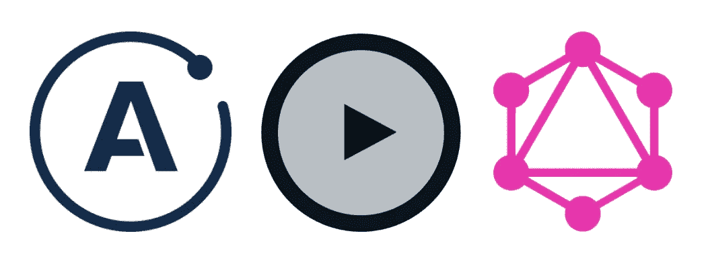

# 在 Apollo 服务器的 GraphQL Playground 中注入客户端脚本

> 原文：<https://itnext.io/injecting-a-client-side-script-in-graphql-playground-in-apollo-server-d23b6e3c901b?source=collection_archive---------1----------------------->

只是个黑客。



这是一篇解释我如何在 Playground 中注入客户端脚本的短文。请注意，在我找到更好的方法之前，这只是一个变通解决方案。

## 背景

在用 Apollo Server 开发 GraphQL 服务器时，GraphQL Playground 是你很可能会用到的工具。现在，假设我们有一个 Apollo 服务器，它使用 HTTP 头中的令牌进行身份验证。幸运的是，Playground 有一个编辑器来指定 HTTP 头。但是，如果我们需要调用 OAuth provider 来获取 accessToken，该怎么办呢？当然，我们可以运行`curl`来获得一个令牌，在终端中复制它并粘贴到浏览器中。如果我们只需在浏览器中登录，应该会容易得多。

快速查看一下 Apollo 服务器代码和 Playground 代码，似乎没有配置来注入一个在浏览器中运行的脚本。虽然不确定是否有推荐的方法，但我尝试修补它。

## 示例代码

下面是基于 Apollo 服务器教程的代码。它只是在 HTML 中添加了一个字符串。

```
const { ApolloServer, gql } = require('apollo-server-express');
const express = require('express');
const interceptor = require('express-interceptor');

const typeDefs = gql`
  type Query {
    "A simple type for getting started!"
    hello: String
  }
`;

const resolvers = {
  Query: {
    hello: () => 'world',
  },
};

const server = new ApolloServer({
  typeDefs,
  resolvers,
});

const app = express();
const port = process.env.PORT || 3000;

const **SCRIPT_TO_INJECT** = `
  <script>
    window.addEventListener('load', () => {
      console.log('script injected');
      **const store = window.s;**
      setTimeout(() => {
        const headers = '{"Authorization": "Bearer token"}';
        store.dispatch({ type: 'EDIT_HEADERS', payload: { headers } });
      }, 2000);
    });
  </script>
`;
const **END_BODY** = '\n  </body>\n  </html>';
app.use(interceptor((req, res) => ({
  isInterceptable: () => **/text\/html/**.test(res.get('content-type')),
  intercept: (body, send) => {
    send(body.replace(**END_BODY**, **SCRIPT_TO_INJECT** + **END_BODY**));
  },
})));

server.applyMiddleware({ app });

app.get('/', (req, res) => {
  res.redirect(server.graphqlPath);
});

app.listen(port, () => {
  console.log(`Open http://localhost:${port}${server.graphqlPath}`);
});
```

这里好看的是 Playground 把 Redux store 曝光为`window.s`。请注意，字符串替换并不健壮，如果 Playground 更改了 HTML 中的空格，它将不起作用。

## 怎么跑

您可以查看 GitHub 存储库并运行这个示例。

[](https://github.com/dai-shi/apollo-server-patch-playground-example) [## 戴-史/阿波罗-服务器-补丁-游乐场-示例

### 用 Apollo Server 修补 GraphQL Playground 的一个例子——戴式/Apollo-Server-patch-Playground——example

github.com](https://github.com/dai-shi/apollo-server-patch-playground-example) 

也可以在 codesandbox 中运行。

[](https://codesandbox.io/s/github/dai-shi/apollo-server-patch-playground-example/tree/master/?module=%2Fsrc%2Fserver.js) [## 阿波罗-服务器-补丁-游乐场-示例-代码沙盒

### 用 Apollo 服务器修补 GraphQL Playground 的一个例子

codesandbox.io](https://codesandbox.io/s/github/dai-shi/apollo-server-patch-playground-example/tree/master/?module=%2Fsrc%2Fserver.js) 

(直到现在，我才意识到 CodeSandbox 有能力运行阿波罗服务器。多好啊！)

## 最终注释

正如我提到的，这只是写作时的一种变通方法。我很确定这不是我们想要的，并希望寻找一个推荐的解决方案。