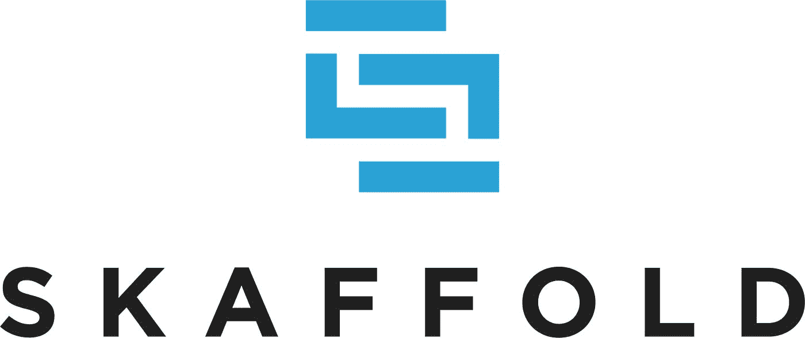

# 使用 Skaffold 进行内循环容器本地开发

> 原文：<https://itnext.io/inner-loop-container-native-development-with-skaffold-d954c8dfcda5?source=collection_archive---------5----------------------->


一种不同的脚手架

## 使用 Skaffold 简化内循环容器本地应用程序开发的构建、推送和部署过程

我正在探索一系列开源工具来简化容器原生开发工作流的内部循环。这描述了您正在编写代码，但是还没有将它推送到版本控制系统的一段时间。这些工具，[](https://draft.sh)**[**斯卡福德**](http://skaffold.dev) 和 [**倾斜**](https://tilt.dev/) 每一种都采取不同的方法来完成手头的任务。每个工具都可以用来构建项目的映像，将映像推送到您选择的注册服务，并将映像部署到 Kubernetes 集群上。采用这些工具将释放你的时间，让你专注于编写代码。你可以在我的[第一篇文章](https://medium.com/@m.r.boxell/local-container-native-development-tools-ef4b1beb472c)中了解更多关于这个系列背后的动机，在我的[第二篇文章](https://medium.com/@m.r.boxell/inner-loop-container-native-development-with-draft-2f74f7c7f6a2)中了解更多关于使用草稿的信息。**

## **定义**

**[ska fold](https://github.com/GoogleContainerTools/skaffold)是一个命令行工具，用于 Kubernetes 应用程序的本地持续开发。Skaffold 可用于自动化构建应用程序映像、将其推送到存储库以及将其部署到 Kubernetes 集群的工作流。Skaffold 可以用`skaffold dev`观察代码的变化，然后在保存代码时自动启动构建、推送和部署过程。**

## **区分者**

**Skaffold 可以用来一次部署多个微服务。您可以在`skaffold.yaml`中引用多个图像和清单文件。斯卡福德是一个非常灵活的选择。例如，对于更新图像存储库这样简单的事情，有五个选项。您可以手动替换`skaffold.yaml`中的图像存储库，或者您可以为您当前的`kubectl`上下文使用一个标志、环境变量、全局 ska fold 配置或 ska fold 配置。斯卡福德还提供了两种部署选项:`skaffold dev`和`skaffold run`。`skaffold dev`持续观察您的应用程序的变化，并在发生变化时重启构建、推送和部署管道。从`skaffold dev`退出将删除您部署的应用程序。或者，`skaffold run`运行您的管道一次，并且不观察变化。**

**Skaffold 通过一个可插拔的架构，使得使用各种工具进行构建、推送和部署变得容易，并且还允许您通过 profiles 特性在这些配置之间轻松切换。Skaffold 为您提供了在构建、推进和部署过程的每个阶段使用您喜欢的工具的选项。有很多构建选项(本地的 Dockerfile，带 Kaniko 的集群内 Dockerfile，云上的 Dockerfile，本地的 Jib Maven/Gradle 等。)、部署选项(`kubectl`、Helm、Kustomize)以及许多可选的图像标签策略。这种可插拔性使得匹配生产部署管道中使用的工具成为可能。**

**profiles 特性使得 Skaffold 的可插拔架构更加有用。概要文件是存储在`skaffold.yaml`中的一组设置，它覆盖了您当前配置的构建、测试和部署部分。配置文件使您能够根据您的上下文，在您认为合适的时候有效地切换工具。您可以使用`skaffold run -p [PROFILE]`激活配置。例如，您可以创建一个名为`local` development 的概要文件，它使用本地 Docker 守护进程来构建映像，并使用`kubectl`将它们部署到本地集群。在您完成设计之后，您可以使用 Jib 和 Maven 切换到`production`概要文件作为您的构建工具，并使用`helm`部署到您的集群。**

****

## **要求**

**-[Docker For Desktop](https://www.docker.com/products/docker-desktop)
-[Kubectl](https://kubernetes.io/docs/tasks/tools/install-kubectl/)
-[Oracle Container Engine For Kubernetes(OKE)](https://docs.cloud.oracle.com/iaas/Content/ContEng/Concepts/contengoverview.htm)
-[Oracle Cloud infra structure Registry(OCIR)](https://docs.cloud.oracle.com/iaas/Content/Registry/Concepts/registryoverview.htm)**

## **装置**

**更详细的安装信息可以在 [Skaffold GitHub 页面](https://github.com/GoogleContainerTools/skaffold)上找到。**

**下载并安装 Skaffold:**

**`brew install skaffold`**

**验证您的安装:**

**`skaffold version`**

**安装将在您的主目录中创建一个`/.skaffold`文件夹来存储配置信息。**

## **本地配置**

**在 GitHub 上克隆[ska fold 仓库](https://github.com/GoogleContainerTools/skaffold)并切换到`/examples/getting-started`目录。该目录包括:**

```
$ ls 
Dockerfile	README.adoc	k8s-pod.yaml	main.go		skaffold.yaml
```

*   **docker 文件包含如何构建应用程序的信息**
*   **yaml 指定了工作流程的步骤**
*   **yaml 是 Kubernetes 清单，用于构建 Dockerfile 文件创建的图像**

**当使用本地上下文时，您可以使用命令`skaffold config set --global local-cluster true`绕过图像推送步骤。注意:如果您正在使用示例应用程序，请确保您当前没有登录到 Docker 注册表。注册表 URL 可能与 Kubernetes 清单文件中指定的 URL 冲突。**

**Skaffold 将使用您当前的 Kubernetes 上下文来确定您的应用程序将部署在哪个集群上。要找到您的上下文运行:`kubectl config current-context`。**

## **部署应用程序**

**每次代码发生变化时，运行`skaffold dev`来构建和部署应用程序。从`skaffold dev`退出将会删除您的 pod。Skaffold 还提供了使用`skaffold run`命令只构建和部署一次应用程序的选项。**

**使用`kubectl get pods`验证您的应用程序是否已正确部署**

```
$ kubectl get pods
NAME                                     READY   STATUS    RESTARTS   AGE
getting-started                          1/1     Running   0          5s
```

## **连接到应用程序**

**Skaffold 将根据您的 pod 规格配置自动转发“入门”应用程序。**

## **修改应用程序**

**当`skaffold dev`运行时，构建、推送和部署应用程序将在每次代码发生变化时重新出现。**

## **应用程序日志**

**从部署的应用程序运行中获取日志:`skaffold run --tail`**

## **删除应用程序**

**当您测试完应用程序后，您可以退出`skaffold dev`，这将从您的集群中删除该应用程序:**

```
Cleaning up...
pod "getting-started" deleted
Cleanup complete in 2.317906684s
```

# **托管的 Kubernetes 和 Docker 注册表配置**

**Skaffold 还可以与托管的 Kubernetes 解决方案一起使用。我的示例将使用[Oracle Container Engine for Kubernetes(OKE)](https://docs.cloud.oracle.com/iaas/Content/ContEng/Concepts/contengoverview.htm)作为 Kubernetes 集群，使用[Oracle Cloud infra structure Registry(OCIR)](https://docs.cloud.oracle.com/iaas/Content/Registry/Concepts/registryoverview.htm)作为容器映像注册表。可以按照类似的步骤用其他 Kubernetes 集群和注册服务配置 Skaffold。**

## **注册表配置**

**要使用云注册表服务，您需要使用`skaffold config set default-repo`命令在 Skaffold 中设置注册表。要将 OCIR 设置为您的注册表，您需要提供注册表的服务器 URL。要将 OCIR 设置为您的注册表，您需要提供注册表的服务器 URL。跑:`skaffold config set default-repo <region code>.ocir.io/<tenancy name>/<repo name>/<image name>:<tag>`**

*   **`<region-code>`是您正在使用的 OCI 地区的代码。例如，凤凰城的区号是`phx`。有关更多信息，请参见[区域和可用性域](https://docs.cloud.oracle.com/iaas/Content/General/Concepts/regions.htm)。**
*   **`ocir.io`是 Oracle 云基础设施注册名称。**
*   **`<tenancy-name>`是拥有您想要将映像推送到的存储库的租赁的名称，例如`example-dev`。请注意，您的用户必须有权访问租赁。**
*   **如果指定了`<repo-name>`，则它是您要将映像推送到的存储库的名称。比如`project01`。请注意，指定存储库是可选的。如果选择指定资料档案库名称，映像的名称将用作 Oracle Cloud infra structure Registry 中的资料档案库名称。**
*   **`<image-name>`是您希望在 Oracle Cloud infra structure Registry 中为映像指定的名称，例如`helloworld`。**
*   **`<tag>`是您希望在 Oracle Cloud infra structure Registry 中赋予映像的映像标签，例如`latest`。**

**您需要使用以下信息登录注册表:**

**`docker login <region code>.ocir.io`**

*   **用户名:`<tenancy-name>/<oci-username>`**
*   **密码:`<oci-auth-token>`**

**您可能还需要与注册中心建立信任关系。例如，默认情况下，OCIR 注册表将被设置为私有。如果您想继续使用私有存储库，您将必须添加一个图像拉取秘密，它允许 Kubernetes 向容器注册中心认证以拉取私有图像。有关使用图像机密的更多信息，请参阅本指南。出于测试目的，一个更简单的选择是将注册表设置为 **public** 。**

## **Kubernetes 集群配置**

**因为 Skaffold 使用您当前的 Kubernetes 上下文来确定您的应用程序将被部署在哪个集群上，所以您需要记住切换到您的上下文来 OKE。使用`kubectl config current-context`验证您的上下文。**

**配置完成后，运行`skaffold dev`使用 Dockerfile 构建您的应用程序，将应用程序推送到 OCIR，并将应用程序部署到 OKE。正如您之前在本地所做的那样，您可以通过运行`kubectl get pods`来验证应用程序的成功部署。Skaffold 将自动端口转发 pod 规范中提到的任何端口。**

## **摘要**

**Skaffold 是一个精心设计的工具，它解决了内部循环容器本地开发的核心问题。其可插拔架构和配置文件特性提供了灵活性，使其在竞争中脱颖而出。**

## **参考**

**[Skaffold 用户文档](https://skaffold.dev/)**

**[斯卡福特 GitHub](https://github.com/GoogleContainerTools/skaffold)**

**在[http://cloudnative.oracle.com](http://cloudnative.oracle.com)查看更多云原生和容器原生项目。**