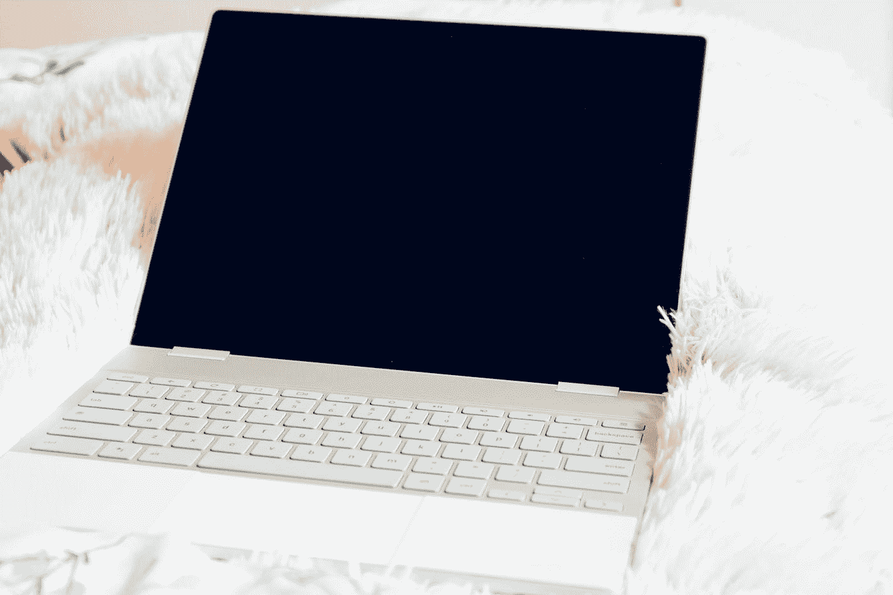

# 在 Pixelbook 上安装 Docker(ChromeOS)

> 原文：<https://itnext.io/install-docker-on-pixelbook-chromeos-24fc898451e1?source=collection_archive---------0----------------------->



照片由 [Unsplash](https://unsplash.com?utm_source=medium&utm_medium=referral) 上的 [Ihor Dvoretskyi](https://unsplash.com/@ihor_dvoretskyi?utm_source=medium&utm_medium=referral) 拍摄

我发现自己试图在我的 Pixelbook 上重新安装几个工具，当我按照官方文档上的教程安装 Docker(以避免错过一个库)时，我注意到没有关于如何在 ChromeOS 中安装它的信息。我在谷歌上快速搜索了一下，发现大多数人都不推荐使用 Docker 这个操作系统。无论如何，我用谷歌的 Pixelbook i7 试了试，并成功了，它有 16GB 的内存，这可能会推迟运行这个操作系统的其他型号。

打开终端，并安装以下依赖项:

```
sudo apt-get -y install apt-transport-https ca-certificates software-properties-common gnupg2
```

然后我们需要添加 Docker 存储库:

```
curl -fsSL [https://download.docker.com/linux/debian/gpg](https://download.docker.com/linux/debian/gpg) | sudo apt-key add -
sudo apt-key fingerprint 0EBFCD88
sudo add-apt-repository “deb [arch=amd64] [https://download.docker.com/linux/debian](https://download.docker.com/linux/debian) $(lsb_release -cs) stable”
sudo apt-get update
```

最后，我们安装 Docker 本身:

```
sudo apt-get -y install docker-ce || exit 1
```

搞定了。码头工人现在工作。正如预期的那样，我需要使用 **sudo** 来执行大多数命令，但它不仅可以工作，而且运行速度也比我以前在旧 Macbook 上使用时更快。我希望这能帮助任何人！