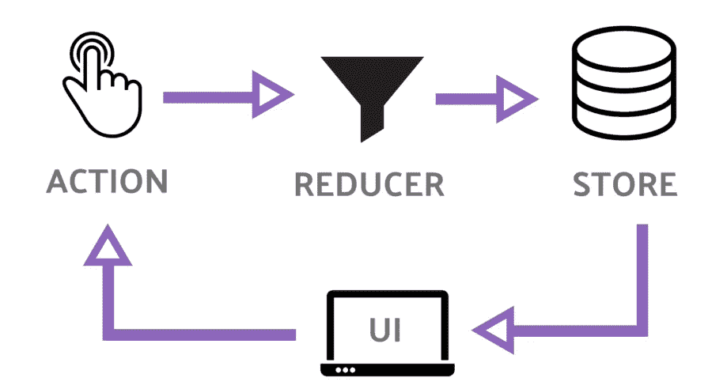

# 用 Redux 集成语义用户界面模型

> 原文：<https://itnext.io/integrating-semantic-ui-modal-with-redux-4df36abb755c?source=collection_archive---------1----------------------->



[*点击这里在 LinkedIn 上分享这篇文章*](https://www.linkedin.com/cws/share?url=https%3A%2F%2Fitnext.io%2Fintegrating-semantic-ui-modal-with-redux-4df36abb755c)

我们在生活中都会用到情态动词，对吗？

在过去的几天里，我一直在用一个简单的 CRUD 应用程序研究 React 和 Redux，并且需要向我的用户展示一个确认模式。

由于我使用了优秀的 [semantic-ui-react](https://react.semantic-ui.com/) ，我已经可以访问 [*Confirm*](https://react.semantic-ui.com/addons/confirm) 组件，它显示了一个模态确认，理论上很容易使用。

我不希望我的每个组件都有一个对库的引用，我尤其不希望管理我的无状态组件中的模态状态。

所以，既然我已经使用 Redux 来管理状态，为什么不用它来管理我的模态及其状态呢？这就是我们在这篇文章中要做的。

*如果你不熟悉 redux，我建议你从阅读他们的文档* [*这里*](https://redux.js.org/) *开始。*

# 步骤 1:设置我们的示例应用程序

让我们首先用 [create-react-app](https://github.com/facebook/create-react-app) 来设置我们的应用程序。如果您对这个工具不熟悉，请花时间阅读他们的自述文件，它相当不错。

首先，让我们安装 create-react-app 并搭建我们的应用程序:

```
npm i -g create-react-app
create-react-app semantic-ui-modal-redux
```

该工具为我们创建了所有需要的文件和配置，所以现在我们只需设置我们的依赖项:

```
npm i -S semantic-ui-css semantic-ui-react redux react-redux
```

现在让我们在应用程序中导入语义 ui css 文件。打开文件`index.js`并将其更改为以下内容:

现在只有一些清理工作要做。删除以下文件:

```
> src/logo.svg 
> src/App.css 
```

并更改`src/App.js`以删除已删除的文件引用，并为其添加一些味道:

好了，现在我们准备开始配置 Redux。

# 步骤 2:配置 Redux

## 动作创建者

创建一个`actions`文件夹并添加以下文件:

这些将是我们在这些例子中的模态动作。如你所见，它们非常简单。当我们调用我们的`openModal`动作创建者时，我们期望接收模态属性，用于配置它的内容、标题等等。我们的`closeModal`动作目前没有接收任何参数，因为它只是声明了我们关闭模态的意图。

## 还原剂

现在让我们创建我们的减速器。在这个例子中，我们将有一个根缩减器和一个模态缩减器。如您所见，它们的实现非常简单:

`rootReducer`将聚合所有现有的 reducers(在这个例子中只有一个),`modalReducer`将负责定义我们的模态的状态。当我们调用`MODAL_OPEN`动作时，我们只是传递我们收到的有效载荷(还记得动作创建者的参数吗？)到商店，当我们调用`MODAL_CLOSE`动作时，我们会清除状态，所以我们没有任何模态配置。

## 商店

我们的商店没有任何特别的东西。这只是对 Redux 的`createStore`的一个调用，传递我们的`rootReducer`，如下图所示:

## 供应者

所有配置就绪后，是时候配置我们的应用程序来使用 Redux 了。打开`index.js`文件，添加`Provider`组件，如下图所示:

# 步骤 3:创建我们的 ModalManager 组件

好了，样板文件说够了。让我们开始编写我们的模态管理器组件！

首先，让我们给我们的`App`组件添加一个按钮，这样我们就可以打开我们的调用我们的`openModal`动作创建器:

我们刚刚添加了一个`Button`组件，并将其配置为调用我们的`openModal`动作创建器。为了做到这一点，我们必须从 Redux 调用`connect`函数。该函数负责将我们的组件连接到 redux 存储，因此我们可以调度操作，而不必显式调用我们的组件中的`dispatch`方法。

现在，让我们创建主要组件。首先创建`components`文件夹，并添加一个包含以下内容的`ModalManager`文件:

这个组件其实挺简单的。它只是从 Redux 获取`modals`存储，将其映射到`modalConfiguration`属性，如果定义了该对象(意味着调度了`OPEN_MODAL`动作)，则在其内部呈现一个`Modal`组件(带有一些默认配置)。

当调度`CLOSE_MODAL`动作时，我们的`modalConfiguration`对象为空，这意味着我们的`Modal`组件不会被呈现。

# 结论

就是这样！现在，我们可以让我们的组件显示语义 ui 模型，而不必将它们耦合到它们的组件，也不必管理它的可见性/状态，并且我们还可以将 Redux 的时间旅行调试用于我们的模型。

这只是一个粗略的实现，但是它可以帮助指导您接下来与 Redux 的集成。我希望你喜欢这个帖子，如果你有任何疑问，请在下面留下评论，我会尽力帮助你:)

该职位的代码可在[https://github.com/rodrigoff/semantic-ui-modal-redux](https://github.com/rodrigoff/semantic-ui-modal-redux)获得。如果您想跳到特定的点，每个提交都与 post 的一个步骤相关。

*如果你需要更高级的指导，可以参考本帖:*[*http://blog . isquared software . com/2017/07/practical-redux-part-10-managing-modals/*](http://blog.isquaredsoftware.com/2017/07/practical-redux-part-10-managing-modals/)*，帮助指导了本帖。*